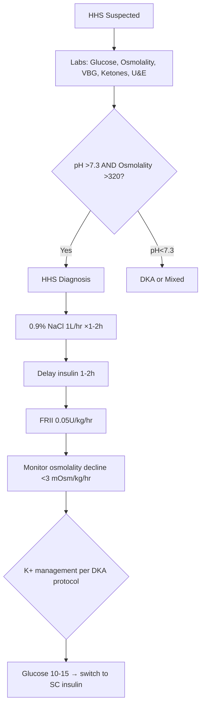

# HHS diagnosis criteria

## 1. Learning Objectives
- [ ] State HHS diagnostic criteria (glucose, osmolality, pH, ketones)
- [ ] Differentiate HHS from DKA and mixed DKA-HHS
- [ ] Execute HHS management protocol (fluids priority, low-dose insulin)
- [ ] Monitor osmolality decline rate (<3 mOsm/kg/hr)
- [ ] Recognise mortality predictors

## 2. Definition & Epidemiology
| Feature | Detail |
|--------|--------|
| **Definition** | Hyperosmolar Hyperglycaemic State: severe hyperglycaemia + hyperosmolality + minimal ketosis/acidosis |
| **Diagnostic Criteria** | Glucose >30 mmol/L (540 mg/dL) + Osmolality >320 mOsm/kg + pH >7.30 + Bicarbonate >18 mmol/L + Minimal ketonaemia |
| **Calculated Osmolality** | 2×Na + Glucose + Urea (mmol/L) — normal 285–295 |
| **Incidence** | <1% of diabetic admissions; 10x less common than DKA |
| **Mortality** | 10–20% (vs 1–5% DKA) — higher in elderly, comorbidities |
| **Typical Patient** | Elderly T2DM, nursing home, infection, steroid use, non-compliance |

## 3. Clinical Features / Presentation
| Presentation | Frequency | Key Features |
|-------------|-----------|--------------|
| **Altered consciousness** | Universal | Confusion, lethargy, coma (correlates with osmolality) |
| **Severe dehydration** | Universal | >10L deficit; dry mucosa, poor turgor, hypotension |
| **Polyuria → oliguria** | Progressive | Pre-renal AKI |
| **Focal neurological signs** | 25–50% | Hemiparesis, seizures, nystagmus (resolve with treatment) |
| **No Kussmaul breathing** | Absent | No acidosis → no respiratory compensation |
| **Precipitants** | Infection (pneumonia, UTI), MI, stroke, drugs (steroids, diuretics, antipsychotics), non-compliance | |

## 4. Classification / Staging / Grading
| Feature | HHS | DKA | Mixed DKA-HHS |
|---------|-----|-----|---------------|
| **Glucose** | >30 mmol/L | >11.1 mmol/L | Variable |
| **Osmolality** | >320 mOsm/kg | <320 | >320 |
| **pH** | >7.30 | <7.30 | <7.30 |
| **Bicarbonate** | >18 | <15 | <15 |
| **Ketones** | Minimal | >3 mmol/L | >3 mmol/L |
| **Age** | >60y | <60y (often) | Variable |
| **Mortality** | 10–20% | 1–5% | Intermediate |

## 5. Diagnosis & Investigations
| Investigation | Role | Key Details |
|---------------|------|-------------|
| **Glucose** | Confirm hyperglycaemia | >30 mmol/L |
| **Calculated osmolality** | Confirm hyperosmolality | 2Na + Glucose + Urea >320 mOsm/kg |
| **VBG** | Exclude acidosis | pH >7.3, HCO3 >18 |
| **Blood ketones** | Exclude significant ketosis | <3 mmol/L (but may be mildly elevated) |
| **U&E, Creatinine** | Renal function, Na+, K+ | AKI common; corrected Na+ if glucose high |
| **Corrected Na+** | Account for hyperglycaemia | Measured Na+ + 1.6×(Glucose-5.5)/5.5 |
| **ECG** | K+ effects, ischaemia | Silent MI common |
| **Infection screen** | Precipitant | Blood/urine culture, CXR, CRP |

## 6. Differential Diagnosis
| Condition | Distinguishing Features |
|-----------|-------------------------|
| **DKA** | Acidosis (pH<7.3), ketosis (>3 mmol/L), lower glucose |
| **Mixed DKA-HHS** | Both acidosis AND hyperosmolality present |
| **Severe dehydration alone** | Normal glucose, normal osmolality |
| **Stroke** | Focal signs without hyperglycaemia/osmolality |
| **Septic encephalopathy** | Infection + confusion, but glucose/osmolality normal |

## 7. Management

### Fluid Resuscitation (PRIORITY)
| Phase | Fluid | Rate | Key Points |
|-------|-------|------|------------|
| **1st hour** | 0.9% NaCl | 1L | Rapid restoration of perfusion |
| **Hours 2–6** | 0.9% NaCl | 500–1000ml/hr | Adjust to correct deficit; HHS deficit 8–12L (150–200ml/kg) |
| **If corrected Na+ rising >10** | 0.45% NaCl | Per protocol | Prevent rapid osmolar fall |
| **If glucose <14** | 5% Dextrose + 0.45% NaCl | Match insulin | Prevent hypoglycaemia |

> **Goal**: Correct deficit over 24–48h; osmolality decline **<3 mOsm/kg/hr**

### Insulin Therapy
| Parameter | HHS (vs DKA) |
|-----------|--------------|
| **Timing** | **Delay 1–2h after fluids started** — fluids alone drop glucose |
| **Dose** | **0.05 U/kg/hr** (HALF of DKA dose) — lower insulin sensitivity |
| **Bolus?** | NO |
| **Target** | Glucose decline 2–4 mmol/L/hr; stop when glucose 10–15 mmol/L |
| **Potassium** | Same as DKA — replace per level |

### Monitoring
| Parameter | Frequency | Target |
|-----------|-----------|--------|
| **Osmolality (calculated)** | Hourly | Decline <3 mOsm/kg/hr |
| **Glucose** | Hourly | Decline 2–4 mmol/L/hr |
| **Na+ (corrected)** | 2-hourly | Avoid rapid correction |
| **K+** | 1–2 hourly | 4.0–5.0 mmol/L |
| **Urine output** | Hourly | >0.5 ml/kg/hr |
| **Neurology (GCS)** | Hourly | Improvement expected |
| **Fluid balance** | Hourly | Positive then neutral |

## 8. FCPS/MRCP High-Yield Summary
| Topic | Key Points |
|-------|------------|
| **Diagnostic triad** | Glucose >30 + Osmolality >320 + pH >7.3 + minimal ketones |
| **HHS vs DKA** | HHS: older, T2DM, higher glucose/osmolality, NO acidosis, higher mortality (10–20%) |
| **Fluids FIRST** | 1L 0.9% NaCl/hr before insulin; deficit 8–12L |
| **Insulin HALF dose** | 0.05 U/kg/hr (vs 0.1 in DKA); delay 1–2h |
| **Osmolality decline** | <3 mOsm/kg/hr — prevent cerebral oedema |
| **Mortality predictors** | Age >70, coma, hypotension, osmolality >350, comorbidities, delayed presentation |
| **Neurological signs** | Hemiparesis, seizures common — resolve with treatment |

## 9. Viva Questions
| Question | Expected Answer |
|----------|-----------------|
| **What are the diagnostic criteria for HHS?** | Glucose >30 mmol/L, calculated osmolality >320 mOsm/kg, pH >7.30, bicarbonate >18 mmol/L, minimal ketonaemia |
| **How does HHS differ from DKA?** | HHS: older, T2DM, glucose >30, osmolality >320, pH >7.3, NO significant ketosis, mortality 10–20%. DKA: younger, T1DM, glucose >11.1, pH <7.3, ketones >3, mortality 1–5%. |
| **What is the initial fluid management in HHS?** | 0.9% NaCl 1L in 1st hour, then 500–1000ml/hr; total deficit 8–12L over 24–48h. FLUIDS BEFORE INSULIN. |
| **What insulin dose in HHS?** | 0.05 U/kg/hr (half DKA dose); start AFTER 1–2h of fluid resuscitation. |
| **What is the target osmolality decline rate?** | <3 mOsm/kg/hr — rapid correction causes cerebral oedema. |
| **How do you calculate osmolality?** | 2×Na+ + Glucose + Urea (all in mmol/L). Corrected Na+ = Measured Na+ + 1.6×(Glucose-5.5)/5.5 |
| **What are mortality predictors in HHS?** | Age >70, coma/GCS<12, systolic BP <90, osmolality >350, significant comorbidities, delayed presentation >24h. |

## 10. Confusions & Mnemonics
| Confusion | Clarification |
|-----------|---------------|
| **Insulin before fluids in HHS?** | NO — fluids alone drop glucose via dilution and improved renal perfusion; insulin delayed 1–2h |
| **Same insulin dose as DKA?** | NO — half dose (0.05 vs 0.1 U/kg/hr); HHS more insulin sensitive |
| **Cerebral oedema only in DKA?** | Also in HHS if osmolality corrected too fast — same <3 mOsm/kg/hr rule |

**Mnemonic: HHS-FLUIDS-FIRST**
- **H**yperglycaemia >30 mmol/L
- **H**yperosmolality >320 mOsm/kg
- **S**erum pH >7.3 (NO acidosis)
- **F**luids FIRST (1L/hr, then 500–1000)
- **L**ow insulin (0.05 U/kg/hr, delayed)
- **U**rine output >0.5 ml/kg/hr
- **I**nsulin after 1-2h fluids
- **D**ecline osmolality <3 mOsm/kg/hr
- **S**top insulin at glucose 10-15
- **F**atal if missed (10-20% mortality)
- **I**nfection screen/treat
- **R**esolve neuro signs with treatment
- **S**witch to SC when stable

### Local Navigation
- **Parent Heading**: [[Diabetic Emergencies/Hyperosmolar hyperglycaemic state (HHS)|Diabetic Emergencies/Hyperosmolar hyperglycaemic state (HHS)]]
- **Chapter Map**: [[../../Davidson Chapter 25 - Diabetes Hierarchy|Diabetes Hierarchy]]
- **Chapter MOC**: [[../../Diabetes MOC|Diabetes MOC]]
- **Drug Reference": [[../../../Clinical Therapeutics and Good Prescribing|Drugs]]
- **Related": [[]]

---
## Tags
#medicine #diabetes #davidson #fcps #mrcp #full-fcps-mrcp-note
