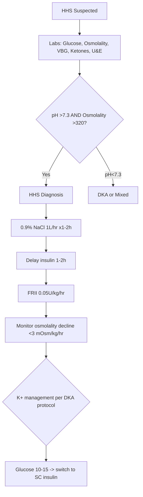
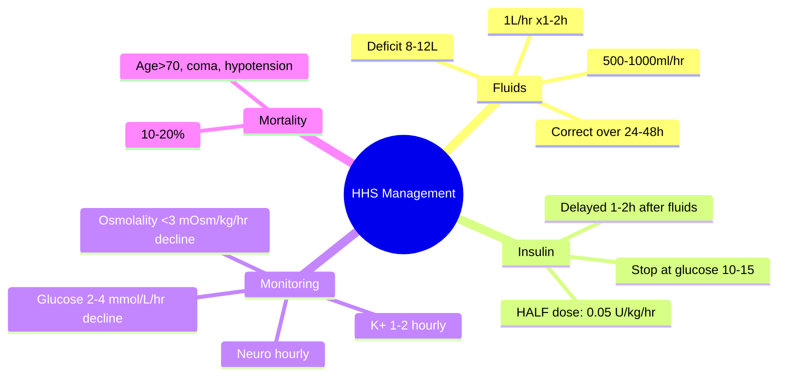

# HHS management protocol

## 1. Learning Objectives
By the end of this note you should be able to:
- [ ] Execute HHS management protocol (fluids priority, low-dose insulin)
- [ ] Monitor osmolality decline rate (<3 mOsm/kg/hr)
- [ ] Manage electrolytes (K+, Na+) and fluid balance
- [ ] Recognise and manage complications (cerebral oedema, rhabdomyolysis)

---

## 2. Definition & Epidemiology

| Feature | Detail |
|--------|--------|
| **Diagnosis** | Glucose >30 mmol/L + Osmolality >320 mOsm/kg + pH >7.3 + Bicarbonate >18 + Minimal ketones |
| **Mortality** | 10-20% (vs 1-5% DKA) - higher in elderly, comorbidities |
| **Key Principle** | **FLUIDS FIRST** - insulin delayed 1-2h after fluid resuscitation |

---

## 3. Clinical Features / Presentation
(See HHS diagnosis criteria)

---

## 4. Classification / Staging / Grading
(See HHS diagnosis criteria)

---

## 5. Diagnosis & Investigations
| Investigation | Frequency | Key Details |
|---------------|-----------|-------------|
| **Glucose** | Hourly | Decline 2-4 mmol/L/hr |
| **Calculated osmolality** | Hourly | **Decline <3 mOsm/kg/hr** (2Na+Glucose+Urea) |
| **Corrected Na+** | 2-hourly | Measured Na+ + 1.6(Glucose-5.5)/5.5 |
| **K+** | 1-2 hourly | 4.0-5.0 mmol/L target |
| **Urine output** | Hourly | >0.5 ml/kg/hr |
| **Neurology (GCS)** | Hourly | Improvement expected |

---

## 6. Differential Diagnosis
(See HHS vs DKA differentiation)

---

## 7. Management

### Fluid Resuscitation (PRIORITY)
| Phase | Fluid | Rate | Key Points |
|-------|-------|------|------------|
| **1st hour** | 0.9% NaCl | 1L | Rapid restoration of perfusion |
| **Hours 2-6** | 0.9% NaCl | 500-1000ml/hr | Adjust to correct deficit; HHS deficit 8-12L (150-200ml/kg) |
| **If corrected Na+ rising >10** | 0.45% NaCl | Per protocol | Prevent rapid osmolar fall |
| **If glucose <14** | 5% Dextrose + 0.45% NaCl | Match insulin | Prevent hypoglycaemia |

> **Goal**: Correct deficit over 24-48h; osmolality decline **<3 mOsm/kg/hr**

### Insulin Therapy
| Parameter | HHS (vs DKA) |
|-----------|--------------|
| **Timing** | **Delay 1-2h after fluids started** -- fluids alone drop glucose |
| **Dose** | **0.05 U/kg/hr** (HALF of DKA dose) -- lower insulin sensitivity |
| **Bolus?** | NO |
| **Target** | Glucose decline 2-4 mmol/L/hr; stop when glucose 10-15 mmol/L |
| **Potassium** | Same as DKA -- replace per level |

### Monitoring
| Parameter | Frequency | Target |
|-----------|-----------|--------|
| **Osmolality (calculated)** | Hourly | Decline <3 mOsm/kg/hr |
| **Glucose** | Hourly | Decline 2-4 mmol/L/hr |
| **Na+ (corrected)** | 2-hourly | Avoid rapid correction |
| **K+** | 1-2 hourly | 4.0-5.0 mmol/L |
| **Urine output** | Hourly | >0.5 ml/kg/hr |
| **Neurology (GCS)** | Hourly | Improvement expected |
| **Fluid balance** | Hourly | Positive then neutral |

---

## 8. FCPS/MRCP High-Yield Summary

| Topic | Key Points |
|-------|------------|
| **Fluids FIRST** | 1L 0.9% NaCl/hr before insulin; deficit 8-12L over 24-48h |
| **Insulin HALF dose** | 0.05 U/kg/hr (vs 0.1 in DKA); delay 1-2h |
| **Osmolality decline** | <3 mOsm/kg/hr -- prevent cerebral oedema |
| **Mortality predictors** | Age >70, coma, hypotension, osmolality >350, comorbidities, delayed presentation |
| **Neurological signs** | Hemiparesis, seizures common -- resolve with treatment |

---

## 9. Viva Questions

| Question | Expected Answer |
|----------|-----------------|
| **What is the initial fluid management in HHS?** | 0.9% NaCl 1L in 1st hour, then 500-1000ml/hr; total deficit 8-12L over 24-48h. FLUIDS BEFORE INSULIN. |
| **What insulin dose in HHS?** | 0.05 U/kg/hr (half DKA dose); start AFTER 1-2h of fluid resuscitation. |
| **What is the target osmolality decline rate?** | <3 mOsm/kg/hr -- rapid correction causes cerebral oedema. |
| **How do you calculate osmolality?** | 2xNa+ + Glucose + Urea (all in mmol/L). Corrected Na+ = Measured Na+ + 1.6(Glucose-5.5)/5.5 |
| **What are mortality predictors in HHS?** | Age >70, coma/GCS<12, systolic BP <90, osmolality >350, significant comorbidities, delayed presentation >24h. |
| **How does HHS differ from DKA management?** | Fluids priority (insulin delayed 1-2h); half insulin dose (0.05 vs 0.1 U/kg/hr); osmolality monitoring; higher mortality. |

---

## 10. Confusions & Mnemonics

| Confusion | Clarification |
|-----------|---------------|
| **Insulin before fluids in HHS?** | NO - fluids alone drop glucose via dilution and improved renal perfusion; insulin delayed 1-2h |
| **Same insulin dose as DKA?** | NO - half dose (0.05 vs 0.1 U/kg/hr); HHS more insulin sensitive |
| **Cerebral oedema only in DKA?** | Also in HHS if osmolality corrected too fast -- same <3 mOsm/kg/hr rule |

**Mnemonic: HHS-FLUIDS-FIRST**
- **H**yperglycaemia >30 mmol/L
- **H**yperosmolality >320 mOsm/kg
- **S**erum pH >7.3 (NO acidosis)
- **F**luids FIRST (1L/hr, then 500-1000)
- **L**ow insulin (0.05 U/kg/hr, delayed)
- **U**rine output >0.5 ml/kg/hr
- **I**nsulin after 1-2h fluids
- **D**ecline osmolality <3 mOsm/kg/hr
- **S**top insulin at glucose 10-15
- **F**atal if missed (10-20% mortality)
- **I**nfection screen/treat
- **R**esolve neuro signs with treatment
- **S**witch to SC when stable

---

## 11. Mind Map

---

## 12. One-Page Revision Card

| Domain | Key Points |
|--------|------------|
| **Definition** | Glucose >30, Osmolality >320, pH >7.3, min ketones; fluid deficit 8-12L |
| **Key Test" | Calculated osmolality; glucose hourly; corrected Na+ |
| **Classification" | HHS vs DKA: pH>7.3, no acidosis, osmolality>320 |
| **Acute Mgmt" | FLUIDS FIRST (1L/hr x1-2h); insulin 0.05U/kg/hr delayed 1-2h |
| **Chronic Mgmt" | Switch to SC insulin at glucose 10-15; treat precipitant |
| **Key Score" | Osmolality decline <3 mOsm/kg/hr |
| **Complications" | Cerebral oedema, rhabdomyolysis, AKI, DVT, mortality 10-20% |
| **Prognosis" | Resolves with fluids; neuro signs reversible; address precipitant |

---

## 13. Spaced Repetition Trackers

| Review Interval | Date Completed | Confidence (1-5) | Notes |
|-----------------|----------------|------------------|-------|
| 24 hours | | | |
| 7 days | | | |
| 15 days | | | |
| 30 days | | | |
| 90 days | | | |

---

## 14. Self-Test Scorecard

| Section | Score /5 | Last Attempt |
|---------|----------|--------------|
| Definition & Epidemiology | | |
| Classification & Staging | | |
| Diagnosis & Investigations | | |
| Management (Acute) | | |
| Management (Chronic) | | |
| Complications | | |
| Viva Questions | | |
| DDx Distinctions | | |
| Mnemonics/Algorithms | | |

---

### Local Navigation
- **Parent Heading": [[../../Diabetic Emergencies|Diabetic Emergencies]]
- **Chapter Map": [[../../Davidson Chapter 25 - Diabetes Hierarchy|Diabetes Hierarchy]]
- **Chapter MOC": [[../../Diabetes MOC|Diabetes MOC]]
- **Drug Reference": [[../../../Clinical Therapeutics and Good Prescribing|Drugs]]
- **Related": [[HHS diagnosis criteria]], [[HHS vs DKA differentiation]], [[Diabetic ketoacidosis (DKA)]]

---
## Tags
#medicine #diabetes #davidson #fcps #mrcp #full-fcps-mrcp-note