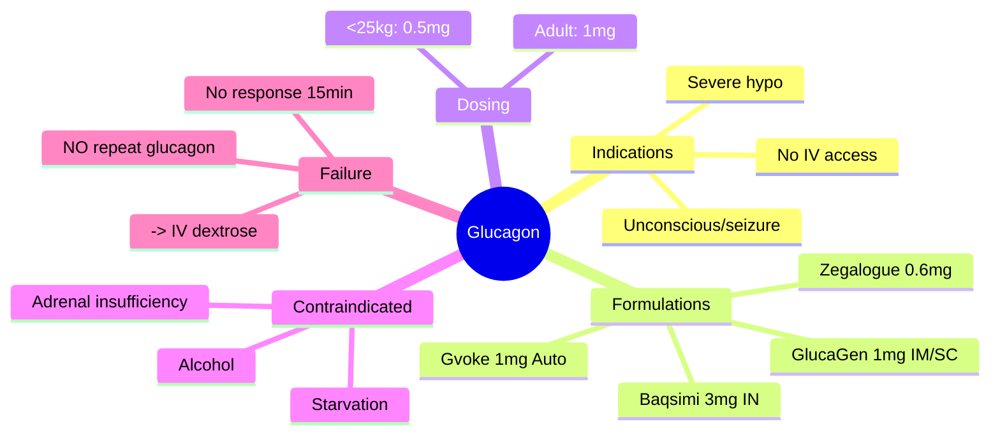

# Glucagon (IM, IN, auto-injector)

## 1. Learning Objectives
By the end of this note you should be able to:
- [ ] State glucagon indications, dosing, and routes
- [ ] Choose appropriate formulation (IM, IN, auto-injector)
- [ ] Recognise contraindications (starvation, alcohol, adrenal insufficiency)
- [ ] Manage glucagon failure

---

## 2. Definition & Epidemiology

| Feature | Detail |
|--------|--------|
| **Indication** | Severe hypoglycaemia (unconscious/seizure/unable to swallow) when IV access unavailable |
| **Mechanism** | Stimulates hepatic glycogenolysis and gluconeogenesis -> increases blood glucose |
| **Requirement** | **Requires hepatic glycogen stores** -- ineffective if depleted |

---

## 3. Clinical Features / Presentation
(N/A - drug therapy)

---

## 4. Classification / Staging / Grading

### Glucagon Formulations

| Formulation | Dose | Route | Onset | Duration | Key Features |
|-------------|------|-------|-------|----------|--------------|
| **GlucaGen HypoKit** | 1mg (adult), 0.5mg (<25kg) | IM/SC | 10-15min | 60-90min | Reconstitute powder; standard UK |
| **Baqsimi** | 3mg | Intranasal | 10-15min | 60-90min | Needle-free; device-based; single use |
| **Gvoke HypoPen/Pre-filled syringe** | 0.5mg (paed), 1mg (adult) | SC (auto-injector/syringe) | 10-15min | 60-90min | Ready-to-use liquid; stable at room temp |
| **Zegalogue (dasiglucagon)** | 0.6mg | SC (auto-injector/syringe) | 10min | 60-90min | Ready-to-use; stable; no reconstitution |

### Dosing by Age/Weight
| Population | IM/SC (GlucaGen) | Intranasal (Baqsimi) | Auto-injector (Gvoke) |
|------------|------------------|---------------------|----------------------|
| **Adult** | 1mg | 3mg | 1mg |
| **Child <25kg / <6-8y** | 0.5mg | 3mg (age>=4) | 0.5mg |

---

## 5. Diagnosis & Investigations
| Investigation | Role |
|---------------|------|
| **Blood glucose** | Confirm hypo before/after; recheck 15min post-glucagon |
| **Ketones** | If DKA suspected -- glucagon contraindicated (requires insulin) |

---

## 6. Differential Diagnosis
| Scenario | Glucagon Effective? |
|----------|-------------------|
| **Insulin/SU hypoglycaemia** | YES (glycogen present) |
| **Starvation/prolonged fasting** | NO - glycogen depleted |
| **Alcohol-induced hypoglycaemia** | NO - glycogen depleted, blocks gluconeogenesis |
| **Adrenal insufficiency** | NO - impaired counter-regulation |
| **Post-bariatric hypoglycaemia** | Variable (may have glycogen) |

---

## 7. Management

### Acute Administration Protocol
```mermaid
flowchart TD
    A[Severe Hypoglycaemia] --> B{IV Access?}
    B -->|Yes| C[IV Dextrose 75-80ml 20% (or 150ml 10%) bolus -> 10% infusion]
    B -->|No| D{Conscious?}
    D -->|No/Unsafe to swallow| E[Glucagon 1mg IM/SC (adult) or Nasal 3mg (Baqsimi)]
    D -->|Yes but unable to swallow| E
    E --> F[Recheck glucose 15min]
    F --> G{Glucose >3.9?}
    G -->|No| H[IV access? -> dextrose; or 2nd glucagon NOT recommended]
    G -->|Yes| I[Complex carb snack if meal >1h]
```

### Key Administration Points
| Step | Action |
|------|--------|
| **1** | Check glucose (if possible) -- but DON'T delay if clinical hypo |
| **2** | Choose formulation: IM/SC (GlucaGen), IN (Baqsimi), Auto (Gvoke) |
| **3** | Administer per device instructions |
| **4** | Position recovery position (aspiration risk if vomiting) |
| **5** | Recheck glucose at 15min |
| **6** | If no response in 15min -> IV dextrose (do NOT repeat glucagon) |
| **7** | Once glucose >3.9 -> complex carbs if next meal >1h |

### Post-Glucagon Care
| Action | Detail |
|--------|--------|
| **Complex carbs** | Once conscious and glucose >3.9; snack if meal >1h away |
| **Monitoring** | Glucose q15-30min for 1-2h |
| **Investigate cause** | Review insulin/SU doses, meal timing, alcohol, exercise |
| **Education** | Patient/carer training on glucagon use; expiry dates |

---

## 8. FCPS/MRCP High-Yield Summary

| Topic | Key Points |
|-------|------------|
| **Indication** | Severe hypo (unconscious/seizure/unable to swallow) + NO IV access |
| **Dose adult** | 1mg IM/SC (GlucaGen); 3mg IN (Baqsimi); 1mg auto-injector (Gvoke) |
| **Dose child** | 0.5mg <25kg/age<8y; Baqsimi 3mg (age>=4) |
| **Onset/Duration** | 10-15min onset; 60-90min duration |
| **Contraindications** | Starvation, alcohol, adrenal insufficiency -- NO glycogen -> NO effect |
| **Failure** | If no response 15min -> IV dextrose; do NOT repeat glucagon (glycogen depleted) |
| **Post-glucagon** | Recheck 15min; complex carbs if glucose>3.9; monitor 1-2h |

---

## 9. Viva Questions

| Question | Expected Answer |
|----------|-----------------|
| **What is the dose of glucagon for severe hypoglycaemia in an adult?** | 1mg IM/SC (GlucaGen); 3mg intranasal (Baqsimi); 1mg SC auto-injector (Gvoke) |
| **What is the dose for a child <25kg?** | 0.5mg IM/SC (GlucaGen); 3mg IN (Baqsimi, age>=4); 0.5mg auto-injector (Gvoke) |
| **When is glucagon CONTRAINDICATED?** | Starvation/prolonged fasting, alcohol-induced hypoglycaemia, adrenal insufficiency -- NO hepatic glycogen stores |
| **What if glucagon fails to raise glucose in 15 minutes?** | Give IV dextrose (75-80ml 20% or 150ml 10%); do NOT repeat glucagon |
| **How long does glucagon effect last?** | 60-90 minutes -- complex carbs needed if next meal >1h away |
| **What are the available glucagon formulations?** | GlucaGen HypoKit (IM/SC, 1mg), Baqsimi (intranasal, 3mg), Gvoke (auto-injector/syringe, 0.5/1mg), Zegalogue (dasiglucagon, 0.6mg) |

---

## 10. Confusions & Mnemonics

| Confusion | Clarification |
|-----------|---------------|
| **Glucagon works in starvation?** | NO -- requires hepatic glycogen; use IV dextrose instead |
| **Repeat glucagon if no response?** | NO -- depletes glycogen; if no response 15min -> IV dextrose |
| **Glucagon in DKA?** | NO -- DKA has hyperglycaemia; glucagon would worsen it; insulin needed |

**Mnemonic: GLUCAGON-1MG**
- **G**lucagon: 1mg IM/SC adult
- **L**icenced: IM, IN, Auto-injector
- **U**nder 25kg: 0.5mg
- **C**ontraindicated: starvation, alcohol, adrenal insufficiency
- **A**dministration: IM/SC/IN/Auto; 10-15min onset
- **G**lucose check: 15min post-dose
- **A**gain? NO repeat -- if fail -> IV dextrose
- **O**nce glucose>3.9: complex carbs if meal>1h
- **N**asal Baqsimi 3mg (age>=4)
- **1**mg adult / 0.5mg <25kg
- **M**ust have glycogen (fails in starvation/alcohol)
- **G**voke auto-injector ready-to-use

---

## 11. Mind Map



---

## 12. One-Page Revision Card

| Domain | Key Points |
|--------|------------|
| **Definition** | Hepatic glycogenolysis stimulator for severe hypoglycaemia without IV access |
| **Key Test" | Glucose at 15min post-dose; must have glycogen stores |
| **Classification" | IM/SC (GlucaGen), IN (Baqsimi), Auto (Gvoke/Zegalogue) |
| **Acute Mgmt" | 1mg IM/SC adult; 3mg IN; 0.5mg <25kg; recheck 15min |
| **Chronic Mgmt" | Education on use; expiry dates; carer training |
| **Key Score" | 1mg adult / 0.5mg child; onset 10-15min; duration 60-90min |
| **Complications" | Nausea, vomiting; inefficacy if glycogen depleted |
| **Prognosis" | Effective if glycogen present; life-saving in severe hypo |

---

## 13. Spaced Repetition Trackers

| Review Interval | Date Completed | Confidence (1-5) | Notes |
|-----------------|----------------|------------------|-------|
| 24 hours | | | |
| 7 days | | | |
| 15 days | | | |
| 30 days | | | |
| 90 days | | | |

---

## 14. Self-Test Scorecard

| Section | Score /5 | Last Attempt |
|---------|----------|--------------|
| Definition & Epidemiology | | |
| Classification & Staging | | |
| Diagnosis & Investigations | | |
| Management (Acute) | | |
| Management (Chronic) | | |
| Complications | | |
| Viva Questions | | |
| DDx Distinctions | | |
| Mnemonics/Algorithms | | |

---

### Local Navigation
- **Parent Heading": [[../../Diabetic Emergencies|Diabetic Emergencies]]
- **Chapter Map": [[../../Davidson Chapter 25 - Diabetes Hierarchy|Diabetes Hierarchy]]
- **Chapter MOC": [[../../Diabetes MOC|Diabetes MOC]]
- **Drug Reference": [[../../../Clinical Therapeutics and Good Prescribing|Drugs]]
- **Related": [[Hypoglycaemia classification (level 1/2/3)], [[Severe hypoglycaemia]], [[Diabetic ketoacidosis (DKA)]]

---
## Tags
#medicine #diabetes #davidson #fcps #mrcp #full-fcps-mrcp-note

## PasTest Scenario SBAs (Clinical Vignettes)

> **Auto-generated PasTest/Mediscope-style scenario SBAs** grounded in the authored source. Each scenario tests a real clinical fact (triad, specific sign, contraindication, trial, first-line Rx) extracted from the topic. *Source: Ch 21: Diabetes — glucagon-im,-in,-auto-injector*

**Q1.** What is the most appropriate first-line therapy for glucagon-im,-in,-auto-injector?

  - **A.** CGM in hospital
  - **B.** An advanced/surgical therapy reserved for refractory disease
  - **C.** Symptomatic treatment only, no disease-modifying therapy
  - **D.** Empiric broad-spectrum therapy without specific indication

  > **Answer: A** — CGM in hospital
  >
  > *Source:* **CGM in hospital**   Real-time alerts; reduces severe hypo 50%
---

> Auto-generated study sections for "Severe hypoglycaemia" — Ch 21: Diabetes Mellitus.

## Flashcards (13 generated)

- Q: What is the definition of Severe hypoglycaemia?
  A: By the end of this note you should be able to:
- Q: What is Severe hypoglycaemia indicated for?
  A: Severe hypoglycaemia (unconscious/seizure/unable to swallow) when IV access unavailable
- Q: What is the mechanism of Severe hypoglycaemia?
  A: Stimulates hepatic glycogenolysis and gluconeogenesis -> increases blood glucose
- Q: What is Requirement of Severe hypoglycaemia?
  A: Requires hepatic glycogen stores -- ineffective if depleted
- Q: What is Blood glucose of Severe hypoglycaemia?
  A: Confirm hypo before/after; recheck 15min post-glucagon
- Q: What is Ketones of Severe hypoglycaemia?
  A: If DKA suspected -- glucagon contraindicated (requires insulin)
- Q: What is Blood glucose of Severe hypoglycaemia?
  A: Confirm hypo before/after; recheck 15min post-glucagon
- Q: What is Ketones of Severe hypoglycaemia?
  A: If DKA suspected -- glucagon contraindicated (requires insulin)
- Q: What is Severe hypoglycaemia indicated for?
  A: Severe hypo (unconscious/seizure/unable to swallow) + NO IV access
- Q: What is the dose of Severe hypoglycaemia?
  A: 1mg IM/SC (GlucaGen); 3mg IN (Baqsimi); 1mg auto-injector (Gvoke)
- Q: What is Onset/Duration of Severe hypoglycaemia?
  A: 10-15min onset; 60-90min duration
- Q: What is Failure of Severe hypoglycaemia?
  A: If no response 15min -> IV dextrose; do NOT repeat glucagon (glycogen depleted)
- Q: What is Post-glucagon of Severe hypoglycaemia?
  A: Recheck 15min; complex carbs if glucose>3.9; monitor 1-2h

## MCQs (1 generated)

1. **Which of the following best describes Severe hypoglycaemia?**
   A. **By the end of this note you should be able to:**
   B. An unrelated condition not matching the clinical picture of Severe hypoglycaemia
   C. A complication seen late in the disease course of Severe hypoglycaemia
   D. A condition that mimics Severe hypoglycaemia but has a different underlying cause

## SBA Questions (1 generated)

1. A patient with suspected Severe hypoglycaemia presents with: Indication — Severe hypoglycaemia (unconscious/seizure/unable to swallow) when IV access unavailable; Mechanism — Stimulates hepatic glycogenolysis and gluconeogenesis -> increases blood glucose; Requirement — Requires hepatic glycogen stores -- ineffective if depleted. What is the most likely diagnosis?
   A. **Severe hypoglycaemia**
   B. A condition that mimics Severe hypoglycaemia but is not the same entity
   C. A complication of Severe hypoglycaemia rather than the primary diagnosis
   D. An unrelated condition in the same clinical category as Severe hypoglycaemia

