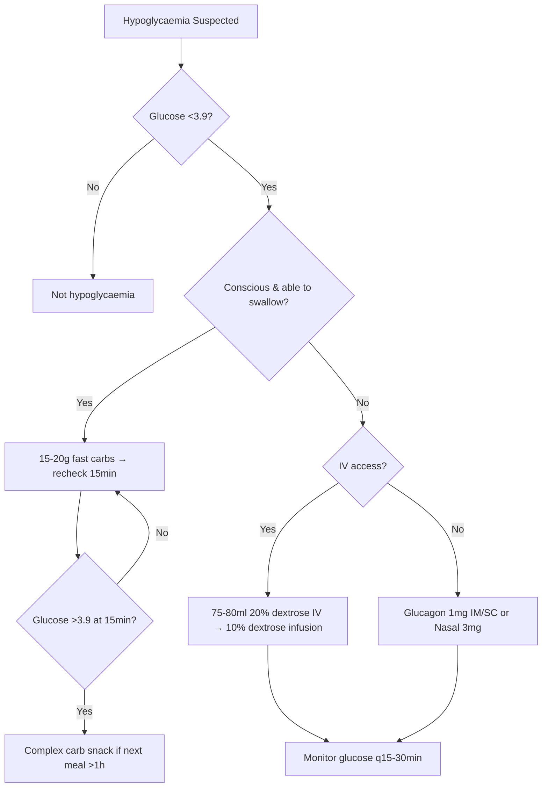

# Hypoglycaemia classification (level 1/2/3)

## 1. Learning Objectives
- [ ] Classify hypoglycaemia (Level 1/2/3 per ADA/IHSG)
- [ ] Manage hypoglycaemia in conscious and unconscious patients
- [ ] Dose glucagon (IM, IN, auto-injector)
- [ ] Recognise hypoglycaemia unawareness and manage
- [ ] Prevent recurrent hypoglycaemia

## 2. Definition & Epidemiology
| Feature | Detail |
|--------|--------|
| **Definition** | Plasma glucose <3.9 mmol/L (70 mg/dL) — threshold for neuroendocrine response |
| **Classification (ADA/IHSG 2017)** | Level 1: <3.9 mmol/L (alert value); Level 2: <3.0 mmol/L (clinically significant); Level 3: Severe (requires assistance) |
| **Incidence** | T1DM: 2–3 severe episodes/patient-year; T2DM on insulin: 1–2; T2DM on SU: 0.5–1 |
| **Mortality** | ~4–10% of T1DM deaths; "dead in bed" syndrome (nocturnal hypo + arrhythmia) |
| **Risk Factors** | Insulin/SU use, CKD, elderly, hypoglycaemia unawareness, tight control, alcohol, exercise, erratic meals |

## 3. Clinical Features / Presentation
| Level | Glucose | Symptoms | Management |
|-------|---------|----------|------------|
| **Level 1 (Alert)** | <3.9 mmol/L | Autonomic: sweating, tremor, palpitations, hunger, anxiety | Oral carbs 15–20g; recheck 15min |
| **Level 2 (Clinical)** | <3.0 mmol/L | Neuroglycopenic: confusion, drowsiness, speech difficulty, ataxia, visual disturbance | Oral carbs if able; glucagon if not |
| **Level 3 (Severe)** | Any (requires help) | Unconscious, seizure, coma — needs 3rd party assistance | Glucagon IM/IN + IV dextrose; emergency services |

## 4. Classification / Staging / Grading
| System | Categories | Key Features |
|--------|------------|--------------|
| **ADA/IHSG** | Level 1: <3.9 mmol/L | Autonomic symptoms; self-treat |
| | Level 2: <3.0 mmol/L | Neuroglycopenic; impaired judgement |
| | Level 3: Severe | Requires assistance; unconscious/seizure |
| **Counter-regulation** | Normal | Glucagon ↑, epinephrine ↑, cortisol/GH ↑ |
| | Impaired (T1DM) | Glucagon response lost first, then epinephrine blunted → unawareness |
| **Unawareness** | Absent autonomic symptoms | Sudden neuroglycopenia; risk of severe hypo 6x higher |

## 5. Diagnosis & Investigations
| Investigation | Role | Key Details |
|---------------|------|-------------|
| **Capillary/venous glucose** | Confirm hypo | <3.9 = Level 1; <3.0 = Level 2 |
| **CGM** | Detect nocturnal/unrecognised | TIR/TBR metrics; alerts for <3.9 |
| **Whipple's triad** | Diagnostic | Symptoms + low glucose + relief with glucose |
| **Insulin/C-peptide** | Factitious hypoglycaemia | Exogenous insulin → high insulin, low C-peptide; insulinoma → high both |

## 6. Differential Diagnosis
| Condition | Distinguishing Features |
|-----------|-------------------------|
| **Factitious hypoglycaemia** | Surreptitious insulin/SU use; high insulin, low C-peptide; surreptitious access |
| **Insulinoma** | Fasting hypoglycaemia; high insulin + high C-peptide + high proinsulin; CT/MRI pancreas |
| **Adrenal insufficiency** | Hypoglycaemia + hypotension + hyponatraemia + hyperkalaemia; cortisol low |
| **Post-bariatric hypoglycaemia** | Late dumping (1–3h post-meal); nesidioblastosis; GLP-1 mediated |
| **Non-islet cell tumour hypoglycaemia (NICTH)** | Large tumours; IGF-2 mediated; low insulin, low C-peptide, low IGF-1 |

## 7. Management

### Acute Management
| Scenario | Intervention | Dose / Details |
|----------|--------------|----------------|
| **Conscious, able to swallow** | Oral carbohydrate | 15–20g fast-acting carbs (glucose tablets, 150ml juice, 5–6 jelly babies); recheck 15min; repeat if <3.9 |
| **Conscious, unable/unwilling to swallow** | Glucagon | 1mg IM/SC (adult); 0.5mg <25kg child; Nasal 3mg (Baqsimi); Auto-injector 0.5mg/1mg (Gvoke) |
| **Unconscious / seizure** | IV dextrose + Glucagon | 75–80ml 20% dextrose (or 150ml 10%) IV bolus; then 10% dextrose infusion; Glucagon 1mg IM if no IV access |
| **Hospital insulin error** | Same as above + root cause analysis | Insulin passport; double-check protocol; CGM in hospital |

### Glucagon Details
| Formulation | Dose | Route | Onset | Duration |
|-------------|------|-------|-------|----------|
| **GlucaGen HypoKit** | 1mg (adult), 0.5mg (<25kg) | IM/SC | 10–15min | 60–90min |
| **Baqsimi** | 3mg | Intranasal | 10–15min | 60–90min |
| **Gvoke (auto-injector)** | 0.5mg/1mg | SC | 10–15min | 60–90min |
| **Zegalogue (dasiglucagon)** | 0.6mg | SC/auto-injector | 10min | Ready-to-use, stable at room temp |

### Prevention of Recurrent Hypoglycaemia
| Strategy | Details |
|----------|---------|
| **Hypoglycaemia unawareness reversal** | Avoid <3.9 for 2–3 weeks → restores autonomic symptoms; higher targets (HbA1c 58–64), CGM alerts, CSII |
| **Medication adjustment** | Reduce/stop SU; switch to GLP-1 RA/SGLT2i/DPP-4i; insulin dose reduction; basal-bolus → CSII/AID |
| **Education** | Carb counting, sick day rules, alcohol + food, exercise adjustments |
| **Technology** | CGM with predictive alerts; AID systems (reduce hypo by 30–50%) |

## 8. FCPS/MRCP High-Yield Summary
| Topic | Key Points |
|-------|------------|
| **Classification** | Level 1: <3.9; Level 2: <3.0; Level 3: severe (needs help) |
| **Conscious treatment** | 15–20g fast carbs → recheck 15min → repeat if needed |
| **Unconscious/no IV** | Glucagon 1mg IM/SC (adult), 0.5mg <25kg; Nasal 3mg |
| **Unconscious + IV** | 75–80ml 20% dextrose IV bolus → 10% dextrose infusion |
| **Glucagon types** | IM/SC (GlucaGen), IN (Baqsimi), Auto-injector (Gvoke), Dasiglucagon (Zegalogue) |
| **Unawareness reversal** | Avoid <3.9 for 2–3 weeks → restores glucagon/epinephrine response |
| **Hospital prevention** | Insulin passport, double-check, CGM, reduce sliding scale |

## 9. Viva Questions
| Question | Expected Answer |
|----------|-----------------|
| **How do you classify hypoglycaemia?** | Level 1: <3.9 mmol/L (alert); Level 2: <3.0 mmol/L (clinically significant); Level 3: Severe — requires assistance (unconscious/seizure) |
| **Management of conscious hypoglycaemia?** | 15–20g fast-acting carbohydrate (glucose tablets, 150ml juice, jelly babies) → recheck 15min → repeat if <3.9 → complex carb snack if meal >1h away |
| **Management of unconscious hypoglycaemia?** | IV access: 75–80ml 20% dextrose (or 150ml 10%) IV bolus → 10% dextrose infusion. No IV: Glucagon 1mg IM/SC (adult), 0.5mg <25kg; or Nasal 3mg (Baqsimi) |
| **Glucagon dose and routes?** | 1mg IM/SC (adult), 0.5mg <25kg; Nasal 3mg (Baqsimi); Auto-injector 0.5/1mg (Gvoke); Dasiglucagon 0.6mg SC (Zegalogue) |
| **What is hypoglycaemia unawareness?** | Absent autonomic symptoms due to blunted epinephrine response (glucagon already lost in T1DM); sudden neuroglycopenia; 6x risk severe hypo |
| **How do you reverse hypoglycaemia unawareness?** | Strict avoidance of glucose <3.9 mmol/L for 2–3 weeks → restores autonomic symptoms; use higher targets, CGM alerts, CSII/AID |
| **What is the "dead in bed" syndrome?** | Nocturnal hypoglycaemia → cardiac arrhythmia (QT prolongation) → sudden death in young T1DM; prevention: CGM nocturnal alerts, avoid tight control at bedtime |

## 10. Confusions & Mnemonics
| Confusion | Clarification |
|-----------|---------------|
| **Glucagon in starvation/alcohol** | INEFFECTIVE — requires hepatic glycogen stores; use IV dextrose |
| **Glucagon repeat dose** | NOT recommended — depletes glycogen; if no response in 15min → IV dextrose |
| **Level 3 definition** | "Requires assistance" — NOT defined by specific glucose value |

**Mnemonic: HYPO-15**
- **H**ypoglycaemia: <3.9 mmol/L
- **Y**ou check glucose
- **P**atient conscious? → 15–20g carbs
- **O**ral carbs: glucose tabs, juice, jelly babies
- **1**5min recheck
- **5** → if still low, repeat 15g
- **Unconscious**: No IV → Glucagon 1mg IM/IN; IV → 20% dextrose 75ml
- **Unawareness**: avoid <3.9 ×2-3 weeks → restores symptoms
- **Glucagon**: needs glycogen (fails in starvation/alcohol)

### Local Navigation
- **Parent Heading**: [[Diabetic Emergencies/Severe hypoglycaemia|Diabetic Emergencies/Severe hypoglycaemia]]
- **Chapter Map**: [[../../Davidson Chapter 25 - Diabetes Hierarchy|Diabetes Hierarchy]]
- **Chapter MOC**: [[../../Diabetes MOC|Diabetes MOC]]
- **Drug Reference": [[../../../Clinical Therapeutics and Good Prescribing|Drugs]]
- **Related": [[]]

---
## Tags
#medicine #diabetes #davidson #fcps #mrcp #full-fcps-mrcp-note
