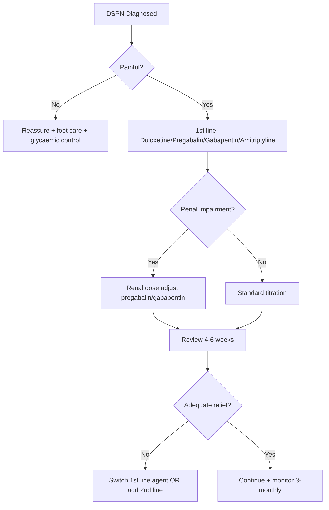

# Distal symmetric polyneuropathy (DSPN)

## 1. Learning Objectives
- [ ] Diagnose DSPN: stocking-glove sensory loss, absent ankle reflexes
- [ ] Differentiate painful vs painless DSPN
- [ ] Apply Toronto Clinical Scoring System for severity
- [ ] Manage neuropathic pain (duloxetine/pregabalin/gabapentin/amitriptyline)
- [ ] Exclude non-diabetic mimics (B12, alcohol, CIDP)

## 2. Definition & Epidemiology
| Feature | Detail |
|--------|--------|
| **Definition** | Symmetric, length-dependent sensorimotor polyneuropathy from chronic hyperglycaemia |
| **Prevalence** | ~50% T2DM at 20y; ~20% T1DM at 20y |
| **Risk Factors** | HbA1c, duration, age, HTN, dyslipidaemia, smoking, height |
| **Pathophysiology** | Polyol pathway, AGEs, PKC-β, oxidative stress → axonal degeneration (dying-back) |

## 3. Clinical Features / Presentation
| Feature | Painful DSPN (10–20%) | Painless DSPN |
|---------|----------------------|---------------|
| **Sensory** | Burning, shooting, lancinating, allodynia, hyperalgesia | Numbness, "cotton wool" sensation, insensate foot |
| **Nocturnal worsening** | Yes (often wakes patient) | N/A |
| **Reflexes** | Ankle reflexes absent; knee preserved | Ankle reflexes absent |
| **Motor** | Late: mild distal weakness, wasting | Late: mild weakness |
| **Autonomic** | May coexist | May coexist |

## 4. Classification / Staging / Grading

### Toronto Clinical Scoring System (TCSS)
| Component | Points |
|-----------|--------|
| **Symptoms** | Numbness 1, Tinling 1, Pain 1, Weakness 1, Ataxia 1 |
| **Reflexes** | Ankle absent 1, Knee absent 1 |
| **Sensation** | Pinprick ↓ 1, Vibration ↓ 1, Temperature ↓ 1 |

| Score | Interpretation |
|-------|----------------|
| **0–5** | No / mild DSPN |
| **6–8** | Moderate DSPN |
| **≥9** | Severe DSPN |

### NCS Findings (if performed)
| Parameter | DSPN Pattern |
|-----------|--------------|
| **Sensory nerve action potential (SNAP)** | ↓Amplitude (sural, radial) |
| **Motor NCV** | Normal or mildly ↓ |
| **CMAP amplitude** | Normal or ↓ (severe) |
| **F-waves** | Prolonged/absent |
| **Pattern** | **Axonal > demyelinating**; length-dependent |

## 5. Diagnosis & Investigations
| Investigation | Role |
|---------------|------|
| **10g monofilament** | Screening (LOPS); 6 sites/foot |
| **128Hz tuning fork** | Vibration perception; <10s at hallux = abnormal |
| **ANNS** | Symptom questionnaire (score ≥3 = likely DSPN) |
| **NCS** | Confirm atypical/mononeuropathy/radiculoplexus; not routine for typical DSPN |
| **Bloods (exclude mimics)** | B12, folate, TSH, ESR, SPEP, HIV, ANA, ANCA, alcohol history |

## 6. Differential Diagnosis
| Condition | Distinguishing Features |
|-----------|-------------------------|
| **B12 deficiency** | Macrocytic anaemia, subacute combined degeneration (posterior column), +ve IF Ab |
| **Alcoholic neuropathy** | Painful, sensory > motor; improves with abstinence + thiamine |
| **CIDP** | Progressive >8 weeks, proximal + distal weakness, areflexia, ↑CSF protein, demyelinating NCS |
| **Vasculitic neuropathy** | Mononeuritis multiplex, systemic features, ↑ESR/CRP, ANCA+ |
| **Amyloid neuropathy** | Autonomic dominant, carpal tunnel, family history, Congo red +ve |
| **Hypothyroid** | Carpal tunnel, myxoedema, delayed reflex relaxation |

## 7. Management

### Neuropathic Pain (NICE / ADA / NeuPSIG Aligned)
| Line | Agent | Dose | Notes |
|------|-------|------|-------|
| **1st** | **Duloxetine** | 30mg OD → 60mg OD (max 120mg) | SNRI; also helps depression; avoid hepatic impairment |
| | **Pregabalin** | 75mg BD → 150–300mg BD (max 600mg) | Renal adjust; weight gain, dizziness, euphoria risk |
| | **Gabapentin** | 300mg TDS → 600–1200mg TDS (max 3600mg) | Renal adjust; slower titration |
| | **Amitriptyline** | 10mg ON → 25–75mg ON | TCA; anticholinergic SE; avoid elderly/CVD |
| **2nd** | Tramadol / Tapentadol | PRN breakthrough | Opioid risk; short-term only |
| **3rd** | Capsaicin 8% patch | Q3mo | Topical; application pain |
| | Lidocaine 5% plaster | Daily 12h on/off | Localised pain |

### Non-Pharmacological
| Intervention | Evidence |
|--------------|----------|
| **Glycaemic control** | DCCT: ↓DSPN 60% (T1DM); UKPDS: ↓microvascular (T2DM) |
| **Exercise** | Improves nerve conduction, pain, QoL |
| **Foot care** | Daily inspection; offloading if LOPS; podiatry referral |
| **TENS / Acupuncture** | Limited evidence; adjunctive |

### Renal Dosing for Pregabalin/Gabapentin
| eGFR (mL/min) | Pregabalin | Gabapentin |
|---------------|------------|------------|
| **≥60** | 150–600mg/day | 900–3600mg/day |
| **30–59** | 75–300mg/day | 400–1400mg/day |
| **15–29** | 25–150mg/day | 200–700mg/day |
| **<15** | 25–75mg/day | 100–350mg/day |

## 8. FCPS/MRCP High-Yield Summary
| Topic | Key Points |
|-------|------------|
| **DSPN** | Stocking-glove sensory loss, absent ankle reflexes; painful 10–20% |
| **Screening** | Annual: 10g monofilament + vibration + ANNS |
| **Toronto Score** | 0–5 mild, 6–8 mod, ≥9 severe |
| **Pain Rx 1st line** | Duloxetine, Pregabalin, Gabapentin, Amitriptyline |
| **Renal adjust** | Pregabalin/Gabapentin — MUST adjust for eGFR |
| **Glycaemic control** | DCCT/UKPDS: intensive ↓DSPN |
| **Mimics** | B12, alcohol, CIDP, vasculitis — exclude if atypical |

## 9. Viva Questions
| Question | Expected Answer |
|----------|-----------------|
| **What is the typical presentation of DSPN?** | Stocking-glove sensory loss (pinprick, temperature, vibration, proprioception), absent ankle reflexes; painful 10–20% (burning, nocturnal) |
| **How do you screen for DSPN?** | Annual: 10g monofilament (6 sites/foot — cannot feel = LOPS), 128Hz tuning fork on hallux IP (<10s abnormal), ANNS questionnaire |
| **What are the 1st line agents for painful DSPN?** | Duloxetine (30→60mg), Pregabalin (75→150–300mg BD), Gabapentin (300→600–1200mg TDS), Amitriptyline (10→25–75mg ON) |
| **How do you adjust pregabalin/gabapentin in CKD?** | **MUST renal adjust**: Pregabalin eGFR 30–60: 75–150mg/day; 15–30: 25–75mg/day; <15: 25mg/day. Gabapentin similar. |
| **What is the Toronto Clinical Scoring System?** | Symptoms (numbness, tingling, pain, weakness, ataxia) + reflexes (ankle, knee) + sensation (pinprick, vibration, temp); 0–5 mild, 6–8 mod, ≥9 severe |
| **How does intensive glycaemic control affect DSPN?** | DCCT: ↓DSPN 60% in T1DM; UKPDS: ↓microvascular in T2DM |
| **What non-diabetic conditions mimic DSPN?** | B12 deficiency, alcoholic neuropathy, CIDP, vasculitis, amyloid, hypothyroidism — exclude if atypical (asymmetric, rapid, proximal, systemic) |

## 10. Confusions & Mnemonics
| Confusion | Clarification |
|-----------|---------------|
| **All painful feet = DSPN?** | NO — consider plantar fasciitis, Morton's neuroma, PAD, Charcot |
| **DSPN = autonomic neuropathy?** | NO — can coexist but distinct; DSPN = sensory/motor; Autonomic = CV/GI/GU |
| **Pregabalin = gabapentin?** | Similar but pregabalin: linear PK, faster onset, less dose variability; both need renal adjust |

**Mnemonic: DSPN-STOCKING**
- **D**SPN: length-dependent, dying-back axonal
- **S**tocking-glove: toes → up, fingers → up
- **P**ainful: 10-20% (burning, nocturnal)
- **N**umb: painless = insensate foot → ulcer risk
- **S**creening: 10g monofilament + 128Hz tuning fork + ANNS
- **T**oronto Score: 0-5 mild, 6-8 mod, ≥9 severe
- **O**ral meds 1st line: Duloxetine, Pregabalin, Gabapentin, Amitriptyline
- **C**KD: renal adjust pregabalin/gabapentin
- **K**etogenic: not relevant
- **I**ntensive glycaemic control: DCCT 60%, UKPDS ↓DSPN
- **N**euritis mimics: B12, alcohol, CIDP, vasculitis
- **G**ait: ataxia from proprioception loss

### Local Navigation
- **Parent Heading**: [[Microvascular Complications/Diabetic neuropathy|Microvascular Complications/Diabetic neuropathy]]
- **Chapter Map": [[../../Davidson Chapter 25 - Diabetes Hierarchy|Diabetes Hierarchy]]
- **Chapter MOC": [[../../Diabetes MOC|Diabetes MOC]]
- **Drug Reference": [[../../../Clinical Therapeutics and Good Prescribing|Drugs]]
- **Related": [[]]

---
## Tags
#medicine #diabetes #davidson #fcps #mrcp #full-fcps-mrcp-note
