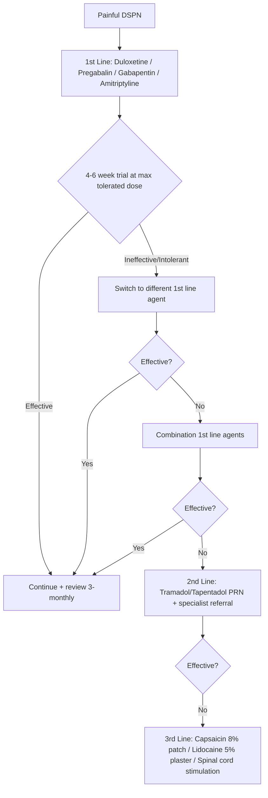

# Neuropathic pain management

## 1. Learning Objectives
- [ ] Apply stepwise pharmacological management of painful DSPN
- [ ] Select and titrate 1st line agents (duloxetine, pregabalin, gabapentin, amitriptyline)
- [ ] Apply renal dosing for pregabalin/gabapentin
- [ ] Manage refractory pain (combination, opioids, topical, interventional)
- [ ] Recognise and manage adverse effects

## 2. Definition & Epidemiology
| Feature | Detail |
|--------|--------|
| **Painful DSPN** | 10–20% of DSPN; burning, shooting, lancinating, allodynia, hyperalgesia |
| **Impact** | ↓QoL, sleep disturbance, depression, anxiety, ↓function |
| **Guidelines** | NICE CG173, NeuPSIG, ADA, AAN — broadly aligned on 1st line agents |

## 3. Clinical Features / Presentation
| Pain Characteristic | Description |
|---------------------|-------------|
| **Burning** | Constant, distally predominant |
| **Shooting/Lancinating** | Paroxysmal, electric shock-like |
| **Allodynia** | Pain from non-painful stimulus (light touch, bedsheets) |
| **Hyperalgesia** | Exaggerated pain response |
| **Nocturnal worsening** | Common; disrupts sleep |

## 4. Classification / Staging / Grading

### Neuropathic Pain Grading (NeuPSIG)
| Grade | Criteria |
|-------|----------|
| **Possible** | History suggestive + neuroanatomically plausible distribution |
| **Probable** | Possible + sensory signs in same distribution |
| **Definite** | Probable + confirmatory test (NCS, QST, skin biopsy) |

### Pain Severity (Numeric Rating Scale)
| Score | Severity |
|-------|----------|
| **1–3** | Mild |
| **4–6** | Moderate |
| **7–10** | Severe |

## 5. Diagnosis & Investigations
| Investigation | Role |
|---------------|------|
| **Clinical exam** | Sensory signs (stocking-glove), allodynia mapping |
| **NCS** | Confirm DSPN; exclude mononeuropathy/radiculoplexus |
| **QST (Quantitative Sensory Testing)** | Thermal/mechanical thresholds; research/specialist |
| **Skin biopsy** | Intraepidermal nerve fibre density (IENFD); specialist |
| **Pain scales** | NRS (0–10), DN4, PainDETECT, MSPQ |

## 6. Differential Diagnosis
| Condition | Distinguishing Features |
|-----------|-------------------------|
| **Mechanical foot pain** | Plantar fasciitis (heel, morning), Morton's neuroma (interdigital), PAD (claudication) |
| **Charcot** | Hot swollen foot, deformity, preserved pulses |
| **Osteomyelitis** | Ulcer + probe-to-bone, elevated inflammatory markers |
| **Radiculopathy** | Dermatomal distribution, back pain, MRI |

## 7. Management

### Stepwise Pharmacological Algorithm (NICE / NeuPSIG / ADA)

### 1st Line Agents (Monotherapy)
| Agent | Starting Dose | Titration | Max Dose | Key SE |
|-------|---------------|-----------|----------|--------|
| **Duloxetine** | 30mg OD | 60mg OD at 1–2wk | 120mg/day | Nausea, dry mouth, ↑BP, sexual dysfunction |
| **Pregabalin** | 75mg BD | 150mg BD at 1wk → 300mg BD | 600mg/day | Dizziness, weight gain, euphoria, **renal adjust** |
| **Gabapentin** | 300mg TDS | 600mg TDS at 3d → 1200mg TDS | 3600mg/day | Dizziness, somnolence, **renal adjust** |
| **Amitriptyline** | 10mg ON | 25mg ON at 1wk → 50–75mg ON | 75mg ON | Anticholinergic, sedation, orthostatic HTN, **avoid elderly/CVD** |

### Renal Dosing (Critical for Exams)
| eGFR (mL/min) | Pregabalin (mg/day) | Gabapentin (mg/day) |
|---------------|---------------------|---------------------|
| **≥60** | 150–600 | 900–3600 |
| **30–59** | 75–300 | 400–1400 |
| **15–29** | 25–150 | 200–700 |
| **<15** | 25–75 | 100–350 |

### Combination Therapy
| Combination | Rationale |
|-------------|-----------|
| **Duloxetine + Pregabalin** | Different mechanisms (SNRI + α2δ); additive; ↑SE |
| **Amitriptyline + Pregabalin** | Different mechanisms; monitor anticholinergic + sedation |

### 2nd Line
| Agent | Indication | Caution |
|-------|------------|---------|
| **Tramadol** | PRN breakthrough | Opioid; seizure risk; serotonin syndrome with duloxetine |
| **Tapentadol** | PRN breakthrough | µ-opioid + NA reuptake; less constipation |

### 3rd Line / Specialist
| Intervention | Details |
|--------------|---------|
| **Capsaicin 8% patch** | Q3 months; application pain; specialist application |
| **Lidocaine 5% plaster** | 12h on/12h off; localised neuropathic pain |
| **Spinal cord stimulation** | Refractory; trial then implant; NICE TA159 |
| **Peripheral nerve field stimulation** | Emerging |

### Non-Pharmacological
| Intervention | Evidence |
|--------------|----------|
| **TENS** | Low-quality evidence; adjunct |
| **Acupuncture** | Limited; some QoL benefit |
| **CBT / ACT** | Pain coping, sleep, mood |
| **Exercise** | Improves nerve conduction, pain, function |

## 8. FCPS/MRCP High-Yield Summary
| Topic | Key Points |
|-------|------------|
| **1st line** | Duloxetine, Pregabalin, Gabapentin, Amitriptyline — 4–6 week trial |
| **Renal dosing** | **Pregabalin/Gabapentin MUST adjust** by eGFR (table above) |
| **Amitriptyline** | Avoid elderly, CVD, glaucoma; anticholinergic burden |
| **Combination** | Duloxetine + Pregabalin (different mechanisms) |
| **2nd line** | Tramadol/Tapentadol PRN (opioid risks) |
| **3rd line** | Capsaicin 8% patch, Lidocaine 5% plaster, SCS (refractory) |
| **Non-drug** | CBT, exercise, TENS, acupuncture (adjunct) |

## 9. Viva Questions
| Question | Expected Answer |
|----------|-----------------|
| **What are the 1st line agents for painful diabetic neuropathy?** | Duloxetine, Pregabalin, Gabapentin, Amitriptyline (NICE/NeuPSIG/ADA aligned) |
| **How do you titrate pregabalin?** | Start 75mg BD → 150mg BD at 1 week → 300mg BD; max 600mg/day; **renal adjust essential** |
| **How do you adjust gabapentin/pregabalin in renal impairment?** | **MUST adjust**: Pregabalin eGFR 30–60: 75–300mg/day; 15–30: 25–150mg/day; <15: 25–75mg/day. Gabapentin similar. |
| **When do you use amitriptyline?** | 1st line option; avoid elderly, CVD, glaucoma, urinary retention; start 10mg ON → 25–75mg ON |
| **What is the role of opioids in neuropathic pain?** | **2nd line only** (Tramadol/Tapentadol PRN); short-term; avoid long-term; specialist if considering |
| **When do you refer for spinal cord stimulation?** | Refractory to 1st/2nd line; specialist assessment; NICE TA159 |

## 10. Confusions & Mnemonics
| Confusion | Clarification |
|-----------|---------------|
| **All 1st line equally effective?** | Similar efficacy (NNT ~4–5); choose by comorbidity/SE profile |
| **Gabapentin = pregabalin?** | Similar but pregabalin: linear PK, faster onset, less variability; both need renal adjust |
| **Amitriptyline safe in elderly?** | NO — anticholinergic burden, falls, orthostatic HTN, arrhythmia risk |

**Mnemonic: PAIN-DSPN-RX**
- **P**ainful DSPN: 10-20% of DSPN
- **A**gents 1st line: Duloxetine, Pregabalin, Gabapentin, Amitriptyline
- **I**nitial trial: 4-6 weeks max tolerated dose
- **N**ext: switch 1st line if fail → combine → 2nd line
- **D**uloxetine: SNRI, 30→60mg, also depression
- **S**pinal cord stim: 3rd line refractory
- **P**regabalin: **renal adjust** (eGFR 30-60: 75-300, 15-30: 25-150, <15: 25-75)
- **N**europathic: burning, shooting, allodynia
- **R**enal dosing: **MUST** for pregabalin/gabapentin
- **X** (no): amitriptyline in elderly/CVD

### Local Navigation
- **Parent Heading**: [[Microvascular Complications/Diabetic neuropathy|Microvascular Complications/Diabetic neuropathy]]
- **Chapter Map": [[../../Davidson Chapter 25 - Diabetes Hierarchy|Diabetes Hierarchy]]
- **Chapter MOC": [[../../Diabetes MOC|Diabetes MOC]]
- **Drug Reference": [[../../../Clinical Therapeutics and Good Prescribing|Drugs]]
- **Related": [[]]

---
## Tags
#medicine #diabetes #davidson #fcps #mrcp #full-fcps-mrcp-note
