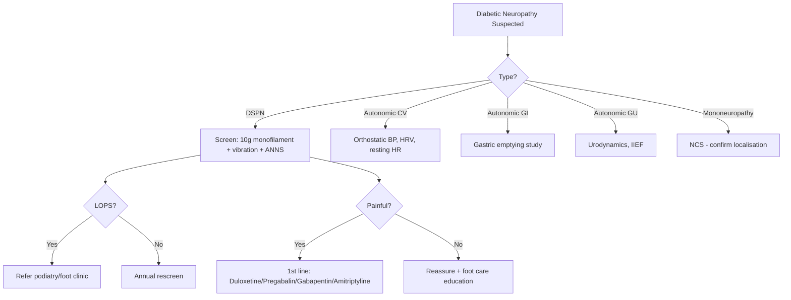
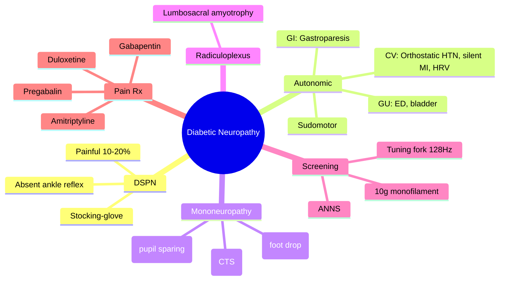

# Diabetic Neuropathy

> [!info]
> **Diabetic neuropathy: most common diabetic complication** — **DSPN** (distal symmetric polyneuropathy, 50% T2DM); **Autonomic** (CV: orthostatic hypotension, silent MI; GI: gastroparesis; GU: ED, bladder); **Mononeuropathies** (cranial, median, femoral); **Screening** (10g monofilament, 128Hz tuning fork, ANNS); **Pain** (duloxetine/pregabalin/gabapentin/amitriptyline 1st line).

---

## 1. Learning Objectives
- [ ] Classify diabetic neuropathy types (DSPN, autonomic, mononeuropathy, radiculoplexus)
- [ ] Perform bedside screening (10g monofilament, vibration, ANNS)
- [ ] Diagnose autonomic neuropathy subtypes (CV, GI, GU)
- [ ] Manage neuropathic pain (duloxetine/pregabalin/gabapentin/amitriptyline)
- [ ] Differentiate from non-diabetic causes (B12, alcohol, CIDP, vasculitis)

---

## 2. Definition & Epidemiology

| Feature | Detail |
|---------|--------|
| **Definition** | Nerve damage from chronic hyperglycaemia: metabolic (polyol pathway, AGEs, PKC), vascular (endoneurial ischaemia), oxidative stress |
| **Prevalence** | DSPN: ~50% T2DM, ~20% T1DM at 20y; Autonomic: ~20–40%; Painful DSPN: 10–20% of DSPN |
| **Risk Factors** | HbA1c, duration, age, hypertension, dyslipidaemia, smoking, alcohol, height, HLA-DR3/4 |
| **Pathophysiology** | Polyol pathway (sorbitol accumulation) → osmotic swelling; AGEs → protein cross-linking; PKC-β → vascular dysfunction; oxidative stress → mitochondrial dysfunction |

---

## 3. Clinical Features / Presentation

| Type | Frequency | Key Features |
|------|-----------|--------------|
| **DSPN** | Most common | **Stocking-glove** sensory loss (pinprick, temperature, vibration, proprioception); absent ankle reflexes; **painful** (burning, shooting, lancinating) in 10–20%; nocturnal worsening |
| **Autonomic CV** | 20–40% | Resting tachycardia (>100bpm), **orthostatic hypotension** (↓SBP ≥20/DBP ≥10), exercise intolerance, **silent MI**, HRV ↓ |
| **Autonomic GI** | 20–30% | **Gastroparesis**: nausea, vomiting, early satiety, bloating, erratic glucose; constipation/diarrhoea |
| **Autonomic GU** | 30–50% men | **Erectile dysfunction** (autonomic + vascular); retrograde ejaculation; neurogenic bladder (retention, incontinence, UTIs) |
| **Mononeuropathies** | <5% | Cranial (III > VI > IV) — ptosis, diplopia, pupil sparing; Median (CTS); Ulnar; Peroneal (foot drop); Femoral |
| **Radiculoplexus** | Rare | Severe pain → weakness/wasting (lumbosacral > cervical); asymmetric; weight loss; self-limiting 6–18mo |

---

## 4. Classification / Staging / Grading

| Classification | Subtypes | Key Features |
|----------------|----------|--------------|
| **DSPN** | Painful vs painless | Painful: burning, allodynia, hyperalgesia; Painless: insensate foot → ulcer risk |
| **Autonomic** | Cardiovascular | Orthostatic hypotension, resting tachycardia, silent ischaemia, HRV ↓ |
| | Gastrointestinal | Gastroparesis, diarrhoea, constipation |
| | Genitourinary | ED, retrograde ejaculation, neurogenic bladder |
| | Sudomotor | Anhidrosis (distal), gustatory sweating |
| **Mononeuropathy** | Cranial III/IV/VI, median, ulnar, peroneal, femoral | Acute onset; usually self-limiting 6–12 weeks |
| **Radiculoplexus neuropathy** | Lumbosacral (diabetic amyotrophy), cervical | Severe pain → wasting/weakness; asymmetric; weight loss |

### DSPN Severity (Toronto Clinical Scoring System)
| Score | Components | Interpretation |
|-------|------------|----------------|
| **0–5** | Symptoms, reflexes, sensation | No/mild DSPN |
| **6–8** | | Moderate DSPN |
| **≥9** | | Severe DSPN |

---

## 5. Diagnosis & Investigations

| Investigation | Role | Key Details |
|---------------|------|-------------|
| **10g monofilament** | Screening (LOPS) | Apply to 6 sites/foot (hallux, 1st/3rd/5th met heads, medial/lateral heel); **cannot feel = LOPS**; sensitivity 85%, specificity 90% |
| **128Hz tuning fork** | Vibration perception | On bony prominence (hallux IP joint, medial malleolus); count seconds; **<10s = abnormal** |
| **ANNS (Annual Neuropathy Symptom Score)** | Symptom questionnaire | 4 questions (pain, numbness, tingling, weakness); score ≥3 = likely DSPN |
| **Nerve conduction studies (NCS)** | Confirmation / atypical | ↓Amplitude, ↓conduction velocity; axonal > demyelinating; if atypical/mononeuropathy/radiculoplexus |
| **HRV / Valsalva / tilt table** | Autonomic CV | HRV ↓, Valsalva ratio <1.2, orthostatic BP drop |
| **Gastric emptying study** | Gastroparesis | T½ >120min (solids) or >40min (liquids); scintigraphy gold standard |
| **Blood tests** | Exclude mimics | B12, folate, TSH, ESR, SPEP, HIV, ANA, ANCA, alcohol history |

> **Screening Algorithm**: Annual 10g monofilament + vibration/ANNS in all DM; if abnormal → refer podiatry/neurology

---

## 6. Differential Diagnosis

| Condition | Distinguishing Features |
|-----------|-------------------------|
| **B12 deficiency** | Macrocytic anaemia, subacute combined degeneration (posterior column), +ve intrinsic factor Ab; MMA/homocysteine ↑ |
| **Alcoholic neuropathy** | Painful, predominantly sensory; history; improves with abstinence + thiamine |
| **CIDP** | Progressive >8 weeks, proximal + distal weakness, areflexia, ↑CSF protein, demyelinating NCS |
| **Vasculitic neuropathy** | Mononeuritis multiplex, systemic features, ↑ESR/CRP, ANCA+, nerve biopsy |
| **Amyloid neuropathy** | Autonomic dominant, carpal tunnel, family history, Congo red +ve biopsy |
| **Hypothyroid neuropathy** | Carpal tunnel, myxoedema, delayed reflex relaxation; TSH ↑ |

---

## 7. Management

### Neuropathic Pain (1st Line → 2nd Line → 3rd Line)
| Line | Agent | Dose | Notes |
|------|-------|------|-------|
| **1st** | **Duloxetine** | 30mg OD → 60mg OD (max 120mg) | SNRI; also helps depression; avoid if hepatic impairment |
| | **Pregabalin** | 75mg BD → 150–300mg BD (max 600mg) | Renal adjust; weight gain, dizziness, euphoria risk |
| | **Gabapentin** | 300mg TDS → 600–1200mg TDS (max 3600mg) | Renal adjust; slower titration |
| | **Amitriptyline** | 10mg ON → 25–75mg ON | TCA; anticholinergic SE; avoid elderly/CVD |
| **2nd** | Tramadol / Tapentadol | PRN breakthrough | Opioid risk; short-term only |
| **3rd** | Capsaicin 8% patch | Q3mo | Topical; application pain |
| | Lidocaine 5% plaster | Daily 12h on/off | Localised pain |

### Autonomic Neuropathy Management
| Subtype | Management |
|---------|------------|
| **Orthostatic hypotension** | ↑Salt/fluid, compression stockings, head-up tilt sleep, **fludrocortisone** 0.1–0.3mg OD, **midodrine** 2.5–10mg TDS |
| **Gastroparesis** | Small frequent meals, low fat/fibre, **metoclopramide** 10mg TDS (max 5d), **domperidone** 10mg TDS, **erythromycin** 250mg TDS (short-term) |
| **Erectile dysfunction** | **PDE5 inhibitors** (sildenafil 50mg, tadalafil 10mg); vacuum device; intraurethral alprostadil; penile prosthesis |
| **Neurogenic bladder** | Timed voiding, CIC, anticholinergics (oxybutynin), botulinum toxin, sacral neuromodulation |

### Glycaemic Control for Prevention
| Target | Evidence |
|--------|----------|
| **HbA1c <53mmol/mol (7.0%)** | DCCT: ↓DSPN 60%, autonomic 45% in T1DM; UKPDS: ↓microvascular in T2DM |
| **Avoid glucose variability** | CGM: CV <36%; glycaemic variability linked to neuropathy |

---

## 8. FCPS/MRCP High-Yield Summary

| Topic | Key Points |
|-------|------------|
| **DSPN** | Stocking-glove sensory loss, absent ankle reflexes; painful 10–20% (burning, nocturnal) |
| **Screening** | **Annual**: 10g monofilament (6 sites/foot) + 128Hz tuning fork + ANNS; LOPS = cannot feel monofilament |
| **Autonomic CV** | Orthostatic hypotension (↓SBP≥20), resting tachycardia, silent MI, HRV ↓ |
| **Autonomic GI** | Gastroparesis: nausea, vomiting, early satiety, erratic glucose; gastric emptying T½ >120min |
| **Autonomic GU** | ED (50% men), retrograde ejaculation, neurogenic bladder |
| **Mononeuropathies** | Cranial III (ptosis, diplopia, pupil sparing), median (CTS), peroneal (foot drop); self-limiting 6–12wk |
| **Pain management** | 1st line: **Duloxetine, Pregabalin, Gabapentin, Amitriptyline**; renal adjust pregabalin/gabapentin |
| **Glycaemic control** | DCCT/UKPDS: intensive control ↓DSPN 60% (T1DM), ↓microvascular (T2DM) |
| **Non-diabetic mimics** | B12 deficiency, alcohol, CIDP, vasculitis, amyloid — exclude if atypical |

---

## 9. Viva Questions

| Question | Expected Answer |
|----------|-----------------|
| **How do you screen for diabetic neuropathy?** | **Annual**: 10g monofilament (6 sites: hallux, 1st/3rd/5th met heads, medial/lateral heel — cannot feel = LOPS), 128Hz tuning fork on hallux IP joint/medial malleolus (<10s abnormal), ANNS questionnaire |
| **What is the stocking-glove distribution?** | Distal symmetric sensory loss starting in toes/feet → progresses proximally; follows longest nerve fibres first |
| **How do you classify autonomic neuropathy?** | Cardiovascular (orthostatic hypotension, silent MI, HRV), GI (gastroparesis), GU (ED, bladder), sudomotor |
| **What is gastroparesis and how do you diagnose it?** | Delayed gastric emptying without obstruction; symptoms: nausea, vomiting, early satiety, bloating, erratic glucose; **Gastric emptying scintigraphy**: T½ solids >120min, liquids >40min |
| **What are the 1st line agents for painful DSPN?** | Duloxetine (30→60mg), Pregabalin (75→150–300mg BD), Gabapentin (300→600–1200mg TDS), Amitriptyline (10→25–75mg ON); renal adjust pregabalin/gabapentin |
| **How does cranial nerve III palsy present in diabetes?** | Acute ptosis, ophthalmoplegia (down and out), **pupil sparing** (parasympathetic fibres peripheral), pain common; self-limiting 6–12wk |
| **What is diabetic amyotrophy?** | Lumbosacral radiculoplexus neuropathy: severe hip/thigh pain → wasting/weakness, asymmetric, weight loss; self-limiting 6–18mo |
| **How do you manage orthostatic hypotension in autonomic neuropathy?** | Non-drug: ↑salt/fluid, compression stockings, head-up tilt; Drug: fludrocortisone 0.1–0.3mg OD, midodrine 2.5–10mg TDS |

---

## 10. Confusions & Mnemonics

| Confusion | Clarification |
|-----------|---------------|
| **DSPN = autonomic neuropathy?** | NO — DSPN = distal symmetric sensory ± motor; Autonomic = CV/GI/GU/sudomotor; often coexist but distinct |
| **All painful neuropathy = diabetic?** | NO — exclude B12, alcohol, CIDP, vasculitis if atypical (asymmetric, rapid, proximal, systemic) |
| **Pregabalin/gabapentin dosing in CKD?** | **Must renal adjust**: Pregabalin eGFR 30–60: 75–150mg/day; 15–30: 25–75mg/day; <15: 25mg/day. Gabapentin similar. |

**Mnemonic: NEURO-PATHY**
- **N**europathy types: DSPN, Autonomic, Mono, Radiculoplexus
- **E**xam: 10g monofilament (6 sites) + 128Hz tuning fork + ANNS
- **U**lcers from LOPS (loss of protective sensation)
- **R**adiculoplexus: amyotrophy (pain → wasting)
- **O**rthostatic hypotension: ↓SBP≥20, fludrocortisone/midodrine
- **P**ainful DSPN: 10-20%; 1st line duloxetine/pregabalin/gabapentin/amitriptyline
- **A**utonomic: CV (silent MI), GI (gastroparesis), GU (ED)
- **T**uning fork 128Hz <10s abnormal
- **H**bA1c <53 prevents (DCCT 60%, UKPDS)
- **Y**ield NCS if atypical/mono/radiculoplexus

---

## 11. Mind Map

---

## 12. One-Page Revision Card

| Domain | Key Points |
|--------|------------|
| **Definition** | Nerve damage from hyperglycaemia: metabolic, vascular, oxidative |
| **Key Test** | 10g monofilament (6 sites/foot) + 128Hz tuning fork + ANNS (annual) |
| **Classification** | DSPN, Autonomic (CV/GI/GU), Mononeuropathy, Radiculoplexus |
| **Acute Mgmt** | Pain crisis: duloxetine/pregabalin/gabapentin/amitriptyline titration |
| **Chronic Mgmt** | HbA1c <53; annual screening; foot care if LOPS; orthostatic/ED/gastroparesis Rx |
| **Key Score** | Toronto Clinical Score; ANSS ≥3 |
| **Complications** | Foot ulcer (LOPS), falls (orthostatic), malnutrition (gastroparesis), QoL (pain) |
| **Prognosis** | DSPN progressive; autonomic improves with glycaemic control; mononeuropathy self-limiting |

---

## 13. Spaced Repetition Trackers

| Review Interval | Date Completed | Confidence (1-5) | Notes |
|-----------------|----------------|------------------|-------|
| 24 hours | | | |
| 7 days | | | |
| 15 days | | | |
| 30 days | | | |
| 90 days | | | |

---

## 14. Self-Test Scorecard

| Section | Score /5 | Last Attempt |
|---------|----------|--------------|
| Definition & Epidemiology | | |
| Classification & Staging | | |
| Diagnosis & Investigations | | |
| Management (Acute) | | |
| Management (Chronic) | | |
| Complications | | |
| Viva Questions | | |
| DDx Distinctions | | |
| Mnemonics/Algorithms | | |

---

### Local Navigation
- **Parent Heading": [[../../Microvascular Complications/Diabetic neuropathy|Diabetic neuropathy]]
- **Chapter Map": [[../../../Davidson Chapter 25 - Diabetes Hierarchy|Diabetes Hierarchy]]
- **Chapter MOC": [[../../../Diabetes MOC|Diabetes MOC]]
- **Drug Reference": [[../../../../Clinical Therapeutics and Good Prescribing|Drugs]]
- **Related": [[Neuropathy screening (10g monofilament, vibration, ANNS)]], [[Neuropathic pain management]], [[Autonomic neuropathy (cardiovascular, GI, genitourinary)]]

---
## Tags
#medicine #diabetes #davidson #fcps #mrcp #full-fcps-mrcp-note