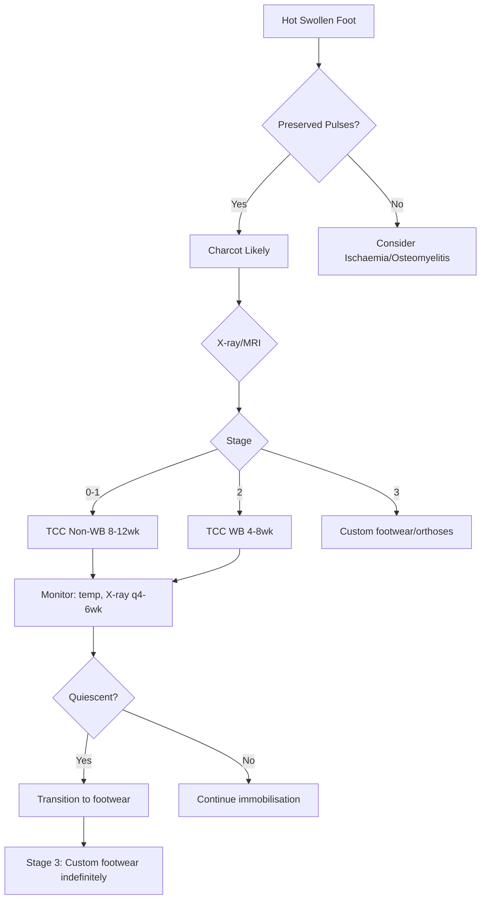

# Charcot neuroarthropathy

## 1. Learning Objectives
By the end of this note you should be able to:
- [ ] Diagnose Charcot neuroarthropathy: hot swollen foot + preserved pulses
- [ ] Apply Eichenholtz staging (0-3) for management decisions
- [ ] Differentiate from osteomyelitis, cellulitis, gout, DVT
- [ ] Execute TCC immobilisation protocol (non-WB -> WB)
- [ ] Recognise bisphosphonate role (limited evidence)

## 2. Definition & Epidemiology
| Feature | Detail |
|--------|--------|
| **Definition** | Neuropathic osteoarthropathy: joint destruction from repetitive trauma on insensate foot |
| **Incidence** | 0.1-0.5% diabetes; 1-2% with neuropathy |
| **Risk Factors** | Severe peripheral neuropathy (LOPS), prior ulcer, trauma, recent surgery, organ transplant |
| **Pathophysiology** | **Neurotraumatic**: repetitive microtrauma on insensate foot + **Neurovascular**: autonomic dysregulation -> increased blood flow -> bone resorption (RANKL/OPG) |

## 3. Clinical Features / Presentation
| Feature | Charcot | Osteomyelitis | Cellulitis |
|---------|---------|---------------|------------|
| **Onset** | Acute/subacute (days-weeks) | Subacute (weeks) | Acute (hours-days) |
| **Pain** | Variable (often painless due to neuropathy) | Painful (if no neuropathy) | Painful, tender |
| **Temperature** | **Hot** (increased 2-4°C vs contralateral) | Warm | Warm/hot |
| **Swelling** | **Marked**, diffuse | Localised | Spreading |
| **Erythema** | Diffuse, non-spreading | Localised | Spreading |
| **Pulses** | **Preserved** (often bounding) | Present | Present |
| **Deformity** | **Rocker-bottom**, midfoot collapse | Rare | None |
| **Systemic signs** | Absent (afebrile) | Fever, increased WBC, increased ESR/CRP | Fever, increased WBC, increased CRP |
| **X-ray** | Fragmentation, dislocation, debris | Periosteal reaction, destruction | Soft tissue swelling |

## 4. Classification / Staging / Grading

### Eichenholtz Staging
| Stage | Radiological Features | Clinical | Duration |
|-------|----------------------|----------|----------|
| **0 (Development)** | **Normal** X-ray; MRI: marrow oedema, joint effusion | Hot, swollen, erythematous; no deformity | Weeks |
| **1 (Fragmentation)** | **Bone fragmentation**, joint dislocation, subluxation, debris; "rocker-bottom" | Peak inflammation; deformity developing | 3-6 months |
| **2 (Coalescence)** | Decreased fragmentation; early fusion; sclerosis | Decreasing heat/swelling; deformity stabilising | 6-12 months |
| **3 (Reconstruction)** | Consolidation, fusion, remodelling; stable deformity | Cool, non-erythematous; fixed deformity | 12+ months |

> **Diagnostic tip**: **Hot swollen foot + preserved pulses = Charcot until proven otherwise**

### Differential Diagnosis
| Condition | Distinguishing Features |
|-----------|-------------------------|
| **Osteomyelitis** | Ulcer + probe-to-bone, systemic signs, elevated inflammatory markers |
| **Cellulitis** | Spreading erythema, systemic signs, no deformity |
| **Gout** | Acute 1st MTP, exquisitely tender, crystals in aspirate |
| **DVT** | Calf tenderness, positive Wells, D-dimer, US; no foot deformity |
| **Inflammatory arthritis** | Symmetric, morning stiffness, autoantibodies |

## 5. Diagnosis & Investigations
| Investigation | Role |
|---------------|------|
| **Clinical exam** | Hot swollen foot, preserved pulses, deformity, neuropathy (LOPS) |
| **X-ray** | Eichenholtz staging; fragmentation, dislocation |
| **MRI** | **Gold standard early**: marrow oedema, joint effusion (Stage 0) |
| **Bone scan** | Increased uptake (non-specific); if MRI contraindicated |
| **Inflammatory markers** | ESR/CRP usually normal (vs osteomyelitis) |
| **Bone turnover markers** | Increased NTX, CTX in active phase |

## 6. Differential Diagnosis
(See table above - key: **preserved pulses + hot swollen foot = Charcot**)

## 7. Management

### Immobilisation (Cornerstone)
| Phase | Intervention | Duration |
|-------|--------------|----------|
| **Acute (Stage 0-1)** | **TCC (Total Contact Cast)** - non-weightbearing | 8-12 weeks |
| **Transition (Stage 1-2)** | TCC - weightbearing as tolerated | 4-8 weeks |
| **Quiescent (Stage 2-3)** | Custom footwear / CROW / accommodative orthoses | Indefinite |

> **TCC Protocol**: Fibreglass/plaster; molded; window for skin inspection; changed weekly; crutches/knee scooter for non-WB

### Adjunctive Therapies
| Therapy | Evidence |
|---------|----------|
| **Bisphosphonates** | IV zoledronic acid 5mg / pamidronate 60mg - small RCTs show reduced bone turnover markers, reduced temperature; **not standard** |
| **Calcitonin** | Intranasal / SC - historical; limited use |
| **Protease inhibitors** | Experimental (RANKL/OPG pathway) |
| **Surgical** | Acute: rarely (exostectomy for pressure); Chronic: osteotomy, arthrodesis for unstable deformity |

### Monitoring
| Parameter | Frequency |
|-----------|-----------|
| **Skin temperature (infrared)** | Weekly (difference >2°C = active) |
| **Serial X-rays** | 4-6 weekly (Eichenholtz progression) |
| **MRI** | If diagnostic uncertainty (Stage 0) |

### Surgical Indications (Chronic Stage 3)
| Indication | Procedure |
|------------|-----------|
| **Unstable deformity** | Arthrodesis (midfoot/hindfoot) |
| **Rocker-bottom with ulcer risk** | Exostectomy + osteotomy |
| **Failed conservative** | Realignment arthrodesis |

## 8. FCPS/MRCP High-Yield Summary
| Topic | Key Points |
|-------|------------|
| **Diagnosis** | **Hot swollen foot + preserved pulses** = Charcot until proven otherwise |
| **Eichenholtz 0-3** | 0: normal X-ray/MRI oedema; 1: fragmentation; 2: coalescence; 3: reconstruction |
| **Immobilisation** | **TCC non-WB 8-12wk -> WB 4-8wk -> custom footwear** |
| **Key differentiator** | **Preserved pulses** (vs osteomyelitis/cellulitis) |
| **Bisphosphonates** | Not standard; zoledronic acid 5mg some evidence for reduced turnover |
| **Surgical** | Chronic unstable deformity -> arthrodesis/exostectomy |

## 9. Viva Questions
| Question | Expected Answer |
|----------|-----------------|
| **What is the hallmark clinical feature of Charcot foot?** | **Hot, swollen, erythematous foot with PRESERVED PULSES** in a neuropathic diabetic |
| **What are the Eichenholtz stages?** | 0: normal X-ray (MRI oedema); 1: fragmentation/dislocation; 2: coalescence; 3: reconstruction |
| **How do you manage acute Charcot (Stage 0-1)?** | **TCC immobilisation non-weightbearing 8-12 weeks** -> weightbearing in TCC 4-8 weeks |
| **How do you differentiate Charcot from osteomyelitis?** | Charcot: **preserved pulses**, hot swollen foot, bilateral rare, no systemic sepsis; Osteomyelitis: ulcer + probe-to-bone, elevated ESR/CRP, systemic signs |
| **What is the role of bisphosphonates in Charcot?** | Not standard; zoledronic acid 5mg IV some evidence for reduced bone turnover markers; limited RCTs |
| **When is surgery indicated?** | Chronic Stage 3: unstable deformity -> arthrodesis; rocker-bottom with ulcer risk -> exostectomy |

## 10. Confusions & Mnemonics
| Confusion | Clarification |
|-----------|---------------|
| **Charcot = osteomyelitis?** | NO - Charcot has **preserved pulses**, no systemic sepsis, bilateral rare |
| **TCC weightbearing immediately?** | NO - **non-weightbearing 8-12 weeks** first, then gradual transition |
| **MRI for all suspected Charcot?** | YES if Stage 0 suspected (normal X-ray); X-ray sufficient for Stage 1+ |

**Mnemonic: CHARCOT-FOOT**
- **C**haracteristic: **Hot swollen foot + preserved pulses**
- **H**ot: increased 2-4°C vs contralateral
- **A**utonomic: neurovascular theory (increased blood flow -> bone resorption)
- **R**ocker-bottom: midfoot collapse deformity
- **C**octures: fragmentation, dislocation, debris (Eichenholtz 1)
- **O**steomyelitis DDx: Charcot has pulses, no sepsis
- **T**CC: **non-WB 8-12wk -> WB 4-8wk -> footwear**
- **F**ragmentation = Eichenholtz 1
- **O**steolysis: neurovascular theory (RANKL/OPG)
- **O**steomyelitis DDx: pulses preserved in Charcot
- **T**reatment: TCC non-WB 8-12wk -> WB 4-8wk -> custom footwear
- **E**ichenholtz: 0=dev, 1=frag, 2=coal, 3=recon
- **B**isphosphonates: not standard (zoledronic 5mg some evidence)

### Local Navigation
- **Parent Heading**: [[Microvascular Complications/Diabetic foot disease|Microvascular Complications/Diabetic foot disease]]
- **Chapter Map": [[../../Davidson Chapter 25 - Diabetes Hierarchy|Diabetes Hierarchy]]
- **Chapter MOC": [[../../Diabetes MOC|Diabetes MOC]]
- **Drug Reference": [[../../../Clinical Therapeutics and Good Prescribing|Drugs]]
- **Related": [[]]

---
## Tags
#medicine #diabetes #davidson #fcps #mrcp #full-fcps-mrcp-note

## PasTest Scenario SBAs (Clinical Vignettes)

> **Auto-generated PasTest/Mediscope-style scenario SBAs** grounded in the authored source. Each scenario tests a real clinical fact (triad, specific sign, contraindication, trial, first-line Rx) extracted from the topic. *Source: Ch 21: Diabetes — Charcot neuroarthropathy*

**Q1.** Which of the following features is most specific or characteristic of Charcot neuroarthropathy?

  - **A.** DVT
  - **B.** A feature common to many acute inflammatory conditions
  - **C.** A non-specific sign that does not localise the diagnosis
  - **D.** An investigation finding rather than a clinical feature

  > **Answer: A** — DVT
  >
  > *Source:* l |
| **Gout** | **Exquisitely painful**; monoarticular (1st MTP common); tophi; urate crystals |
| **DVT** | Calf tenderness, swelling, +ve D-dimer/US; foot not typically hot/deformed |
| **Fracture*

**Q2.** What is the most appropriate first-line therapy for Charcot neuroarthropathy?

  - **A.** Total Contact Cast + Gold standard + 12–24 weeks
  - **B.** An advanced/surgical therapy reserved for refractory disease
  - **C.** Symptomatic treatment only, no disease-modifying therapy
  - **D.** Empiric broad-spectrum therapy without specific indication

  > **Answer: A** — Total Contact Cast + Gold standard + 12–24 weeks
  >
  > *Source:* **Total Contact Cast (TCC)**   **Gold standard** — non-removable offloading; change weekly for skin check; **12–24 weeks** until quiescent (Stage 2–3)
---

> Auto-generated study sections for "Diabetic foot disease" — Ch 21: Diabetes Mellitus.

## Flashcards (25 generated)

- Q: What is the definition of Diabetic foot disease?
  A: Neuropathic osteoarthropathy: joint destruction from repetitive trauma on insensate foot
- Q: What is the epidemiology of Diabetic foot disease?
  A: 0.1-0.5% diabetes; 1-2% with neuropathy
- Q: What causes Diabetic foot disease?
  A: Severe peripheral neuropathy (LOPS), prior ulcer, trauma, recent surgery, organ transplant
- Q: What is Clinical exam of Diabetic foot disease?
  A: Hot swollen foot, preserved pulses, deformity, neuropathy (LOPS)
- Q: What is X-ray of Diabetic foot disease?
  A: Eichenholtz staging; fragmentation, dislocation
- Q: What is MRI of Diabetic foot disease?
  A: Gold standard early: marrow oedema, joint effusion (Stage 0)
- Q: What is Bone scan of Diabetic foot disease?
  A: Increased uptake (non-specific); if MRI contraindicated
- Q: What is Inflammatory markers of Diabetic foot disease?
  A: ESR/CRP usually normal (vs osteomyelitis)
- Q: What is Skin temperature (infrared) of Diabetic foot disease?
  A: Weekly (difference >2°C = active)
- Q: What is Serial X-rays of Diabetic foot disease?
  A: 4-6 weekly (Eichenholtz progression)
- Q: What is MRI of Diabetic foot disease?
  A: If diagnostic uncertainty (Stage 0)
- Q: What is Clinical exam of Diabetic foot disease?
  A: Hot swollen foot, preserved pulses, deformity, neuropathy (LOPS)
- Q: What is X-ray of Diabetic foot disease?
  A: Eichenholtz staging; fragmentation, dislocation
- Q: What is MRI of Diabetic foot disease?
  A: Gold standard early: marrow oedema, joint effusion (Stage 0)
- Q: What is Bone scan of Diabetic foot disease?
  A: Increased uptake (non-specific); if MRI contraindicated
- Q: What is Inflammatory markers of Diabetic foot disease?
  A: ESR/CRP usually normal (vs osteomyelitis)
- Q: What is Bone turnover markers of Diabetic foot disease?
  A: Increased NTX, CTX in active phase
- Q: What is Skin temperature (infrared) of Diabetic foot disease?
  A: Weekly (difference >2°C = active)
- Q: What is Serial X-rays of Diabetic foot disease?
  A: 4-6 weekly (Eichenholtz progression)
- Q: What is the investigation of choice for Diabetic foot disease?
  A: Hot swollen foot + preserved pulses = Charcot until proven otherwise
- Q: What is Eichenholtz 0-3 of Diabetic foot disease?
  A: 0: normal X-ray/MRI oedema; 1: fragmentation; 2: coalescence; 3: reconstruction
- Q: What is Immobilisation of Diabetic foot disease?
  A: TCC non-WB 8-12wk -> WB 4-8wk -> custom footwear
- Q: What is Key differentiator of Diabetic foot disease?
  A: Preserved pulses (vs osteomyelitis/cellulitis)
- Q: What is Bisphosphonates of Diabetic foot disease?
  A: Not standard; zoledronic acid 5mg some evidence for reduced turnover
- Q: What is Surgical of Diabetic foot disease?
  A: Chronic unstable deformity -> arthrodesis/exostectomy

## MCQs (1 generated)

1. **Which of the following best describes Diabetic foot disease?**
   A. **By the end of this note you should be able to:**
   B. An unrelated condition not matching the clinical picture of Diabetic foot disease
   C. A complication seen late in the disease course of Diabetic foot disease
   D. A condition that mimics Diabetic foot disease but has a different underlying cause

## SBA Questions (1 generated)

1. A patient with suspected Diabetic foot disease presents with: Incidence — 0.1-0.5% diabetes; 1-2% with neuropathy; Risk Factors — Severe peripheral neuropathy (LOPS), prior ulcer, trauma, recent surgery, organ transplant; Pathophysiology — Neurotraumatic: repetitive microtrauma on insensate foot + Neurovascular: autonomic dysregulation -> increased blood flow -> bone resorption (RANKL/OPG). What is the most likely diagnosis?
   A. **Diabetic foot disease**
   B. A condition that mimics Diabetic foot disease but is not the same entity
   C. A complication of Diabetic foot disease rather than the primary diagnosis
   D. An unrelated condition in the same clinical category as Diabetic foot disease

