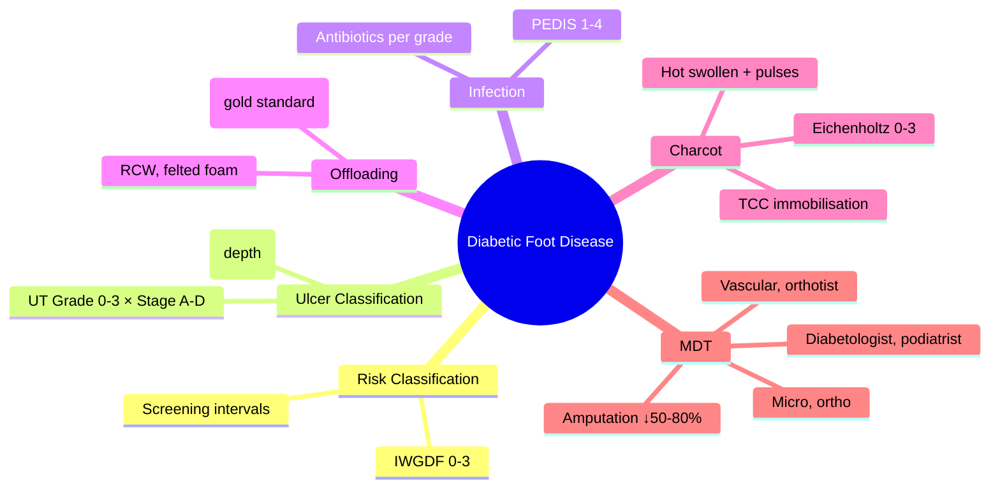

# Diabetic Foot Disease

> [!info]
> **Diabetic foot disease: leading cause of non-traumatic lower limb amputation** — **IWGDF risk 0–3** drives screening/referral; **Wagner 0–5 / UT Grade 0–3 × Stage A–D** classify ulcers; **TCC (total contact cast) = gold standard offloading**; **PEDIS** grades infection; **MDT reduces amputations 50–80%**; **Charcot** (Eichenholtz 0–3) = hot swollen foot, preserved pulses, TCC immobilisation.

---

## 1. Learning Objectives
- [ ] Apply IWGDF/Scottish foot risk classification (0–3) for screening and referral
- [ ] Classify DFU using Wagner (depth) and University of Texas (depth × infection × ischaemia)
- [ ] Execute DFU management: offloading (TCC), debridement, infection (PEDIS), revascularisation
- [ ] Diagnose Charcot neuroarthropathy (Eichenholtz 0–3) and differentiate from osteomyelitis
- [ ] Coordinate MDT care (diabetologist, podiatrist, vascular, orthotics, microbiology, orthopaedics)

---

## 2. Definition & Epidemiology

| Feature | Detail |
|---------|--------|
| **Definition** | Foot ulceration, infection, or destruction in diabetes from neuropathy, ischaemia, or both |
| **Epidemiology** | Lifetime DFU risk 15–25%; 85% amputations preceded by DFU; **mortality 5yr post-amputation ~50–70%** |
| **Pathophysiology** | **Neuropathy** (LOPS → unrecognised trauma) + **Ischaemia** (PAD → impaired healing) + **Immunopathy** (↑infection risk) |
| **Risk Factors** | Prior ulcer/amputation, LOPS, PAD, deformity, nephropathy, retinopathy, poor glycaemic control, smoking |

---

## 3. Clinical Features / Presentation

| Presentation | Frequency | Key Features |
|-------------|-----------|--------------|
| **Neuropathic ulcer** | 50% | Plantar metatarsal heads, toes; painless (LOPS); callus rim; warm foot, pulses present |
| **Neuroischaemic ulcer** | 30% | Margins (heel, lateral border); painful; cool foot, pulses absent; delayed healing |
| **Ischaemic ulcer** | 10% | Distal toes, heel; painful at rest; gangrene; absent pulses, dependent rubor |
| **Charcot foot** | 1–2% | Hot, swollen, erythematous foot; **preserved pulses**; deformity (rocker-bottom); often unilateral |
| **Infection** | 50–60% DFU | Cellulitis, purulence, systemic signs; osteomyelitis if probe-to-bone +ve |

---

## 4. Classification / Staging / Grading

### IWGDF / Scottish Foot Risk Classification
| Risk | Criteria | Screening Interval | Referral |
|------|----------|-------------------|----------|
| **0 (Low)** | No LOPS, no PAD, no deformity | Annual | None |
| **1 (Moderate)** | **LOPS only** | 6-monthly | Podiatry |
| **2 (High)** | LOPS **+ PAD and/or deformity** | 3–6 monthly | Podiatry + vascular if PAD |
| **3 (Very High/Active)** | **Prior ulcer or amputation** | 1–3 monthly | **MDT foot clinic** |

> **LOPS** = Loss of Protective Sensation (cannot feel 10g monofilament at ≥1 site)

### Wagner Ulcer Classification (Depth)
| Grade | Description |
|-------|-------------|
| **0** | Pre-ulcer (callus, deformity, no break in skin) |
| **1** | Superficial ulcer (skin/subcutaneous only) |
| **2** | Deep ulcer to tendon, capsule, or bone |
| **3** | Deep + abscess/osteomyelitis |
| **4** | Forefoot gangrene |
| **5** | Whole foot gangrene |

### University of Texas (UT) Classification (Depth × Infection × Ischaemia)
| Grade (Depth) | Stage A (Clean) | Stage B (Infected) | Stage C (Ischaemic) | Stage D (Infected + Ischaemic) |
|---------------|-----------------|-------------------|--------------------|-------------------------------|
| **0** | Pre-ulcer | — | — | — |
| **1** | Superficial | Infected | Ischaemic | Infected + Ischaemic |
| **2** | Deep to tendon/capsule | Infected | Ischaemic | Infected + Ischaemic |
| **3** | Deep to bone/joint | Infected | Ischaemic | Infected + Ischaemic |

> **UT preferred** — incorporates infection and ischaemia; predicts healing/amputation better than Wagner alone.

### PEDIS Infection Classification
| Grade | Definition | Treatment |
|-------|------------|-----------|
| **1** | Uninfected | Local wound care |
| **2** | Mild (superficial, <2cm erythema) | Oral antibiotics (flucloxacillin 500mg QDS, or co-amoxiclav) |
| **3** | Moderate (deep, >2cm erythema, abscess, lymphangitis) | IV antibiotics (piperacillin-tazobactam, or ceftriaxone + metronidazole) |
| **4** | Severe (sepsis, SIRS) | IV antibiotics + ICU + urgent surgical debridement |

---

## 5. Diagnosis & Investigations

| Investigation | Role | Key Details |
|---------------|------|-------------|
| **10g monofilament** | LOPS screening | 6 sites/foot; annual (risk 0), 6-monthly (1), 3-monthly (2–3) |
| **Vibration (128Hz)** | Neuropathy severity | <10s at hallux IP = abnormal |
| **ABI / TBI** | PAD screening | ABI <0.9 diagnostic; TBI if ABI >1.4 (calcified vessels) |
| **Probe-to-bone test** | Osteomyelitis screening | Sterile probe to bone through ulcer; **PPV 89% if positive** |
| **ESR / CRP** | Infection monitoring | ESR >40 suggestive; CRP trend |
| **Plain X-ray** | Osteomyelitis / Charcot | Periosteal reaction, destruction, gas; Charcot: fragmentation, dislocation |
| **MRI** | Osteomyelitis / Charcot | **Gold standard** for osteomyelitis (sens 90%, spec 85%); Charcot: marrow oedema, joint subluxation |
| **Tc-99m / WBC scan** | Osteomyelitis if MRI contraindicated | Alternative to MRI |

---

## 6. Differential Diagnosis

| Condition | Distinguishing Features |
|-----------|-------------------------|
| **Charcot vs Osteomyelitis** | **Charcot**: hot swollen foot, **preserved pulses**, bilateral rare, X-ray fragmentation/dislocation, no systemic signs; **Osteomyelitis**: ulcer + probe-to-bone, elevated ESR/CRP, MRI marrow oedema |
| **Charcot vs Cellulitis** | Charcot: bilateral rare, deformity, preserved pulses; Cellulitis: spreading erythema, warmth, systemic signs |
| **Ischaemic vs Neuropathic ulcer** | Ischaemic: painful, cool, absent pulses, dependent rubor; Neuropathic: painless, warm, callus rim, pulses present |
| **Gout vs Charcot** | Gout: acute monoarticular (1st MTP), exquisitely tender, crystals in aspirate; Charcot: midfoot, less tender, preserved pulses |
| **DVT vs Charcot** | DVT: calf tenderness, +ve Wells, D-dimer, US; Charcot: foot deformity, preserved pulses, bilateral rare |

---

## 7. Management

### Offloading (Cornerstone)
| Method | Efficacy | Indications |
|--------|----------|-------------|
| **TCC (Total Contact Cast)** | **Gold standard** — heals 80–90% neuropathic ulcers | Plantar neuropathic ulcers; compliant patient |
| **Removable Cast Walker (RCW)** | Good if worn 24/7 | If TCC contraindicated (infection, severe PAD) |
| **Felted foam / insoles** | Adjunct | Minor ulcers / prevention |
| **Surgical offloading** | Tendon lengthening, metatarsal head resection | Recurrent ulcers despite conservative |

> **TCC contraindications**: Active infection (Grade 3–4), severe PAD (ABI<0.5), patient non-compliance, severe oedema

### Infection Management (PEDIS)
| Grade | Antibiotics | Duration |
|-------|-------------|----------|
| **2 (Mild)** | Flucloxacillin 500mg QDS OR Co-amoxiclav 625mg TDS | 1–2 weeks |
| **3 (Moderate)** | Piperacillin-tazobactam 4.5g TDS OR Ceftriaxone 2g OD + Metronidazole 500mg TDS | 2–4 weeks |
| **4 (Severe)** | Same as Grade 3 + ICU support + urgent surgical debridement | 4–6 weeks |

### Revascularisation
| Indication | Approach |
|------------|----------|
| **Tissue loss (Wagner ≥3 / UT Stage C/D)** | **Urgent** vascular imaging (CT/MR angiography) → Endovascular 1st (angioplasty/stent) → Surgical bypass if unsuitable |
| **Rest pain** | Same pathway |

### Charcot Neuroarthropathy (Eichenholtz Staging)
| Stage | Features | Management |
|-------|----------|------------|
| **0 (Development)** | Hot, swollen, erythematous; normal X-ray; MRI: marrow oedema | **TCC immobilisation** (non-weightbearing 8–12wk → weightbearing in TCC 4–8wk) |
| **1 (Fragmentation)** | Bone fragmentation, joint dislocation, debris; "rocker-bottom" | TCC until quiescent |
| **2 (Coalescence)** | Decreased heat/swelling; early fusion | Transition to custom footwear/orthoses |
| **3 (Reconstruction)** | Consolidated, stable deformity | Custom footwear, accommmodative orthoses, surgery if unstable |

> **Bisphosphonates**: IV zoledronic acid 5mg / pamidronate 60mg — some evidence for ↓turnover; not standard

### MDT Composition
| Member | Role |
|--------|------|
| **Diabetologist** | Glycaemic control, medical optimisation |
| **Podiatrist** | Debridement, offloading, wound care |
| **Vascular surgeon** | Revascularisation (endovascular/surgical) |
| **Orthotist** | Custom footwear, insoles, TCC application |
| **Microbiologist** | Antibiotic stewardship, culture interpretation |
| **Orthopaedic surgeon** | Debridement, amputation, Charcot reconstruction |
| **Nurse specialist** | Wound dressing, patient education, coordination |

```mermaid
flowchart TD
    A[New DFU] --> B[Assess: IWGDF risk, Wagner/UT, PEDIS, ABI]
    B --> C{PEDIS Grade?}
    C -->|1 (Uninfected)| D[Offloading (TCC) + debridement + dressings]
    C -->|2 (Mild)| E[TCC + oral abx + debridement]
    C -->|3 (Moderate)| F[TCC + IV abx + debridement ± vascular]
    C -->|4 (Severe)| G[ICU + IV abx + URGENT surgical debridement ± amputation]
    D --> H{Healing at 4wk?}
    E --> H
    F --> H
    G --> H
    H -->|No| I[Review: infection? ischaemia? offloading adherence?]
    H -->|Yes| J[Continue → preventive footwear]
    I --> K[MDT discussion: vascular imaging, MRI, surgical options]
    K --> L[Revascularisation if PAD]
    L --> M[Continue offloading + wound care]
```

---

## 8. FCPS/MRCP High-Yield Summary

| Topic | Key Points |
|-------|------------|
| **IWGDF Risk** | 0: no LOPS/PAD; 1: LOPS; 2: LOPS+PAD/deformity; 3: hx ulcer/amputation |
| **Screening** | Annual (0), 6-monthly (1), 3-monthly (2–3); 10g monofilament + vibration + ABI |
| **Wagner** | 0: pre-ulcer; 1: superficial; 2: deep to tendon; 3: bone/abscess; 4: forefoot gangrene; 5: whole foot |
| **UT Classification** | Grade 0–3 (depth) × Stage A–D (A=clean, B=infected, C=ischaemic, D=both) |
| **PEDIS Infection** | 1: none; 2: mild (oral abx); 3: moderate (IV abx); 4: severe (sepsis + surgical) |
| **Offloading** | **TCC = gold standard** (heals 80–90%); RCW if TCC contraindicated |
| **Charcot** | Eichenholtz 0–3; **hot swollen foot + preserved pulses** = Charcot until proven otherwise; TCC immobilisation |
| **Probe-to-bone** | Positive → osteomyelitis likely (PPV 89%); MRI gold standard |
| **MDT** | Diabetologist, podiatrist, vascular, orthotist, microbiology, orthopaedics → **reduces amputations 50–80%** |
| **Revascularisation** | Endovascular 1st → surgical bypass if unsuitable; urgent if tissue loss |

---

## 9. Viva Questions

| Question | Expected Answer |
|----------|-----------------|
| **What is the IWGDF foot risk classification?** | 0: no LOPS/PAD; 1: LOPS; 2: LOPS+PAD/deformity; 3: prior ulcer/amputation — drives screening interval |
| **How do you classify a diabetic foot ulcer?** | **Wagner** (depth 0–5) or **University of Texas** (Grade 0–3 depth × Stage A–D infection/ischaemia) — UT preferred |
| **What is the gold standard offloading for neuropathic plantar ulcers?** | **Total Contact Cast (TCC)** — heals 80–90%; contraindicated in active infection, severe PAD, non-compliance |
| **What is PEDIS infection classification?** | 1: uninfected; 2: mild (oral abx); 3: moderate (IV abx); 4: severe (sepsis + urgent surgery) |
| **How do you differentiate Charcot from osteomyelitis?** | **Charcot**: hot swollen foot, **preserved pulses**, bilateral rare, X-ray fragmentation/dislocation, no systemic sepsis; **Osteomyelitis**: ulcer + probe-to-bone +ve, elevated ESR/CRP, MRI marrow oedema |
| **What is the probe-to-bone test?** | Sterile blunt probe through ulcer to bone; **positive PPV 89% for osteomyelitis** |
| **When do you revascularise a diabetic foot?** | Tissue loss (Wagner ≥3 / UT Stage C/D) → urgent CT/MR angiography → endovascular 1st → surgical bypass |
| **What is the MDT for diabetic foot?** | Diabetologist, podiatrist, vascular surgeon, orthotist, microbiologist, orthopaedic surgeon, nurse specialist — **reduces amputations 50–80%** |
| **How is Charcot managed?** | **TCC immobilisation** (non-WB 8–12wk → WB in TCC 4–8wk) until quiescent (Eichenholtz stage 2); then custom footwear; bisphosphonates optional |

---

## 10. Confusions & Mnemonics

| Confusion | Clarification |
|-----------|---------------|
| **Wagner vs UT** | Wagner = depth only; UT = depth + infection + ischaemia; **UT predicts outcome better** |
| **Charcot = osteomyelitis?** | NO — Charcot has **preserved pulses**, hot swollen foot; osteomyelitis has ulcer + probe-to-bone + elevated inflammatory markers |
| **TCC for all ulcers?** | NO — contraindicated in active infection (PEDIS 3–4), severe PAD (ABI<0.5), non-compliance |
| **Bisphosphonates for Charcot?** | Not standard; some use IV zoledronic acid 5mg for ↓bone turnover; limited evidence |

**Mnemonic: FOOT-IWGDF**
- **F**oot risk: IWGDF 0-3 (0=none, 1=LOPS, 2=LOPS+PAD, 3=hx ulcer)
- **O**ffloading: **TCC gold standard** (80-90% heal)
- **O**steomyelitis: probe-to-bone +ve (PPV 89%), MRI gold standard
- **T**reatment: PEDIS 1-4 (1=none, 2=oral abx, 3=IV abx, 4=sepsis/surgery)
- **I**schaemia: ABI <0.9; TBI if calcified; revascularise if tissue loss
- **W**agner 0-5: depth only; **UT preferred** (grade × stage)
- **G**rade UT: 0-3 depth × A-D (A=clean, B=infected, C=ischaemic, D=both)
- **D**ebridement: sharp, regular, with offloading
- **F**oot MDT: diabetologist, podiatry, vascular, orthotist, micro, ortho → **amputations ↓50-80%**

---

## 11. Mind Map



---

## 12. One-Page Revision Card

| Domain | Key Points |
|--------|------------|
| **Definition** | Foot ulcer/infection/destruction from neuropathy + ischaemia + immunopathy; leading cause non-traumatic amputation |
| **Key Test** | 10g monofilament (LOPS), ABI (PAD), probe-to-bone (osteomyelitis), Wagner/UT, PEDIS |
| **Classification** | IWGDF 0–3 risk; Wagner 0–5; UT Grade×Stage; PEDIS 1–4; Charcot Eichenholtz 0–3 |
| **Acute Mgmt** | PEDIS 3–4: IV abx + surgery; Charcot: TCC; Infected ulcer: debridement + abx |
| **Chronic Mgmt** | Offloading (TCC), debridement, revascularisation if PAD, MDT follow-up, preventive footwear |
| **Key Score** | IWGDF risk → screening interval; UT → healing prognosis |
| **Complications** | Osteomyelitis, amputation, sepsis, death (5yr post-amp 50–70%) |
| **Prognosis** | MDT reduces amputations 50–80%; TCC heals 80–90% neuropathic ulcers |

---

## 13. Spaced Repetition Trackers

| Review Interval | Date Completed | Confidence (1-5) | Notes |
|-----------------|----------------|------------------|-------|
| 24 hours | | | |
| 7 days | | | |
| 15 days | | | |
| 30 days | | | |
| 90 days | | | |

---

## 14. Self-Test Scorecard

| Section | Score /5 | Last Attempt |
|---------|----------|--------------|
| Definition & Epidemiology | | |
| Classification & Staging | | |
| Diagnosis & Investigations | | |
| Management (Acute) | | |
| Management (Chronic) | | |
| Complications | | |
| Viva Questions | | |
| DDx Distinctions | | |
| Mnemonics/Algorithms | | |

---

### Local Navigation
- **Parent Heading**: [[../../Microvascular Complications/Diabetic foot disease|Diabetic foot disease]]
- **Chapter Map": [[../../../Davidson Chapter 25 - Diabetes Hierarchy|Diabetes Hierarchy]]
- **Chapter MOC": [[../../../Diabetes MOC|Diabetes MOC]]
- **Drug Reference": [[../../../../Clinical Therapeutics and Good Prescribing|Drugs]]
- **Related": [[Foot risk classification (IWGDF/Scottish)]], [[Diabetic foot ulcer (DFU) classification (Wagner, University of Texas)]], [[DFU management (offloading, debridement, infection, revascularisation)]], [[Charcot neuroarthropathy]]

---
## Tags
#medicine #diabetes #davidson #fcps #mrcp #full-fcps-mrcp-note

## PasTest Scenario SBAs (Clinical Vignettes)

> **Auto-generated PasTest/Mediscope-style scenario SBAs** grounded in the authored source. Each scenario tests a real clinical fact (triad, specific sign, contraindication, trial, first-line Rx) extracted from the topic. *Source: Ch 21: Diabetes — Diabetic foot disease*

**Q1.** Which of the following features is most specific or characteristic of Diabetic foot disease?

  - **A.** ABI / TBI
  - **B.** A feature common to many acute inflammatory conditions
  - **C.** A non-specific sign that does not localise the diagnosis
  - **D.** An investigation finding rather than a clinical feature

  > **Answer: A** — ABI / TBI
  >
  > *Source:* 3-monthly (2–3) |
| **Vibration (128Hz)** | Neuropathy severity | <10s at hallux IP = abnormal |
| **ABI / TBI** | PAD screening | ABI <0.9 diagnostic; TBI if ABI >1.4 (calcified vessels) |
| **Probe-

**Q2.** What is the most appropriate first-line therapy for Diabetic foot disease?

  - **A.** TCC immobilisation
  - **B.** An advanced/surgical therapy reserved for refractory disease
  - **C.** Symptomatic treatment only, no disease-modifying therapy
  - **D.** Empiric broad-spectrum therapy without specific indication

  > **Answer: A** — TCC immobilisation
  >
  > *Source:* **0 (Development)**   Hot, swollen, erythematous; normal X-ray; MRI: marrow oedema   **TCC immobilisation** (non-weightbearing 8–12wk → weightbearing in TCC 4–8wk)
---

> Auto-generated study sections for "Microvascular Complications" — Ch 21: Diabetes Mellitus.

## Flashcards (14 generated)

- Q: What is the definition of Microvascular Complications?
  A: Foot ulceration, infection, or destruction in diabetes from neuropathy, ischaemia, or both
- Q: What is the epidemiology of Microvascular Complications?
  A: Lifetime DFU risk 15–25%; 85% amputations preceded by DFU; mortality 5yr post-amputation ~50–70%
- Q: What is the pathogenesis of Microvascular Complications?
  A: Neuropathy (LOPS → unrecognised trauma) + Ischaemia (PAD → impaired healing) + Immunopathy (↑infection risk)
- Q: What causes Microvascular Complications?
  A: Prior ulcer/amputation, LOPS, PAD, deformity, nephropathy, retinopathy, poor glycaemic control, smoking
- Q: What is IWGDF Risk of Microvascular Complications?
  A: 0: no LOPS/PAD; 1: LOPS; 2: LOPS+PAD/deformity; 3: hx ulcer/amputation
- Q: What is Screening of Microvascular Complications?
  A: Annual (0), 6-monthly (1), 3-monthly (2–3); 10g monofilament + vibration + ABI
- Q: What is Wagner of Microvascular Complications?
  A: 0: pre-ulcer; 1: superficial; 2: deep to tendon; 3: bone/abscess; 4: forefoot gangrene; 5: whole foot
- Q: How is Microvascular Complications classified?
  A: Grade 0–3 (depth) × Stage A–D (A=clean, B=infected, C=ischaemic, D=both)
- Q: What is PEDIS Infection of Microvascular Complications?
  A: 1: none; 2: mild (oral abx); 3: moderate (IV abx); 4: severe (sepsis + surgical)
- Q: What is Offloading of Microvascular Complications?
  A: TCC = gold standard (heals 80–90%); RCW if TCC contraindicated
- Q: What is Charcot of Microvascular Complications?
  A: Eichenholtz 0–3; hot swollen foot + preserved pulses = Charcot until proven otherwise; TCC immobilisation
- Q: What is Probe-to-bone of Microvascular Complications?
  A: Positive → osteomyelitis likely (PPV 89%); MRI gold standard
- Q: What is MDT of Microvascular Complications?
  A: Diabetologist, podiatrist, vascular, orthotist, microbiology, orthopaedics → reduces amputations 50–80%
- Q: What is Revascularisation of Microvascular Complications?
  A: Endovascular 1st → surgical bypass if unsuitable; urgent if tissue loss

## MCQs (1 generated)

1. **Which of the following best describes Microvascular Complications?**
   A. **Diabetic foot disease: leading cause of non-traumatic lower limb amputation — IWGDF risk 0–3 drives screening/referral; Wagner 0–5 / UT Grade 0–3 × Stage A–D classify ulcers; TCC (total contact cast) **
   B. An unrelated condition not matching the clinical picture of Microvascular Complications
   C. A complication seen late in the disease course of Microvascular Complications
   D. A condition that mimics Microvascular Complications but has a different underlying cause

## SBA Questions (1 generated)

1. A patient with suspected Microvascular Complications presents with: Definition — Foot ulceration, infection, or destruction in diabetes from neuropathy, ischaemia, or both; Epidemiology — Lifetime DFU risk 15–25%; 85% amputations preceded by DFU; mortality 5yr post-amputation ~50–70%; Pathophysiology — Neuropathy (LOPS → unrecognised trauma) + Ischaemia (PAD → impaired healing) + Immunopathy (↑infection risk). What is the most likely diagnosis?
   A. **Microvascular Complications**
   B. A condition that mimics Microvascular Complications but is not the same entity
   C. A complication of Microvascular Complications rather than the primary diagnosis
   D. An unrelated condition in the same clinical category as Microvascular Complications

