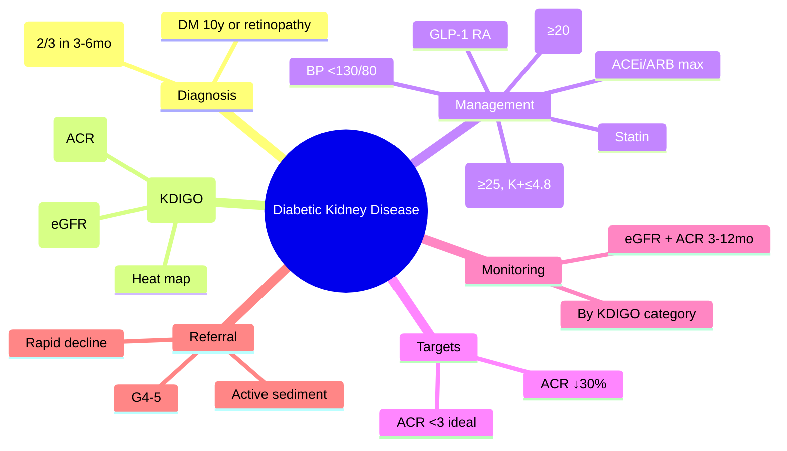

# Diabetic Kidney Disease (DKD)

> [!info]
> **DKD = leading cause of ESRD worldwide** — KDIGO staging (GFR G1–5 × Albuminuria A1–3); **ACEi/ARB max tolerated** + **SGLT2i (1st line, eGFR≥20)** + **finerenone (eGFR≥25)** + **GLP-1 RA**; **proteinuria reduction targets** (↓30% or ACR<3); **multidisciplinary** at G4–5.

---

## 1. Learning Objectives
- [ ] Apply KDIGO 2022 staging (G1–5 × A1–3 heat map)
- [ ] Diagnose DKD: persistent ACR ≥3 mg/mmol (≥30 mg/g) + eGFR <60 or DM duration >10y
- [ ] Execute management: ACEi/ARB → SGLT2i → finerenone → GLP-1 RA
- [ ] Set proteinuria reduction targets and monitoring intervals
- [ ] Recognise non-diabetic kidney disease (red flags for referral)

---

## 2. Definition & Epidemiology

| Feature | Detail |
|---------|--------|
| **Definition** | Chronic kidney disease attributed to diabetes: persistent albuminuria (ACR ≥3 mg/mmol) and/or eGFR <60 mL/min/1.73m² in diabetes |
| **Epidemiology** | ~40% T1DM, ~30% T2DM develop DKD; **leading cause of ESRD** (40–50% of dialysis starts) |
| **Risk Factors** | HbA1c, hypertension, duration, smoking, dyslipidaemia, family history, ethnicity (South Asian, African-Caribbean) |
| **Pathophysiology** | Hyperglycaemia → hyperfiltration → glomerular hypertension → mesangial expansion → basement membrane thickening → Kimmelstiel-Wilson nodules → sclerosis |

---

## 3. Clinical Features / Presentation

| Presentation | Frequency | Key Features |
|-------------|-----------|--------------|
| **Asymptomatic** | Early CKD (G1–3a) | Detected on screening (ACR/eGFR) |
| **Oedema** | Nephrotic syndrome (A3) | Periorbital, peripheral, ascites |
| **Hypertension** | Progressive | Often difficult to control; volume overload |
| **Anaemia** | G3b+ | EPO deficiency; Hb <110g/L |
| **Bone/mineral disorder** | G3b+ | ↑PTH, ↓vit D, ↑phosphate, vascular calcification |
| **Uraemic symptoms** | G5 | Nausea, pruritus, pericarditis, neuropathy |

> **Red Flags for Non-Diabetic Kidney Disease**: Rapid eGFR decline (>5 mL/min/yr), active urinary sediment (RBC/casts), haematuria, no retinopathy, family history of hereditary kidney disease, low BMI at diagnosis → refer nephrology.

---

## 4. Classification / Staging / Grading

### KDIGO 2022 Heat Map (GFR × Albuminuria)

| GFR Category | eGFR (mL/min/1.73m²) | A1 (<3 mg/mmol) | A2 (3–30 mg/mmol) | A3 (>30 mg/mmol) |
|--------------|----------------------|-----------------|-------------------|------------------|
| **G1** | ≥90 | Low risk (🟢) | Moderate (🟡) | High (🟠) |
| **G2** | 60–89 | Low (🟢) | Moderate (🟡) | High (🟠) |
| **G3a** | 45–59 | Moderate (🟡) | High (🟠) | Very high (🔴) |
| **G3b** | 30–44 | High (🟠) | Very high (🔴) | Very high (🔴) |
| **G4** | 15–29 | Very high (🔴) | Very high (🔴) | Very high (🔴) |
| **G5** | <15 | Very high (🔴) | Very high (🔴) | Very high (🔴) |

> **Colour codes**: 🟢 Low → annual monitor; 🟡 Moderate → 6-monthly; 🟠 High → 3–6 monthly + nephrology; 🔴 Very high → nephrology + MDT

### Albuminuria Categories (ACR)
| Category | ACR (mg/mmol) | ACR (mg/g) | Terminology |
|----------|---------------|------------|-------------|
| **A1** | <3 | <30 | Normal/mildly increased |
| **A2** | 3–30 | 30–300 | Moderately increased (microalbuminuria) |
| **A3** | >30 | >300 | Severely increased (macroalbuminuria) |

### GFR Categories
| Category | eGFR | Description |
|----------|------|-------------|
| **G1** | ≥90 | Normal/high |
| **G2** | 60–89 | Mildly decreased |
| **G3a** | 45–59 | Mild–moderate |
| **G3b** | 30–44 | Moderate–severe |
| **G4** | 15–29 | Severely decreased |
| **G5** | <15 | Kidney failure |

---

## 5. Diagnosis & Investigations

| Investigation | Role | Key Details |
|---------------|------|-------------|
| **ACR (spot urine)** | Albuminuria quantification | **Preferred over PCR**; early morning sample; avoid exercise/UTI/fever; confirm with 2/3 positive in 3–6 months |
| **eGFR (CKD-EPI)** | GFR estimation | Standardised; if eGFR<60 + DM >10y + retinopathy → DKD likely |
| **Urine microscopy** | Exclude non-diabetic | RBC >10/µL, casts → consider non-diabetic |
| **HbA1c** | Glycaemic control | Target individualised; falsely low in CKD/ESRD |
| **Renal ultrasound** | Structural assessment | Small kidneys = chronic; normal/large = infiltrative/obstructive |
| **Kidney biopsy** | If non-diabetic suspected | Rapid decline, active sediment, no retinopathy, systemic disease signs |

---

## 6. Differential Diagnosis

| Condition | Distinguishing Features |
|-----------|-------------------------|
| **Hypertensive nephrosclerosis** | No albuminuria (or mild), long-standing HTN, no retinopathy, benign urinary sediment |
| **Chronic glomerulonephritis** | Haematuria, RBC casts, proteinuria; may have low complement |
| **Amyloidosis** | Nephrotic syndrome, low albumin, systemic features (cardiac, neuropathy); Congo red +ve |
| **Multiple myeloma** | Bence Jones proteinuria, anaemia, hypercalcaemia, lytic lesions; urine protein electrophoresis |
| **Autosomal dominant polycystic kidney disease** | Family history, large cystic kidneys, hepatic cysts; haematuria common |
| **Obstructive uropathy** | Hydronephrosis on US; post-void residual; recurrent UTIs |

---

## 7. Management

### Stepwise DKD Management (KDIGO 2022/ADA 2024)
| Step | Intervention | Target/Details |
|------|--------------|----------------|
| **1. Lifestyle** | Low salt (<5g/day), protein 0.8g/kg, weight control, smoking cessation, SGLT2i if indicated | BP <130/80 |
| **2. ACEi/ARB** | **Max tolerated dose** (e.g., ramipril 10mg, losartan 100mg) | Target ACR <3 or ↓30%; monitor K+/Cr (rise ≤30% acceptable) |
| **3. SGLT2i** | **1st line add-on** (empagliflozin 10mg, dapagliflozin 10mg, canagliflozin 100mg) | Initiate eGFR ≥20 (dapa/empa) / ≥30 (cana); **continue to dialysis** |
| **4. Finerenone** | Non-steroidal MRA (10–20mg OD) | eGFR ≥25, K+ ≤4.8; add if ACR≥30 on ACEi/ARB+SGLT2i |
| **5. GLP-1 RA** | Semaglutide (FLOW), liraglutide (LEADER renal) | CV/renal benefit; weight loss |
| **6. BP control** | <130/80 (ADA/KDIGO); ACEi/ARB + CCB/thiazide | Avoid dual RAS blockade |
| **7. Statin** | Atorvastatin 20–40mg (SHARP) | LDL <1.8mmol/L or ↓50% |

### Proteinuria Reduction Targets
| Target | Action if Not Met |
|--------|-------------------|
| **ACR reduction ≥30%** at 3–6 months | Optimise ACEi/ARB dose; add SGLT2i |
| **ACR <3 mg/mmol (normoalbuminuria)** | Ideal but rarely achieved in established DKD |
| **ACR <30 mg/mmol (A2)** | Acceptable if A3 → A2 transition |

### Monitoring Intervals by KDIGO Category
| Category | eGFR | ACR | BP | Review |
|----------|------|-----|----|--------|
| **Low (Green)** | Annual | Annual | 6-monthly | Primary care |
| **Moderate (Yellow)** | 6-monthly | 6-monthly | 3–6 monthly | Primary care ± specialist |
| **High/Very High (Orange/Red)** | 3–6 monthly | 3–6 monthly | 1–3 monthly | Nephrology + MDT |

```mermaid
flowchart TD
    A[DKD Diagnosed] --> B[ACEi/ARB max tolerated]
    B --> C{ACR ≥30 or eGFR<60?}
    C -->|Yes| D[Add SGLT2i (eGFR≥20)]
    C -->|No| E[Monitor 6-12 monthly]
    D --> F{ACR≥30 on ACEi+SGLT2i?}
    F -->|Yes| G[Add Finerenone (eGFR≥25, K+≤4.8)]
    F -->|No| H[Monitor 3-6 monthly]
    G --> I[Add GLP-1 RA if CVD/obesity]
    H --> I
    I --> J[BP<130/80 + Statin + Lifestyle]
    J --> K{Progress to G4/G5?}
    K -->|Yes| L[Nephrology MDT + Transplant/Dialysis prep]
    K -->|No| M[Continue monitoring]
```

---

## 8. FCPS/MRCP High-Yield Summary

| Topic | Key Points |
|-------|------------|
| **KDIGO Staging** | G1–5 (eGFR) × A1–3 (ACR); heat map for risk; G3aA2 = moderate, G3bA3 = very high |
| **Diagnosis** | Persistent ACR ≥3 mg/mmol (2/3 in 3–6mo) + DM (≥10y or retinopathy) |
| **ACEi/ARB** | Max tolerated dose; target ACR <3 or ↓30%; rise in Cr ≤30% acceptable; K+ ≤5.5 |
| **SGLT2i** | **1st line add-on**; eGFR ≥20 (dapa/empa) / ≥30 (cana); continue to dialysis; CREDENCE, DAPA-CKD, EMPA-KIDNEY |
| **Finerenone** | Non-steroidal MRA; eGFR ≥25, K+ ≤4.8; FIDELIO/FIGARO; add if ACR≥30 on ACEi/ARB+SGLT2i |
| **GLP-1 RA** | Semaglutide (FLOW ✓), liraglutide (LEADER renal ✓); CV/renal benefit |
| **BP Target** | <130/80; ACEi/ARB + CCB/thiazide; avoid dual RAS blockade |
| **Proteinuria Target** | ↓ACR ≥30% at 3–6mo; ultimate <3 mg/mmol |
| **HbA1c in CKD** | Falsely LOW (↓RBC lifespan); use fructosamine/glycated albumin; target individualised |
| **Referral** | G4–5, rapid decline >5mL/min/yr, active sediment, ACR>70 without retinopathy |

---

## 9. Viva Questions

| Question | Expected Answer |
|----------|-----------------|
| **What is the KDIGO staging for DKD?** | G1–5 (eGFR: ≥90, 60–89, 45–59, 30–44, 15–29, <15) × A1–3 (ACR: <3, 3–30, >30 mg/mmol); heat map for risk |
| **How do you diagnose DKD?** | Persistent albuminuria (ACR ≥3 mg/mmol on 2/3 occasions in 3–6 months) + diabetes (≥10 years or retinopathy present) |
| **What is the stepwise management of DKD?** | 1) Lifestyle 2) ACEi/ARB max dose 3) SGLT2i (eGFR≥20) 4) Finerenone (eGFR≥25, K+≤4.8) 5) GLP-1 RA 6) BP<130/80 7) Statin |
| **What are the eGFR thresholds for SGLT2i in CKD?** | Dapagliflozin/Empagliflozin: initiate ≥20, continue to dialysis; Canagliflozin: initiate ≥30 |
| **When do you add finerenone?** | ACR ≥30 mg/mmol **on max ACEi/ARB + SGLT2i**; eGFR ≥25, K+ ≤4.8; FIDELIO/FIGARO trials |
| **What are the proteinuria reduction targets?** | ↓ACR ≥30% at 3–6 months; target ACR <3 mg/mmol (ideal) or <30 mg/mmol (acceptable) |
| **Why is HbA1c unreliable in CKD?** | Falsely LOW due to ↓RBC lifespan, ESA use; use fructosamine (2–3 week avg) or glycated albumin (3 week) |
| **When do you refer DKD to nephrology?** | G4–5 (eGFR<30), rapid decline >5mL/min/yr, active urinary sediment, ACR>70 without retinopathy, refractory hypertension |

---

## 10. Confusions & Mnemonics

| Confusion | Clarification |
|-----------|---------------|
| **ACEi + ARB together?** | NO — dual RAS blockade ↑hyperkalaemia, AKI, no added benefit (ONTARGET, VA NEPHRON-D) |
| **SGLT2i in low eGFR?** | **YES — initiate ≥20 (dapa/empa) / ≥30 (cana); continue to dialysis** — renal benefit persists |
| **Finerenone vs spironolactone?** | Finerenone: non-steroidal, selective MRA, less hyperkalaemia, no gynaecomastia; eGFR≥25, K+≤4.8 |
| **HbA1c in ESRD?** | Falsely low; use fructosamine/glycated albumin for monitoring |

**Mnemonic: DKD-ACE-SGLT-FIN**
- **D**KD: ACR ≥3 + DM (10y/retinopathy)
- **K**DIGO: G1-5 × A1-3 heat map
- **D**iagnose: 2/3 ACR ≥3 in 3-6mo
- **A**CEi/ARB: max dose, ACR↓30%, Cr rise ≤30% OK
- **C**ontinue SGLT2i to dialysis (eGFR≥20 dapa/empa)
- **E**liminate dual RAS blockade
- **S**GLT2i: 1st add-on (CREDENCE, DAPA-CKD, EMPA-KIDNEY)
- **G**FR ≥20 dapa/empa, ≥30 cana
- **L**ower BP <130/80
- **T**arget ACR ↓30% or <3
- **F**inerenone: eGFR≥25, K+≤4.8, on ACEi+SGLT2i (FIDELIO/FIGARO)
- **I**nsulin/GLP-1: GLP-1 RA renal benefit (FLOW, LEADER)
- **N**ephrology refer: G4-5, rapid decline, active sediment

---

## 11. Mind Map



---

## 12. One-Page Revision Card

| Domain | Key Points |
|--------|------------|
| **Definition** | DKD: persistent ACR ≥3 mg/mmol + DM (≥10y or retinopathy); leading cause ESRD |
| **Key Test" | ACR (spot urine, early morning); eGFR (CKD-EPI); avoid PCR |
| **Classification" | KDIGO G1-5 × A1-3; heat map: G3aA2=moderate, G3bA3=very high |
| **Acute Mgmt" | AKI on CKD: hold ACEi/ARB/SGLT2i/diuretics; volume resuscitation |
| **Chronic Mgmt" | ACEi/ARB max → SGLT2i (eGFR≥20) → Finerenone (eGFR≥25) → GLP-1 RA → BP<130/80 |
| **Key Score" | KDIGO heat map; ACR ↓30% at 3-6mo |
| **Complications" | ESRD, CVD, anaemia, bone disease, hyperkalaemia |
| **Prognosis" | G3aA2: 5yr ESRD risk ~1%; G3bA3: ~50%; SGLT2i/finerenone ↓progression 30-40% |

---

## 13. Spaced Repetition Trackers

| Review Interval | Date Completed | Confidence (1-5) | Notes |
|-----------------|----------------|------------------|-------|
| 24 hours | | | |
| 7 days | | | |
| 15 days | | | |
| 30 days | | | |
| 90 days | | | |

---

## 14. Self-Test Scorecard

| Section | Score /5 | Last Attempt |
|---------|----------|--------------|
| Definition & Epidemiology | | |
| Classification & Staging | | |
| Diagnosis & Investigations | | |
| Management (Acute) | | |
| Management (Chronic) | | |
| Complications | | |
| Viva Questions | | |
| DDx Distinctions | | |
| Mnemonics/Algorithms | | |

---

### Local Navigation
- **Parent Heading": [[../../Microvascular Complications/Diabetic nephropathy|Diabetic nephropathy]]
- **Chapter Map": [[../../../Davidson Chapter 25 - Diabetes Hierarchy|Diabetes Hierarchy]]
- **Chapter MOC": [[../../../Diabetes MOC|Diabetes MOC]]
- **Drug Reference": [[../../../../Clinical Therapeutics and Good Prescribing|Drugs]]
- **Related": [[Albuminuria categories (A1/A2/A3)]], [[GFR categories (G1-G5)]], [[SGLT2 inhibitors]], [[GLP-1 receptor agonists]]

---
## Tags
#medicine #diabetes #davidson #fcps #mrcp #full-fcps-mrcp-note

## PasTest Scenario SBAs (Clinical Vignettes)

> **Auto-generated PasTest/Mediscope-style scenario SBAs** grounded in the authored source. Each scenario tests a real clinical fact (triad, specific sign, contraindication, trial, first-line Rx) extracted from the topic. *Source: Ch 21: Diabetes — Diabetic kidney disease staging (KDIGO)*

**Q1.** What is the most appropriate first-line therapy for Diabetic kidney disease staging (KDIGO)?

  - **A.** ACR <3 mg/mmol
  - **B.** An advanced/surgical therapy reserved for refractory disease
  - **C.** Symptomatic treatment only, no disease-modifying therapy
  - **D.** Empiric broad-spectrum therapy without specific indication

  > **Answer: A** — ACR <3 mg/mmol
  >
  > *Source:* **ACR <3 mg/mmol (normoalbuminuria)**   Ideal but rarely achieved in established DKD
---

> Auto-generated study sections for "Microvascular Complications" — Ch 21: Diabetes Mellitus.

## Flashcards (14 generated)

- Q: What is the definition of Microvascular Complications?
  A: Chronic kidney disease attributed to diabetes: persistent albuminuria (ACR ≥3 mg/mmol) and/or eGFR <60 mL/min/1.73m² in diabetes
- Q: What is the epidemiology of Microvascular Complications?
  A: ~40% T1DM, ~30% T2DM develop DKD; leading cause of ESRD (40–50% of dialysis starts)
- Q: What causes Microvascular Complications?
  A: HbA1c, hypertension, duration, smoking, dyslipidaemia, family history, ethnicity (South Asian, African-Caribbean)
- Q: What is the pathogenesis of Microvascular Complications?
  A: Hyperglycaemia → hyperfiltration → glomerular hypertension → mesangial expansion → basement membrane thickening → Kimmelstiel-Wilson nodules → sclerosis
- Q: What is KDIGO Staging of Microvascular Complications?
  A: G1–5 (eGFR) × A1–3 (ACR); heat map for risk; G3aA2 = moderate, G3bA3 = very high
- Q: What is the investigation of choice for Microvascular Complications?
  A: Persistent ACR ≥3 mg/mmol (2/3 in 3–6mo) + DM (≥10y or retinopathy)
- Q: What is ACEi/ARB of Microvascular Complications?
  A: Max tolerated dose; target ACR <3 or ↓30%; rise in Cr ≤30% acceptable; K+ ≤5.5
- Q: What is SGLT2i of Microvascular Complications?
  A: 1st line add-on; eGFR ≥20 (dapa/empa) / ≥30 (cana); continue to dialysis; CREDENCE, DAPA-CKD, EMPA-KIDNEY
- Q: What is Finerenone of Microvascular Complications?
  A: Non-steroidal MRA; eGFR ≥25, K+ ≤4.8; FIDELIO/FIGARO; add if ACR≥30 on ACEi/ARB+SGLT2i
- Q: What is GLP-1 RA of Microvascular Complications?
  A: Semaglutide (FLOW ✓), liraglutide (LEADER renal ✓); CV/renal benefit
- Q: What is BP Target of Microvascular Complications?
  A: <130/80; ACEi/ARB + CCB/thiazide; avoid dual RAS blockade
- Q: What is Proteinuria Target of Microvascular Complications?
  A: ↓ACR ≥30% at 3–6mo; ultimate <3 mg/mmol
- Q: What is HbA1c in CKD of Microvascular Complications?
  A: Falsely LOW (↓RBC lifespan); use fructosamine/glycated albumin; target individualised
- Q: What is Referral of Microvascular Complications?
  A: G4–5, rapid decline >5mL/min/yr, active sediment, ACR>70 without retinopathy

## MCQs (1 generated)

1. **Which of the following best describes Microvascular Complications?**
   A. **DKD = leading cause of ESRD worldwide — KDIGO staging (GFR G1–5 × Albuminuria A1–3); ACEi/ARB max tolerated + SGLT2i (1st line, eGFR≥20) + finerenone (eGFR≥25) + GLP-1 RA; proteinuria reduction target**
   B. An unrelated condition not matching the clinical picture of Microvascular Complications
   C. A complication seen late in the disease course of Microvascular Complications
   D. A condition that mimics Microvascular Complications but has a different underlying cause

## SBA Questions (1 generated)

1. A patient with suspected Microvascular Complications presents with: Epidemiology — ~40% T1DM, ~30% T2DM develop DKD; leading cause of ESRD (40–50% of dialysis starts); Risk Factors — HbA1c, hypertension, duration, smoking, dyslipidaemia, family history, ethnicity (South Asian, African-Caribbean); Pathophysiology — Hyperglycaemia → hyperfiltration → glomerular hypertension → mesangial expansion → basement membrane thickening → Kimmelstiel-Wilson nodules → sclerosis. What is the most likely diagnosis?
   A. **Microvascular Complications**
   B. A condition that mimics Microvascular Complications but is not the same entity
   C. A complication of Microvascular Complications rather than the primary diagnosis
   D. An unrelated condition in the same clinical category as Microvascular Complications

