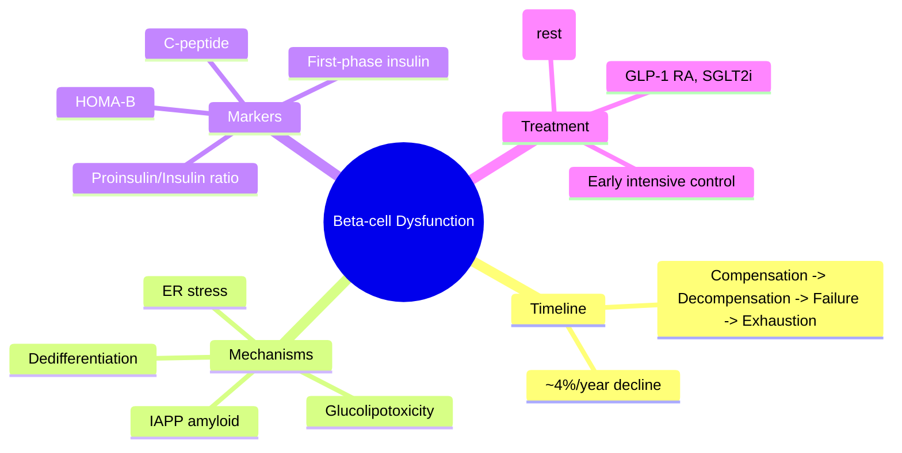

# Beta-cell dysfunction and failure

## 1. Learning Objectives
By the end of this note you should be able to:
- [ ] Describe the timeline of beta-cell failure in T2DM
- [ ] Explain mechanisms: glucolipotoxicity, amyloid, ER stress, dedifferentiation
- [ ] Apply proinsulin/insulin ratio as marker of beta-cell stress
- [ ] Contrast T2DM beta-cell failure vs T1DM autoimmune destruction

---

## 2. Definition & Epidemiology

| Feature | Detail |
|--------|--------|
| **Definition** | Progressive loss of beta-cell function and mass in T2DM |
| **Timeline** | Present at diagnosis (~50% function lost); continues ~4%/year decline |
| **Key Concept** | **Beta-cell failure** = inadequate insulin for degree of IR |

---

## 3. Clinical Features / Presentation
(N/A)

---

## 4. Classification / Staging / Grading

### Stages of Beta-Cell Dysfunction (UKPDS Model)
| Stage | Beta-Cell Function | Clinical Correlate |
|-------|-------------------|-------------------|
| **Compensation** | Increased insulin secretion (hyperinsulinaemia) | Normal glucose (insulin resistance compensated) |
| **Decompensation** | Decreased first-phase insulin response | IGT / IFG |
| **Failure** | Inadequate insulin for IR | Overt T2DM (fasting + post-prandial hyperglycaemia) |
| **Exhaustion** | Severe loss; insulin required | Insulin-requiring T2DM |

### Key Pathogenic Mechanisms

| Mechanism | Details |
|-----------|---------|
| **Glucotoxicity** | Chronic hyperglycaemia -> oxidative stress, ER stress, mitochondrial dysfunction -> apoptosis |
| **Lipotoxicity** | FFA/ceramides -> down PDX-1, down MafA, up CHOP -> apoptosis; UPR activation |
| **Amyloid (IAPP)** | Islet amyloid polypeptide deposits -> beta-cell toxicity; ~90% T2DM have islet amyloid |
| **ER Stress** | Misfolded proinsulin -> unfolded protein response -> CHOP-mediated apoptosis |
| **Dedifferentiation** | Beta-cells lose identity -> revert to progenitor-like or alpha-like cells (reversible?) |
| **Oxidative Stress** | Mitochondrial ROS -> DNA damage, apoptosis |

### Beta-Cell Markers
| Marker | Significance |
|--------|--------------|
| **Proinsulin/Insulin ratio** | Increased = beta-cell stress; decreased processing efficiency |
| **C-peptide** | Surrogate for endogenous insulin secretion |
| **First-phase insulin response** | Lost early in T2DM pathogenesis |
| **HOMA-B** | Beta-cell function index (model-derived) |

---

## 5. Diagnosis & Investigations
| Test | Interpretation |
|------|----------------|
| **C-peptide** | Low = beta-cell failure; preserved = insulin resistance |
| **Proinsulin/Insulin** | Increased ratio = beta-cell stress |
| **OGTT with insulin** | First-phase loss; beta-cell glucose sensitivity |
| **HOMA-B** | Beta-cell function index (model-derived) |

---

## 6. Differential Diagnosis
| Condition | Distinguishing Features |
|-----------|-------------------------|
| **T1DM** | Autoimmune, rapid loss, autoantibodies 2+, low C-peptide |
| **MODY** | Genetic, preserved C-peptide, specific gene defects |
| **Secondary DM** | Pancreatic, endocrine, drug-induced mechanisms |

---

## 7. Management Implications
| Strategy | Evidence |
|----------|----------|
| **Early intensive control** | UKPDS legacy effect; down beta-cell exhaustion rate |
| **GLP-1 RA** | up Beta-cell survival (preclinical); down apoptosis |
| **SGLT2i** | Indirect via weight loss, down glucotoxicity |
| **Early insulin** | "Beta-cell rest" hypothesis; transient intensive insulin -> remission |
| **TZDs** | Pioglitazone: down lipotoxicity, down amyloid? |

---

## 8. FCPS/MRCP High-Yield Summary
| Topic | Key Points |
|-------|------------|
| **Timeline** | ~50% function lost at diagnosis; ~4%/year decline |
| **Mechanisms** | Glucolipotoxicity, IAPP amyloid, ER stress, dedifferentiation |
| **Amyloid** | IAPP deposits in ~90% T2DM; toxic to beta-cells |
| **Proinsulin/Insulin** | Increased ratio = beta-cell stress marker |
| **Dedifferentiation** | Beta-cells lose identity -> progenitor/alpha-like (potentially reversible) |
| **First-phase loss** | Earliest functional defect; precedes hyperglycaemia |

---

## 9. Viva Questions
| Question | Expected Answer |
|----------|-----------------|
| **What is the natural history of beta-cell function in T2DM?** | Compensation (hyperinsulinaemia) -> decompensation (first-phase loss) -> failure (T2DM) -> exhaustion (insulin-requiring); ~4%/year decline |
| **What is the role of islet amyloid (IAPP) in T2DM?** | Deposits in ~90% T2DM; toxic to beta-cells; contributes to apoptosis |
| **What is glucolipotoxicity?** | Combined chronic hyperglycaemia + elevated FFA -> oxidative stress, ER stress, mitochondrial dysfunction -> beta-cell apoptosis |
| **What is beta-cell dedifferentiation?** | Beta-cells lose identity markers (PDX-1, MafA) -> revert to progenitor-like or alpha-like cells; potentially reversible with early intervention |

---

## 10. Confusions & Mnemonics
| Confusion | Clarification |
|-----------|---------------|
| **Beta-cell failure = T1DM?** | NO - T2DM: functional decline + mass loss; T1DM: autoimmune destruction |
| **Beta-cell mass vs function?** | Both decline; function declines first (dedifferentiation precedes apoptosis) |

**Mnemonic: BETA-CELL-FAIL**
- **B**eta-cell: ~50% lost at diagnosis
- **E**xhaustion: final stage -> insulin required
- **T**imeline: ~4%/year decline
- **A**myloid: IAPP deposits in ~90% T2DM
- **C**ompensation: hyperinsulinaemia early
- **E**R stress: misfolded proinsulin -> CHOP apoptosis
- **L**ipotoxicity: FFA/ceramides -> down PDX-1, up CHOP
- **L**oss of first-phase: earliest defect
- **F**irst-phase insulin response lost early
- **A**myloid: IAPP deposits ~90%
- **I**nsulin/proinsulin ratio: up = stress
- **L**GLP-1 RA/SGLT2i: may slow decline
- **D**edifferentiation: loss of PDX-1/MafA -> progenitor/alpha-like

---

## 11. Mind Map

---

## 12. One-Page Revision Card

| Domain | Key Points |
|--------|------------|
| **Definition** | Progressive loss of beta-cell function/mass in T2DM |
| **Key Test" | Proinsulin/Insulin ratio (up = stress); C-peptide (low = failure) |
| **Classification" | Compensation -> Decompensation -> Failure -> Exhaustion |
| **Acute Mgmt" | Early intensive insulin -> remission possible |
| **Chronic Mgmt" | GLP-1 RA, SGLT2i, weight loss, early intensive control |
| **Key Score" | Proinsulin/Insulin ratio up = stress; first-phase lost early |
| **Complications" | Progressive hyperglycaemia; insulin requirement |
| **Prognosis" | ~4%/year decline; early intervention may preserve function |

---

## 13. Spaced Repetition Trackers

| Review Interval | Date Completed | Confidence (1-5) | Notes |
|-----------------|----------------|------------------|-------|
| 24 hours | | | |
| 7 days | | | |
| 15 days | | | |
| 30 days | | | |
| 90 days | | | |

---

## 14. Self-Test Scorecard

| Section | Score /5 | Last Attempt |
|---------|----------|--------------|
| Definition & Epidemiology | | |
| Classification & Staging | | |
| Diagnosis & Investigations | | |
| Management (Acute) | | |
| Management (Chronic) | | |
| Complications | | |
| Viva Questions | | |
| DDx Distinctions | | |
| Mnemonics/Algorithms | | |

---

### Local Navigation
- **Parent Heading**: [[../Pathophysiology of Diabetes|Pathophysiology of Diabetes]]
- **Chapter Map": [[../../Davidson Chapter 25 - Diabetes Hierarchy|Diabetes Hierarchy]]
- **Chapter MOC": [[../../Diabetes MOC|Diabetes MOC]]
- **Drug Reference": [[../../../Clinical Therapeutics and Good Prescribing|Drugs]]
- **Related": [[Insulin resistance]], [[Incretin defect and glucagon dysregulation]], [[Lipotoxicity and glucotoxicity]], [[Genetics of type 2 diabetes (polygenic risk)]]

---
## Tags
#medicine #diabetes #davidson #fcps #mrcp #full-fcps-mrcp-note

## PasTest Scenario SBAs (Clinical Vignettes)

> **Auto-generated PasTest/Mediscope-style scenario SBAs** grounded in the authored source. Each scenario tests a real clinical fact (triad, specific sign, contraindication, trial, first-line Rx) extracted from the topic. *Source: Ch 21: Diabetes — Beta-cell dysfunction and failure*

**Q1.** Which of the following features is most specific or characteristic of Beta-cell dysfunction and failure?

  - **A.** MODY
  - **B.** A feature common to many acute inflammatory conditions
  - **C.** A non-specific sign that does not localise the diagnosis
  - **D.** An investigation finding rather than a clinical feature

  > **Answer: A** — MODY
  >
  > *Source:* ------------------------|
| **T1DM** | Autoimmune, rapid loss, autoantibodies 2+, low C-peptide |
| **MODY** | Genetic, preserved C-peptide, specific gene defects |
| **Secondary DM** | Pancreatic, en
---

> Auto-generated study sections for "Type 2 diabetes pathogenesis" — Ch 21: Diabetes Mellitus.

## Flashcards (26 generated)

- Q: What is the definition of Type 2 diabetes pathogenesis?
  A: Progressive loss of beta-cell function and mass in T2DM
- Q: What is Timeline of Type 2 diabetes pathogenesis?
  A: Present at diagnosis (~50% function lost); continues ~4%/year decline
- Q: What is Key Concept of Type 2 diabetes pathogenesis?
  A: Beta-cell failure = inadequate insulin for degree of IR
- Q: What are the side effects of Type 2 diabetes pathogenesis?
  A: Chronic hyperglycaemia -> oxidative stress, ER stress, mitochondrial dysfunction -> apoptosis
- Q: What is Amyloid (IAPP) of Type 2 diabetes pathogenesis?
  A: Islet amyloid polypeptide deposits -> beta-cell toxicity; ~90% T2DM have islet amyloid
- Q: What is ER Stress of Type 2 diabetes pathogenesis?
  A: Misfolded proinsulin -> unfolded protein response -> CHOP-mediated apoptosis
- Q: What is Dedifferentiation of Type 2 diabetes pathogenesis?
  A: Beta-cells lose identity -> revert to progenitor-like or alpha-like cells (reversible?)
- Q: What is Oxidative Stress of Type 2 diabetes pathogenesis?
  A: Mitochondrial ROS -> DNA damage, apoptosis
- Q: What is C-peptide of Type 2 diabetes pathogenesis?
  A: Low = beta-cell failure; preserved = insulin resistance
- Q: What is Proinsulin/Insulin of Type 2 diabetes pathogenesis?
  A: Increased ratio = beta-cell stress
- Q: What is OGTT with insulin of Type 2 diabetes pathogenesis?
  A: First-phase loss; beta-cell glucose sensitivity
- Q: What is HOMA-B of Type 2 diabetes pathogenesis?
  A: Beta-cell function index (model-derived)
- Q: What are the side effects of Type 2 diabetes pathogenesis?
  A: Chronic hyperglycaemia -> oxidative stress, ER stress, mitochondrial dysfunction -> apoptosis
- Q: What is Amyloid (IAPP) of Type 2 diabetes pathogenesis?
  A: Islet amyloid polypeptide deposits -> beta-cell toxicity; ~90% T2DM have islet amyloid
- Q: What is ER Stress of Type 2 diabetes pathogenesis?
  A: Misfolded proinsulin -> unfolded protein response -> CHOP-mediated apoptosis
- Q: What is Dedifferentiation of Type 2 diabetes pathogenesis?
  A: Beta-cells lose identity -> revert to progenitor-like or alpha-like cells (reversible?)
- Q: What is C-peptide of Type 2 diabetes pathogenesis?
  A: Low = beta-cell failure; preserved = insulin resistance
- Q: What is Proinsulin/Insulin of Type 2 diabetes pathogenesis?
  A: Increased ratio = beta-cell stress
- Q: What is OGTT with insulin of Type 2 diabetes pathogenesis?
  A: First-phase loss; beta-cell glucose sensitivity
- Q: What is HOMA-B of Type 2 diabetes pathogenesis?
  A: Beta-cell function index (model-derived)
- Q: What is Timeline of Type 2 diabetes pathogenesis?
  A: ~50% function lost at diagnosis; ~4%/year decline
- Q: What is the mechanism of Type 2 diabetes pathogenesis?
  A: Glucolipotoxicity, IAPP amyloid, ER stress, dedifferentiation
- Q: What is Amyloid of Type 2 diabetes pathogenesis?
  A: IAPP deposits in ~90% T2DM; toxic to beta-cells
- Q: What is Proinsulin/Insulin of Type 2 diabetes pathogenesis?
  A: Increased ratio = beta-cell stress marker
- Q: What is Dedifferentiation of Type 2 diabetes pathogenesis?
  A: Beta-cells lose identity -> progenitor/alpha-like (potentially reversible)
- Q: What is First-phase loss of Type 2 diabetes pathogenesis?
  A: Earliest functional defect; precedes hyperglycaemia

## MCQs (1 generated)

1. **Which of the following best describes Type 2 diabetes pathogenesis?**
   A. **By the end of this note you should be able to:**
   B. An unrelated condition not matching the clinical picture of Type 2 diabetes pathogenesis
   C. A complication seen late in the disease course of Type 2 diabetes pathogenesis
   D. A condition that mimics Type 2 diabetes pathogenesis but has a different underlying cause

## SBA Questions (1 generated)

1. A patient with suspected Type 2 diabetes pathogenesis presents with: Definition — Progressive loss of beta-cell function and mass in T2DM; Timeline — Present at diagnosis (~50% function lost); continues ~4%/year decline; Key Concept — Beta-cell failure = inadequate insulin for degree of IR. What is the most likely diagnosis?
   A. **Type 2 diabetes pathogenesis**
   B. A condition that mimics Type 2 diabetes pathogenesis but is not the same entity
   C. A complication of Type 2 diabetes pathogenesis rather than the primary diagnosis
   D. An unrelated condition in the same clinical category as Type 2 diabetes pathogenesis

