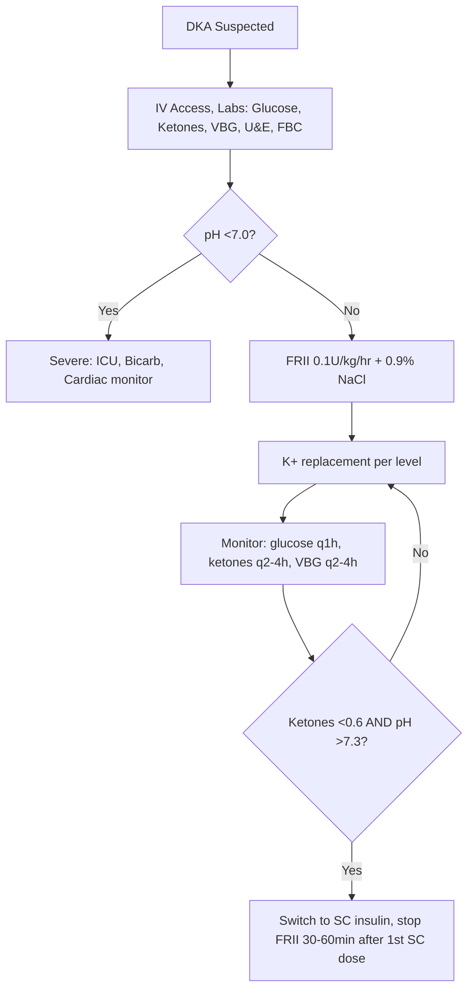
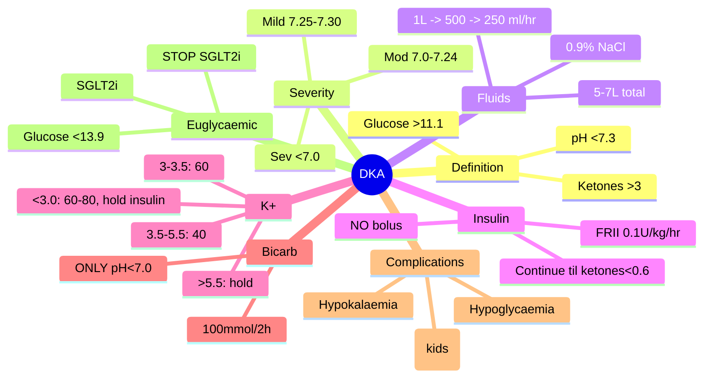

# Diabetic ketoacidosis (DKA)

## 1. Learning Objectives
By the end of this note you should be able to:
- [ ] State DKA diagnostic criteria (glucose, ketones, pH, bicarbonate)
- [ ] Grade DKA severity (mild/moderate/severe)
- [ ] Execute DKA management protocol per JBDS/ADA
- [ ] Manage potassium replacement and bicarbonate indications
- [ ] Recognise and manage complications (cerebral oedema, hypokalaemia)

---

## 2. Definition & Epidemiology

| Feature | Detail |
|---------|--------|
| **Definition** | Acute diabetic emergency: hyperglycaemia + ketonaemia + acidosis |
| **Diagnostic Triad** | 1) Glucose >11.1 mmol/L (200 mg/dL) 2) Ketonaemia >3 mmol/L (or significant ketonuria) 3) pH <7.3 and/or bicarbonate <15 mmol/L |
| **Incidence** | 4-8 per 1000 patient-years in T1DM; rising with SGLT2i use |
| **Mortality** | <1% (mild/moderate); 5-10% (severe); higher in elderly/comorbidities |
| **Precipitants** | Infection (pneumonia, UTI), insulin omission, MI, stroke, trauma, surgery, drugs (SGLT2i, steroids), pregnancy |

---

## 3. Clinical Features / Presentation

| Presentation | Frequency | Key Features |
|-------------|-----------|--------------|
| **Polyuria/polydipsia** | Universal | Precedes by days-weeks |
| **Nausea/vomiting/abdominal pain** | 75% | Abdominal pain mimics surgical abdomen |
| **Kussmaul breathing** | Moderate/severe | Deep, rapid respirations (compensatory) |
| **Dehydration** | Universal | Dry mucosa, poor skin turgor, tachycardia, hypotension |
| **Ketotic breath** | Common | Pear-drop/acetone smell |
| **Altered consciousness** | Severe | Confusion, drowsiness, coma (pH<7.0) |

> **Red Flags**: Ketosis at presentation -> think Type 1 / LADA; rapid weight loss + osmotic symptoms in adult -> LADA; pancreatic cancer (new-onset DM >50y + weight loss).

---

## 4. Classification / Staging / Grading

| Severity | pH | Bicarbonate (mmol/L) | Ketonaemia (mmol/L) | Mental Status | K+ (mmol/L) |
|----------|-----|----------------------|---------------------|---------------|-------------|
| **Mild** | 7.25-7.30 | 15-18 | >3 | Alert | >3.5 |
| **Moderate** | 7.00-7.24 | 10-15 | >3 | Alert/drowsy | 3.0-3.5 |
| **Severe** | <7.00 | <10 | >3 | Drowsy/coma | <3.0 |

> **Euglycaemic DKA**: Glucose <13.9 mmol/L (250 mg/dL) + same ketone/pH criteria. Associated with SGLT2 inhibitors, pregnancy, starvation, alcohol. **STOP SGLT2i**, same management.

---

## 5. Diagnosis & Investigations

| Investigation | Role | Key Details |
|---------------|------|-------------|
| **Blood glucose** | Confirm hyperglycaemia | Portal/venous >11.1 mmol/L |
| **Blood ketones (β-hydroxybutyrate)** | Confirm ketonaemia | >3 mmol/L diagnostic; superior to urine ketones (nitroprusside detects acetoacetate only) |
| **Venous blood gas (VBG)** | Assess acidosis | pH, bicarbonate, pCO2, base excess. VBG ≈ ABG for pH/HCO3 |
| **U&E, Creatinine** | Renal function, K+ | K+ critical for insulin safety |
| **FBC, CRP** | Infection screen | Leucocytosis common (stress + infection) |
| **ECG** | K+ effects, ischaemia | Peaked T (hyperK+), flat T/U (hypoK+); silent MI |
| **CXR / Urine culture** | Precipitant identification | Pneumonia, UTI common |
| **Pregnancy test** | Women of childbearing age | Euglycaemic DKA risk |

---

## 6. Differential Diagnosis

| Condition | Distinguishing Features |
|-----------|-------------------------|
| **HHS** | Glucose >30 mmol/L, osmolality >320 mOsm/kg, pH >7.3, bicarbonate >18, minimal ketones |
| **Euglycaemic DKA** | Glucose <13.9 mmol/L, same ketone/pH criteria; SGLT2i, pregnancy, starvation |
| **Alcoholic ketoacidosis** | Normal/mildly elevated glucose, high ketones, metabolic acidosis; history alcohol binge |
| **Lactic acidosis** | Normal glucose/ketones, high lactate; metformin, sepsis, shock |
| **Renal tubular acidosis** | Normal glucose, non-anion gap acidosis, normal ketones |

---

## 7. Management

### Fluid Resuscitation
| Phase | Fluid | Rate | Duration |
|-------|-------|------|----------|
| **1st hour** | 0.9% NaCl | 1L | 60 min |
| **Hours 2-3** | 0.9% NaCl | 500ml/hr | 2 hr |
| **Hours 4-24** | 0.9% NaCl | 250ml/hr | Adjust to replace deficit over 24-48h |
| **If Na+ rising >5** | 0.45% NaCl | Per protocol | Prevent hypernatraemia |
| **If glucose <14 mmol/L** | 5% Dextrose + 0.45%/0.9% NaCl | Match insulin | Prevent hypoglycaemia |

> **Total deficit**: ~5-7L (100ml/kg). Replace 50% in 12h, rest over 24-48h.

### Insulin Therapy
| Parameter | Detail |
|-----------|--------|
| **Regimen** | Fixed-rate IV insulin infusion (FRII) |
| **Dose** | 0.1 U/kg/hr (e.g., 50U Actrapid/Humulin S in 50ml 0.9% NaCl = 1U/ml) |
| **Bolus?** | **NO IV bolus** - increases cerebral oedema risk |
| **Duration** | Until ketones <0.6 mmol/L AND pH >7.3 AND bicarbonate >18 |
| **Glucose <14** | Add 5% dextrose; **DO NOT STOP INSULIN** until ketone clearance |

### Potassium Replacement
| Serum K+ (mmol/L) | K+ in Fluids (mmol/L) | Notes |
|-------------------|----------------------|-------|
| **<3.0** | 60-80 | **Hold insulin until K+ >3.3** - cardiac arrest risk |
| **3.0-3.5** | 60 | Cardiac monitor; replace aggressively |
| **3.5-5.5** | 40 | Standard replacement |
| **>5.5** | Hold (0) | Recheck q1h; usually falls with insulin |

> **Target**: 4.0-5.0 mmol/L. Total K+ requirement often 500-1000mmol over 24h.

### Bicarbonate
| Indication | Dose |
|------------|------|
| **pH <7.0 (severe)** | 100mmol NaHCO3 in 400ml water + 20mmol KCl over 2h |
| **pH 7.0-7.3** | **Do not give** - no outcome benefit, paradoxical CNS acidosis risk |

### Monitoring & Complications
| Complication | Prevention / Management |
|--------------|------------------------|
| **Cerebral oedema** | Children <20y; rapid osmolar drop; headache, bradycardia, hypertension, ↓GCS; **mannitol 0.5-1g/kg**; hyperventilation; ICU; avoid rapid osmolar drop >3 mOsm/kg/hr |
| **Hypokalaemia** | K+ replacement per protocol; cardiac monitor; hold insulin if K+<3.3 |
| **Hypoglycaemia** | Add 5% dextrose when glucose <14; don't stop insulin until ketones clear |
| **Hypophosphataemia** | If <0.3 mmol/L: IV phosphate (risk of hypocalcaemia) |
| **Hyperchloraemic acidosis** | From 0.9% NaCl; switch to 0.45% if Na+ rising rapidly |

---

## 8. FCPS/MRCP High-Yield Summary

| Topic | Key Points |
|-------|------------|
| **Diagnostic criteria** | Glucose >11.1 + Ketones >3 + pH <7.3 / HCO3 <15 |
| **Severity grading** | Mild: pH 7.25-7.30; Mod: 7.0-7.24; Sev: <7.0 |
| **Fluids** | 1L/hr ×1, 500ml/hr ×2, 250ml/hr → total 5-7L over 24-48h |
| **Insulin** | FRII 0.1 U/kg/hr; NO bolus; continue till ketones <0.6, pH >7.3, HCO3 >18 |
| **K+** | <3.0: 60-80mmol/L (hold insulin till >3.3); 3.0-3.5: 60; 3.5-5.5: 40; >5.5: hold |
| **Bicarb** | ONLY pH <7.0: 100mmol/2h |
| **Dextrose** | Start 5% when glucose <14; DON'T stop insulin |
| **Euglycaemic DKA** | Glucose <13.9; SGLT2i-associated; STOP SGLT2i; same Rx |
| **Cerebral oedema** | Children: mannitol 0.5-1g/kg; ICU; avoid rapid osmolar drop >3 mOsm/kg/hr |
| **Precipitant** | Treat infection, stop SGLT2i, restart insulin |

---

## 9. Viva Questions

| Question | Expected Answer |
|----------|-----------------|
| **What are the diagnostic criteria for DKA?** | Glucose >11.1 mmol/L + blood ketones >3 mmol/L (or significant ketonuria) + venous pH <7.3 or bicarbonate <15 mmol/L |
| **How do you grade DKA severity?** | Mild: pH 7.25-7.30, bicarb 15-18, alert, K+ >3.5; Moderate: pH 7.00-7.24, bicarb 10-15, drowsy, K+ 3.0-3.5; Severe: pH <7.00, bicarb <10, coma/GCS<12, K+ <3.0 |
| **What is the initial fluid regimen for DKA?** | 0.9% NaCl 1L in 1st hour, then 500ml/hr ×2h, then 250ml/hr; total deficit ~5-7L over 24-48h |
| **What insulin regimen is used?** | Fixed-rate IV insulin infusion (FRII) 0.1 U/kg/hr (e.g., 50U Actrapid in 50ml 0.9% NaCl = 1U/ml); NO IV bolus |
| **How do you manage potassium in DKA?** | Replace in fluids: K+ <3.0 → 60-80mmol/L (hold insulin till K+>3.3); 3.0-3.5 → 60mmol/L; 3.5-5.5 → 40mmol/L; >5.5 → hold. Target 4.0-5.0. Cardiac monitoring essential. |
| **When do you give bicarbonate in DKA?** | ONLY if pH <7.0: 100mmol NaHCO3 in 400ml water + 20mmol KCl over 2h |
| **When do you add dextrose?** | When glucose <14 mmol/L; switch to 5% dextrose + 0.45%/0.9% NaCl; DO NOT stop insulin until ketones <0.6, pH >7.3, HCO3 >18 |
| **What is euglycaemic DKA?** | DKA with glucose <13.9 mmol/L; associated with SGLT2 inhibitors, pregnancy, starvation; same ketone/pH criteria; STOP SGLT2i |
| **What are the complications of DKA treatment?** | Hypokalaemia (insulin drives K+ in), hypoglycaemia (if dextrose not added), cerebral oedema (children, rapid osmolar drop), hyperchloraemic acidosis (0.9% NaCl) |
| **How do you transition to subcutaneous insulin?** | Give 1st SC dose (basal + bolus if eating) → continue FRII 30-60min → stop FRII |

---

## 10. Confusions & Mnemonics

| Confusion | Clarification |
|-----------|---------------|
| **DKA vs HHS** | DKA: ketosis + acidosis; HHS: severe hyperosmolality, minimal ketosis, no acidosis. Mixed DKA-HHS exists. |
| **Euglycaemic DKA vs DKA** | Same ketone/pH criteria; glucose <13.9; SGLT2i major cause; STOP SGLT2i |
| **Insulin bolus vs infusion** | NEVER bolus in DKA; FRII 0.1U/kg/hr only; bolus → cerebral oedema risk |
| **Stop insulin when glucose normal?** | NO - continue FRII until **ketones <0.6, pH >7.3, HCO3 >18**; glucose controlled with dextrose |
| **Bicarbonate for all acidosis?** | NO - only pH <7.0; paradoxical CNS acidosis, hypokalaemia risk |

**Mnemonic: DKA-KUSS**
- **D**iagnosis: Glucose >11.1 + Ketones >3 + pH <7.3/HCO3 <15
- **K**etones: β-hydroxybutyrate >3 mmol/L (blood preferred over urine)
- **A**cidosis: pH <7.3, bicarbonate <15
- **K**+: replace aggressively (40-60mmol/L in fluids)
- **U**rine ketones: nitroprusside = acetoacetate only (misses β-OHB)
- **S**everity: Mild 7.25-7.30 / Mod 7.0-7.24 / Sev <7.0
- **S**top insulin only after ketones <0.6 + pH >7.3

---

## 11. Mind Map

---

## 12. One-Page Revision Card

| Domain | Key Points |
|--------|------------|
| **Definition** | Glucose >11.1 + Ketones >3 + pH <7.3/HCO3 <15 |
| **Key Test** | Blood β-hydroxybutyrate >3 mmol/L; VBG pH/HCO3 |
| **Classification** | Mild 7.25-7.30; Mod 7.0-7.24; Sev <7.0 |
| **Acute Mgmt** | 1L NS/hr → 500 → 250 ml/hr; FRII 0.1U/kg/hr; K+ per level; Bicarb ONLY if pH<7.0 |
| **Chronic Mgmt** | Stop insulin only after ketones<0.6 + pH>7.3 + HCO3>18; transition SC with 30-60min overlap |
| **Key Score** | JBDS/ADA severity grading; K+ replacement protocol |
| **Complications** | Cerebral oedema (kids), hypokalaemia, hypoglycaemia, hyperchloraemic acidosis |
| **Prognosis** | Mortality <1% mild/mod; 5-10% severe; higher elderly/comorbid |

---

## 13. Spaced Repetition Trackers

| Review Interval | Date Completed | Confidence (1-5) | Notes |
|-----------------|----------------|------------------|-------|
| 24 hours | | | |
| 7 days | | | |
| 15 days | | | |
| 30 days | | | |
| 90 days | | | |

---

## 14. Self-Test Scorecard

| Section | Score /5 | Last Attempt |
|---------|----------|--------------|
| Definition & Epidemiology | | |
| Classification & Staging | | |
| Clinical Features | | |
| Diagnosis & Investigations | | |
| Management (Acute) | | |
| Management (Chronic) | | |
| Complications | | |
| Viva Questions | | |
| DDx Distinctions | | |
| Mnemonics/Algorithms | | |

---

### Local Navigation
- **Parent Heading**: [[../Diabetic Emergencies/Diabetic ketoacidosis (DKA)|Diabetic ketoacidosis (DKA)]]
- **Chapter Map**: [[../../Davidson Chapter 25 - Diabetes Hierarchy|Diabetes Hierarchy]]
- **Chapter MOC**: [[../../Diabetes MOC|Diabetes MOC]]
- **Drug Reference**: [[../../../Clinical Therapeutics and Good Prescribing|Drugs]]
- **Related**: [[DKA severity grading (mild/moderate/severe)]], [[DKA management protocol]], [[DKA complications (cerebral oedema, hypokalaemia)]]

---
## Tags
#medicine #diabetes #davidson #fcps #mrcp #full-fcps-mrcp-note