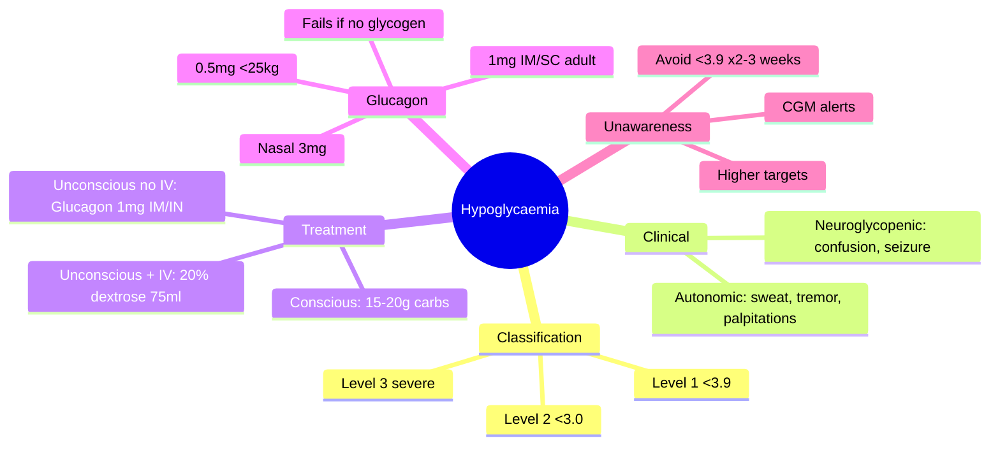

# Hypoglycaemia

## 1. Learning Objectives
By the end of this note you should be able to:
- [ ] Classify hypoglycaemia levels (1/2/3) and manage each
- [ ] Apply glucagon dosing (IM, IN, auto-injector)
- [ ] Manage hypoglycaemia unawareness
- [ ] Prevent recurrent hypoglycaemia

---

## 2. Definition & Epidemiology

| Feature | Detail |
|--------|--------|
| **Level 1 (Alert)** | Glucose <3.9 mmol/L (70 mg/dL) - threshold for neuroendocrine response |
| **Level 2 (Clinical)** | Glucose <3.0 mmol/L (54 mg/dL) - clinically significant |
| **Level 3 (Severe)** | Severe - requires assistance (unconscious/seizure) |
| **Incidence T1DM** | 2-3 severe episodes/patient-year |
| **Incidence T2DM (insulin)** | 1-2 severe episodes/patient-year |
| **Mortality** | ~4-10% of T1DM deaths; "dead in bed" syndrome |

---

## 3. Clinical Features / Presentation

| Level | Autonomic Symptoms | Neuroglycopenic Symptoms |
|-------|-------------------|-------------------------|
| **Level 1 (<3.9)** | Sweating, tremor, palpitations, hunger, anxiety | - |
| **Level 2 (<3.0)** | Intense autonomic | Confusion, drowsiness, speech difficulty, ataxia |
| **Level 3 (Severe)** | May be absent (unawareness) | Seizure, coma, focal signs, death |

---

## 4. Classification / Staging / Grading

| Classification | Glucose | Clinical |
|----------------|---------|----------|
| **Level 1 (Alert)** | <3.9 mmol/L | Self-treat |
| **Level 2 (Clinical)** | <3.0 mmol/L | Self-treat, impaired judgement |
| **Level 3 (Severe)** | Any (needs help) | Unconscious, seizure, needs 3rd party |

| Counter-regulation | Status |
|-------------------|--------|
| **Normal** | Glucagon ↑, epinephrine ↑, cortisol/GH ↑ |
| **Impaired (T1DM)** | Glucagon response lost first, then epinephrine blunted → unawareness |

---

## 5. Diagnosis & Investigations

| Investigation | Role | Key Details |
|---------------|------|-------------|
| **Capillary/venous glucose** | Confirm hypo | <3.9 = Level 1; <3.0 = Level 2 |
| **CGM** | Detect nocturnal/unrecognised | TIR/TBR metrics; alerts for <3.9 |
| **Whipple's triad** | Diagnostic | Symptoms + low glucose + relief with glucose |
| **Insulin/C-peptide** | Factitious hypoglycaemia | Exogenous insulin: high insulin, low C-peptide; Insulinoma: high both |

---

## 6. Differential Diagnosis

| Condition | Distinguishing Features |
|-----------|-------------------------|
| **Factitious hypoglycaemia** | Surreptitious insulin/SU use; high insulin, low C-peptide; urine SU screen |
| **Insulinoma** | Fasting hypo; high insulin + high C-peptide + high proinsulin; CT/MRI pancreas |
| **Adrenal insufficiency** | Hypo + hypotension + hyponatraemia + hyperkalaemia; cortisol low |
| **Post-bariatric hypoglycaemia** | Late dumping (1-3h post-meal); nesidioblastosis; GLP-1 mediated |
| **Non-islet cell tumour (NICTH)** | Large tumours; IGF-2 mediated; low insulin, low C-peptide, low IGF-1 |

---

## 7. Management

### Acute Management

| Scenario | Treatment |
|----------|-----------|
| **Conscious, able to swallow** | 15-20g fast carbs (glucose tabs, 150ml juice, 5-6 jelly babies); recheck 15min; repeat if <3.9; complex carb if meal >1h |
| **Conscious, unable to swallow** | Glucagon 1mg IM/SC (adult); 0.5mg <25kg; Nasal 3mg (Baqsimi); Auto-injector 0.5/1mg (Gvoke) |
| **Unconscious + IV access** | 75-80ml 20% dextrose (or 150ml 10%) IV bolus → 10% dextrose infusion |
| **Unconscious, no IV** | Glucagon 1mg IM/SC (adult); 0.5mg <25kg; Nasal 3mg (Baqsimi) |
| **Hospital insulin error** | Same + root cause analysis; insulin passport; double-check protocol; CGM in hospital |

### Glucagon Formulations

| Form | Dose | Route | Onset | Duration |
|------|------|-------|-------|----------|
| **GlucaGen HypoKit** | 1mg (0.5mg <25kg) | IM/SC | 10-15min | 60-90min |
| **Baqsimi** | 3mg | Intranasal | 10-15min | 60-90min |
| **Gvoke (auto-injector)** | 0.5mg/1mg | SC | 10-15min | 60-90min |
| **Zegalogue (dasiglucagon)** | 0.6mg | SC/auto | 10min | Ready-to-use, stable at room temp |

### Prevention of Recurrent Hypoglycaemia

| Strategy | Detail |
|----------|--------|
| **Hypoglycaemia unawareness reversal** | Avoid <3.9 for 2-3 weeks → restores autonomic symptoms; higher targets (HbA1c 58-64); CGM alerts; CSII/AID |
| **Medication adjustment** | Reduce/stop SU; switch to DPP-4i/SGLT2i/GLP-1 RA; insulin dose reduction; basal-bolus → CSII/AID |
| **Education** | Carb counting, sick day rules, alcohol + food, exercise adjustments |
| **Technology** | CGM with predictive alerts; AID systems (reduce hypo by 30-50%) |

---

## 8. FCPS/MRCP High-Yield Summary

| Topic | Key Points |
|-------|------------|
| **Classification** | Level 1: <3.9; Level 2: <3.0; Level 3: severe (needs help) |
| **Conscious treatment** | 15-20g fast carbs → recheck 15min → repeat if <3.9 → complex carb if meal >1h |
| **Unconscious + IV** | 75-80ml 20% dextrose (or 150ml 10%) IV bolus → 10% dextrose infusion |
| **Unconscious, no IV** | Glucagon 1mg IM/SC (adult), 0.5mg <25kg; Nasal 3mg (Baqsimi) |
| **Glucagon types** | IM/SC (GlucaGen), IN (Baqsimi 3mg), Auto (Gvoke 0.5/1mg), Dasiglucagon (Zegalogue 0.6mg) |
| **Unawareness reversal** | Avoid <3.9 for 2-3 weeks → restores autonomic symptoms; CGM alarms; higher targets |
| **Hospital prevention** | Insulin passport; double-check protocol; CGM in hospital; reduce sliding scale |

---

## 9. Viva Questions

| Question | Expected Answer |
|----------|-----------------|
| **How do you classify hypoglycaemia?** | Level 1: <3.9 mmol/L (alert); Level 2: <3.0 mmol/L (clinically significant); Level 3: Severe - requires assistance (unconscious/seizure) |
| **Management of conscious hypoglycaemia?** | 15-20g fast-acting carbohydrate (glucose tablets, 150ml juice, jelly babies) → recheck 15min → repeat if <3.9 → complex carb snack if meal >1h away |
| **Management of unconscious hypoglycaemia?** | IV access: 75-80ml 20% dextrose (or 150ml 10%) IV bolus → 10% dextrose infusion. No IV: Glucagon 1mg IM/SC (adult), 0.5mg <25kg; or Nasal 3mg (Baqsimi) |
| **Glucagon dose and routes?** | 1mg IM/SC (adult), 0.5mg <25kg; Nasal 3mg (Baqsimi); Auto-injector 0.5/1mg (Gvoke); Dasiglucagon 0.6mg SC (Zegalogue) |
| **What is hypoglycaemia unawareness?** | Absent autonomic symptoms due to blunted epinephrine response (glucagon already lost in T1DM); sudden neuroglycopenia; 6x risk severe hypo |
| **How do you reverse hypoglycaemia unawareness?** | Strict avoidance of glucose <3.9 mmol/L for 2-3 weeks → restores autonomic symptoms; use higher targets, CGM alerts, CSII/AID |
| **What is the "dead in bed" syndrome?** | Nocturnal hypoglycaemia → cardiac arrhythmia (QT prolongation) → sudden death in young T1DM; prevention: CGM nocturnal alerts, avoid tight control at bedtime |

---

## 10. Confusions & Mnemonics

| Confusion | Clarification |
|-----------|---------------|
| **Glucagon in starvation/alcohol** | INEFFECTIVE - requires hepatic glycogen stores; use IV dextrose |
| **Glucagon repeat dose** | NOT recommended - depletes glycogen; if no response in 15min → IV dextrose |
| **Level 3 definition** | "Requires assistance" - NOT defined by specific glucose value |

**Mnemonic: HYPO-15**
- **H**ypoglycaemia: <3.9 mmol/L
- **Y**ou check glucose
- **P**atient conscious? → 15-20g carbs
- **O**ral carbs: glucose tabs, juice, jelly babies
- **1**5min recheck
- **5** → if still low, repeat 15g
- **Unconscious**: No IV → Glucagon 1mg IM/IN; IV → 20% dextrose 75ml
- **Unawareness**: avoid <3.9 ×2-3 weeks → restores symptoms
- **Glucagon**: needs glycogen (fails in starvation/alcohol) |

---

## 11. Mind Map

---

## 12. One-Page Revision Card

| Domain | Key Points |
|--------|------------|
| **Definition** | Glucose <3.9 mmol/L; Level 1<3.9, Level 2<3.0, Level 3=severe (needs help) |
| **Key Test** | Capillary/venous glucose; CGM for nocturnal/unrecognised |
| **Classification** | Level 1: <3.9 (alert); Level 2: <3.0 (clinical); Level 3: severe (needs help) |
| **Acute Mgmt** | Conscious: 15-20g carbs → recheck 15min; Unconscious: IV 20% dextrose 75ml or Glucagon 1mg IM/IN |
| **Chronic Mgmt** | Unawareness: avoid <3.9 ×2-3 weeks; CGM alerts; higher targets; CSII/AID |
| **Key Score** | ADA/IHSG classification Level 1/2/3 |
| **Complications** | Seizure, coma, "dead in bed" (nocturnal hypo + arrhythmia), falls, cognitive decline |
| **Prognosis** | 4-10% T1DM deaths; recurrent hypo → unawareness → vicious cycle |

---

## 13. Spaced Repetition Trackers

| Review Interval | Date Completed | Confidence (1-5) | Notes |
|-----------------|----------------|------------------|-------|
| 24 hours | | | |
| 7 days | | | |
| 15 days | | | |
| 30 days | | | |
| 90 days | | | |

---

## 14. Self-Test Scorecard

| Section | Score /5 | Last Attempt |
|---------|----------|--------------|
| Definition & Epidemiology | | |
| Classification & Staging | | |
| Clinical Features | | |
| Diagnosis & Investigations | | |
| Management (Acute) | | |
| Management (Chronic) | | |
| Complications | | |
| Viva Questions | | |
| DDx Distinctions | | |
| Mnemonics/Algorithms | | |

---

### Local Navigation
- **Parent Heading**: [[../Diabetic Emergencies/Severe hypoglycaemia|Severe hypoglycaemia]]
- **Chapter Map": [[../../Davidson Chapter 25 - Diabetes Hierarchy|Diabetes Hierarchy]]
- **Chapter MOC": [[../../Diabetes MOC|Diabetes MOC]]
- **Drug Reference": [[../../../Clinical Therapeutics and Good Prescribing|Drugs]]
- **Related": [[Hypoglycaemia classification (level 1/2/3)], [[Glucagon (IM, IN, auto-injector)]]

---
## Tags
#medicine #diabetes #davidson #fcps #mrcp #full-fcps-mrcp-note