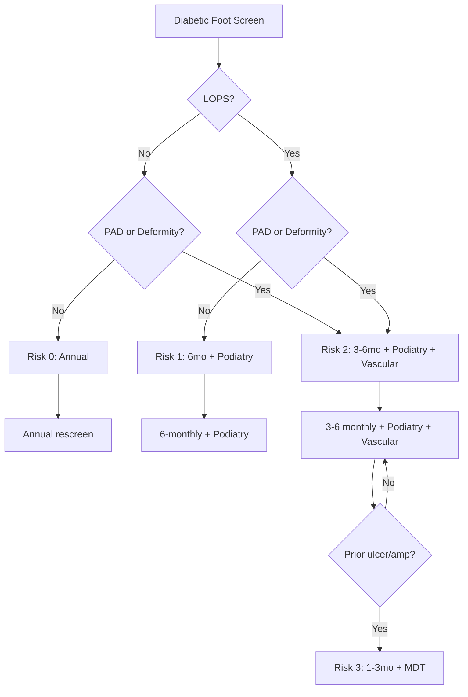

# foot-risk-classification-iwgdf-scottish

---
tags: [medicine, diabetes, davidson, foot-risk-classification-iwgdf-scottish, fcps, mrcp]
davidson_part: Part 3: Clinical Medicine
davidson_chapter: Chapter 25: Endocrinology and Diabetes
status: full-fcps-mrcp-note
priority: HIGH
exam_relevance: "FCPS/MRCP High Yield - Core diabetes topic"
see_also: ["Foot risk classification (IWGDF/Scottish)"]
created: 2026-06-13
modified: 2026-06-13
---

# Foot risk classification (IWGDF/Scottish)

## 1. Learning Objectives
By the end of this note you should be able to:
- [ ] Apply IWGDF/Scottish foot risk classification (0-3) for screening and referral
- [ ] Identify LOPS (loss of protective sensation) and PAD as risk multipliers
- [ ] Set screening intervals by risk category
- [ ] Coordinate referral to podiatry/MDT foot clinic

## 2. Definition & Epidemiology
| Feature | Detail |
|--------|--------|
| **Purpose** | Stratify diabetic patients by foot ulcer/amputation risk |
| **Tools** | 10g monofilament (LOPS), vibration (128Hz), pedal pulses, ABI, deformity inspection |
| **Outcome** | Risk 0-3 drives screening interval and referral pathway |
| **Evidence** | Risk stratification reduces amputations 50-80% with MDT care |

## 3. Clinical Features / Presentation
(N/A - risk classification based on examination findings)

## 4. Classification / Staging / Grading

### IWGDF / Scottish Foot Risk Classification

| Risk | Criteria | Screening Interval | Referral |
|------|----------|-------------------|----------|
| **0 (Low)** | **No LOPS, no PAD, no deformity** | **Annual** | None (routine care) |
| **1 (Moderate)** | **LOPS only** (cannot feel 10g monofilament at >=1 site) | **6-monthly** | Podiatry |
| **2 (High)** | **LOPS + PAD and/or deformity** | **3-6 monthly** | Podiatry + Vascular if PAD |
| **3 (Very High/Active)** | **Prior ulcer or amputation** | **1-3 monthly** | **MDT Foot Clinic** |

> **LOPS** = Loss of Protective Sensation: cannot feel 10g monofilament at >=1 of 6 sites
> **PAD** = Peripheral Arterial Disease: absent pedal pulses OR ABI <0.9
> **Deformity** = Prominent metatarsal heads, claw/hammer toes, Charcot, limited joint mobility, bony prominences

### Risk Factor Definitions
| Factor | Definition |
|--------|------------|
| **LOPS** | Miss >=1 site with 10g monofilament (6 sites/foot) |
| **PAD** | Absent DP/PT pulses OR ABI <0.9 OR TBI <0.7 |
| **Deformity** | Claw/hammer toes, prominent met heads, Charcot, limited joint mobility, bony prominences |
| **Prior ulcer** | History of full-thickness skin break below ankle |
| **Prior amputation** | Any level below knee |

## 5. Diagnosis & Investigations
| Examination | Method | Risk Contribution |
|-------------|--------|-------------------|
| **10g monofilament** | 6 sites/foot | LOPS = miss >=1 site |
| **128Hz tuning fork** | Hallux IP, medial malleolus | Confirms neuropathy |
| **Pedal pulses** | DP + PT (both feet) | PAD if absent |
| **ABI / TBI** | ABI <0.9 diagnostic; TBI if ABI >1.4 | Confirms PAD |
| **Deformity inspection** | Visual + palpation | Claw toes, Charcot, limited mobility |

## 6. Differential Diagnosis
(N/A - risk classification based on exam)

## 7. Management

### Screening Pathway by Risk

### Referral Criteria
| Risk | Referral | Timeline |
|------|----------|----------|
| **0** | None | Annual review |
| **1** | Podiatry | 6-monthly |
| **2** | Podiatry + Vascular (if PAD) | 3-6 monthly |
| **3** | **MDT Foot Clinic** | **1-3 monthly** |

### Patient Education by Risk
| Risk | Education Focus |
|------|-----------------|
| **0** | Daily foot check, footwear, annual screen |
| **1** | Daily check, emollients, footwear, podiatry 6mo |
| **2** | Daily check, professional nail/skin care, offloading insoles, vascular review |
| **3** | MDT coordination, custom footwear, home monitoring, urgent access |

## 8. FCPS/MRCP High-Yield Summary
| Topic | Key Points |
|-------|------------|
| **Risk 0** | No LOPS, no PAD, no deformity -> Annual |
| **Risk 1** | LOPS only -> 6-monthly + Podiatry |
| **Risk 2** | LOPS + PAD/deformity -> 3-6mo + Podiatry + Vascular |
| **Risk 3** | Prior ulcer/amputation -> **1-3mo + MDT Foot Clinic** |
| **LOPS** | 10g monofilament miss >=1/6 sites |
| **PAD** | Absent pulses OR ABI <0.9 |
| **MDT** | Diabetologist, podiatrist, vascular, orthotist, microbiology, orthopaedics -> **amputations reduced 50-80%** |

## 9. Viva Questions
| Question | Expected Answer |
|----------|-----------------|
| **What is the IWGDF foot risk classification?** | 0: no LOPS/PAD/deformity; 1: LOPS; 2: LOPS+PAD/deformity; 3: prior ulcer/amputation |
| **How do you define LOPS?** | Inability to feel 10g monofilament at >=1 of 6 sites (hallux, 1st/3rd/5th met heads, medial/lateral heel) |
| **What screening interval for Risk 2?** | **3-6 monthly** + podiatry + vascular referral |
| **What defines Risk 3 (very high)?** | **History of prior foot ulcer or amputation** |
| **When do you refer to MDT Foot Clinic?** | **Risk 3 (prior ulcer/amputation)**; also Risk 2 with active concerns |
| **What is the evidence for risk stratification?** | Reduces amputations 50-80% with MDT care |

## 10. Confusions & Mnemonics
| Confusion | Clarification |
|-----------|---------------|
| **Risk 1 = PAD?** | NO - Risk 1 = LOPS only; PAD + LOPS = Risk 2 |
| **All prior ulcers = Risk 3?** | YES - any history of full-thickness ulcer below ankle = Risk 3 |
| **ABI vs pulses for PAD?** | Both used; ABI <0.9 or absent DP/PT pulses = PAD; TBI if calcified vessels |

**Mnemonic: FOOT-RISK-0123**
- **F**oot risk: IWGDF/Scottish 0-3
- **O**verall goal: amputations reduced 50-80% with MDT
- **O**ne LOPS = Risk 1 (6mo screen + podiatry)
- **T**wo = LOPS + PAD/deformity = Risk 2 (3-6mo + podiatry + vascular)
- **R**isk 0 = none of above = annual
- **I**schemia: ABI<0.9 or absent pulses = PAD
- **S**creening intervals: 0=annual, 1=6mo, 2=3-6mo, 3=1-3mo
- **K**now: prior ulcer/amp = Risk 3 = MDT 1-3mo
- **0** = Low risk
- **1** = LOPS only
- **2** = LOPS + PAD/deformity
- **3** = Prior ulcer/amp = Risk 3 = MDT

### Local Navigation
- **Parent Heading**: [[Microvascular Complications/Diabetic foot disease|Microvascular Complications/Diabetic foot disease]]
- **Chapter Map": [[../../Davidson Chapter 25 - Diabetes Hierarchy|Diabetes Hierarchy]]
- **Chapter MOC": [[../../Diabetes MOC|Diabetes MOC]]
- **Drug Reference": [[../../../Clinical Therapeutics and Good Prescribing|Drugs]]
- **Related": [[]]

---
## Tags
#medicine #diabetes #davidson #fcps #mrcp #full-fcps-mrcp-note
