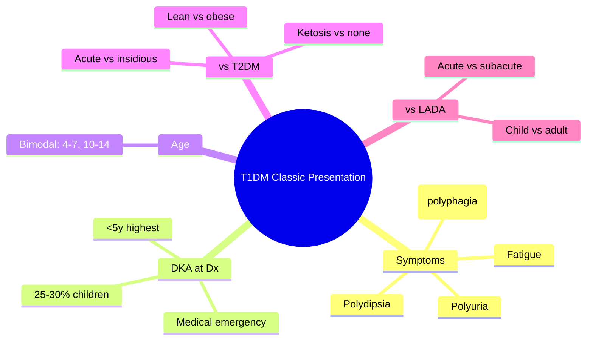

# Classic symptomatic presentation

## 1. Learning Objectives
By the end of this note you should be able to:
- [ ] Describe classic symptomatic presentation of T1DM
- [ ] Recognise DKA at diagnosis (25-30%)
- [ ] Differentiate from T2DM, LADA, stress hyperglycaemia
- [ ] Apply diagnostic criteria in symptomatic patients

---

## 2. Definition & Epidemiology

| Feature | Detail |
|--------|--------|
| **Presentation** | Acute/subacute onset (days-weeks) |
| **DKA at diagnosis** | 25-30% of T1DM children; higher in <5 years |
| **Peak age** | 10-14 years (bimodal: 4-7, 10-14) |
| **Seasonal variation** | Winter peak (viral triggers) |

---

## 3. Clinical Features / Presentation

| Symptom | Frequency | Mechanism |
|---------|-----------|-----------|
| **Polyuria** | 95% | Osmotic diuresis (glucose > renal threshold) |
| **Polydipsia** | 95% | Thirst from dehydration/hyperosmolality |
| **Weight loss** | 80% | Catabolism (lipolysis/proteolysis) despite polyphagia |
| **Fatigue/lethargy** | 70% | Insulin deficiency -> impaired glucose utilisation |
| **Blurred vision** | 30% | Osmotic lens swelling |
| **Abdominal pain** | 40% (if DKA) | Ketosis, gastric stasis |
| **Kussmaul breathing** | DKA only | Respiratory compensation for metabolic acidosis |
| **Ketotic breath** | DKA | Acetone excretion |

> **Red Flags**: Ketosis at presentation -> T1DM/LADA; rapid weight loss + osmotic symptoms in adult -> LADA; pancreatic cancer (new-onset DM >50y + weight loss).

---

## 4. Classification / Staging / Grading

| Feature | T1DM Classic | T2DM | LADA |
|---------|--------------|------|------|
| **Onset** | Acute (days-weeks) | Insidious (months-years) | Subacute |
| **Age** | Peak 10-14y | >40y (usually) | >30y |
| **BMI** | Normal/low | Overweight/obese | Normal/low |
| **Ketosis** | Common (25-30% DKA) | Rare | Uncommon |
| **Autoantibodies** | 2+ (GAD65, IA-2, ZnT8, IAA) | Negative | GAD65+ (often single) |
| **C-peptide** | Low/absent | Normal/high | Low-normal |

---

## 5. Diagnosis & Investigations

| Investigation | T1DM | T2DM | LADA |
|---------------|------|------|------|
| **Autoantibodies** | 2+ positive | Negative | GAD65+ (single often) |
| **C-peptide** | Low/absent | Normal/high | Low-normal |
| **HbA1c** | >48 usually | Variable | Variable |
| **Ketones** | Positive if DKA | Negative | Usually negative |

---

## 6. Differential Diagnosis

| Condition | Distinguishing Features |
|-----------|-------------------------|
| **T2DM** | Insidious, obese, no ketosis, negative autoantibodies |
| **LADA** | Adult, slow progression, GAD65+, initial non-insulin response |
| **Stress hyperglycaemia** | Acute illness, resolves, no prior dysglycaemia |
| **MODY** | <25y, non-obese, strong FH, negative autoantibodies |
| **Pancreatic cancer** | >50y, weight loss, new-onset DM, no autoantibodies |

---

## 7. Management

### Acute (DKA at presentation)
| Step | Action |
|------|--------|
| **1** | ABCDE assessment; IV access; labs (glucose, ketones, VBG, U&E, FBC) |
| **2** | DKA protocol: fluids, FRII 0.1U/kg/hr, K+ replacement, monitor |
| **3** | Once stable: transition to SC insulin (basal-bolus) |

### Chronic (after DKA resolution)
| Component | Detail |
|-----------|--------|
| **Insulin** | Basal-bolus MDI or CSII (see Insulin therapy note) |
| **Education** | Carb counting, sick day rules, hypoglycaemia management |
| **CGM** | Strongly recommended (NICE: all T1DM) |
| **Follow-up** | MDT (diabetologist, educator, dietitian, psychologist) |

---

## 8. FCPS/MRCP High-Yield Summary

| Topic | Key Points |
|-------|------------|
| **Classic triad** | Polyuria, polydipsia, weight loss (despite polyphagia) |
| **DKA at diagnosis** | 25-30% children; <5y highest risk; medical emergency |
| **Symptom duration** | Days to weeks before presentation |
| **Age peak** | 4-7y and 10-14y (bimodal) |
| **vs T2DM** | Acute, lean, ketosis, autoantibodies 2+ |
| **vs LADA** | Acute vs subacute; child/adolescent vs adult |

---

## 9. Viva Questions

| Question | Expected Answer |
|----------|-----------------|
| **What is the classic presentation of T1DM?** | Polyuria, polydipsia, weight loss despite polyphagia, fatigue; duration days-weeks |
| **What percentage present in DKA?** | 25-30% of children; higher in <5 years |
| **How do you differentiate T1DM from T2DM at presentation?** | Acute onset, lean, ketosis/DKA, autoantibodies 2+, low C-peptide |
| **What is the peak age of onset?** | Bimodal: 4-7 years and 10-14 years |
| **What are the osmotic symptoms?** | Polyuria (glucose > renal threshold), polydipsia (dehydration), polyphagia (catabolism) |

---

## 10. Confusions & Mnemonics

| Confusion | Clarification |
|-----------|---------------|
| **Weight loss = T1DM only?** | NO - can occur in uncontrolled T2DM, pancreatic cancer, hyperthyroidism |
| **DKA = T1DM only?** | NO - T2DM can present in DKA (esp. Afro-Caribbean, ketosis-prone T2DM) |

**Mnemonic: T1DM-CLASSIC**
- **T**1DM: acute onset days-weeks
- **1** Osmotic: polyuria, polydipsia
- **D**KA: 25-30% at diagnosis
- **M**ass loss: weight loss despite polyphagia
- **C**lassic: polyuria, polydipsia, weight loss, fatigue
- **L**eading to DKA if missed
- **A**ge peak: 4-7, 10-14 bimodal
- **S**ymptoms: polyuria, polydipsia, weight loss, fatigue
- **S**easonal: winter peak (viral)
- **I**nsulin required immediately
- **C**hild/adolescent peak

---

## 11. Mind Map

---

## 12. One-Page Revision Card

| Domain | Key Points |
|--------|------------|
| **Definition** | Acute onset T1DM: osmotic symptoms + weight loss +/- DKA |
| **Key Test" | Autoantibodies (2+); ketones; VBG if DKA suspected |
| **Classification" | DKA at dx 25-30%; classic osmotic triad |
| **Acute Mgmt" | DKA protocol if ketotic; then basal-bolus insulin |
| **Chronic Mgmt" | Basal-bolus/CSII, carb counting, CGM, education |
| **Key Score" | 2+ autoantibodies; C-peptide low |
| **Complications" | DKA (acute); micro/macrovascular (long-term) |
| **Prognosis" | Lifelong insulin; DKA mortality <1% if treated |

---

## 13. Spaced Repetition Trackers

| Review Interval | Date Completed | Confidence (1-5) | Notes |
|-----------------|----------------|------------------|-------|
| 24 hours | | | |
| 7 days | | | |
| 15 days | | | |
| 30 days | | | |
| 90 days | | | |

---

## 14. Self-Test Scorecard

| Section | Score /5 | Last Attempt |
|---------|----------|--------------|
| Definition & Epidemiology | | |
| Classification & Staging | | |
| Diagnosis & Investigations | | |
| Management (Acute) | | |
| Management (Chronic) | | |
| Complications | | |
| Viva Questions | | |
| DDx Distinctions | | |
| Mnemonics/Algorithms | | |

---

### Local Navigation
- **Parent Heading**: [[../../Type 1 Diabetes Mellitus|Type 1 Diabetes Mellitus]]
- **Chapter Map": [[../../Davidson Chapter 25 - Diabetes Hierarchy|Diabetes Hierarchy]]
- **Chapter MOC": [[../../Diabetes MOC|Diabetes MOC]]
- **Drug Reference": [[../../../Clinical Therapeutics and Good Prescribing|Drugs]]
- **Related": [[Diabetic ketoacidosis (DKA)], [[LADA (Latent Autoimmune Diabetes in Adults)], [[Autoimmune beta-cell destruction]]

---
## Tags
#medicine #diabetes #davidson #fcps #mrcp #full-fcps-mrcp-note
---

> Auto-generated study sections for "Clinical presentation" — Ch 21: Diabetes Mellitus.

## Flashcards (11 generated)

- Q: What is the definition of Clinical presentation?
  A: By the end of this note you should be able to:
- Q: What are the clinical features of Clinical presentation?
  A: Acute/subacute onset (days-weeks)
- Q: What is the investigation of choice for Clinical presentation?
  A: 25-30% of T1DM children; higher in <5 years
- Q: What is Peak age of Clinical presentation?
  A: 10-14 years (bimodal: 4-7, 10-14)
- Q: What is Seasonal variation of Clinical presentation?
  A: Winter peak (viral triggers)
- Q: What is Classic triad of Clinical presentation?
  A: Polyuria, polydipsia, weight loss (despite polyphagia)
- Q: What is the investigation of choice for Clinical presentation?
  A: 25-30% children; <5y highest risk; medical emergency
- Q: What are the clinical features of Clinical presentation?
  A: Days to weeks before presentation
- Q: What is Age peak of Clinical presentation?
  A: 4-7y and 10-14y (bimodal)
- Q: What is vs T2DM of Clinical presentation?
  A: Acute, lean, ketosis, autoantibodies 2+
- Q: What is vs LADA of Clinical presentation?
  A: Acute vs subacute; child/adolescent vs adult

## MCQs (1 generated)

1. **Which of the following best describes Clinical presentation?**
   A. **By the end of this note you should be able to:**
   B. An unrelated condition not matching the clinical picture of Clinical presentation
   C. A complication seen late in the disease course of Clinical presentation
   D. A condition that mimics Clinical presentation but has a different underlying cause

## SBA Questions (1 generated)

1. A patient with suspected Clinical presentation presents with: Presentation — Acute/subacute onset (days-weeks); DKA at diagnosis — 25-30% of T1DM children; higher in <5 years; Peak age — 10-14 years (bimodal: 4-7, 10-14). What is the most likely diagnosis?
   A. **Clinical presentation**
   B. A condition that mimics Clinical presentation but is not the same entity
   C. A complication of Clinical presentation rather than the primary diagnosis
   D. An unrelated condition in the same clinical category as Clinical presentation

