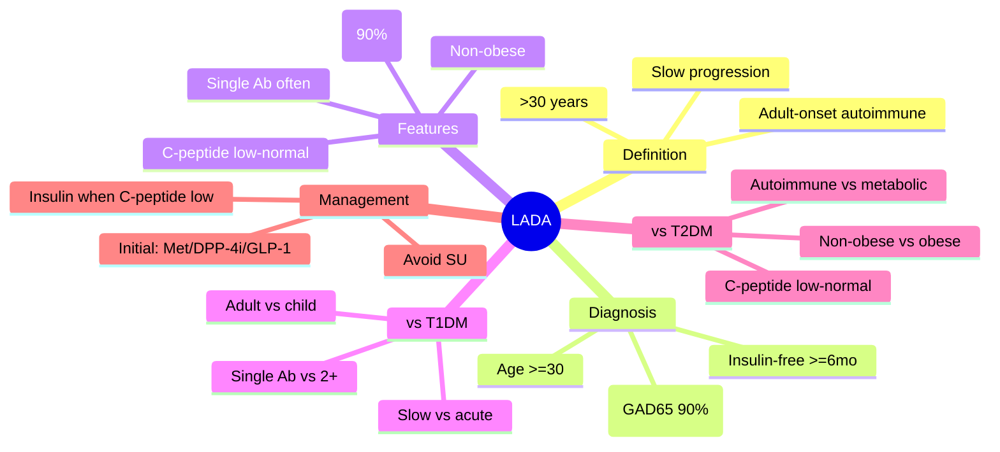

# LADA (Latent Autoimmune Diabetes in Adults)

## 1. Learning Objectives
By the end of this note you should be able to:
- [ ] Define LADA and distinguish from T1DM and T2DM
- [ ] Apply diagnostic criteria (age, autoantibodies, progression)
- [ ] Manage initial non-insulin phase and insulin transition
- [ ] Recognise LADA vs T2DM vs classic T1DM

---

## 2. Definition & Epidemiology

| Feature | Detail |
|--------|--------|
| **Definition** | Latent Autoimmune Diabetes in Adults: adult-onset autoimmune diabetes with slow progression |
| **Age at onset** | >30 years (peak 40-60) |
| **Prevalence** | 2-12% of adult-onset diabetes; ~50% of non-obese T2DM |
| **Autoantibodies** | GAD65+ (90%); IA-2, ZnT8, IAA less common |
| **Progression** | Slow: insulin required at ~3-7 years (vs months in classic T1DM) |
| **Genetics** | HLA-DR3/DR4 (like T1DM); TCF7L2 (like T2DM) - hybrid |

---

## 3. Clinical Features / Presentation

| Feature | LADA | Classic T1DM | T2DM |
|---------|------|--------------|------|
| **Age** | >30y (peak 40-60) | Peak 10-14y | >40y |
| **BMI** | Normal/low | Normal/low | Overweight/obese |
| **Onset** | Subacute (months-years) | Acute (days-weeks) | Insidious (years) |
| **Autoantibodies** | GAD65+ (90%); often single | 2+ (GAD65, IA-2, ZnT8, IAA) | Negative |
| **C-peptide** | Low-normal (preserved initially) | Low/absent | Normal/high |
| **Initial response** | Non-insulin agents work (1-5y) | Insulin required immediately | Non-insulin agents work |
| **DKA at dx** | Rare | Common (25-30%) | Rare |

---

## 3. Clinical Features / Presentation

| Symptom | Frequency | Notes |
|---------|-----------|-------|
| **Osmotic symptoms** | Common | Polyuria, polydipsia, weight loss |
| **Ketosis/DKA** | Rare at diagnosis | Unlike classic T1DM |
| **Misdiagnosis** | Common as T2DM | Due to age, BMI, initial oral agent response |

---

## 4. Classification / Staging / Grading

### Diagnostic Criteria (Immunology of Diabetes Society)
| Criterion | Requirement |
|-----------|-------------|
| **Age** | >=30 years at diagnosis |
| **Autoantibodies** | >=1 islet autoantibody (GAD65, IA-2, ZnT8, IAA) |
| **Insulin independence** | Not insulin-requiring for >=6 months after diagnosis |

### Subtypes
| Type | Autoantibodies | Progression |
|------|----------------|-------------|
| **LADA 1** | Low titre GAD65 only | Slow; T2DM-like |
| **LADA 2** | High titre GAD65 + other Abs | Faster; T1DM-like |

---

## 5. Diagnosis & Investigations

| Test | LADA | T1DM | T2DM |
|------|------|------|------|
| **GAD65** | Positive (90%) | Positive (70-80%) | Negative |
| **IA-2/ZnT8** | Occasionally positive | Often positive | Negative |
| **C-peptide** | Low-normal (preserved initially) | Low/absent | Normal/high |
| **Autoantibodies** | 1+ (GAD65 most common) | 2+ | 0 |
| **HLA** | DR3/DR4 (like T1DM) | DR3/DR4 | DR3/DR4 (variable) |

---

## 6. Differential Diagnosis

| Condition | Distinguishing Features |
|-----------|-------------------------|
| **Classic T1DM** | <30y, acute, DKA common, 2+ Abs, C-peptide low |
| **T2DM** | Obese, insidious, no Abs, C-peptide high, insulin resistance |
| **MODY** | <25y, autosomal dominant FH, non-obese, negative Abs, preserved C-peptide |
| **Type 3c** | Pancreatic disease (pancreatitis, cancer), exocrine insufficiency |

---

## 7. Management

### Initial Phase (non-insulin)
| Agent | Suitability | Notes |
|-------|-------------|-------|
| **Metformin** | Often used | May delay insulin need; weight neutral |
| **DPP-4i** | Can be used | Low hypo risk |
| **GLP-1 RA** | Increasingly used | Weight loss benefit; preserves beta-cell? |
| **SGLT2i** | Used | CV/renal benefit; euglycaemic DKA risk |
| **Sulfonylureas** | Avoid if possible | Accelerates beta-cell exhaustion |
| **TZDs** | Avoid | Fluid retention, fracture risk |

### Insulin Transition
| Trigger | Action |
|---------|--------|
| **HbA1c >58 on oral agents** | Start basal insulin |
| **C-peptide low/undetectable** | Insulin required |
| **Symptomatic hyperglycaemia** | Basal-bolus insulin |
| **Pregnancy** | Insulin immediately |

### Monitoring
| Parameter | Frequency |
|-----------|-----------|
| **HbA1c** | 3-monthly |
| **C-peptide** | Annually (tracks progression) |
| **Autoantibodies** | Not needed to repeat |

---

## 8. FCPS/MRCP High-Yield Summary

| Topic | Key Points |
|-------|------------|
| **Definition** | Adult-onset (>30y) autoimmune diabetes; slow progression |
| **Key feature** | GAD65+ (90%); single Ab often; initial non-insulin response |
| **Diagnosis** | Age >=30, 1+ Ab, insulin-independent >=6 months |
| **vs T1DM** | Adult, slow, no DKA, single Ab, preserved C-peptide |
| **vs T2DM** | Non-obese, GAD65+, C-peptide low-normal, fails oral agents |
| **Management** | Metformin/DPP-4i/GLP-1 RA initially; avoid SU; transition to insulin when C-peptide low or HbA1c uncontrolled |

---

## 9. Viva Questions

| Question | Expected Answer |
|----------|-----------------|
| **What is LADA?** | Latent Autoimmune Diabetes in Adults: autoimmune diabetes onset >30y with slow progression |
| **What are the diagnostic criteria for LADA?** | Age >=30, 1+ islet autoantibody, insulin-independent for >=6 months after diagnosis |
| **How does LADA differ from T1DM?** | Adult onset, slower progression, no DKA at dx, single Ab (GAD65), preserved C-peptide initially |
| **How does LADA differ from T2DM?** | Non-obese, GAD65+, C-peptide low-normal, fails oral agents sooner, autoimmune |
| **What is the initial management of LADA?** | Metformin/DPP-4i/GLP-1 RA; avoid sulfonylureas (accelerate beta-cell failure) |
| **When do you start insulin in LADA?** | HbA1c >58 on orals, low C-peptide, symptomatic, or pregnancy |

---

## 10. Confusions & Mnemonics

| Confusion | Clarification |
|-----------|---------------|
| **LADA = T1DM?** | Subtype of T1DM but distinct clinical entity (adult, slow) |
| **LADA = T2DM?** | Autoimmune (GAD65+); not insulin resistance primary |
| **All GAD65+ = LADA?** | GAD65+ also in classic T1DM; need clinical context |

**Mnemonic: LADA-ADULT**
- **L**ADA: Latent Autoimmune Diabetes in Adults
- **A**ge >=30 at diagnosis
- **D**iabetes: autoimmune (GAD65+ 90%)
- **A**dult onset: >30y, peak 40-60
- **A**utoantibody: GAD65+ (single often); =6 months insulin-free
- **D**istinguish from T2DM: non-obese, GAD65+, C-peptide low-normal
- **U**ps insulin: when C-peptide low or HbA1c uncontrolled
- **L**ow C-peptide: progression marker
- **T**2DM misdiagnosis common initially

---

## 11. Mind Map

---

## 12. One-Page Revision Card

| Domain | Key Points |
|--------|------------|
| **Definition** | Adult-onset (>30y) autoimmune diabetes; 1+ Ab; insulin-free >=6mo |
| **Key Test" | GAD65 (90%); C-peptide (low-normal); autoantibodies |
| **Classification" | LADA 1 (low titre GAD65) vs LADA 2 (high titre + other Abs) |
| **Acute Mgmt" | Rare DKA; usually stable |
| **Chronic Mgmt" | Met/DPP-4i/GLP-1 initially; avoid SU; insulin when C-peptide low |
| **Key Score" | Age >=30 + 1+ Ab + insulin-free >=6mo |
| **Complications" | Same as T1DM once insulin-requiring |
| **Prognosis** | Insulin required at ~3-7 years; then same as T1DM |

---

## 13. Spaced Repetition Trackers

| Review Interval | Date Completed | Confidence (1-5) | Notes |
|-----------------|----------------|------------------|-------|
| 24 hours | | | |
| 7 days | | | |
| 15 days | | | |
| 30 days | | | |
| 90 days | | | |

---

## 14. Self-Test Scorecard

| Section | Score /5 | Last Attempt |
|---------|----------|--------------|
| Definition & Epidemiology | | |
| Classification & Staging | | |
| Diagnosis & Investigations | | |
| Management (Acute) | | |
| Management (Chronic) | | |
| Complications | | |
| Viva Questions | | |
| DDx Distinctions | | |
| Mnemonics/Algorithms | | |

---

### Local Navigation
- **Parent Heading**: [[../../Type 1 Diabetes Mellitus|Type 1 Diabetes Mellitus]]
- **Chapter Map": [[../../Davidson Chapter 25 - Diabetes Hierarchy|Diabetes Hierarchy]]
- **Chapter MOC": [[../../Diabetes MOC|Diabetes MOC]]
- **Drug Reference": [[../../../Clinical Therapeutics and Good Prescribing|Drugs]]
- **Related": [[Classic symptomatic presentation]], [[Diabetic ketoacidosis (DKA)], [[Autoimmune beta-cell destruction]]

---
## Tags
#medicine #diabetes #davidson #fcps #mrcp #full-fcps-mrcp-note