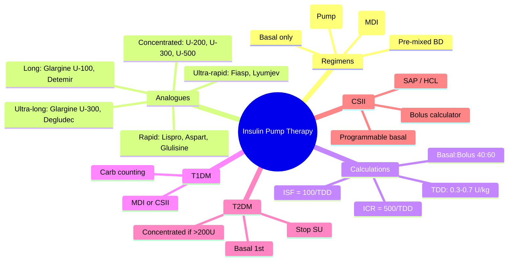

# Insulin pump therapy (CSII)

## 1. Learning Objectives
By the end of this note you should be able to:
- [ ] Indications for CSII/pump therapy in T1DM
- [ ] Pump components: basal rates, bolus calculator, ICR/ISF
- [ ] Automated insulin delivery (AID) systems: hybrid closed-loop
- [ ] Manage pump failure, site issues, DKA risk

---

## 2. Definition & Epidemiology

| Feature | Detail |
|--------|--------|
| **CSII** | Continuous subcutaneous insulin infusion - rapid analogue only |
| **Usage** | ~30-40% T1DM in UK; increasing with AID |
| **Indications (NICE)** | HbA1c>58 on MDI, severe hypo, Dawn phenomenon, pregnancy, lifestyle |

---

## 3. Clinical Features / Presentation
(N/A - therapy)

---

## 4. Classification / Staging / Grading

### Pump Types

| Type | Examples | Features |
|------|----------|----------|
| **Tethered** | Medtronic 780G, Tandem t:slim X2 | Tubing, large reservoir, colour screen |
| **Patch** | Omnipod 5, Accu-Chek Solo | Tubeless, disposable pod, PDA/controller |
| **Closed-loop (AID)** | Algorithm adjusts basal + microbolus | Hybrid: meal announcement; Full: no announcement |

### Commercial Hybrid Closed-Loop Systems

| System | Algorithm | CGM | Pump |
|--------|-----------|-----|------|
| **Medtronic 780G** | SmartGuard | Guardian 4 | 780G |
| **Tandem Control-IQ** | Control-IQ | Dexcom G6/G7 | t:slim X2 |
| **Omnipod 5** | SmartAdjust | Dexcom G6/G7 | Omnipod 5 |
| **CamAPS FX** | CamAPS | Dexcom G6/G7 / Libre 2/3 | Dana-i / YpsoPump |
| **Loop (DIY)** | Loop | Dexcom / Libre | Medtronic / Omnipod / RileyLink |

---

## 5. Diagnosis & Investigations
(N/A)

---

## 6. Differential Diagnosis
(N/A)

---

## 7. Management

### Pump Setup

| Parameter | Typical Setup |
|-----------|---------------|
| **Basal rates** | 24h profile from MDI basal (e.g., 0.5-1.5 U/h); Dawn: +20-30% 3-5am |
| **ICR (Insulin:Carb Ratio)** | 500/TDD = g carb per 1U (e.g., TDD 50 → 10g/U) |
| **ISF (Insulin Sensitivity Factor)** | 100/TDD = mmol/L drop per 1U (e.g., TDD 50 → 2 mmol/L/U) |
| **Target BG** | 5.5-6.5 mmol/L (individualised) |
| **Active insulin time** | 3-5 hours (prevents stacking) |

### Bolus Types

| Type | Use |
|------|-----|
| **Normal** | Standard meal |
| **Extended/Square** | High fat/protein meals (pizza, pasta) - over 2-4h |
| **Dual/Combo** | Mixed meals - immediate + extended |

### Automated Insulin Delivery (AID)

| Feature | Hybrid Closed-Loop | Full Closed-Loop (experimental) |
|---------|-------------------|--------------------------------|
| **Meal announcement** | Required | Not required |
| **Basal adjustment** | Algorithm ± microbolus | Algorithm ± microbolus |
| **Correction bolus** | Auto (some systems) | Auto |
| **Examples** | 780G, Control-IQ, Omnipod 5, CamAPS FX | Research only |

### Troubleshooting

| Issue | Action |
|-------|--------|
| **Occlusion alarm** | Change set + reservoir + insulin; check for DKA if >4h |
| **High BG unexplained** | Check site (lipohypertrophy), insulin expiry, pump settings; give correction via pen |
| **DKA risk** | Pump failure = rapid DKA (no basal depot); check ketones if BG>14 |
| **Lipohypertrophy** | Rotate sites; avoid palpable nodules |

---

## 8. FCPS/MRCP High-Yield Summary

| Topic | Key Points |
|-------|------------|
| **Indications** | HbA1c>58 on MDI, severe hypo, Dawn phenomenon, pregnancy, lifestyle |
| **Basal rates** | 24h profile; Dawn phenomenon: increase 3-5am |
| **ICR/ISF** | ICR=500/TDD; ISF=100/TDD |
| **AID systems** | 780G, Control-IQ, Omnipod 5, CamAPS FX; hybrid = meal announce |
| **DKA risk** | No basal depot; check ketones if BG>14 or unwell |
| **Site rotation** | Prevent lipohypertrophy; avoid nodules |

---

## 9. Viva Questions

| Question | Expected Answer |
|----------|-----------------|
| **What are the indications for insulin pump therapy in T1DM?** | HbA1c>58mmol/mol on MDI, severe hypoglycaemia, Dawn phenomenon, pregnancy, lifestyle flexibility |
| **How do you calculate ICR and ISF?** | ICR = 500/TDD (g carb per 1U); ISF = 100/TDD (mmol/L drop per 1U) |
| **What is the difference between hybrid and full closed-loop?** | Hybrid requires meal announcement; full does not (research only) |
| **What is the DKA risk with pump therapy?** | No basal depot → rapid DKA if occlusion/disconnection; check ketones if BG>14 or unwell |
| **How do you manage an occlusion alarm?** | Change set + reservoir + insulin; give correction via pen if BG high; check ketones |

---

## 10. Confusions & Mnemonics

| Confusion | Clarification |
|-----------|---------------|
| **Pump = no hypos?** | NO - hypos still occur; AID reduces but not eliminates |
| **Basal = background?** | YES - basal = background = long-acting covering hepatic glucose production |
| **Pre-mixed = basal-bolus?** | NO - pre-mixed is fixed ratio (30/70); less flexible; for regular meals only |

**Mnemonic: PUMP-CSII**
- **P**ump: CSII - rapid insulin only
- **U**ltra: AID systems (780G, Control-IQ, Omnipod 5, CamAPS)
- **M**eal: Hybrid = announce; Full = no announce
- **P**arameters: Basal rates, ICR=500/TDD, ISF=100/TDD
- **C**SII: indications HbA1c>58, severe hypo, Dawn, pregnancy
- **S**ite rotation: prevent lipohypertrophy
- **I**nsulin: rapid analogue only (no basal depot)
- **I**nterruption: DKA risk if occlusion/disconnect >4h; check ketones |

---

## 11. Mind Map

---

## 12. One-Page Revision Card

| Domain | Key Points |
|--------|------------|
| **Definition** | CSII: continuous rapid insulin; basal + bolus via pump |
| **Key Test" | SMBG/CGM (pre-meal, bed, 3am, drive); HbA1c 3-6mo; ketones if unwell |
| **Classification" | Rapid (lispro/aspart), ultra-rapid (Fiasp), long (glargine), ultra-long (degludec/U-300), concentrated (U-200/300/500) |
| **Acute Mgmt" | DKA: FRII 0.1U/kg/hr; Hypo: carbs/glucagon/IV dextrose |
| **Chronic Mgmt" | T1DM: MDI/CSII; T2DM: basal → basal-bolus; ICR/ISF; carb counting |
| **Key Score" | ICR=500/TDD; ISF=100/TDD; TDD=0.3-0.7 U/kg |
| **Complications" | Hypoglycaemia, weight gain, lipohypertrophy, allergy |
| **Prognosis" | T1DM: lifelong; T2DM: progressive; CSII/HCL improves control/hypo |

---

## 13. Spaced Repetition Trackers

| Review Interval | Date Completed | Confidence (1-5) | Notes |
|-----------------|----------------|------------------|-------|
| 24 hours | | | |
| 7 days | | | |
| 15 days | | | |
| 30 days | | | |
| 90 days | | | |

---

## 14. Self-Test Scorecard

| Section | Score /5 | Last Attempt |
|---------|----------|--------------|
| Definition & Epidemiology | | |
| Classification & Staging | | |
| Diagnosis & Investigations | | |
| Management (Acute) | | |
| Management (Chronic) | | |
| Complications | | |
| Viva Questions | | |
| DDx Distinctions | | |
| Mnemonics/Algorithms | | |

---

### Local Navigation
- **Parent Heading": [[../Type 1 Diabetes Mellitus/Insulin therapy|Insulin therapy]]
- **Chapter Map": [[../../Davidson Chapter 25 - Diabetes Hierarchy|Diabetes Hierarchy]]
- **Chapter MOC": [[../../Diabetes MOC|Diabetes MOC]]
- **Drug Reference": [[../../../Clinical Therapeutics and Good Prescribing|Drugs]]
- **Related": [[Basal-bolus regimen]], [[Insulin analogues (rapid, long-acting, ultra-long)]], [[Carbohydrate counting and dose adjustment]], [[Insulin therapy in type 2 diabetes]]

---
## Tags
#medicine #diabetes #davidson #fcps #mrcp #full-fcps-mrcp-note