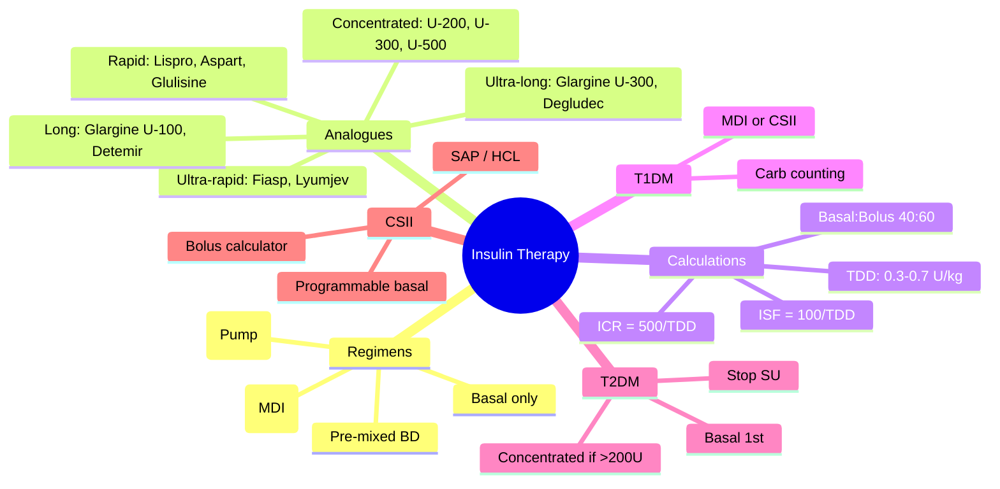

# Insulin Therapy

> [!info]
> **Insulin therapy: essential for all T1DM; progressive in T2DM** — **Basal-bolus (MDI)** standard: basal 40–50% TDD (glargine/degludec) + bolus 50–60% TDD (rapid analogues); **CSII/pump** if HbA1c>58 on MDI, severe hypo, Dawn phenomenon; **Carb counting** (ICR/ISF); **Analogues**: rapid (lispro/aspart/glulisine), long (glargine U-100/U-300, degludec), ultra-rapid (Fiasp/Lyumjev); **Concentrated**: U-200 degludec, U-300 glargine, U-500 regular.

---

## 1. Learning Objectives
- [ ] Construct basal-bolus regimen (basal 40–50%, bolus 50–60% TDD)
- [ ] Select insulin analogues by onset/peak/duration profile
- [ ] Calculate ICR (insulin-to-carb ratio) and ISF (insulin sensitivity factor)
- [ ] Apply CSII/pump indications and settings (basal rates, bolus wizard)
- [ ] Manage concentrated insulins (U-200/300/500) and transition in T2DM

---

## 2. Definition & Epidemiology

| Feature | Detail |
|---------|--------|
| **Definition** | Exogenous insulin replacement for absolute (T1DM) or relative (T2DM) insulin deficiency |
| **T1DM** | 100% require insulin from diagnosis; basal-bolus (MDI) or CSII |
| **T2DM** | ~30% eventually require insulin; progressive β-cell failure; start when HbA1c>58 on dual/triple oral |
| **TDD (Total Daily Dose)** | Estimate: 0.3–0.5 U/kg/day (higher in obesity, puberty, pregnancy, steroids) |
| **Basal : Bolus Split** | **Basal 40–50% TDD**, **Bolus 50–60% TDD** (pre-meal + correction) |

---

## 3. Clinical Features / Presentation
(N/A — therapy)

---

## 4. Classification / Staging / Grading

### Insulin Analogues — Pharmacokinetic Profiles

| Type | Agent | Onset | Peak | Duration | Key Features |
|------|-------|-------|------|----------|--------------|
| **Rapid-acting** | Lispro (Humalog), Aspart (Novorapid), Glulisine (Apidra) | 10–15 min | 1–2 h | 3–5 h | Standard pre-meal; inject 0–15 min before eating |
| **Ultra-rapid** | **Fiasp** (faster aspart), **Lyumjev** (faster lispro) | 5–10 min | 30–60 min | 3–5 h | Niacinamide/vit B3 + citrate → faster absorption; inject at meal start or ≤20 min after |
| **Long-acting** | Glargine U-100 (Lantus), Detemir (Levemir) | 1–2 h | Flat (minimal) | 24 h | Glargine U-100: once daily; Detemir: once/twice daily |
| **Ultra-long** | **Glargine U-300** (Toujeo), **Degludec** (Tresiba) | 1–2 h | Flat | **>42 h** (Degludec 42h, U-300 ~36h) | Once daily; flexible timing (±3h degludec); less hypoglycaemia (nocturnal) |
| **Intermediate** | NPH (Humulin I, Insulatard) | 1–2 h | 4–8 h | 12–18 h | Cheap; used in resource-limited; ↑nocturnal hypo |
| **Pre-mixed** | Biphasic 30/70 (30% rapid, 70% intermediate) | As rapid component | Dual | 12–18 h | Fixed ratio; twice daily; regular meals required |
| **Concentrated** | Degludec U-200, Glargine U-300, Regular U-500 | Per base insulin | Per base | Per base | For insulin resistance >200U/day; ↓volume, ↓injection pain |

### Insulin Regimens
| Regimen | Indication | Structure |
|---------|------------|-----------|
| **Basal-bolus (MDI)** | T1DM standard; T2DM on multiple orals | Basal (glargine/degludec) 1–2x daily + Rapid (lispro/aspart) pre-meal ×3–4 |
| **Basal only** | T2DM initiation | Glargine/degludec 10U or 0.1–0.2 U/kg OD; titrate to FPG 4–7 mmol/L |
| **Basal + 1 bolus** | T2DM partial control | Add largest meal bolus |
| **Pre-mixed BD** | T2DM, regular meals, limited monitoring | 0.3–0.5 U/kg BD (2/3 AM, 1/3 PM); fixed ratio |
| **CSII (Pump)** | T1DM: HbA1c>58 on MDI, severe hypo, Dawn phenomenon, pregnancy, lifestyle | Rapid only; programmable basal rates; bolus calculator; suspend on low (SAP) |

---

## 5. Diagnosis & Investigations
| Investigation | Role | Key Details |
|---------------|------|-------------|
| **HbA1c** | Efficacy monitoring | 3-monthly till target, then 6-monthly |
| **SMBG / CGM** | Dose adjustment | Pre-meal, bedtime, 3am (basal check), pre-driving, suspected hypo |
| **C-peptide** | Residual β-cell function | Low = T1DM/insulin-requiring; preserved = T2DM/MODY |
| **Ketones (blood)** | DKA risk / insulin adequacy | >0.6 mmol/L on insulin = inadequate; SGLT2i: euglycaemic DKA risk |
| **Weight** | Insulin-associated gain | Monitor; SGLT2i/GLP-1 RA mitigate |

---

## 6. Differential Diagnosis
| Scenario | Distinguishing Features |
|----------|-------------------------|
| **Insulin resistance vs deficiency** | High TDD (>1U/kg), obesity, acanthosis, cysts → resistance; add SGLT2i/GLP-1 RA/Metformin |
| **Dawn phenomenon** | 3am glucose normal, rising 3–8am; ↑basal rate 3–5am (pump) or switch to ultra-long basal |
| **Somogyi effect** | 3am hypoglycaemia → rebound hyperglycaemia; ↓basal dose |
| **Lipohypertrophy** | Palpable nodules at injection sites; erratic absorption; **rotate sites** |
| **Insulin allergy** | Local (erythema, pruritus) vs systemic (anaphylaxis); human insulin/analogues rare; desensitisation |

---

## 7. Management

### Basal-Bolus (MDI) Construction
| Step | Calculation |
|------|-------------|
| **1. TDD estimate** | 0.3–0.5 U/kg/day (T1DM: 0.5–0.7; T2DM: 0.3–0.5; higher if obese/pubertal/steroids) |
| **2. Basal dose** | 40–50% TDD (e.g., 50U TDD → 20–25U basal) |
| **3. Bolus dose** | 50–60% TDD ÷ 3–4 meals (e.g., 30U bolus → 7–10U per meal) |
| **4. ICR (Insulin:Carb Ratio)** | **500 ÷ TDD** = grams carb per 1U (e.g., 500/50 = 10g/U) |
| **5. ISF (Insulin Sensitivity Factor)** | **100 ÷ TDD** = mmol/L drop per 1U (e.g., 100/50 = 2 mmol/L/U) |
| **6. Pre-meal bolus** | (Carbs ÷ ICR) + (Current BG − Target) ÷ ISF |

### Carbohydrate Counting
| Concept | Detail |
|---------|--------|
| **ICR** | 1 unit rapid insulin per X grams carbohydrate (500/TDD rule) |
| **ISF** | 1 unit rapid insulin drops BG by Y mmol/L (100/TDD rule) |
| **Target pre-meal** | 4–7 mmol/L (individualised) |
| **Correction dose** | (Current BG − Target) ÷ ISF |
| **Bolus timing** | Rapid: 10–15 min before meal; Ultra-rapid: at meal start |

### CSII (Pump) Settings
| Parameter | Typical Starting Point |
|-----------|------------------------|
| **Basal rates** | 24h profile from MDI basal (e.g., 0.5–1.5 U/h); Dawn phenomenon: ↑3–5am |
| **Bolus calculator** | ICR, ISF, target BG, active insulin time (3–5h) |
| **Suspend on low (SAP)** | Threshold 3.9–3.5 mmol/L; suspend 30–120 min |
| **Auto-mode (HCL)** | Algorithm adjusts basal ± micro-bolus; meal announcement needed |

### Concentrated Insulins in T2DM
| Insulin | Concentration | Use Case |
|---------|---------------|----------|
| **Degludec U-200** | 200 U/mL | High dose (>100U/day); ↓volume, less injection pain |
| **Glargine U-300** | 300 U/mL | High dose; flatter profile, ↓nocturnal hypo |
| **Regular U-500** | 500 U/mL | Severe resistance (>200U/day); extended duration (18–24h); U-500 syringe/pen only |

### Transition to Insulin in T2DM
| Trigger | Approach |
|---------|----------|
| **HbA1c >58 on dual/triple** | Basal insulin 10U or 0.1–0.2 U/kg OD; continue Met ± SGLT2i/GLP-1 RA; **stop SU** |
| **Symptomatic hyperglycaemia** | Basal-bolus from outset; TDD 0.3–0.5 U/kg |
| **Pregnancy** | Basal-bolus; tight targets (FPG <5.3, 1h <7.8, 2h <6.4); stop SGLT2i/GLP-1 RA/SU/TZD |
| **CKD G4–5** | Basal insulin ↓dose (25–50%); avoid SGLT2i if eGFR<20; monitor hypoglycaemia |

```mermaid
flowchart TD
    A[Insulin Indicated] --> B{Type?}
    B -->|T1DM| C[Basal-bolus MDI OR CSII]
    B -->|T2DM| D{Trigger}
    D -->|HbA1c>58 on orals| E[Basal insulin 0.1-0.2U/kg OD]
    D -->|Symptomatic| F[Basal-bolus 0.3-0.5U/kg]
    D -->|Pregnancy| G[Basal-bolus + tight targets]
    D -->|CKD G4-5| H[Basal ↓dose 25-50%]
    C --> I[Basal 40-50% (glargine/degludec)]
    C --> J[Bolus 50-60% (rapid/ultra-rapid)]
    C --> K[ICR = 500/TDD, ISF = 100/TDD]
    E --> L[Titrate to FPG 4-7]
    L --> M{Target met?}
    M -->|No| N[Add bolus → basal-bolus]
    M -->|Yes| O[Continue + monitor 3-monthly]
```

---

## 8. FCPS/MRCP High-Yield Summary

| Topic | Key Points |
|-------|------------|
| **TDD estimate** | 0.3–0.5 U/kg/day (T1DM 0.5–0.7; T2DM 0.3–0.5) |
| **Basal:Bolus split** | Basal 40–50% TDD; Bolus 50–60% TDD |
| **ICR** | 500 ÷ TDD = g carb per 1U (e.g., TDD 50 → 10g/U) |
| **ISF** | 100 ÷ TDD = mmol/L drop per 1U (e.g., TDD 50 → 2 mmol/L/U) |
| **Rapid analogues** | Lispro, Aspart, Glulisine — 10–15min onset, 1–2h peak, 3–5h duration |
| **Ultra-rapid** | Fiasp, Lyumjev — 5–10min onset; inject at meal start |
| **Long-acting** | Glargine U-100, Detemir — 24h, once daily |
| **Ultra-long** | Glargine U-300, Degludec — >42h, flexible timing, ↓nocturnal hypo |
| **Concentrated** | Degludec U-200, Glargine U-300, Regular U-500 — for >200U/day |
| **CSII indications** | HbA1c>58 on MDI, severe hypo, Dawn phenomenon, pregnancy, lifestyle |
| **T2DM insulin start** | Basal 0.1–0.2 U/kg; continue Met ± SGLT2i/GLP-1 RA; **stop SU** |
| **Pump (CSII)** | Rapid only; programmable basal; bolus calculator; SAP/HCL |

---

## 9. Viva Questions

| Question | Expected Answer |
|----------|-----------------|
| **How do you calculate TDD for a new T1DM patient?** | 0.5–0.7 U/kg/day; split basal 40–50%, bolus 50–60% |
| **What is the 500 rule and 100 rule?** | **500 ÷ TDD = ICR** (g carb per 1U); **100 ÷ TDD = ISF** (mmol/L drop per 1U) |
| **Difference between glargine U-100 and U-300?** | U-300: 300U/mL, flatter, >36h, ↓nocturnal hypo, ↓injection volume; U-100: 100U/mL, 24h |
| **What are the indications for CSII (pump) in T1DM?** | HbA1c >58mmol/mol (7.5%) on MDI, severe hypoglycaemia, Dawn phenomenon, pregnancy, erratic lifestyle |
| **How do you manage insulin in T2DM starting basal insulin?** | Start 10U or 0.1–0.2 U/kg OD; titrate 2–4U q3–4d to FPG 4–7 mmol/L; **continue Met ± SGLT2i/GLP-1 RA; stop SU** |
| **What are concentrated insulins and when used?** | Degludec U-200, Glargine U-300, Regular U-500; for insulin resistance >200U/day; ↓volume, ↓pain, ↓nocturnal hypo |
| **Difference between Fiasp/Lyumjev and standard rapid analogues?** | Ultra-rapid: onset 5–10min (vs 10–15min); inject at meal start (vs 10–15min before); niacinamide/citrate or treprostinil accelerates absorption |
| **How do you adjust for Dawn phenomenon?** | CSII: ↑basal rate 3–5am; MDI: switch to ultra-long basal (degludec/U-300) or split basal (glargine U-100 50% AM/50% PM) |

---

## 10. Confusions & Mnemonics

| Confusion | Clarification |
|-----------|---------------|
| **Basal = same as background?** | YES — basal = background = long-acting insulin covering hepatic glucose production |
| **All rapid analogues interchangeable?** | Similar profiles; but **ultra-rapid (Fiasp/Lyumjev) ≠ standard** — different timing |
| **Pre-mixed = basal-bolus?** | NO — pre-mixed is fixed ratio (30/70); less flexible; for regular meals only |
| **Insulin dose in CKD?** | **Reduce 25–50%**; ↓clearance; monitor hypoglycaemia; SGLT2i/GLP-1 RA preferred if eGFR allows |

**Mnemonic: INSULIN-BASICS**
- **I**nsulin TDD: 0.3-0.5 U/kg (T2DM), 0.5-0.7 (T1DM)
- **N**PB: Basal 40-50%, Bolus 50-60%
- **S**plit: Basal (glargine/degludec) + Bolus (rapid/ultra-rapid)
- **U**ltra-rapid: Fiasp/Lyumjev (5-10min onset, at meal)
- **L**ong: Glargine U-100/Detemir (24h); Ultra-long: U-300/Degludec (>42h)
- **I**CR = 500/TDD; **ISF** = 100/TDD
- **N**o SU when insulin started in T2DM
- **B**asal only 1st in T2DM → add bolus if needed
- **A**uto-mode (HCL): algorithm adjusts basal
- **S**AP: suspend on low (threshold 3.9)
- **I**CSII indications: HbA1c>58, severe hypo, Dawn, pregnancy
- **C**oncentrated: U-200/U-300/U-500 for >200U/day
- **S**top SU when insulin started

---

## 11. Mind Map



---

## 12. One-Page Revision Card

| Domain | Key Points |
|--------|------------|
| **Definition** | Exogenous insulin for absolute (T1DM) or relative (T2DM) deficiency |
| **Key Test" | SMBG/CGM (pre-meal, bed, 3am, drive); HbA1c 3-6mo; ketones if unwell |
| **Classification" | Rapid (lispro/aspart), ultra-rapid (Fiasp), long (glargine), ultra-long (degludec/U-300), concentrated (U-200/300/500) |
| **Acute Mgmt" | DKA: FRII 0.1U/kg/hr; Hypo: carbs/glucagon/IV dextrose |
| **Chronic Mgmt" | T1DM: MDI/CSII; T2DM: basal → basal-bolus; ICR/ISF; carb counting |
| **Key Score" | ICR=500/TDD; ISF=100/TDD; TDD=0.3-0.7 U/kg |
| **Complications" | Hypoglycaemia, weight gain, lipohypertrophy, allergy |
| **Prognosis" | T1DM: lifelong; T2DM: progressive; CSII/HCL improves control/hypo |

---

## 13. Spaced Repetition Trackers

| Review Interval | Date Completed | Confidence (1-5) | Notes |
|-----------------|----------------|------------------|-------|
| 24 hours | | | |
| 7 days | | | |
| 15 days | | | |
| 30 days | | | |
| 90 days | | | |

---

## 14. Self-Test Scorecard

| Section | Score /5 | Last Attempt |
|---------|----------|--------------|
| Definition & Epidemiology | | |
| Classification & Staging | | |
| Diagnosis & Investigations | | |
| Management (Acute) | | |
| Management (Chronic) | | |
| Complications | | |
| Viva Questions | | |
| DDx Distinctions | | |
| Mnemonics/Algorithms | | |

---

### Local Navigation
- **Parent Heading": [[../../Type 1 Diabetes Mellitus/Insulin therapy|Insulin therapy]]
- **Chapter Map": [[../../../Davidson Chapter 25 - Diabetes Hierarchy|Diabetes Hierarchy]]
- **Chapter MOC": [[../../../Diabetes MOC|Diabetes MOC]]
- **Drug Reference": [[../../../../Clinical Therapeutics and Good Prescribing|Drugs]]
- **Related": [[Basal-bolus regimen]], [[Insulin pump therapy (CSII)]], [[Insulin analogues (rapid, long-acting, ultra-long)]], [[Carbohydrate counting and dose adjustment]], [[Insulin therapy in type 2 diabetes]]

---
## Tags
#medicine #diabetes #davidson #fcps #mrcp #full-fcps-mrcp-note

## PasTest Scenario SBAs (Clinical Vignettes)

> **Auto-generated PasTest/Mediscope-style scenario SBAs** grounded in the authored source. Each scenario tests a real clinical fact (triad, specific sign, contraindication, trial, first-line Rx) extracted from the topic. *Source: Ch 21: Diabetes — Insulin therapy*

**Q1.** What is the most appropriate first-line therapy for Insulin therapy?

  - **A.** Auto-mode
  - **B.** An advanced/surgical therapy reserved for refractory disease
  - **C.** Symptomatic treatment only, no disease-modifying therapy
  - **D.** Empiric broad-spectrum therapy without specific indication

  > **Answer: A** — Auto-mode
  >
  > *Source:* **Auto-mode (HCL)**   Algorithm adjusts basal ± micro-bolus; meal announcement needed  

### Concentrated Insulins in T2DM
---

> Auto-generated study sections for "Type 1 Diabetes Mellitus" — Ch 21: Diabetes Mellitus.

## Flashcards (33 generated)

- Q: What is the definition of Type 1 Diabetes Mellitus?
  A: Exogenous insulin replacement for absolute (T1DM) or relative (T2DM) insulin deficiency
- Q: What is T1DM of Type 1 Diabetes Mellitus?
  A: 100% require insulin from diagnosis; basal-bolus (MDI) or CSII
- Q: What is T2DM of Type 1 Diabetes Mellitus?
  A: ~30% eventually require insulin; progressive β-cell failure; start when HbA1c>58 on dual/triple oral
- Q: What is the dose of Type 1 Diabetes Mellitus?
  A: Estimate: 0.3–0.5 U/kg/day (higher in obesity, puberty, pregnancy, steroids)
- Q: What is Basal : Bolus Split of Type 1 Diabetes Mellitus?
  A: Basal 40–50% TDD, Bolus 50–60% TDD (pre-meal + correction)
- Q: What is ICR of Type 1 Diabetes Mellitus?
  A: 1 unit rapid insulin per X grams carbohydrate (500/TDD rule)
- Q: What is ISF of Type 1 Diabetes Mellitus?
  A: 1 unit rapid insulin drops BG by Y mmol/L (100/TDD rule)
- Q: What is Target pre-meal of Type 1 Diabetes Mellitus?
  A: 4–7 mmol/L (individualised)
- Q: What is the dose of Type 1 Diabetes Mellitus?
  A: (Current BG − Target) ÷ ISF
- Q: What is Bolus timing of Type 1 Diabetes Mellitus?
  A: Rapid: 10–15 min before meal; Ultra-rapid: at meal start
- Q: What is Basal rates of Type 1 Diabetes Mellitus?
  A: 24h profile from MDI basal (e.g., 0.5–1.5 U/h); Dawn phenomenon: ↑3–5am
- Q: What is Bolus calculator of Type 1 Diabetes Mellitus?
  A: ICR, ISF, target BG, active insulin time (3–5h)
- Q: What is Suspend on low (SAP) of Type 1 Diabetes Mellitus?
  A: Threshold 3.9–3.5 mmol/L; suspend 30–120 min
- Q: What is Auto-mode (HCL) of Type 1 Diabetes Mellitus?
  A: Algorithm adjusts basal ± micro-bolus; meal announcement needed
- Q: What is ICR of Type 1 Diabetes Mellitus?
  A: 1 unit rapid insulin per X grams carbohydrate (500/TDD rule)
- Q: What is ISF of Type 1 Diabetes Mellitus?
  A: 1 unit rapid insulin drops BG by Y mmol/L (100/TDD rule)
- Q: What is Target pre-meal of Type 1 Diabetes Mellitus?
  A: 4–7 mmol/L (individualised)
- Q: What is the dose of Type 1 Diabetes Mellitus?
  A: (Current BG − Target) ÷ ISF
- Q: What is Basal rates of Type 1 Diabetes Mellitus?
  A: 24h profile from MDI basal (e.g., 0.5–1.5 U/h); Dawn phenomenon: ↑3–5am
- Q: What is Bolus calculator of Type 1 Diabetes Mellitus?
  A: ICR, ISF, target BG, active insulin time (3–5h)
- Q: What is Suspend on low (SAP) of Type 1 Diabetes Mellitus?
  A: Threshold 3.9–3.5 mmol/L; suspend 30–120 min
- Q: What is TDD estimate of Type 1 Diabetes Mellitus?
  A: 0.3–0.5 U/kg/day (T1DM 0.5–0.7; T2DM 0.3–0.5)
- Q: What is Basal:Bolus split of Type 1 Diabetes Mellitus?
  A: Basal 40–50% TDD; Bolus 50–60% TDD
- Q: What is ICR of Type 1 Diabetes Mellitus?
  A: 500 ÷ TDD = g carb per 1U (e.g., TDD 50 → 10g/U)
- Q: What is ISF of Type 1 Diabetes Mellitus?
  A: 100 ÷ TDD = mmol/L drop per 1U (e.g., TDD 50 → 2 mmol/L/U)
- Q: What is Rapid analogues of Type 1 Diabetes Mellitus?
  A: Lispro, Aspart, Glulisine — 10–15min onset, 1–2h peak, 3–5h duration
- Q: What is Ultra-rapid of Type 1 Diabetes Mellitus?
  A: Fiasp, Lyumjev — 5–10min onset; inject at meal start
- Q: What is Long-acting of Type 1 Diabetes Mellitus?
  A: Glargine U-100, Detemir — 24h, once daily
- Q: What is Ultra-long of Type 1 Diabetes Mellitus?
  A: Glargine U-300, Degludec — >42h, flexible timing, ↓nocturnal hypo
- Q: What is Concentrated of Type 1 Diabetes Mellitus?
  A: Degludec U-200, Glargine U-300, Regular U-500 — for >200U/day
- Q: What is Type 1 Diabetes Mellitus indicated for?
  A: HbA1c>58 on MDI, severe hypo, Dawn phenomenon, pregnancy, lifestyle
- Q: What is T2DM insulin start of Type 1 Diabetes Mellitus?
  A: Basal 0.1–0.2 U/kg; continue Met ± SGLT2i/GLP-1 RA; stop SU
- Q: What is Pump (CSII) of Type 1 Diabetes Mellitus?
  A: Rapid only; programmable basal; bolus calculator; SAP/HCL

## MCQs (1 generated)

1. **Which of the following best describes Type 1 Diabetes Mellitus?**
   A. **Insulin therapy: essential for all T1DM; progressive in T2DM — Basal-bolus (MDI) standard: basal 40–50% TDD (glargine/degludec) + bolus 50–60% TDD (rapid analogues); CSII/pump if HbA1c>58 on MDI, seve**
   B. An unrelated condition not matching the clinical picture of Type 1 Diabetes Mellitus
   C. A complication seen late in the disease course of Type 1 Diabetes Mellitus
   D. A condition that mimics Type 1 Diabetes Mellitus but has a different underlying cause

## SBA Questions (1 generated)

1. A patient with suspected Type 1 Diabetes Mellitus presents with: Definition — Exogenous insulin replacement for absolute (T1DM) or relative (T2DM) insulin deficiency; T1DM — 100% require insulin from diagnosis; basal-bolus (MDI) or CSII; T2DM — ~30% eventually require insulin; progressive β-cell failure; start when HbA1c>58 on dual/triple oral. What is the most likely diagnosis?
   A. **Type 1 Diabetes Mellitus**
   B. A condition that mimics Type 1 Diabetes Mellitus but is not the same entity
   C. A complication of Type 1 Diabetes Mellitus rather than the primary diagnosis
   D. An unrelated condition in the same clinical category as Type 1 Diabetes Mellitus

