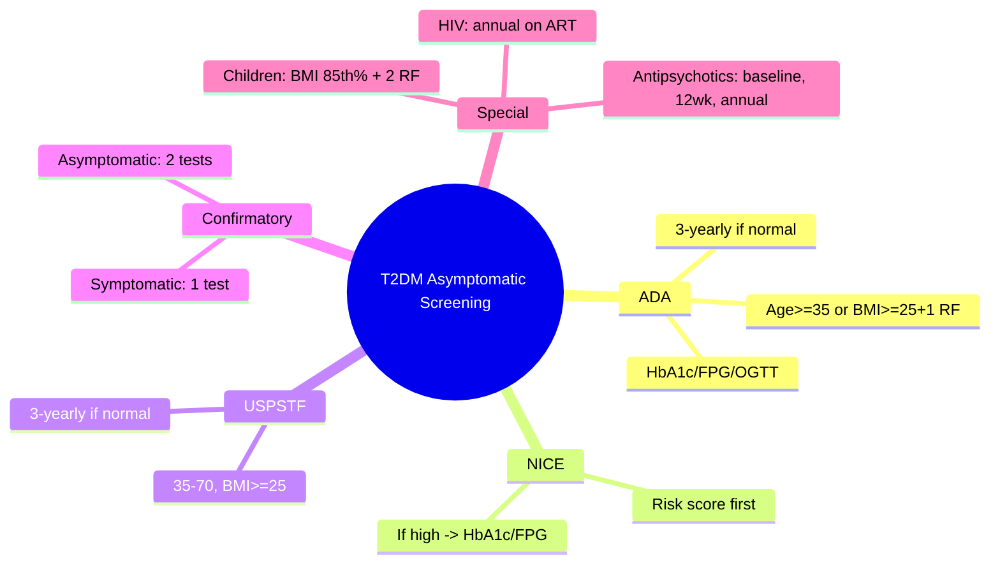

# Asymptomatic screening (ADA, NICE, USPSTF)

## 1. Learning Objectives
By the end of this note you should be able to:
- [ ] Apply ADA, NICE, and USPSTF screening guidelines for T2DM
- [ ] Identify high-risk populations requiring earlier/frequent screening
- [ ] Choose appropriate screening test (HbA1c, FPG, OGTT)
- [ ] Interpret screening results and apply confirmatory testing rules

---

## 2. Definition & Epidemiology

| Feature | Detail |
|--------|--------|
| **Purpose** | Detect asymptomatic T2DM and prediabetes for early intervention |
| **Undiagnosed T2DM** | ~1M in UK; ~8.5M in US; screening reduces complications |
| **Cost-effectiveness** | Screening high-risk adults cost-effective; universal screening debated |

---

## 3. Clinical Features / Presentation
(N/A - asymptomatic screening)

---

## 4. Classification / Staging / Grading

### Screening Guidelines Comparison

| Guideline | Population | Test | Interval | Confirmatory |
|-----------|------------|------|----------|--------------|
| **ADA 2024** | Age >=35 OR BMI >=25 (23 Asian) + >=1 risk factor | HbA1c, FPG, or OGTT | Every 3 years if normal | Repeat abnormal test |
| **NICE NG28** | Risk assessment (Leicester, QDiabetes, etc.) -> if high risk | HbA1c (preferred) or FPG | Per risk score | Repeat HbA1c if 42-47 |
| **USPSTF 2021** | Age 35-70 with BMI >=25 | HbA1c, FPG, or OGTT | Every 3 years if normal | Repeat abnormal test |
| **WHO** | Age >40 or high-risk | FPG preferred | Per programme | Repeat on separate day |

### Risk Factors (ADA)
| Category | Factors |
|----------|---------|
| **Demographic** | Age >=35; first-degree relative T2DM; high-risk ethnicity (South Asian, African-Caribbean, Black African, Chinese) |
| **Anthropometric** | BMI >=25 (>=23 Asian); waist >94cm M / >80cm F |
| **Metabolic** | Hypertension; dyslipidaemia (TG>1.7, HDL<1.0 M/<1.3 F); PCOS; previous GDM; CVD |
| **Lifestyle** | Physical inactivity; smoking |

### Screening in Special Populations
| Population | Recommendation |
|------------|----------------|
| **Children/Adolescents** | BMI >=85th percentile + 2 risk factors (ADA: age >=10 or puberty) |
| **Pregnancy** | Universal (IADPSG) or risk-based (NICE); see GDM note |
| **HIV** | Annual FPG/HbA1c on ART (high risk with PI, age>40, BMI>25) |
| **Antipsychotics** | Baseline + 12 weeks + annually (metabolic monitoring) |

---

## 5. Diagnosis & Investigations
| Test | Advantage | Disadvantage |
|------|-----------|--------------|
| **HbA1c** | No fasting; reflects 3mo; standardised | Falsely low in anaemia/haemoglobinopathy/CKD/pregnancy |
| **FPG** | Simple, cheap | Requires fasting; single timepoint |
| **OGTT** | Gold standard pathophysiology | Inconvenient; poor reproducibility; rarely used for routine screening |

---

## 6. Differential Diagnosis
(N/A - screening context)

---

## 7. Management After Screening

| Result | Action |
|--------|--------|
| **Normal (FPG <6.1, HbA1c <39)** | Routine screening per interval |
| **Prediabetes (IFG 6.1-6.9, IGT 7.8-11.0, HbA1c 39-47)** | Intensive lifestyle (DPP); metformin if high risk (BMI>=35, age<60, GDM hx, rising HbA1c) |
| **Diabetes (FPG>=7.0, HbA1c>=48, 2h-OGTT>=11.1)** | Confirm on separate day (unless symptomatic + random>=11.1); initiate treatment |
| **Discordant results** | Repeat abnormal test; if still discordant -> 3rd test |

---

## 8. FCPS/MRCP High-Yield Summary

| Topic | Key Points |
|-------|------------|
| **ADA** | Age >=35 OR BMI>=25+1 RF; HbA1c/FPG/OGTT; repeat 3y if normal |
| **NICE** | Risk score -> if high risk: HbA1c (preferred) or FPG |
| **USPSTF** | Age 35-70, BMI>=25; HbA1c/FPG/OGTT; repeat 3y |
| **Confirmatory rule** | Asymptomatic: 2 abnormal tests (same test different day, or 2 different tests); Symptomatic + random>=11.1 = single test |
| **Children** | BMI>=85th %ile + 2 RF; age>=10 or puberty |
| **HIV** | Annual on ART |

---

## 9. Viva Questions

| Question | Expected Answer |
|----------|-----------------|
| **What are the ADA screening criteria for T2DM?** | Age >=35 OR BMI>=25 (23 Asian) + >=1 risk factor (FH, high-risk ethnicity, hypertension, dyslipidaemia, PCOS, GDM, CVD, inactivity) |
| **How does NICE screening differ from ADA?** | NICE: validated risk score first -> if high risk then HbA1c/FPG; no universal age cut-off |
| **When do you need a confirmatory test?** | Asymptomatic patient: two abnormal results needed (same test different day, or FPG + HbA1c). Symptomatic + random glucose>=11.1 = single test sufficient. |
| **What are the risk factors for T2DM screening?** | Age>=35, BMI>=25, FH T2DM, high-risk ethnicity (South Asian, African-Caribbean), hypertension, dyslipidaemia, PCOS, previous GDM, CVD |
| **Screening in children?** | BMI>=85th percentile + 2 risk factors; age>=10 or puberty onset |

---

## 10. Confusions & Mnemonics

| Confusion | Clarification |
|-----------|---------------|
| **Screening = diagnosis?** | NO - screening identifies candidates for confirmatory testing |
| **HbA1c always preferred?** | NO - falsely low in anaemia/CKD/pregnancy/haemoglobinopathy; use FPG in these |

**Mnemonic: SCREEN-T2DM**
- **S**creening: ADA age>=35 or BMI>=25+1 RF
- **C**onfirm: asymptomatic = 2 tests; symptomatic = 1 test
- **R**epeat interval: 3 years if normal
- **E**thnicity: South Asian, African-Caribbean, Chinese = high risk
- **E**arly: age 35 (ADA) / risk score (NICE)
- **N**ICE: risk score first
- **T**ests: HbA1c, FPG, OGTT (all acceptable)
- **2** abnormal = diagnosis (asymptomatic)
- **D**iscordant: repeat abnormal test
- **M**etabolic syndrome components = risk factors
- **Undiagnosed**: ~1M UK, ~8.5M US

---

## 11. Mind Map

---

## 12. One-Page Revision Card

| Domain | Key Points |
|--------|------------|
| **Definition** | Detect asymptomatic T2DM/prediabetes in high-risk adults |
| **Key Test" | HbA1c (preferred), FPG, OGTT (all acceptable) |
| **Classification" | Normal <6.1/<39; Prediabetes 6.1-6.9/39-47; DM >=7.0/>=48 |
| **Acute Mgmt" | N/A |
| **Chronic Mgmt" | Normal -> 3y repeat; Prediabetes -> lifestyle; DM -> confirm -> treat |
| **Key Score" | ADA age>=35/BMI>=25+1RF; NICE risk score; confirmatory rule |
| **Complications" | Early detection -> reduced complications |
| **Prognosis" | Early intervention prevents/delays T2DM in prediabetes |

---

## 13. Spaced Repetition Trackers

| Review Interval | Date Completed | Confidence (1-5) | Notes |
|-----------------|----------------|------------------|-------|
| 24 hours | | | |
| 7 days | | | |
| 15 days | | | |
| 30 days | | | |
| 90 days | | | |

---

## 14. Self-Test Scorecard

| Section | Score /5 | Last Attempt |
|---------|----------|--------------|
| Definition & Epidemiology | | |
| Classification & Staging | | |
| Diagnosis & Investigations | | |
| Management (Acute) | | |
| Management (Chronic) | | |
| Complications | | |
| Viva Questions | | |
| DDx Distinctions | | |
| Mnemonics/Algorithms | | |

---

### Local Navigation
- **Parent Heading": [[../../Type 2 Diabetes Mellitus|Type 2 Diabetes Mellitus]]
- **Chapter Map": [[../../Davidson Chapter 25 - Diabetes Hierarchy|Diabetes Hierarchy]]
- **Chapter MOC": [[../../Diabetes MOC|Diabetes MOC]]
- **Drug Reference": [[../../../Clinical Therapeutics and Good Prescribing|Drugs]]
- **Related": [[Symptomatic presentation]], [[Classification and Diagnosis of Diabetes Mellitus]], [[Prediabetic states]]

---
## Tags
#medicine #diabetes #davidson #fcps #mrcp #full-fcps-mrcp-note