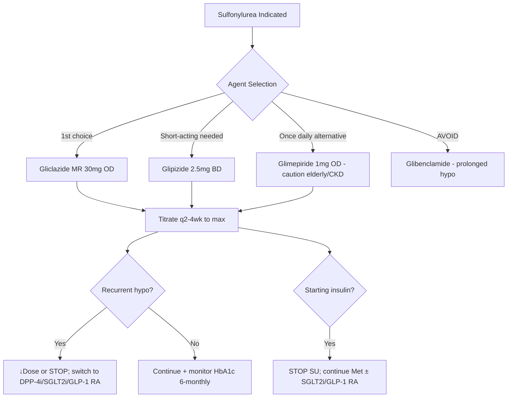
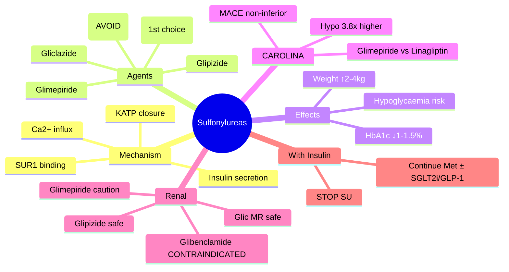

# Sulfonylureas

## 1. Learning Objectives
By the end of this note you should be able to:
- [ ] Classify sulfonylureas by generation and duration
- [ ] Apply renal/hepatic dosing adjustments
- [ ] Recognise hypoglycaemia risk factors and management
- [ ] Apply CAROLINA trial implications (CV neutrality but ↑hypo vs DPP-4i)
- [ ] Choose preferred agent in CKD/elderly (gliclazide MR)

---

## 2. Definition & Epidemiology

| Feature | Detail |
|---------|--------|
| **Drug Class** | Sulfonylureas (insulin secretagogues) |
| **Mechanism** | Bind SUR1 subunit of KATP channel → channel closure → membrane depolarisation → Ca²⁺ influx → insulin exocytosis (glucose-independent at high doses) |
| **Generations** | **1st gen**: tolbutamide, chlorpropamide (long duration, more side effects); **2nd gen**: glibenclamide (glyburide), glipizide, gliclazide, glimepiride (more potent, shorter duration); **3rd gen**: glimepiride |
| **Agents & Doses** | **Gliclazide MR**: 30-120mg OD (max 120mg); **Gliclazide**: 40-320mg BD; **Glimepiride**: 1-6mg OD; **Glipizide**: 2.5-20mg BD; **Glibenclamide**: 2.5-15mg BD (AVOID in elderly/CKD) |
| **HbA1c Reduction** | 1.0-1.5% (11-16 mmol/mol) monotherapy |
| **Weight Change** | +2-4kg (insulin anabolic effect) |

---

## 3. Clinical Features / Presentation
(N/A — drug therapy)

---

## 4. Classification / Staging / Grading

### Agent Comparison

| Agent | Generation | Duration | Dose Range | Renal Adjustment | Key Features |
|-------|------------|----------|------------|------------------|--------------|
| **Gliclazide MR** | 2nd | 24h | 30-120mg OD | **Safe in CKD** (no active metabolites) | Preferred in elderly/CKD; antioxidant; ↓platelet aggregation |
| **Gliclazide** | 2nd | 12-24h | 40-320mg BD | Caution CKD | Standard |
| **Glimepiride** | 3rd | 24h | 1-6mg OD | Use caution (active metabolites) | Once daily; ↑hypo risk in elderly |
| **Glipizide** | 2nd | 12-24h | 2.5-20mg BD | Safe in CKD (inactive metabolites) | Short-acting option |
| **Glibenclamide** | 2nd | 24h+ | 2.5-15mg BD | **AVOID in CKD/elderly** | Prolonged active metabolites → severe/prolonged hypo |

### CAROLINA Trial (Glimepiride vs Linagliptin)

| Outcome | Glimepiride | Linagliptin | HR (95% CI) |
|---------|-------------|-------------|-------------|
| **MACE (CV death/MI/stroke)** | 12.4% | 12.0% | 1.03 (0.90-1.18) — **non-inferior** |
| **Severe hypoglycaemia** | 2.3% | 0.6% | **3.8x higher** |
| **Weight gain** | +1.2kg | –1.0kg | — |
| **Conclusion** | CV neutral vs DPP-4i | But **significantly more hypoglycaemia** | |

---

## 5. Diagnosis & Investigations
| Investigation | Role | Monitoring |
|---------------|------|------------|
| **HbA1c** | Efficacy | 3-monthly till target, then 6-monthly |
| **Glucose (SMBG/CGM)** | Hypoglycaemia detection | Educate on symptoms; CGM if high risk |
| **Renal function (eGFR)** | Dose adjustment | Before initiation, then 6-12 monthly |
| **Weight** | Weight gain tracking | Every visit |

---

## 6. Differential Diagnosis
| Condition | Distinguishing Features |
|-----------|-------------------------|
| **Sulfonylurea-induced hypoglycaemia** | Can occur hours after dose; prolonged (esp glibenclamide, glimepiride); elderly, CKD, missed meals, alcohol, β-blockers mask symptoms |
| **Factitious hypoglycaemia** | Surreptitious SU use; ↑insulin + ↓C-peptide (exogenous insulin) — but SU → ↑insulin + ↑C-peptide; screen urine for SU metabolites |
| **Insulinoma** | Fasting hypo; ↑insulin + ↑C-peptide + ↑proinsulin; CT/MRI pancreas |
| **Post-bariatric hypoglycaemia** | Late dumping (1-3h post-meal); nesidioblastosis; GLP-1 mediated |

---

## 7. Management

### Initiation & Dosing

| Step | Action |
|------|--------|
| **1. Select agent** | **Gliclazide MR** 1st choice (CKD safe, once daily, ↓hypo); Glipizide if short-acting needed; **AVOID glibenclamide** |
| **2. Start low** | Gliclazide MR 30mg OD; Glimepiride 1mg OD; Glipizide 2.5mg BD |
| **3. Titrate** | Increase every 2-4 weeks to max dose or till HbA1c target |
| **4. Combine** | Add to metformin; **avoid triple SU + insulin + DPP-4i** (hypo risk) |

### Hypoglycaemia Prevention

| Risk Factor | Mitigation |
|-------------|------------|
| **Elderly (>75)** | Use gliclazide MR; start 30mg; target HbA1c 58-64; avoid glimepiride/glibenclamide |
| **CKD (eGFR<45)** | **Gliclazide MR** or glipizide only; dose reduce; monitor glucose |
| **Erratic meals** | Educate on regular meals; consider DPP-4i/SGLT2i/GLP-1 RA instead |
| **Alcohol** | Warn on fasting alcohol + SU = severe hypo |
| **β-blockers** | Mask autonomic symptoms; educate on neuroglycopenic signs |

### Switching/Deintensification

| Scenario | Action |
|----------|--------|
| **Recurrent hypoglycaemia** | ↓Dose or stop SU; switch to DPP-4i/SGLT2i/GLP-1 RA |
| **Starting insulin** | **STOP SU** (↓hypo risk); continue metformin ± SGLT2i/GLP-1 RA |
| **Frailty/elderly** | Deintensify: stop SU, relax HbA1c target, simplify regimens |

---

## 8. FCPS/MRCP High-Yield Summary

| Topic | Key Points |
|-------|------------|
| **Mechanism** | Bind SUR1 → close KATP channel → depolarisation → Ca²⁺ influx → insulin secretion (glucose-independent at high doses) |
| **Preferred agent** | **Gliclazide MR**: once daily, CKD safe, ↓hypo vs glimepiride, antioxidant |
| **AVOID** | **Glibenclamide** (prolonged active metabolites → severe/prolonged hypo in elderly/CKD) |
| **Hypoglycaemia risk** | Elderly, CKD, erratic meals, alcohol, β-blockers, high dose, glimepiride/glibenclamide |
| **Weight gain** | +2-4kg (insulin anabolic effect) |
| **CAROLINA trial** | Glimepiride ≈ linagliptin for MACE (non-inferior) but **3.8x more severe hypo**; weight gain vs loss |
| **Renal dosing** | Gliclazide MR/glipizide safe; glimepiride caution; glibenclamide CONTRAINDICATED |
| **With insulin** | **STOP SU** when insulin started (↓hypo risk); continue Met ± SGLT2i/GLP-1 RA |
| **Deintensification** | Stop SU if recurrent hypo, elderly/frail; switch to DPP-4i/SGLT2i/GLP-1 RA |

---

## 9. Viva Questions

| Question | Expected Answer |
|----------|-----------------|
| **What is the mechanism of sulfonylureas?** | Bind SUR1 subunit of KATP channel on pancreatic β-cells → channel closure → membrane depolarisation → voltage-gated Ca²⁺ channel opening → Ca²⁺ influx → insulin exocytosis |
| **Which sulfonylurea is preferred in CKD/elderly?** | **Gliclazide MR** — no active metabolites, once daily, ↓hypoglycaemia risk vs glimepiride, antioxidant properties |
| **Why is glibenclamide avoided in elderly/CKD?** | Prolonged active metabolites excreted renally → accumulation → severe/prolonged hypoglycaemia; higher CV mortality in some studies |
| **What did the CAROLINA trial show?** | Glimepiride non-inferior to linagliptin for MACE (HR 1.03) but **severe hypoglycaemia 3.8x higher** (2.3% vs 0.6%); weight gain +1.2kg vs -1.0kg |
| **How do you manage sulfonylurea-induced hypoglycaemia?** | Acute: 15-20g fast carbs; chronic: ↓dose or stop SU; switch to DPP-4i/SGLT2i/GLP-1 RA; educate on meal regularity, alcohol avoidance |
| **What happens when you start insulin on a sulfonylurea?** | **STOP the sulfonylurea** — combination ↑hypoglycaemia risk; continue metformin ± SGLT2i/GLP-1 RA |
| **Difference between gliclazide MR and standard gliclazide?** | MR: modified release, once daily (30-120mg), smoother profile, ↓hypo; standard: BD dosing (40-320mg BD) |
| **Can sulfonylureas be used in T1DM?** | NO — require functional β-cells; ineffective in absolute insulin deficiency |

---

## 10. Confusions & Mnemonics

| Confusion | Clarification |
|-----------|---------------|
| **Sulfonylureas cause weight loss?** | NO — cause **weight gain 2-4kg** (insulin anabolic) |
| **All sulfonylureas same hypo risk?** | NO — gliclazide MR < glipizide < glimepiride < glibenclamide (highest) |
| **Sulfonylurea + DPP-4i combo?** | Possible but ↑hypo risk vs DPP-4i alone; prefer SGLT2i/GLP-1 RA as add-on |
| **Sulfonylurea + GLP-1 RA?** | Possible but ↑hypo risk; GLP-1 RA preferred over SU as 2nd line after metformin |

**Mnemonic: SU-GLIC-MR**
- **S**ecretagogue: close KATP (SUR1) → insulin release
- **U**p weight: +2-4kg
- **G**liclazide MR: **1st choice** (CKD safe, once daily, ↓hypo)
- **L**ow dose start: Glic MR 30mg, Glime 1mg
- **I**nsulin combo: **STOP SU** when insulin started
- **C**AROLINA: Glimepiride = Lina MACE but **3.8x severe hypo**
- **M**R preferred: once daily, smoother profile
- **R**enal: Glic MR/Glipizide safe; Glime caution; **Glibenclamide AVOID**

---

## 11. Mind Map

---

## 12. One-Page Revision Card

| Domain | Key Points |
|--------|------------|
| **Definition** | Sulfonylureas: gliclazide MR, glimepiride, glipizide, glibenclamide — KATP channel blockers |
| **Key Test" | SMBG for hypoglycaemia; HbA1c 6-monthly; eGFR before initiation |
| **Classification" | 1st gen: tolbutamide; 2nd gen: gliclazide, glipizide, glibenclamide; 3rd gen: glimepiride |
| **Acute Mgmt" | Hypoglycaemia: 15-20g carbs; severe: glucagon/IV dextrose |
| **Chronic Mgmt" | Glic MR 30mg OD → titrate; stop if hypo; STOP when insulin started |
| **Key Score" | CAROLINA: MACE non-inferior but 3.8x severe hypo vs DPP-4i |
| **Complications" | Hypoglycaemia (elderly, CKD, erratic meals), weight gain |
| **Prognosis" | Effective glucose lowering; hypoglycaemia limits use in high-risk |

---

## 13. Spaced Repetition Trackers

| Review Interval | Date Completed | Confidence (1-5) | Notes |
|-----------------|----------------|------------------|-------|
| 24 hours | | | |
| 7 days | | | |
| 15 days | | | |
| 30 days | | | |
| 90 days | | | |

---

## 14. Self-Test Scorecard

| Section | Score /5 | Last Attempt |
|---------|----------|--------------|
| Definition & Epidemiology | | |
| Classification & Staging | | |
| Diagnosis & Investigations | | |
| Management (Acute) | | |
| Management (Chronic) | | |
| Complications | | |
| Viva Questions | | |
| DDx Distinctions | | |
| Mnemonics/Algorithms | | |

---

### Local Navigation
- **Parent Heading**: [[../Type 2 Diabetes Mellitus/Oral glucose-lowering agents|Oral glucose-lowering agents]]
- **Chapter Map": [[../../Davidson Chapter 25 - Diabetes Hierarchy|Diabetes Hierarchy]]
- **Chapter MOC": [[../../Diabetes MOC|Diabetes MOC]]
- **Drug Reference": [[../../../Clinical Therapeutics and Good Prescribing|Drugs]]
- **Related": [[Metformin]], [[DPP-4 inhibitors]], [[Hypoglycaemia classification (level 1/2/3)]]

---
## Tags
#medicine #diabetes #davidson #fcps #mrcp #full-fcps-mrcp-note