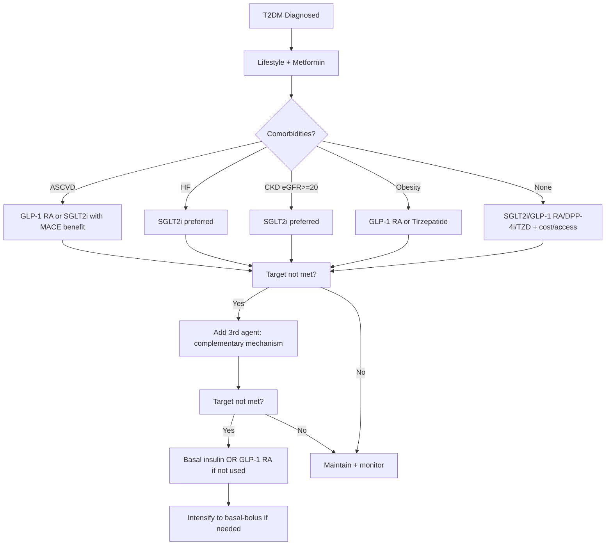

# ADA/EASD 2023+ consensus algorithm

## 1. Learning Objectives
By the end of this note you should be able to:
- [ ] Apply ADA/EASD 2023+ consensus algorithm for T2DM management
- [ ] Select 1st/2nd/3rd line agents based on comorbidities (ASCVD, HF, CKD, obesity)
- [ ] Integrate CVOT evidence (SGLT2i, GLP-1 RA) into treatment decisions
- [ ] Navigate NICE NG28 pathway for UK practice
- [ ] Intensify therapy appropriately (dual -> triple -> insulin)

---

## 2. Definition & Epidemiology

| Feature | Detail |
|--------|--------|
| **Guideline** | ADA/EASD Consensus Report 2023 (Diabetes Care, Diabetologia) -- updated annually |
| **Philosophy** | **Person-centred care** -- individualised targets, shared decision-making, comorbidity-driven drug selection |
| **Key Shift** | **Comorbidity-first** -- ASCVD/HF/CKD/obesity determine 1st add-on after metformin, NOT glucose-lowering potency alone |

---

## 3. Clinical Features / Presentation
(N/A -- treatment algorithm applies after diagnosis confirmed)

---

## 4. Classification / Staging / Grading

### ADA/EASD 2023 Algorithm Steps

| Step | Action | Details |
|------|--------|---------|
| **1. Foundation** | Lifestyle + Metformin (if tolerated) | Metformin 1st line unless contraindicated (eGFR<30, intolerance) |
| **2. Comorbidity Assessment** | **ASCVD? HF? CKD? Obesity?** | Drives drug choice -- see Indication Matrix |
| **3. Add-on Therapy** | Based on comorbidity profile | See Indication Matrix below |
| **4. Intensification** | Dual -> Triple -> Insulin | Add agents with complementary mechanisms |
| **5. Deintensification** | If hypoglycaemia, side effects, frailty | Simplify, stop SU/insulin, higher targets |

### Indication Matrix (Comorbidity-First)

| Comorbidity | Preferred 1st Add-on | Alternative | Evidence |
|-------------|---------------------|-------------|----------|
| **Established ASCVD** | GLP-1 RA (proven MACE[down]) **OR** SGLT2i (proven MACE[down]) | If both contraindicated: DPP-4i (neutral) | LEADER, SUSTAIN-6, REWIND, EMPA-REG, CANVAS, DECLARE |
| **Heart Failure (HFrEF/HFpEF)** | **SGLT2i** (dapagliflozin, empagliflozin) | GLP-1 RA (less evidence) | DAPA-HF, EMPEROR-Reduced/Preserved, DELIVER |
| **CKD (eGFR >=20)** | **SGLT2i** (dapagliflozin, empagliflozin, canagliflozin) | GLP-1 RA (semaglutide FLOW, liraglutide LEADER renal) | CREDENCE, DAPA-CKD, EMPA-KIDNEY, FLOW |
| **Obesity (BMI >=30/27.5 Asian)** | **GLP-1 RA** (semaglutide 2.4mg, liraglutide 3mg) **OR** Tirzepatide | SGLT2i (modest weight loss) | STEP, SURMOUNT, SURPASS |
| **No High-Risk Comorbidities** | Low hypo risk: SGLT2i, GLP-1 RA, DPP-4i, TZD | Cost/access driven: SU, basal insulin | Individualise |

### CVOT Evidence Summary

| Drug Class | Key Trials | MACE Benefit | HF Benefit | Renal Benefit |
|------------|------------|--------------|------------|---------------|
| **SGLT2i** | EMPA-REG, CANVAS, DECLARE, VERTIS-CV | [check] (empagliflozin, canagliflozin) | [check][check] (all) | [check][check] (CREDENCE, DAPA-CKD, EMPA-KIDNEY) |
| **GLP-1 RA** | LEADER, SUSTAIN-6, REWIND, HARMONY, PIONEER-6, FLOW | [check][check] (liraglutide, semaglutide, dulaglutide, albiglutide) | Neutral (FIGHT) / [up]symptoms HFpEF (STEP-HFpEF) | [check] (semaglutide FLOW, liraglutide LEADER renal) |
| **DPP-4i** | TECOS, SAVOR, EXAMINE, CARMELINA, CAROLINA | [x] (saxagliptin: [up]HF hosp) | Saxagliptin [up]HF hosp | Neutral |
| **TZD** | PROactive (pioglitazone) | [down]Stroke, neutral MACE | [up]HF risk | Neutral |
| **SU** | CAROLINA (linagliptin vs glimepiride) | Neutral/possible harm | [up]HF risk | Neutral |

---

## 5. Diagnosis & Investigations
(N/A -- algorithm applies after diagnosis)

---

## 6. Differential Diagnosis
(N/A)

---

## 7. Management

### Stepwise Algorithm (ADA/EASD 2023)

### Dual Therapy Options (after Metformin)

| If on Metformin + | Add | Rationale |
|-------------------|-----|-----------|
| **SGLT2i** | GLP-1 RA | Complementary: SGLT2i (renal/HF) + GLP-1 (weight/CV) |
| **GLP-1 RA** | SGLT2i | Same as above |
| **DPP-4i** | SGLT2i or GLP-1 RA | Upgrade to CV/renal benefit agent |
| **SU** | SGLT2i or GLP-1 RA | [down]Hypo risk, CV benefit |
| **TZD** | SGLT2i | Mitigate fluid retention |

### Triple Therapy

| Combination | Use Case |
|-------------|----------|
| **Met + SGLT2i + GLP-1 RA** | Ideal for ASCVD/HF/CKD/Obesity -- maximal CV/renal/weight benefit |
| **Met + SGLT2i + DPP-4i** | If GLP-1 RA not tolerated/contraindicated |
| **Met + GLP-1 RA + Basal insulin** | If HbA1c >58 on dual; convert to basal-bolus if needed |

### Insulin Initiation

| Trigger | Approach |
|---------|----------|
| **HbA1c >58 (7.5%) on dual/triple** | Basal insulin 0.1-0.2 U/kg or 10U OD; continue Met [plus/minus] SGLT2i/GLP-1 RA; **stop SU** |
| **Symptomatic hyperglycaemia** | Basal-bolus from outset |
| **Pregnancy/pre-conception** | Insulin preferred; stop SGLT2i/GLP-1 RA/TZD/SU |
| **CKD G4-5** | Basal insulin ([down]dose 25-50%); avoid SGLT2i if eGFR<20 |

---

## 8. FCPS/MRCP High-Yield Summary

| Topic | Key Points |
|-------|------------|
| **Step 1** | Lifestyle + Metformin (unless contraindicated) |
| **Step 2** | **Assess comorbidities** -- ASCVD/HF/CKD/Obesity drive choice |
| **ASCVD** | GLP-1 RA (liraglutide, semaglutide, dulaglutide) **OR** SGLT2i (empagliflozin, canagliflozin, dapagliflozin) |
| **HF** | SGLT2i 1st line (dapagliflozin, empagliflozin) -- all HF types |
| **CKD** | SGLT2i 1st line (dapa [ge]25, empa [ge]20, cana [ge]30) -- continue to dialysis |
| **Obesity** | GLP-1 RA (semaglutide 2.4mg, liraglutide 3mg) **OR** Tirzepatide 15mg |
| **No comorbidity** | SGLT2i/GLP-1 RA/DPP-4i/TZD -- consider cost, access, patient preference |
| **Triple therapy** | Met + SGLT2i + GLP-1 RA = optimal CV/renal/weight combo |
| **Insulin start** | Basal 0.1-0.2 U/kg; continue Met [plus/minus] SGLT2i/GLP-1 RA; **stop SU** |
| **NICE NG28** | Met -> dual (add SGLT2i if ASCVD/HF/CKD) -> triple -> insulin; GLP-1 RA if BMI[ge]35 |

---

## 9. Viva Questions

| Question | Expected Answer |
|----------|-----------------|
| **What is the 1st line therapy for T2DM per ADA/EASD 2023?** | Lifestyle + Metformin (if tolerated, eGFR[ge]30) |
| **How do comorbidities change 2nd line choice?** | ASCVD -> GLP-1 RA or SGLT2i; HF -> SGLT2i; CKD -> SGLT2i; Obesity -> GLP-1 RA or Tirzepatide |
| **Which SGLT2i have proven CV benefit?** | Empagliflozin (EMPA-REG), Canagliflozin (CANVAS), Dapagliflozin (DECLARE), Ertugliflozin (VERTIS-CV) |
| **Which GLP-1 RA have proven CV benefit?** | Liraglutide (LEADER), Semaglutide SC (SUSTAIN-6), Dulaglutide (REWIND), Albiglutide (HARMONY), Oral semaglutide (PIONEER-6) |
| **What is the preferred agent for HF in diabetes?** | SGLT2i -- dapagliflozin (DAPA-HF, DELIVER), empagliflozin (EMPEROR-Reduced/Preserved) -- benefit across HFrEF/HFpEF |
| **What is the preferred agent for CKD in diabetes?** | SGLT2i -- canagliflozin (CREDENCE), dapagliflozin (DAPA-CKD), empagliflozin (EMPA-KIDNEY) -- eGFR thresholds: initiate [ge]20/30, continue to dialysis |
| **When do you start insulin in T2DM?** | HbA1c >58mmol/mol (7.5%) on dual/triple therapy, symptomatic hyperglycaemia, pregnancy, CKD G4-5 |
| **What is the difference between ADA/EASD and NICE NG28?** | NICE: Met -> Dual (add SGLT2i if ASCVD/HF/CKD) -> Triple -> Insulin; GLP-1 RA only if BMI[ge]35. ADA/EASD: more flexible, comorbidity-first at every step. |

---

## 10. Confusions & Mnemonics

| Confusion | Clarification |
|-----------|---------------|
| **Metformin always 1st line?** | Yes unless contraindicated (eGFR<30, intolerance). In CKD G3b, use with caution (half dose). |
| **SGLT2i vs GLP-1 RA for ASCVD?** | BOTH have MACE benefit; choice depends on HF/CKD/Obesity comorbidities, patient preference, cost |
| **Tirzepatide position?** | Dual GIP/GLP-1; superior weight/HbA1c vs semaglutide; use for obesity + T2DM; CVOT ongoing (SURPASS-CVOT) |
| **SGLT2i in eGFR<20?** | **YES -- continue to dialysis** once initiated; dapa/empa continue <20 |

**Mnemonic: ADA-EASD-3C**
- **A**ssess comorbidities (ASCVD, HF, CKD, Obesity)
- **D**ecide 2nd line by comorbidity
- **A**dd GLP-1 RA/SGLT2i for CV/renal/weight
- **E**vidence-based (CVOTs)
- **A**void SU/TZD if high-risk comorbidities
- **S**tepwise: Met -> Dual -> Triple -> Insulin
- **D**eintensify if hypo/frail
- **3**rd agent: complementary mechanism
- **C**ombination Met+SGLT2i+GLP-1 RA = optimal
- **C**ost/access considered
- **C**ontinue Met + SGLT2i/GLP-1 RA with insulin"""

notes.append(("Type 2 Diabetes Mellitus/Treatment algorithms", "ADA/EASD 2023+ consensus algorithm", "Type 2 Diabetes", ada_algo_content))

# Write the note
for parent, topic, section, content in notes:
    safe_name = topic.lower().replace(' ', '-').replace('(', '').replace(')', '').replace('/', '-').replace('&', 'and').replace(',', '').replace('+', 'plus')
    path = f"/mnt/tb/Medicine/Diabetes/{parent}/{safe_name}.md"
    result = write_file(path=path, content=make_full_note(parent, topic, section, content))
    print(f"Created: {topic} ({result.get('bytes_written', 'error')} bytes)")

print("Algorithm note complete")