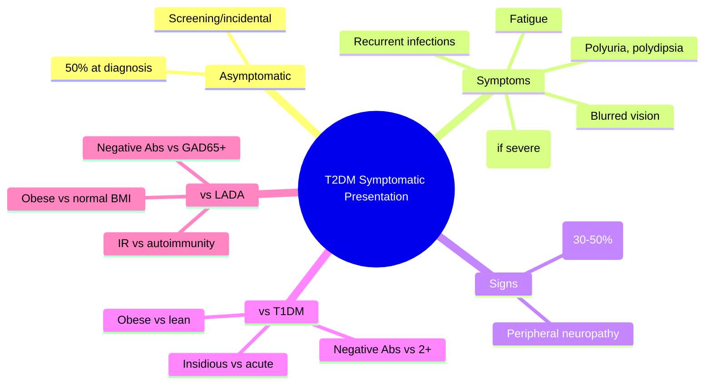

# Symptomatic presentation

## 1. Learning Objectives
By the end of this note you should be able to:
- [ ] Describe classic symptomatic presentation of T2DM
- [ ] Differentiate from T1DM, LADA, stress hyperglycaemia
- [ ] Recognise hyperglycaemic emergencies (DKA, HHS) at presentation
- [ ] Apply diagnostic criteria in symptomatic patients

---

## 2. Definition & Epidemiology

| Feature | Detail |
|--------|--------|
| **Presentation** | Insidious onset (months-years); often asymptomatic at diagnosis |
| **Asymptomatic at Dx** | ~50% detected on screening/incidental finding |
| **Symptomatic** | Osmotic symptoms, weight loss, infections, fatigue |
| **Age at diagnosis** | >40 years (increasing in younger due to obesity) |

---

## 3. Clinical Features / Presentation

| Symptom | Frequency | Mechanism |
|---------|-----------|-----------|
| **Polyuria** | Common if marked hyperglycaemia | Osmotic diuresis |
| **Polydipsia** | Common if marked hyperglycaemia | Dehydration from osmotic diuresis |
| **Weight loss** | Variable | Catabolism if significant insulin deficiency |
| **Fatigue/lethargy** | Common | Impaired glucose utilisation |
| **Blurred vision** | 20-30% | Osmotic lens swelling |
| **Recurrent infections** | Common | Candidiasis, UTIs, skin infections |
| **Acanthosis nigricans** | 30-50% | Insulin resistance marker |
| **Tingling/numbness** | If neuropathy present | Peripheral neuropathy at diagnosis |

> **Red Flags**: Ketosis at presentation -> T1DM/LADA/ketosis-prone T2DM; rapid weight loss + osmotic symptoms in adult -> LADA; new-onset DM >50y + weight loss -> pancreatic cancer.

---

## 4. Classification / Staging / Grading

| Feature | T2DM Classic | T1DM | LADA |
|---------|--------------|------|------|
| **Onset** | Insidious (months-years) | Acute (days-weeks) | Subacute |
| **Age** | >40y (usually) | Peak 10-14y | >30y |
| **BMI** | Overweight/obese | Normal/low | Normal/low |
| **Ketosis** | Rare (unless ketosis-prone) | Common (25-30% DKA) | Uncommon |
| **Autoantibodies** | Negative | 2+ (GAD65, IA-2, ZnT8, IAA) | GAD65+ (often single) |
| **C-peptide** | Normal/high | Low/absent | Low-normal |

---

## 5. Diagnosis & Investigations
| Investigation | T2DM | T1DM | LADA |
|---------------|------|------|------|
| **Autoantibodies** | Negative | 2+ positive | GAD65+ (often single) |
| **C-peptide** | Normal/high | Low/absent | Low-normal |
| **HbA1c** | Variable | >48 usually | Variable |
| **Ketones** | Negative (usually) | Positive if DKA | Usually negative |

---

## 6. Differential Diagnosis

| Condition | Distinguishing Features |
|-----------|-------------------------|
| **T1DM** | Acute, lean, DKA common, 2+ autoantibodies |
| **LADA** | Adult, slow, GAD65+, initial oral response |
| **Stress hyperglycaemia** | Acute illness, resolves, no prior dysglycaemia |
| **MODY** | <25y, non-obese, strong FH, negative autoantibodies |
| **Pancreatic cancer** | >50y, weight loss, new-onset DM, no autoantibodies |

---

## 7. Management

### Acute (if DKA/HHS)
| Emergency | Protocol |
|-----------|----------|
| **DKA** | DKA protocol: fluids, FRII 0.1U/kg/hr, K+, monitor |
| **HHS** | HHS protocol: fluids, lower insulin 0.05U/kg/hr, osmolality monitoring |

### Chronic (after stabilisation)
| Component | Detail |
|-----------|--------|
| **Lifestyle** | MNT, 150min/week exercise, weight loss 5-10% |
| **Metformin** | 1st line unless contraindicated (eGFR<30) |
| **Add-on** | Per ADA/EASD algorithm (SGLT2i/GLP-1 RA for ASCVD/HF/CKD/obesity) |
| **Education** | Self-monitoring, sick day rules, hypoglycaemia awareness |
| **CGM** | Consider if on insulin, hypoglycaemia unawareness |

---

## 8. FCPS/MRCP High-Yield Summary

| Topic | Key Points |
|-------|------------|
| **Onset** | Insidious (months-years); 50% asymptomatic at diagnosis |
| **Classic symptoms** | Polyuria, polydipsia, fatigue, recurrent infections |
| **Weight loss** | Occurs if significant insulin deficiency/catabolism |
| **Acanthosis nigricans** | 30-50%; insulin resistance marker |
| **Asymptomatic diagnosis** | ~50% on screening/incidental |
| **vs T1DM** | Insidious, obese, no ketosis, negative autoantibodies |
| **vs LADA** | Obese, negative autoantibodies, insulin resistance primary |

---

## 9. Viva Questions

| Question | Expected Answer |
|----------|-----------------|
| **What is the typical presentation of T2DM?** | Insidious onset; often asymptomatic; if symptomatic: polyuria, polydipsia, fatigue, recurrent infections |
| **What percentage are asymptomatic at diagnosis?** | ~50% detected on screening/incidental finding |
| **How does T2DM differ from T1DM at presentation?** | Insidious vs acute; obese vs lean; no ketosis vs DKA common; negative vs 2+ autoantibodies |
| **What is acanthosis nigricans and its significance?** | Velvety hyperpigmentation (axilla, neck); marker of insulin resistance |
| **Can T2DM present in DKA?** | Rare; ketosis-prone T2DM (Afro-Caribbean); usually HHS if emergency |

---

## 10. Confusions & Mnemonics

| Confusion | Clarification |
|-----------|---------------|
| **T2DM always asymptomatic?** | NO - 50% present with symptoms if hyperglycaemia marked |
| **Weight loss = T1DM?** | NO - can occur in uncontrolled T2DM with significant insulin deficiency |

**Mnemonic: T2DM-INSIDIOUS**
- **T**2DM: insidious onset months-years
- **2** presentations: asymptomatic (50%) or symptomatic
- **D**ysglycaemia: slow progression
- **M**etabolic: insulin resistance + beta-cell failure
- **I**nsidious: no acute crisis usually
- **D**iagnosis: often screening/incidental
- **I**nfections: recurrent (candidiasis, UTI)
- **O**besity: overweight/obese usual
- **U**nrecognized: 50% asymptomatic
- **S**creening: ADA age>=35 + 1 RF

---

## 11. Mind Map

---

## 12. One-Page Revision Card

| Domain | Key Points |
|--------|------------|
| **Definition** | Insidious onset T2DM; 50% asymptomatic; osmotic symptoms if hyperglycaemic |
| **Key Test" | HbA1c/FPG (screening); autoantibodies (negative) |
| **Classification" | Insidious onset; obese; negative autoantibodies |
| **Acute Mgmt" | HHS if severe; then lifestyle + metformin |
| **Chronic Mgmt" | ADA/EASD algorithm: Met -> SGLT2i/GLP-1 RA per comorbidities |
| **Key Score" | ADA screening age>=35/BMI>=25+1RF |
| **Complications" | Early micro/macrovascular if undiagnosed |
| **Prognosis" | Progressive; early intervention preserves beta-cell function |

---

## 13. Spaced Repetition Trackers

| Review Interval | Date Completed | Confidence (1-5) | Notes |
|-----------------|----------------|------------------|-------|
| 24 hours | | | |
| 7 days | | | |
| 15 days | | | |
| 30 days | | | |
| 90 days | | | |

---

## 14. Self-Test Scorecard

| Section | Score /5 | Last Attempt |
|---------|----------|--------------|
| Definition & Epidemiology | | |
| Classification & Staging | | |
| Diagnosis & Investigations | | |
| Management (Acute) | | |
| Management (Chronic) | | |
| Complications | | |
| Viva Questions | | |
| DDx Distinctions | | |
| Mnemonics/Algorithms | | |

---

### Local Navigation
- **Parent Heading": [[../../Type 2 Diabetes Mellitus|Type 2 Diabetes Mellitus]]
- **Chapter Map": [[../../Davidson Chapter 25 - Diabetes Hierarchy|Diabetes Hierarchy]]
- **Chapter MOC": [[../../Diabetes MOC|Diabetes MOC]]
- **Drug Reference": [[../../../Clinical Therapeutics and Good Prescribing|Drugs]]
- **Related": [[Asymptomatic screening (ADA, NICE, USPSTF)], [[Classification and Diagnosis of Diabetes Mellitus]], [[Type 2 Diabetes Mellitus]]

---
## Tags
#medicine #diabetes #davidson #fcps #mrcp #full-fcps-mrcp-note

## PasTest Scenario SBAs (Clinical Vignettes)

> **Auto-generated PasTest/Mediscope-style scenario SBAs** grounded in the authored source. Each scenario tests a real clinical fact (triad, specific sign, contraindication, trial, first-line Rx) extracted from the topic. *Source: Ch 21: Diabetes — Symptomatic presentation*

**Q1.** What is the most appropriate first-line therapy for Symptomatic presentation?

  - **A.** Add-on
  - **B.** An advanced/surgical therapy reserved for refractory disease
  - **C.** Symptomatic treatment only, no disease-modifying therapy
  - **D.** Empiric broad-spectrum therapy without specific indication

  > **Answer: A** — Add-on
  >
  > *Source:* **Add-on**   Per ADA/EASD algorithm (SGLT2i/GLP-1 RA for ASCVD/HF/CKD/obesity)
---

> Auto-generated study sections for "Clinical presentation and screening" — Ch 21: Diabetes Mellitus.

## Flashcards (9 generated)

- Q: What is the definition of Clinical presentation and screening?
  A: By the end of this note you should be able to:
- Q: What are the clinical features of Clinical presentation and screening?
  A: Insidious onset (months-years); often asymptomatic at diagnosis
- Q: What is the investigation of choice for Clinical presentation and screening?
  A: >40 years (increasing in younger due to obesity)
- Q: What is Onset of Clinical presentation and screening?
  A: Insidious (months-years); 50% asymptomatic at diagnosis
- Q: What are the clinical features of Clinical presentation and screening?
  A: Polyuria, polydipsia, fatigue, recurrent infections
- Q: What is Weight loss of Clinical presentation and screening?
  A: Occurs if significant insulin deficiency/catabolism
- Q: What is Acanthosis nigricans of Clinical presentation and screening?
  A: 30-50%; insulin resistance marker
- Q: What is vs T1DM of Clinical presentation and screening?
  A: Insidious, obese, no ketosis, negative autoantibodies
- Q: What is vs LADA of Clinical presentation and screening?
  A: Obese, negative autoantibodies, insulin resistance primary

## MCQs (1 generated)

1. **Which of the following best describes Clinical presentation and screening?**
   A. **By the end of this note you should be able to:**
   B. An unrelated condition not matching the clinical picture of Clinical presentation and screening
   C. A complication seen late in the disease course of Clinical presentation and screening
   D. A condition that mimics Clinical presentation and screening but has a different underlying cause

## SBA Questions (1 generated)

1. A patient with suspected Clinical presentation and screening presents with: Presentation — Insidious onset (months-years); often asymptomatic at diagnosis; Asymptomatic at Dx — ~50% detected on screening/incidental finding; Symptomatic — Osmotic symptoms, weight loss, infections, fatigue. What is the most likely diagnosis?
   A. **Clinical presentation and screening**
   B. A condition that mimics Clinical presentation and screening but is not the same entity
   C. A complication of Clinical presentation and screening rather than the primary diagnosis
   D. An unrelated condition in the same clinical category as Clinical presentation and screening

