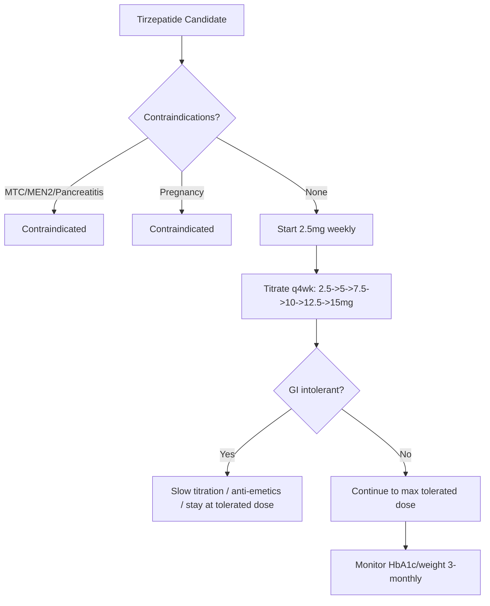
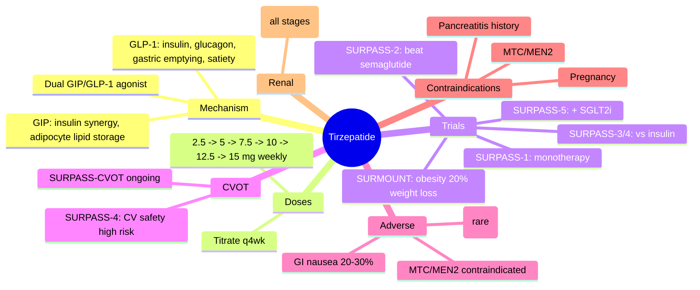

# Dual GIP/GLP-1 receptor agonists (tirzepatide)

## 1. Learning Objectives
By the end of this note you should be able to:
- [ ] Explain tirzepatide mechanism: dual GIP/GLP-1 receptor agonism
- [ ] State SURPASS/SURMOUNT trial efficacy: superior HbA1c/weight loss vs semaglutide
- [ ] Position in ADA/EASD algorithm: obesity + T2DM, after metformin
- [ ] Manage GI side effects (similar to GLP-1 RA)
- [ ] Recognise contraindications: MTC, MEN2, pancreatitis history, pregnancy

---

## 2. Definition & Epidemiology

| Feature | Detail |
|--------|--------|
| **Drug Class** | Dual glucose-dependent insulinotropic polypeptide (GIP) and glucagon-like peptide-1 (GLP-1) receptor agonist |
| **Mechanism** | **Dual agonism**: GIP-R + GLP-1R -> [up]insulin, [down]glucagon, [up]satiety, [down]gastric emptying; **GIP adds**: [up]insulin secretion (synergistic with GLP-1), [up]adipocyte lipid storage, [down]food intake (central) |
| **Agent** | **Tirzepatide** (Mounjaro) -- only dual agonist approved currently |
| **Doses** | 2.5 -> 5 -> 7.5 -> 10 -> 12.5 -> 15 mg SC weekly |
| **HbA1c Reduction** | 1.8-2.5% (20-28 mmol/mol) -- superior to semaglutide 1mg |
| **Weight Loss** | 8-12kg (T2DM); 15-20% body weight (obesity, 15mg) -- superior to semaglutide |
| **Pharmacokinetics** | SC weekly; half-life ~5 days; no renal/hepatic dose adjustment |

---

## 3. Clinical Features / Presentation
(N/A -- drug therapy)

---

## 4. Classification / Staging / Grading

### SURPASS Trials (T2DM)

| Trial | Comparator | HbA1c Reduction | Weight Loss | Key Finding |
|-------|------------|-----------------|-------------|-------------|
| **SURPASS-1** | Placebo | -1.8% (5mg) to -2.1% (15mg) | -7 to -10kg | Monotherapy efficacy |
| **SURPASS-2** | **Semaglutide 1mg** | **Tirzepatide superior**: -2.0% vs -1.9% (NS); weight -11.3kg vs -6.7kg | **Superior weight loss** | **Tirzepatide beats semaglutide** |
| **SURPASS-3** | Insulin degludec | -1.5% to -1.9% vs -1.3% | -10 to -13kg vs +1.5kg | Superior glycaemic/weight |
| **SURPASS-4** | Insulin glargine (high CV risk) | -2.3% (15mg) vs -1.9% | -10.5 to -12.9kg vs +1.6kg | CV safety, weight loss |
| **SURPASS-5** | Add-on to SGLT2i | -1.6% to -2.1% | -8 to -10kg | Effective combo |

### SURMOUNT Trials (Obesity)

| Trial | Population | Weight Loss (15mg) | Key Finding |
|-------|------------|-------------------|-------------|
| **SURMOUNT-1** | Obesity (no T2DM) | **-20.9%** vs -3.1% placebo | **~20% weight loss** |
| **SURMOUNT-2** | T2DM + obesity | **-15.7%** vs -3.3% placebo | Effective in T2DM |
| **SURMOUNT-3/4** | Post lifestyle / maintenance | Sustained loss with continued therapy | Maintenance with continued therapy |

---

## 5. Diagnosis & Investigations
| Investigation | Role | Monitoring |
|---------------|------|------------|
| **HbA1c** | Efficacy | 3-monthly till target, then 6-monthly |
| **Weight** | Obesity benefit | Every visit; target [ge]5% loss |
| **Lipase/amylase** | Pancreatitis suspicion | If severe abdominal pain; **not routine** |
| **Calcitonin / thyroid US** | MTC screening (MEN2) | Contraindicated if personal/family MTC or MEN2 |
| **Renal function** | No dose adjustment needed | Monitor if CKD |

---

## 6. Differential Diagnosis
| Condition | Distinguishing Features |
|-----------|-------------------------|
| **Pancreatitis** | Severe epigastric pain radiating to back, [up]lipase >3xULN; **STOP tirzepatide**; avoid if history |
| **Medullary thyroid cancer (MTC)** | Contraindicated if personal/family MTC or MEN2; rodent C-cell tumours (human relevance uncertain) |
| **Retinopathy** | Rapid HbA1c drop risk; baseline retinal exam if proliferative DR |
| **GI intolerance** | Nausea 20-30%; [up]with rapid titration; manage per protocol |

---

## 7. Management

### Initiation & Titration

| Step | Dose | Duration |
|------|------|----------|
| **1** | 2.5mg weekly | 4 weeks |
| **2** | 5mg weekly | 4 weeks |
| **3** | 7.5mg weekly | 4 weeks |
| **4** | 10mg weekly | 4 weeks |
| **5** | 12.5mg weekly | 4 weeks |
| **6** | 15mg weekly | Maintenance |

> **Titration key**: **Mandatory slow titration** to minimise GI side effects; if intolerant, stay at tolerated dose.

### GI Side Effect Management

| Strategy | Detail |
|----------|--------|
| **Slow titration** | Mandatory -- 4 weeks per step |
| **Take with food** | Not required but may help |
| **Anti-emetics** | Ondansetron/metoclopramide PRN ([down]gastric emptying caution) |
| **Dose reduction** | If intolerant at max dose -- stay at tolerated dose |
| **Split dosing** | Not applicable (weekly only) |

### Special Situations

| Situation | Management |
|-----------|------------|
| **Renal impairment** | No dose adjustment (all stages) |
| **Hepatic impairment** | No dose adjustment (Child-Pugh A/B); avoid C |
| **Pregnancy** | **Contraindicated** (Category C); stop [ge]2mo pre-conception |
| **Pancreatitis history** | **Contraindicated** |
| **MTC/MEN2 family history** | **Contraindicated** |
| **With insulin** | [down]Insulin dose 20-30% to avoid hypo; monitor |
| **Sick-day rules** | Hold if unwell, unable to eat, vomiting |

---

## 8. FCPS/MRCP High-Yield Summary

| Topic | Key Points |
|-------|------------|
| **Mechanism** | **Dual GIP/GLP-1 RA** -> [up]insulin, [down]glucagon, [down]gastric emptying, [up]satiety; **GIP adds**: [up]insulin synergy, [up]adipocyte lipid storage, [down]food intake (central) |
| **Agents** | **Tirzepatide** (Mounjaro) -- only dual agonist approved |
| **Doses** | 2.5 -> 5 -> 7.5 -> 10 -> 12.5 -> 15 mg SC weekly (titrate q4wk) |
| **HbA1c Reduction** | 1.8-2.5% (20-28 mmol/mol) -- **superior to semaglutide 1mg** |
| **Weight Loss** | T2DM: 8-12kg; **Obesity: 15-20% body weight** (SURMOUNT) -- **superior to semaglutide** |
| **CVOT** | **SURPASS-CVOT ongoing**; SURPASS-4: CV safety in high risk |
| **GI SE** | Nausea 20-30%; **slow titration mandatory**; anti-emetics PRN |
| **Pancreatitis** | Rare; **STOP if suspected**; avoid if history |
| **MTC/MEN2** | Contraindicated (rodent C-cell tumours) |
| **Pregnancy** | Contraindicated; stop [ge]2mo pre-conception |
| **Renal/Hepatic** | No dose adjustment |

---

## 9. Viva Questions

| Question | Expected Answer |
|----------|-----------------|
| **What is the mechanism of tirzepatide?** | Dual GIP/GLP-1 receptor agonist -> [up]insulin, [down]glucagon, [down]gastric emptying, [up]satiety; **GIP adds**: [up]insulin synergy, [up]adipocyte lipid storage, [down]food intake (central) |
| **How does tirzepatide compare to semaglutide?** | **SURPASS-2**: Superior HbA1c reduction (-2.0% vs -1.9%) and **superior weight loss** (-11.3kg vs -6.7kg) vs semaglutide 1mg |
| **What is the weight loss with tirzepatide 15mg?** | T2DM: 8-12kg; Obesity (SURMOUNT-1): **~20% body weight loss** (vs ~15% semaglutide 2.4mg) |
| **What is the titration schedule for tirzepatide?** | 2.5mg weekly x4wk -> 5mg x4wk -> 7.5mg x4wk -> 10mg x4wk -> 12.5mg x4wk -> 15mg weekly |
| **What are the contraindications for tirzepatide?** | Personal/family history of **MTC or MEN2**; **pancreatitis history**; **pregnancy** (stop [ge]2mo pre-conception) |
| **How do you manage GI side effects?** | **Slow titration** (mandatory 4wk per step); anti-emetics PRN; if persistent -> stay at tolerated dose |
| **Is tirzepatide safe in renal impairment?** | **No dose adjustment** needed (all stages including dialysis) |
| **What is the CVOT status for tirzepatide?** | **SURPASS-CVOT ongoing**; SURPASS-4: CV safety in high-risk patients |

---

## 10. Confusions & Mnemonics

| Confusion | Clarification |
|-----------|---------------|
| **Tirzepatide = GLP-1 RA?** | NO -- **dual GIP/GLP-1 RA**; GIP adds insulin synergy, adipocyte effects, central satiety |
| **Tirzepatide vs semaglutide efficacy?** | **Tirzepatide 15mg superior** to semaglutide 1mg for both HbA1c and weight (SURPASS-2) |
| **Tirzepatide in T1DM?** | Not approved; no data |
| **Retinopathy risk like semaglutide?** | Limited data; monitor if proliferative DR; rapid HbA1c drop risk factor |

**Mnemonic: TIRZE-TIDE**
- **T**irzepatide: **Dual GIP/GLP-1 RA** (only one)
- **I**nsulin synergy: GIP adds [up]insulin secretion
- **R**educes weight: T2DM -10kg, Obesity **20%** (SURMOUNT)
- **Z**ero renal dose adjust (all stages)
- **E**-fficacy: SURPASS-2 beats semaglutide 1mg (HbA1c/weight)
- **T**itration: 2.5->5->7.5->10->12.5->15mg q4wk
- **I**ntolerant GI: slow titration, anti-emetics, stay at tolerated
- **D**ual agonist: GIP + GLP-1 (not just GLP-1)
- **E**xclude: MTC/MEN2, pancreatitis, pregnancy

---

## 11. Mind Map

---

## 12. One-Page Revision Card

| Domain | Key Points |
|--------|------------|
| **Definition** | Dual GIP/GLP-1 RA: tirzepatide (Mounjaro) -- only dual agonist |
| **Key Test" | HbA1c, weight, lipase if abdominal pain, calcitonin if MTC risk |
| **Classification" | Dual GIP/GLP-1 RA; weekly SC; doses 2.5-15mg |
| **Acute Mgmt" | Pancreatitis: STOP, supportive; Hypoglycaemia (w/ insulin): [down]insulin |
| **Chronic Mgmt" | Titrate q4wk 2.5->15mg; GI SE: slow titration, anti-emetics; sick-day: hold if unwell |
| **Key Score" | SURPASS-2: beats semaglutide 1mg (HbA1c/weight); SURMOUNT: 20% weight loss |
| **Complications" | GI (20-30%), pancreatitis (rare), MTC (contraindicated) |
| **Prognosis" | Superior HbA1c/weight vs semaglutide; CVOT ongoing; renal safe |

---

## 13. Spaced Repetition Trackers

| Review Interval | Date Completed | Confidence (1-5) | Notes |
|-----------------|----------------|------------------|-------|
| 24 hours | | | |
| 7 days | | | |
| 15 days | | | |
| 30 days | | | |
| 90 days | | | |

---

## 14. Self-Test Scorecard

| Section | Score /5 | Last Attempt |
|---------|----------|--------------|
| Definition & Epidemiology | | |
| Classification & Staging | | |
| Diagnosis & Investigations | | |
| Management (Acute) | | |
| Management (Chronic) | | |
| Complications | | |
| Viva Questions | | |
| DDx Distinctions | | |
| Mnemonics/Algorithms | | |

---

### Local Navigation
- **Parent Heading**: [[../../Type 2 Diabetes Mellitus/Injectable non-insulin therapy|Injectable non-insulin therapy]]
- **Chapter Map": [[../../Davidson Chapter 25 - Diabetes Hierarchy|Diabetes Hierarchy]]
- **Chapter MOC": [[../../Diabetes MOC|Diabetes MOC]]
- **Drug Reference": [[../../../Clinical Therapeutics and Good Prescribing|Drugs]]
- **Related": [[GLP-1 receptor agonists]], [[ADA/EASD 2023+ consensus algorithm]], [[Obesity management]]

---
## Tags
#medicine #diabetes #davidson #fcps #mrcp #full-fcps-mrcp-note