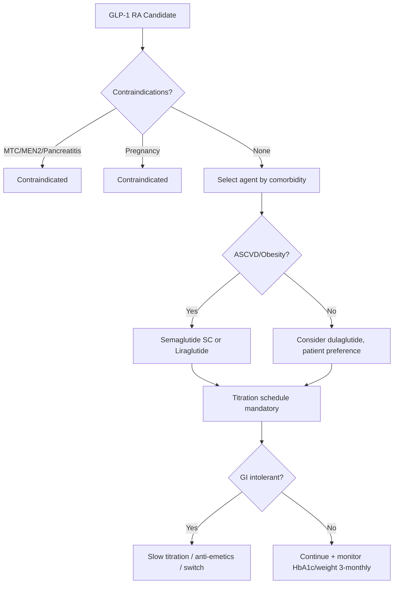

# GLP-1 Receptor Agonists

## 1. Learning Objectives
By the end of this note you should be able to:
- [ ] Classify GLP-1 RAs by dosing frequency and structure
- [ ] State CVOT evidence for each agent (MACE benefit)
- [ ] Apply indication matrix: ASCVD, obesity, CKD, HF
- [ ] Manage GI side effects (titration, dosing timing)
- [ ] Recognise contraindications: MTC, MEN2, pancreatitis history, pregnancy

---

## 2. Definition & Epidemiology

| Feature | Detail |
|--------|--------|
| **Drug Class** | Glucagon-like peptide-1 receptor agonists |
| **Mechanism** | GLP-1R agonism -> [up]glucose-dependent insulin secretion, [down]glucagon secretion, [down]gastric emptying, [up]satiety (hypothalamic), [up][beta]-cell proliferation (preclinical) |
| **Agents & Doses** | **Semaglutide SC**: 0.25->0.5->1.0 mg weekly (Ozempic); **Semaglutide oral**: 3->7->14 mg daily (Rybelsus); **Liraglutide**: 0.6->1.2->1.8 mg daily (Victoza); **Dulaglutide**: 0.75/1.5 mg weekly (Trulicity); **Exenatide XR**: 2mg weekly (Bydureon); **Lixisenatide**: 10->20 mcg daily (Lyxumia) |
| **HbA1c Reduction** | Semaglutide 1.5-2.0%; Liraglutide 1.0-1.5%; Dulaglutide 1.0-1.5% |
| **Weight Loss** | Semaglutide 5-10kg; Liraglutide 3-5kg; Dulaglutide 3-4kg |
| **Pharmacokinetics** | SC: weekly (semaglutide, dulaglutide, exenatide XR) or daily (liraglutide, lixisenatide); Oral: daily, fasting + 30min before food/water |

---

## 3. Clinical Features / Presentation
(N/A -- drug therapy)

---

## 4. Classification / Staging / Grading

### GLP-1 RA Classification

| Agent | Frequency | Structure | Half-life | CVOT (MACE) | Weight Loss | Key Features |
|-------|-----------|-----------|-----------|-------------|-------------|--------------|
| **Semaglutide SC** | Weekly | Human GLP-1 analogue (94% homology) + fatty acid | ~7 days | **SUSTAIN-6** [check] | 5-10kg | Highest efficacy; retinopathy[up] transient |
| **Semaglutide oral** | Daily | Same + SNAC absorption enhancer | ~7 days | **PIONEER-6** [check] | 4-6kg | First oral GLP-1; fasting administration |
| **Liraglutide** | Daily | Human GLP-1 analogue (97% homology) + fatty acid | ~13h | **LEADER** [check] | 3-5kg | Daily injection; 3mg (Saxenda) for obesity |
| **Dulaglutide** | Weekly | Fc-GLP-1 fusion protein | ~5 days | **REWIND** [check] | 3-4kg | 50% no prior ASCVD; renal benefit |
| **Exenatide XR** | Weekly | Exendin-4 (Gila monster) + microspheres | ~17 days | EXSCEL (neutral) | 2-3kg | Nodules at injection site |
| **Lixisenatide** | Daily | Exendin-4 analogue | ~3h | ELIXA (neutral) | 2-3kg | Post-prandial focus; short half-life |

### Indications by Comorbidity

| Indication | Preferred Agent(s) | Evidence |
|------------|-------------------|----------|
| **ASCVD** | Semaglutide SC, Liraglutide, Dulaglutide | SUSTAIN-6, LEADER, REWIND, HARMONY, PIONEER-6 |
| **Obesity (BMI[ge]30/27.5)** | **Semaglutide 2.4mg (Wegovy)**, Liraglutide 3mg (Saxenda) | STEP, SCALE |
| **CKD (eGFR[ge]15)** | Semaglutide (FLOW), Dulaglutide, Liraglutide | FLOW, REWIND renal, LEADER renal |
| **HF** | **Neutral/limited** (FIGHT: liraglutide neutral in HFrEF; STEP-HFpEF: semaglutide improves symptoms) | Not 1st line for HF |
| **No high-risk comorbidity** | Any (consider weight loss need, dosing preference, cost) | -- |

---

## 5. Diagnosis & Investigations

| Investigation | Role | Monitoring |
|---------------|------|------------|
| **HbA1c** | Efficacy | 3-monthly till target, then 6-monthly |
| **Weight** | Obesity benefit | Every visit; target [ge]5% loss |
| **Lipase/amylase** | Pancreatitis suspicion | If severe abdominal pain; **not routine** |
| **Retinal exam** | Semaglutide retinopathy risk | Baseline before semaglutide if proliferative DR; monitor |
| **Calcitonin / thyroid US** | MTC screening (MEN2) | Contraindicated if personal/family MTC or MEN2 |

---

## 6. Differential Diagnosis

| Condition | Distinguishing Features |
|-----------|-------------------------|
| **Pancreatitis** | Severe epigastric pain radiating to back, [up]lipase >3xULN; **STOP GLP-1 RA**; avoid if history |
| **Retinopathy worsening (semaglutide)** | Transient [up]DR progression (SUSTAIN-6: 3.0% vs 1.8%); rapid HbA1c drop >1.5% in 3mo risk factor; baseline retinal exam if proliferative DR |
| **Medullary thyroid cancer (MTC)** | Contraindicated if personal/family MTC or MEN2; rodent C-cell tumours (human relevance uncertain) |
| **Hypoglycaemia** | Rare as monotherapy (glucose-dependent); [up]with insulin/SU -- reduce those doses |
| **GI intolerance** | Nausea 20-30%, vomiting, diarrhoea; [up]with rapid titration; manage per protocol |

---

## 7. Management

### Initiation & Titration

| Agent | Starting Dose | Titration Schedule | Max Dose |
|-------|---------------|-------------------|----------|
| **Semaglutide SC** | 0.25mg weekly x4wk | 0.5mg x4wk -> 1.0mg | 1.0mg (T2DM); 2.4mg (obesity) |
| **Semaglutide oral** | 3mg daily x30d | 7mg x30d -> 14mg | 14mg |
| **Liraglutide** | 0.6mg daily x1wk | 1.2mg x1wk -> 1.8mg | 1.8mg (T2DM); 3.0mg (obesity) |
| **Dulaglutide** | 0.75mg weekly | -> 1.5mg if needed | 1.5mg |
| **Exenatide XR** | 2mg weekly | -- | 2mg |
| **Lixisenatide** | 10mcg daily x14d | -> 20mcg | 20mcg |

> **Titration key**: Semaglutide/liraglutide **must titrate** to minimise GI side effects; dulaglutide less titration needed.

### GI Side Effect Management

| Strategy | Detail |
|----------|--------|
| **Slow titration** | Mandatory for semaglutide/liraglutide |
| **Take with food** | Not required but may help |
| **Anti-emetics** | Ondansetron/metoclopramide PRN ([down]gastric emptying caution) |
| **Dose reduction** | If intolerant at max dose -- stay at tolerated dose |
| **Switch agent** | Dulaglutide/Exenatide XR may be better tolerated |

### Special Situations

| Situation | Management |
|-----------|------------|
| **Renal impairment** | No dose adjustment (all); semaglutide oral: no data eGFR<30 |
| **Hepatic impairment** | No dose adjustment (Child-Pugh A/B); avoid C |
| **Pregnancy** | **Contraindicated** (Category C); stop [ge]2mo pre-conception |
| **Pancreatitis history** | **Contraindicated** |
| **MTC/MEN2 family history** | **Contraindicated** |
| **With insulin** | [down]Insulin dose 20-30% to avoid hypo; monitor |
| **Sick-day rules** | Hold if unwell, unable to eat, vomiting |



---

## 8. FCPS/MRCP High-Yield Summary

| Topic | Key Points |
|-------|------------|
| **Mechanism** | GLP-1R agonism -> [up]glucose-dependent insulin, [down]glucagon, [down]gastric emptying, [up]satiety |
| **CVOT Evidence** | **Semaglutide SC** (SUSTAIN-6), **Liraglutide** (LEADER), **Dulaglutide** (REWIND), **Oral semaglutide** (PIONEER-6), **Albiglutide** (HARMONY) -- **ALL [check] MACE[down]** |
| **Weight loss** | Semaglutide 5-10kg (2.4mg -> 15kg); Liraglutide 3-5kg; Dulaglutide 3-4kg |
| **Indications** | ASCVD -> Semaglutide/Liraglutide/Dulaglutide; Obesity -> Semaglutide 2.4mg/Liraglutide 3mg; CKD -> Semaglutide (FLOW), Dulaglutide, Liraglutide |
| **Gi side effects** | Nausea 20-30%; **slow titration mandatory**; anti-emetics PRN |
| **Pancreatitis** | Rare (~0.1-0.2%); **STOP if suspected**; avoid if history |
| **Retinopathy (semaglutide)** | Transient worsening (SUSTAIN-6: 3.0% vs 1.8%); rapid HbA1c drop >1.5%/3mo risk; baseline retinal exam if proliferative DR |
| **MTC contraindication** | Personal/family MTC or MEN2; rodent C-cell tumours |
| **Pregnancy** | **Contraindicated**; stop [ge]2mo pre-conception |
| **Hypoglycaemia** | Rare monotherapy; [down]insulin/SU dose when combining |

---

## 9. Viva Questions

| Question | Expected Answer |
|----------|-----------------|
| **What is the mechanism of GLP-1 receptor agonists?** | GLP-1R agonism -> [up]glucose-dependent insulin secretion, [down]glucagon secretion, [down]gastric emptying, [up]satiety (hypothalamic), [up][beta]-cell proliferation (preclinical) |
| **Which GLP-1 RAs have proven CV benefit?** | Semaglutide SC (SUSTAIN-6), Liraglutide (LEADER), Dulaglutide (REWIND), Oral semaglutide (PIONEER-6), Albiglutide (HARMONY) -- **all show MACE reduction** |
| **What is the weight loss with semaglutide?** | T2DM dose 1mg: 5-10kg; Obesity dose 2.4mg (Wegovy): ~15kg |
| **How do you manage GI side effects of GLP-1 RAs?** | **Slow titration** (mandatory for semaglutide/liraglutide); anti-emetics PRN; take with food; if persistent -> reduce dose or switch to dulaglutide/exenatide XR |
| **What is the retinopathy risk with semaglutide?** | SUSTAIN-6: 3.0% vs 1.8% placebo; transient worsening; risk with rapid HbA1c drop >1.5%/3mo; **baseline retinal exam if proliferative DR**; monitor |
| **Contraindications for GLP-1 RAs?** | Personal/family **MTC or MEN2**; **pancreatitis history**; **pregnancy** (stop [ge]2mo pre-conception) |
| **How does semaglutide oral differ from SC?** | Daily dosing, fasting + 30min before food/water (SNAC absorption enhancer); lower weight loss (4-6kg vs 5-10kg); same CV benefit (PIONEER-6) |
| **GLP-1 RA in heart failure?** | FIGHT: liraglutide neutral in HFrEF; STEP-HFpEF: semaglutide improves symptoms/QoL in HFpEF; **not 1st line for HF** (SGLT2i preferred) |

---

## 10. Confusions & Mnemonics

| Confusion | Clarification |
|-----------|---------------|
| **GLP-1 RA cause hypoglycaemia?** | NO -- glucose-dependent; only with insulin/SU -> reduce those |
| **All GLP-1 RA same CV benefit?** | Most have MACE[down], but exenatide XR (EXSCEL) and lixisenatide (ELIXA) neutral; semaglutide/liraglutide/dulaglutide preferred for ASCVD |
| **Semaglutide oral vs SC efficacy** | SC > oral for HbA1c/weight; oral = convenience |
| **Retinopathy = permanent damage?** | Transient; stabilises after initial period |

**Mnemonic: GLP1-SEMA-LIRA-DULA**
- **G**LP-1R agonism: [up]insulin, [down]glucagon, [down]gastric emptying, [up]satiety
- **L**oss weight: Sema 5-10kg, Lira 3-5kg, Dula 3-4kg
- **P**ancreatitis risk: rare, STOP if suspected, avoid if history
- **1** (once weekly options: Sema, Dula, Exenatide XR)
- **S**USTAIN-6: Sema CV[check]
- **E**LITE: Lira LEADER CV[check]
- **M**ACE: Dula REWIND CV[check]
- **A**lbiglutide HARMONY CV[check]
- **R**etinopathy: Sema transient worsening (rapid HbA1c drop)
- **E**MTC/MEN2: contraindicated
- **P**regnancy: contraindicated (stop 2mo pre)
- **I**nsulin combo: [down]insulin dose 20-30%
- **D**ulaglutide: weekly Fc-fusion, less GI
- **A**lbiglutide: discontinued but CV[check]**

---

## 11. Mind Map

```mermaid
mindmap
  root((GLP-1 Receptor Agonists))
    Mechanism
      GLP-1R agonism
      Glucose-dependent insulin
      [down]Glucagon, [down]gastric emptying
      [up]Satiety
    Agents
      Semaglutide SC 1mg/wk
      Semaglutide oral 14mg/d
      Liraglutide 1.8mg/d
      Dulaglutide 1.5mg/wk
      Exenatide XR 2mg/wk
      Lixisenatide 20mcg/d
    CVOT Evidence
      SUSTAIN-6 (Sema) [check]
      LEADER (Lira) [check]
      REWIND (Dula) [check]
      PIONEER-6 (Oral Sema) [check]
      EXSCEL (Exenatide) neutral
      ELIXA (Lixi) neutral
    Indications
      ASCVD
      Obesity (Sema 2.4mg, Lira 3mg)
      CKD (FLOW, REWIND renal)
    Side Effects
      GI: nausea 20-30%
      Pancreatitis (rare)
      Retinopathy (Sema transient)
    Contraindications
      MTC/MEN2
      Pancreatitis history
      Pregnancy
```

---

## 12. One-Page Revision Card

| Domain | Key Points |
|--------|------------|
| **Definition** | GLP-1 RAs: semaglutide, liraglutide, dulaglutide, exenatide, lixisenatide |
| **Key Test** | HbA1c, weight, lipase if abdominal pain, retinal exam (semaglutide) |
| **Classification** | Weekly: sema SC, dula, exenatide XR; Daily: lira, lixi, sema oral |
| **Acute Mgmt" | Pancreatitis: STOP, supportive; Hypoglycaemia (w/ insulin): [down]insulin |
| **Chronic Mgmt" | Titration mandatory; monitor weight/HbA1c; sick-day: hold if unwell |
| **Key Score" | ASCVD/Obesity/CKD -> GLP-1 RA 1st/2nd line; CVOT: sema, lira, dula [check] |
| **Complications" | GI (20-30%), pancreatitis (rare), retinopathy (sema), MTC (contraindicated) |
| **Prognosis" | MACE[down] (sema, lira, dula), weight[down][down], CKD benefit (sema, lira, dula) |

---

## 13. Spaced Repetition Trackers

| Review Interval | Date Completed | Confidence (1-5) | Notes |
|-----------------|----------------|------------------|-------|
| 24 hours | | | |
| 7 days | | | |
| 15 days | | | |
| 30 days | | | |
| 90 days | | | |

---

## 14. Self-Test Scorecard

| Section | Score /5 | Last Attempt |
|---------|----------|--------------|
| Definition & Epidemiology | | |
| Classification & Staging | | |
| Diagnosis & Investigations | | |
| Management (Acute) | | |
| Management (Chronic) | | |
| Complications | | |
| Viva Questions | | |
| DDx Distinctions | | |
| Mnemonics/Algorithms | | |

---

### Local Navigation
- **Parent Heading**: [[../Type 2 Diabetes Mellitus/Injectable non-insulin therapy|Injectable non-insulin therapy]]
- **Chapter Map": [[../../Davidson Chapter 25 - Diabetes Hierarchy|Diabetes Hierarchy]]
- **Chapter MOC": [[../../Diabetes MOC|Diabetes MOC]]
- **Drug Reference": [[../../../Clinical Therapeutics and Good Prescribing|Drugs]]
- **Related": [[Dual GIP/GLP-1 receptor agonists (tirzepatide)], [[ADA/EASD 2023+ consensus algorithm]], [[Obesity management]]

---
## Tags
#medicine #diabetes #davidson #fcps #mrcp #full-fcps-mrcp-note