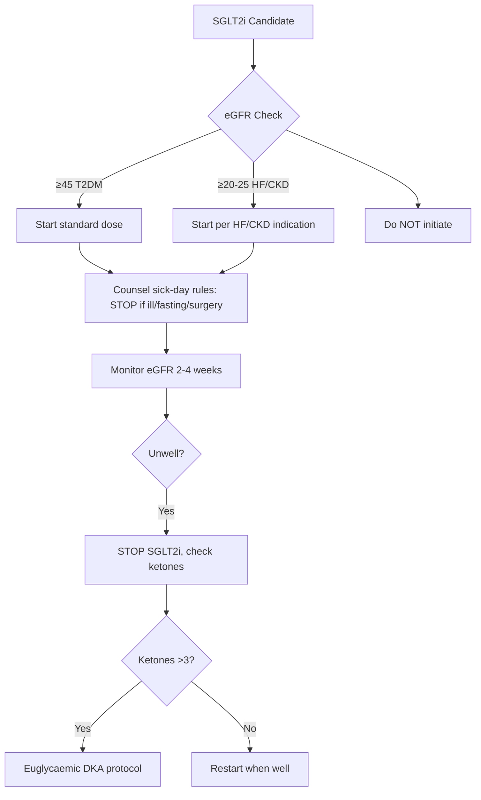
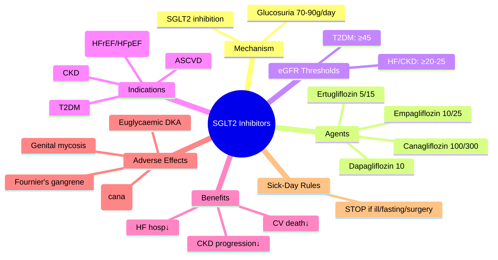

# SGLT2 Inhibitors

> [!info]
> **SGLT2 inhibitors: empagliflozin, dapagliflozin, canagliflozin, ertugliflozin** — ↓renal glucose reabsorption → glucosuria; **proven CV death↓, HF hosp↓, CKD progression↓**; **euglycaemic DKA risk**; **genital mycotic infections**.

---

## 1. Learning Objectives
- [ ] State SGLT2i mechanism, pharmacokinetics, and dosing
- [ ] Apply eGFR-based initiation/continuation thresholds
- [ ] Recognise indications: ASCVD, HF (HFrEF/HFpEF), CKD, T2DM
- [ ] Manage key adverse effects: euglycaemic DKA, genital infections, amputation (canagliflozin), Fournier's gangrene
- [ ] Counsel on sick-day rules (STOP during acute illness)

---

## 2. Definition & Epidemiology

| Feature | Detail |
|---------|--------|
| **Drug Class** | Sodium-glucose co-transporter 2 inhibitors |
| **Mechanism** | Inhibit SGLT2 in proximal tubule (S1 segment) → ↓glucose reabsorption → ↑urinary glucose excretion (~70–90g/day) → ↓plasma glucose, ↓weight, ↓BP, ↓intraglomerular pressure |
| **Agents & Doses** | **Empagliflozin** 10/25mg OD; **Dapagliflozin** 10mg OD; **Canagliflozin** 100/300mg OD; **Ertugliflozin** 5/15mg OD |
| **HbA1c Reduction** | 0.5–1.0% (5–11 mmol/mol) as add-on; weight loss 2–3kg; SBP ↓3–5 mmHg |
| **Pharmacokinetics** | Oral, ~80% bioavailability; hepatic glucuronidation (UGT1A9); renal excretion <2%; t½ 12–17h |

---

## 3. Clinical Features / Presentation
(N/A — drug therapy)

---

## 4. Classification / Staging / Grading

### eGFR Thresholds — **CRITICAL FOR EXAMS**
| Agent | Initiate if eGFR ≥ | Continue if eGFR ≥ | Stop if eGFR < |
|-------|-------------------|-------------------|----------------|
| **Empagliflozin** | 20 (HF/CKD) / 45 (T2DM) | 20 | 20 |
| **Dapagliflozin** | 25 (HF/CKD) / 45 (T2DM) | 15 | 15 |
| **Canagliflozin** | 30 | 30 | 30 |
| **Ertugliflozin** | 45 | 45 | 45 |

> **Key**: HF/CKD indications allow lower eGFR initiation than T2DM-only use. **DAPA-CKD/EMPA-KIDNEY**: continue to dialysis.

### Indications by Comorbidity
| Indication | Preferred Agent(s) | Key Trials |
|------------|-------------------|------------|
| **T2DM + ASCVD** | Empagliflozin, Canagliflozin, Dapagliflozin | EMPA-REG, CANVAS, DECLARE |
| **HFrEF (EF≤40%)** | Dapagliflozin, Empagliflozin | DAPA-HF, EMPEROR-Reduced |
| **HFpEF (EF≥50%)** | Empagliflozin, Dapagliflozin | EMPEROR-Preserved, DELIVER |
| **CKD (eGFR≥20)** | Dapagliflozin, Empagliflozin, Canagliflozin | DAPA-CKD, EMPA-KIDNEY, CREDENCE |
| **T2DM without high-risk comorbidity** | Any (consider cost/access) | — |

---

## 5. Diagnosis & Investigations
| Investigation | Role | Monitoring |
|---------------|------|------------|
| **eGFR (CKD-EPI)** | Dosing/eligibility | Before initiation, 2–4 weeks post, then 3–6 monthly |
| **Ketones (blood)** | Euglycaemic DKA suspicion | If unwell, nausea, abdominal pain — **check ketones even if glucose <13.9** |
| **Genital exam** | Mycotic infections | Clinical review if symptomatic |
| **Foot exam** | Amputation risk (canagliflozin) | Baseline + annual; avoid if active ulcer/PAD |
| **HbA1c** | Efficacy | 3-monthly till target, then 6-monthly |

---

## 6. Differential Diagnosis
| Condition | Distinguishing Features |
|-----------|-------------------------|
| **Euglycaemic DKA** | Glucose <13.9 mmol/L + ketonaemia >3 + pH <7.3; **on SGLT2i**, illness, low carb, surgery, alcohol; STOP SGLT2i, DKA protocol |
| **Genital mycotic infection** | Vulvovaginitis, balanitis; common (10–15%); treat with topical antifungals; consider recurrent = stop |
| **Fournier's gangrene** | Rare (<0.1%); necrotising fasciitis of perineum; **STOP SGLT2i**, urgent surgical debridement, IV antibiotics |
| **Volume depletion** | Hypotension, AKI; elderly, diuretics, low SBP; monitor renal function |
| **Amputation (canagliflozin)** | ↑Toe/midfoot amputation (CANVAS); avoid if active DFU/PAD |

---

## 7. Management

### Initiation & Sick-Day Rules
| Step | Action |
|------|--------|
| **1. Check eligibility** | eGFR per table above; no active DKA, not T1DM, not pregnant |
| **2. Counsel sick-day rules** | **STOP SGLT2i** if: acute illness, fasting, surgery (3 days pre-op), low carb/keto diet, alcohol excess, dehydration |
| **3. Start dose** | Standard dose (no titration needed); take any time with/without food |
| **4. Monitor** | eGFR 2–4 weeks, then 3–6 monthly; ketones if unwell |

### Adverse Effect Management
| Adverse Effect | Management |
|----------------|------------|
| **Genital mycotic infection** | Topical clotrimazole/fluconazole; hygiene; if recurrent → consider stop |
| **UTI** | Standard antibiotics; ↑fluid intake |
| **Volume depletion/hypotension** | ↓diuretic dose; ensure euvolaemia; monitor renal function |
| **Euglycaemic DKA** | **STOP SGLT2i immediately**; standard DKA protocol (fluids, insulin, K+); glucose may be normal — **don't delay insulin** |
| **Fournier's gangrene** | **STOP SGLT2i**; emergency surgical debridement; broad-spectrum IV antibiotics; ICU |

---

## 8. FCPS/MRCP High-Yield Summary

| Topic | Key Points |
|-------|------------|
| **Mechanism** | Inhibit SGLT2 in proximal tubule (S1) → glucosuria ~70–90g/day → ↓glucose, ↓weight, ↓BP, ↓intraglomerular pressure |
| **eGFR thresholds** | **Empa**: initiate ≥45 (T2DM) / ≥20 (HF/CKD); **Dapa**: ≥45/≥25; **Cana**: ≥30; **Ertu**: ≥45 |
| **CV benefit** | **Empa**: EMPA-REG (CV death↓); **Cana**: CANVAS (MACE↓); **Dapa**: DECLARE (HF hosp↓) |
| **HF benefit** | **All HFrEF/HFpEF**: Dapa (DAPA-HF, DELIVER), Empa (EMPEROR-Red/Pres) — **1st line for HF in DM** |
| **CKD benefit** | **Cana** (CREDENCE), **Dapa** (DAPA-CKD), **Empa** (EMPA-KIDNEY) — continue to dialysis |
| **Euglycaemic DKA** | Glucose <13.9 + ketones >3 + pH <7.3; **STOP SGLT2i**, standard DKA Rx; check ketones if unwell |
| **Genital infections** | 10–15% (women > men); topical antifungals; recurrent → stop |
| **Amputation** | **Canagliflozin**: ↑toe/midfoot amputation (CANVAS); avoid if active DFU/PAD |
| **Fournier's gangrene** | Rare (<0.1%); necrotising perineal infection; STOP SGLT2i, surgical emergency |
| **Sick-day rules** | STOP if: illness, fasting, surgery (3d pre), low carb, alcohol, dehydration |

---

## 9. Viva Questions

| Question | Expected Answer |
|----------|-----------------|
| **What is the mechanism of SGLT2 inhibitors?** | Inhibit SGLT2 in proximal tubule (S1) → ↓glucose reabsorption → ↑urinary glucose excretion (~70–90g/day) → ↓plasma glucose, ↓weight, ↓BP, ↓intraglomerular pressure |
| **What are the eGFR thresholds for SGLT2i initiation?** | Empagliflozin: ≥45 (T2DM), ≥20 (HF/CKD); Dapagliflozin: ≥45 (T2DM), ≥25 (HF/CKD); Canagliflozin: ≥30; Ertugliflozin: ≥45 |
| **Which SGLT2i have proven HF benefit?** | **All HFrEF/HFpEF**: Dapagliflozin (DAPA-HF, DELIVER), Empagliflozin (EMPEROR-Reduced, EMPEROR-Preserved) — 1st line for HF in diabetes |
| **Which SGLT2i have proven CKD benefit?** | Canagliflozin (CREDENCE), Dapagliflozin (DAPA-CKD), Empagliflozin (EMPA-KIDNEY) — continue to dialysis |
| **What is euglycaemic DKA and how do you manage it?** | DKA with glucose <13.9 mmol/L; on SGLT2i + precipitant (illness, fasting, surgery, low carb); **STOP SGLT2i**, standard DKA protocol — check ketones even if glucose normal |
| **What are the sick-day rules for SGLT2i?** | **STOP** if: acute illness, fasting, surgery (3 days pre-op), low carbohydrate/ketogenic diet, alcohol excess, dehydration; restart when eating/drinking normally and well |
| **What is the amputation risk with canagliflozin?** | CANVAS trial: ↑toe/midfoot amputation (6.3 vs 3.4/1000 pt-yrs); avoid in active DFU/PAD; monitor feet |
| **How does SGLT2i reduce intraglomerular pressure?** | ↑Tubuloglomerular feedback: ↑distal NaCl delivery → afferent arteriolar vasoconstriction → ↓intraglomerular pressure → ↓hyperfiltration → renal protection |

---

## 10. Confusions & Mnemonics

| Confusion | Clarification |
|-----------|---------------|
| **SGLT2i in T1DM?** | **Contraindicated** — euglycaemic DKA risk high; only in clinical trials with strict monitoring |
| **SGLT2i + insulin?** | Safe; ↓insulin dose often needed (20–30%) to avoid hypoglycaemia |
| **Euglycaemic DKA vs DKA?** | Same ketone/pH criteria; glucose <13.9; **STOP SGLT2i**; don't delay insulin because glucose "not high" |

**Mnemonic: SGLT2-EMPA-CAN-DAPA**
- **S**GLT2 → proximal tubule S1 segment
- **G**lucosuria ~70-90g/day
- **L**owers glucose, weight, BP, intraglomerular pressure
- **T**hresholds: Empa≥45/20, Dapa≥45/25, Cana≥30
- **2** (SGLT2) not SGLT1 (gut)
- **E**MPA-REG: CV death↓
- **M**P: EMPEROR-HF (Red/Pres)
- **A**KI: EMPA-KIDNEY
- **C**REDENCE: Cana renal
- **A**mputation: Cana↑
- **N**ephroprotection: all
- **D**APA-HF: HFrEF
- **A**DAPA-CKD: CKD
- **P**reserved: DELIVER HFpEF
- **A**ll HF types benefit**

---

## 11. Mind Map

---

## 12. One-Page Revision Card

| Domain | Key Points |
|--------|------------|
| **Definition** | SGLT2 inhibitors: empagliflozin, dapagliflozin, canagliflozin, ertugliflozin |
| **Key Test** | eGFR before initiation; ketones if unwell |
| **Classification** | By eGFR threshold: Empa 45/20, Dapa 45/25, Cana 30, Ertu 45 |
| **Acute Mgmt** | Euglycaemic DKA: STOP drug, standard DKA protocol |
| **Chronic Mgmt** | Standard dose; sick-day rules; monitor eGFR 3–6 monthly |
| **Key Score** | Indication matrix: ASCVD/HF/CKD → SGLT2i 1st line |
| **Complications** | Genital mycosis (10-15%), euglycaemic DKA, Fournier's, amputation (cana) |
| **Prognosis** | CV death↓, HF hosp↓, CKD progression↓; continue to dialysis |

---

## 13. Spaced Repetition Trackers

| Review Interval | Date Completed | Confidence (1-5) | Notes |
|-----------------|----------------|------------------|-------|
| 24 hours | | | |
| 7 days | | | |
| 15 days | | | |
| 30 days | | | |
| 90 days | | | |

---

## 14. Self-Test Scorecard

| Section | Score /5 | Last Attempt |
|---------|----------|--------------|
| Definition & Epidemiology | | |
| Classification & Staging | | |
| Diagnosis & Investigations | | |
| Management (Acute) | | |
| Management (Chronic) | | |
| Complications | | |
| Viva Questions | | |
| DDx Distinctions | | |
| Mnemonics/Algorithms | | |

---

### Local Navigation
- **Parent Heading**: [[../../Type 2 Diabetes Mellitus/Oral glucose-lowering agents|Oral glucose-lowering agents]]
- **Chapter Map**: [[../../../Davidson Chapter 25 - Diabetes Hierarchy|Diabetes Hierarchy]]
- **Chapter MOC**: [[../../../Diabetes MOC|Diabetes MOC]]
- **Drug Reference**: [[../../../../Clinical Therapeutics and Good Prescribing|Drugs]]
- **Related**: [[CKD and HF guided therapy]], [[ADA/EASD 2023+ consensus algorithm]], [[Diabetic ketoacidosis (DKA)]]

---

## Tags
#medicine #diabetes #davidson #fcps #mrcp #full-fcps-mrcp-note