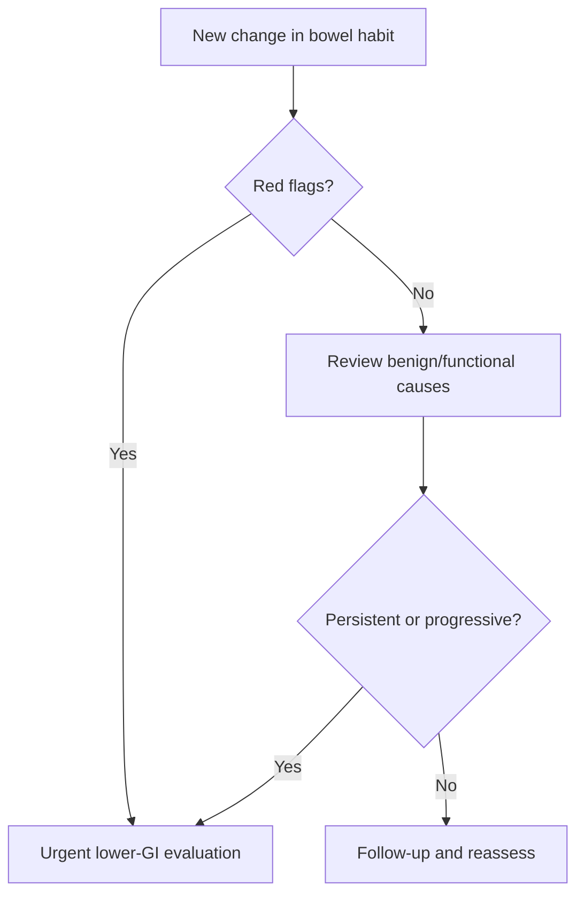

# Change in bowel habit with colorectal cancer red flags

Related: [[../Gastroenterology MOC|Gastroenterology MOC]] · [[../Symptom Patterns and Diagnostic Approach|Symptom Patterns and Diagnostic Approach]] · [[Iron-deficiency anaemia as a GI clue]] · [[Occult GI bleeding and FIT-based triage]] · [[../Lower GI Bleeding, Colorectal, and Anal Disorders/Colorectal cancer|Colorectal cancer]]

> [!warning]
> A **new persistent change in bowel habit** is a colorectal-cancer clue until assessed properly, especially when accompanied by **weight loss, rectal bleeding, iron-deficiency anaemia, abdominal mass, or older age**.

## 1. Learning Objectives
- Define clinically important change in bowel habit.
- Recognize red flags suggesting colorectal malignancy.
- Distinguish benign functional change from high-risk change.
- Build an investigation pathway for suspected colorectal pathology.

## 2. Definition
Change in bowel habit means a new sustained alteration in stool frequency, consistency, caliber, urgency, or ease of passage compared with the patient’s normal pattern. In Gastroenterology, the concern is greatest when this change is recent, progressive, and unexplained.

## 3. Pathophysiology / Why It Matters
Colorectal cancer may alter bowel habit through:
- partial luminal narrowing
- mucosal bleeding and irritation
- disturbed transit
- inflammatory change around a lesion

## 4. High-Risk Clinical Features
- new onset change in bowel habit in older adults
- progressive constipation or diarrhea pattern
- alternating bowel habit with no clear benign explanation
- narrow-caliber stool with other red flags
- tenesmus / rectal urgency suggesting distal disease

## 5. Major Red Flags
- rectal bleeding
- iron-deficiency anaemia
- unintentional weight loss
- abdominal or rectal mass
- persistent abdominal pain or distension
- family history of colorectal cancer
- persistent symptoms despite simple treatment

## 6. History Framework
Ask about:
- exact baseline versus current change
- duration and progression
- stool form, frequency, and caliber
- bleeding / mucus / tenesmus
- weight loss and appetite
- anaemia symptoms
- family history and previous colonoscopy
- medication causes and IBS history

## 7. Examination
- general condition, pallor, weight loss clues
- abdominal distension or mass
- tenderness
- digital rectal examination where appropriate

## 8. Investigations
### Core tests
- CBC for anaemia
- iron studies if deficiency is suspected
- lower GI investigation, especially colonoscopy, when risk is significant
- FIT may assist symptomatic triage in some pathways but does not overrule strong red flags

### Additional logic
- CT staging/investigation if malignancy is identified or strongly suspected
- flexible sigmoidoscopy may be selected in specific distal-symptom contexts, but complete evaluation is often needed

## 9. Interpretation Framework
### Practical algorithm
1. Confirm that the bowel change is new and sustained.
2. Screen for colorectal red flags.
3. Decide whether the pattern looks functional or malignant/organic.
4. Use FIT only as a triage adjunct where appropriate.
5. Proceed to definitive lower-GI evaluation when concern remains.

## 10. Differential Diagnosis
- colorectal cancer
- benign colorectal polyp / advanced adenoma
- IBS
- inflammatory bowel disease
- drug-related bowel change
- diverticular or structural colonic disease

## 11. Management Principles
- do not label new bowel change as functional without checking red flags
- expedite colon investigation when risk factors are present
- correct anaemia/dehydration supportively while pursuing diagnosis

## 12. FCPS/MRCP High-Yield Points
- “New change in bowel habit” is more important than long-standing variable IBS symptoms.
- Iron-deficiency anaemia and weight loss sharply increase colorectal concern.
- FIT is helpful but not definitive when the history is high risk.

## 13. Common Viva Traps
- Reassuring an older patient with persistent bowel change without investigation.
- Ignoring iron-deficiency anaemia because overt bleeding is absent.
- Calling stool caliber change alone cancer without context, or dismissing it when multiple red flags coexist.

## 14. One-Page Summary
- New persistent change in bowel habit is a **colorectal red flag**.
- Highest-risk associated clues: **bleeding, weight loss, iron-deficiency anaemia, mass, older age**.
- Main diagnostic action: **lower GI evaluation**, usually colonoscopy pathway.
- Do not let temporary symptomatic improvement falsely reassure you.

## 15. Mind Map
- Change in bowel habit
  - new / persistent / progressive
  - red flags
    - bleeding
    - IDA
    - weight loss
    - mass
  - differentials
    - CRC
    - IBS
    - IBD
    - drug effect
  - action
    - CBC/iron
    - FIT adjunct
    - colonoscopy

## 16. Flowchart

## 17. Revision Prompts
- Why is new bowel change different from long-standing IBS?
- Name 5 colorectal red flags.
- When does FIT not reassure you?
- What is the main definitive investigation?

## 18. MCQs (10)
1. A new persistent change in bowel habit should raise concern for:
   - A. Organic colorectal pathology including cancer
   - B. Always benign IBS
   - C. Migraine
   - D. Asthma
   - **Answer: A**
2. Which feature most increases colorectal cancer concern?
   - A. Iron-deficiency anaemia
   - B. Mild hiccups
   - C. Dry lips only
   - D. Sneezing
   - **Answer: A**
3. Which statement is correct?
   - A. FIT may help triage but does not overrule strong red flags
   - B. FIT excludes cancer in every case
   - C. Colonoscopy is never needed
   - D. Weight loss is unrelated
   - **Answer: A**
4. A high-risk associated symptom is:
   - A. Rectal bleeding
   - B. Mild thirst only
   - C. Tinnitus
   - D. Myopia
   - **Answer: A**
5. Which patient is highest risk?
   - A. Older adult with new bowel change and weight loss
   - B. Teenager with one day of mild constipation
   - C. Person with transient bloating after a meal
   - D. Patient already fully better
   - **Answer: A**
6. The key lower-GI investigation is usually:
   - A. Colonoscopy
   - B. Audiogram
   - C. Spirometry
   - D. Skin prick test
   - **Answer: A**
7. Which diagnosis belongs in the differential?
   - A. IBD
   - B. Cataract
   - C. Otitis externa
   - D. Cellulitis
   - **Answer: A**
8. Which exam point is high yield?
   - A. New progressive bowel change deserves more attention than long-standing fluctuating symptoms
   - B. All bowel change is functional
   - C. Weight loss is irrelevant
   - D. Masses never matter
   - **Answer: A**
9. A common mistake is to:
   - A. Reassure high-risk patients without investigation
   - B. Check CBC
   - C. Ask about bleeding
   - D. Review family history
   - **Answer: A**
10. Best summary?
   - A. Change in bowel habit is a triage clue, not a diagnosis
   - B. It always means cancer
   - C. It never needs workup
   - D. It excludes IBS
   - **Answer: A**

## 19. SBA Questions (10)
1. A 69-year-old man reports 3 months of altered bowel habit, weight loss, and new fatigue. Best next principle?
   - A. Investigate urgently for colorectal pathology
   - B. Reassure only
   - C. Treat as IBS immediately
   - D. Ignore until overt bleeding appears
   - **Answer: A**
2. A patient has new bowel change with iron-deficiency anaemia but a negative FIT. Best interpretation?
   - A. Clinical risk remains high and needs investigation
   - B. Cancer is ruled out
   - C. The anaemia is irrelevant
   - D. No follow-up is needed
   - **Answer: A**
3. Which feature suggests distal colorectal disease?
   - A. Tenesmus
   - B. Photophobia
   - C. Polyuria
   - D. Wheeze
   - **Answer: A**
4. What is a dangerous error?
   - A. Labeling new bowel change as functional without red-flag review
   - B. Taking a family history
   - C. Performing CBC
   - D. Asking about bleeding
   - **Answer: A**
5. Which symptom combination is most concerning?
   - A. New bowel change plus weight loss and bleeding
   - B. Stable long-standing constipation alone
   - C. One day of mild loose stool
   - D. Mild flatulence only
   - **Answer: A**
6. Which investigation is most definitive in many cases?
   - A. Colonoscopy
   - B. Audiogram
   - C. ECG only
   - D. Skin swab
   - **Answer: A**
7. Which statement is true?
   - A. Change in bowel habit must be interpreted against the patient’s baseline pattern
   - B. Baseline history is unimportant
   - C. Only stool frequency matters
   - D. Weight loss is never relevant
   - **Answer: A**
8. What should be checked in addition to bowel symptoms?
   - A. Anaemia and systemic red flags
   - B. Nail color only
   - C. Hair texture only
   - D. Eye dominance only
   - **Answer: A**
9. Which differential remains possible besides cancer?
   - A. IBS or IBD
   - B. Cataract only
   - C. Rhinitis only
   - D. Otitis only
   - **Answer: A**
10. Best exam phrase?
   - A. Persistent new bowel change is a cancer clue until properly excluded
   - B. Persistent bowel change is always benign
   - C. FIT replaces clinical judgment
   - D. Anaemia never matters
   - **Answer: A**

## 20. Flashcards
- Q: Which 3 red flags with change in bowel habit most strongly suggest colorectal cancer?
  A: Weight loss, rectal bleeding, iron-deficiency anaemia.
- Q: What is the key investigation for high-risk new bowel change?
  A: Colonoscopy/lower-GI evaluation.
- Q: Does a negative FIT overrule strong colorectal alarm features?
  A: No.
- Q: What symptom suggests distal rectal pathology?
  A: Tenesmus.
- Q: Why is baseline bowel history important?
  A: Because “change” is meaningful only relative to the patient’s normal pattern.

## 21. Must Know / Should Know / Nice to Know
### Must Know
- Key red flags and alarm features for this presentation
- Systematic assessment approach (ABCDE for acute, structured for chronic)
- Investigation logic: stepwise from non-invasive to invasive
- Core management principles: treat underlying cause + symptomatic relief

### Should Know
- Special populations (elderly, immunocompromised, pregnancy)
- Refractory/recurrent management strategies
- Multidisciplinary involvement criteria

### Nice to Know
- Advanced diagnostic modalities
- Emerging treatment options
- Health economic considerations

## 22. Self-Test Scorecard
- Can I list 4 key red flags? /10
- Can I outline the assessment algorithm? /10
- Can I explain the investigation strategy? /10
- Can I describe the management approach? /10

**Interpretation:**
- **<35/40** = weak topic
- **35-36/40** = acceptable but insecure
- **37+/40** = exam-ready

## 23. Answer Key with Explanations

