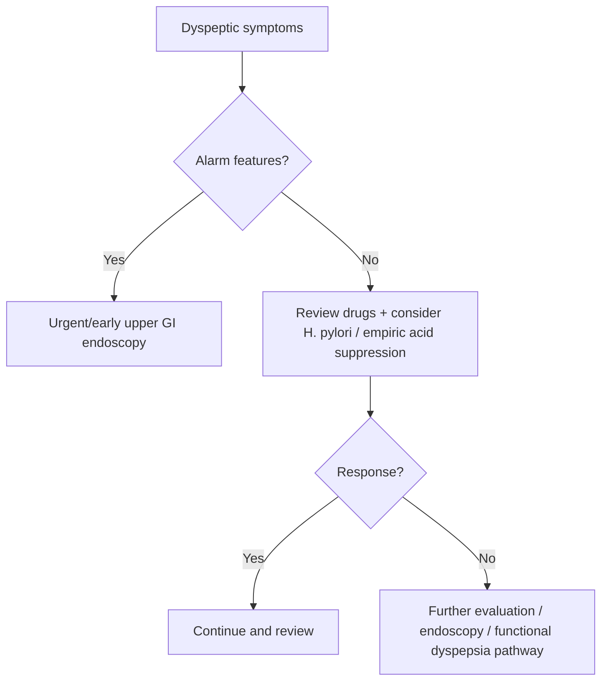

# Dyspepsia approach

Related: [[../Gastroenterology MOC|Gastroenterology MOC]] · [[../Symptom Patterns and Diagnostic Approach|Symptom Patterns and Diagnostic Approach]] · [[Alarm features in dyspepsia and weight loss]] · [[Nausea and vomiting differential diagnosis]] · [[../Stomach and Duodenal Disorders/Functional dyspepsia|Functional dyspepsia]] · [[../Stomach and Duodenal Disorders/Helicobacter pylori infection|Helicobacter pylori infection]] · [[../Stomach and Duodenal Disorders/Duodenal ulcer disease|Duodenal ulcer disease]]

> [!important]
> Dyspepsia is a **syndrome and an approach problem**, not a diagnosis by itself. The exam core is to separate **benign uninvestigated dyspepsia** from **ulcer disease, cancer, GERD overlap, medication causes, and functional dyspepsia**.

## 1. Learning Objectives
- Define dyspepsia and describe its symptom spectrum.
- Recognize alarm features and malignant/ulcer clues.
- Build an investigation and management algorithm.
- Separate functional dyspepsia from organic causes.

## 2. Definition
Dyspepsia refers to chronic or recurrent upper abdominal or epigastric symptoms such as epigastric pain, burning, postprandial fullness, and early satiety. It may overlap with reflux and nausea.

## 3. Physiology / Symptom Basis
Dyspeptic symptoms arise from a mix of:
- acid-peptic disease
- impaired gastric accommodation or hypersensitivity
- delayed gastric emptying
- mucosal inflammation
- medication-related injury

## 4. Symptom Components
- Epigastric pain
- Epigastric burning
- Postprandial fullness
- Early satiety
- Bloating / nausea overlap

## 5. Differential Diagnosis
### Common organic causes
- [[../Stomach and Duodenal Disorders/Helicobacter pylori infection|Helicobacter pylori infection]]
- [[../Stomach and Duodenal Disorders/Duodenal ulcer disease|Duodenal ulcer disease]]
- Gastric ulcer / malignancy
- GERD overlap
- NSAID injury

### Functional / motility overlap
- [[../Stomach and Duodenal Disorders/Functional dyspepsia|Functional dyspepsia]]
- Gastroparesis pattern

### Important non-GI mimics
- Ischaemic heart disease
- Biliary pain
- Pancreatic disease
- Metabolic causes in selected patients

## 6. History Framework
Ask about:
- duration and pattern
- relation to meals
- early satiety / postprandial fullness
- weight loss
- vomiting
- dysphagia
- GI bleed symptoms
- NSAID/aspirin use
- previous ulcer history
- family history of upper GI malignancy

## 7. Alarm Features
- Unintentional weight loss
- Progressive dysphagia
- Persistent vomiting
- GI bleeding / melaena / iron-deficiency anaemia
- Palpable mass
- Older patient with new persistent symptoms
- Strong family history of upper GI malignancy

## 8. Examination
- Nutritional status
- Pallor / cachexia
- Abdominal tenderness or mass
- Signs of dehydration if vomiting is prominent

## 9. Investigations
### Initial logic
- Many patients need clinical risk stratification first, not immediate indiscriminate testing.
- Endoscopy is prioritized when alarm features or cancer concern are present.

### Common tests
- CBC if anaemia/bleeding suspected
- Upper GI endoscopy when alarm features or refractory symptoms exist
- *H. pylori* testing in appropriate uninvestigated dyspepsia pathway
- LFTs, amylase/lipase, ECG, or ultrasound if symptom pattern suggests alternative diagnosis

## 10. Interpretation Framework
### Practical dyspepsia algorithm
1. Confirm symptoms fit dyspepsia rather than chest pain, biliary colic, or bowel disease.
2. Screen for alarm features.
3. Check medication causes, especially NSAIDs.
4. If low-risk, consider *H. pylori* strategy and/or empiric acid suppression.
5. If alarm features or failure to respond, perform endoscopy.
6. If no structural explanation is found, consider functional dyspepsia.

## 11. Diagnosis
Dyspepsia is an approach diagnosis first. Final diagnosis may become:
- peptic ulcer disease
- *H. pylori*-related disease
- reflux overlap
- medication-related dyspepsia
- malignancy
- functional dyspepsia

## 12. Management
### First principles
- Identify alarm features early.
- Stop or reduce ulcerogenic medications where possible.
- Treat *H. pylori* when present.
- Use acid suppression in appropriate patients.
- Reassess non-responders rather than repeatedly extending empiric therapy.

### Symptom-based management
- Lifestyle and meal adjustment
- PPI or other acid suppression when acid-peptic disease is likely
- Functional dyspepsia pathway if investigations are negative

### Cautions
- Persistent symptoms despite therapy are not automatically functional.
- New dyspepsia in older patients needs a lower threshold for endoscopy.

## 13. Complications / What You Must Not Miss
- Upper GI malignancy
- Peptic ulcer bleeding
- Gastric outlet obstruction pattern
- Significant weight loss and malnutrition

## 14. FCPS/MRCP High-Yield Points
- Dyspepsia is a **symptom complex**, not the endpoint diagnosis.
- Alarm features change the pathway to endoscopy.
- NSAID history and *H. pylori* logic are high yield.
- Functional dyspepsia is diagnosed after sensible exclusion, not by neglect.

## 15. Common Viva Traps
- Labeling all epigastric pain as “gastritis.”
- Forgetting cardiac or pancreatic mimics.
- Missing dysphagia, anaemia, or weight loss.

## 16. One-Page Summary
- Dyspepsia = epigastric pain/burning, fullness, or early satiety.
- First ask: **Are there alarm features?**
- Important causes: *H. pylori*, ulcer disease, NSAIDs, malignancy, reflux overlap, functional dyspepsia.
- Low-risk patients may follow a test/treat or empiric acid-suppression pathway.
- Alarm features or refractory symptoms require upper GI endoscopy.

## 17. Mind Map
- Dyspepsia
  - symptoms
    - epigastric pain
    - burning
    - fullness
    - early satiety
  - causes
    - H. pylori
    - ulcer disease
    - NSAIDs
    - cancer
    - functional dyspepsia
  - alarm features
    - weight loss
    - dysphagia
    - vomiting
    - bleeding
  - action
    - low risk: test/treat or PPI
    - high risk: endoscopy

## 18. Flowchart

## 19. Revision Prompts
- Define dyspepsia.
- Name 5 alarm features.
- What is the low-risk initial approach?
- When do you move to endoscopy?

## 20. MCQs (10)
1. Dyspepsia most commonly refers to:
   - A. Upper abdominal / epigastric symptom complex
   - B. Lower GI bleed
   - C. Isolated jaundice
   - D. Pure constipation
   - **Answer: A**
2. An alarm feature is:
   - A. Unintentional weight loss
   - B. Mild flatulence only
   - C. Dry skin
   - D. Tinnitus
   - **Answer: A**
3. A key medication history in dyspepsia is:
   - A. NSAID use
   - B. Eye drops only
   - C. Nasal saline only
   - D. Topical emollients only
   - **Answer: A**
4. A common infective association is:
   - A. *H. pylori*
   - B. EBV encephalitis
   - C. Malaria only
   - D. Otitis media
   - **Answer: A**
5. Upper GI endoscopy is especially indicated when:
   - A. Alarm features are present
   - B. The patient sneezes
   - C. Knee pain is present
   - D. There is isolated rash
   - **Answer: A**
6. A functional diagnosis should usually be considered after:
   - A. Reasonable exclusion of structural disease
   - B. No history-taking
   - C. Ignoring red flags
   - D. Never investigating anything
   - **Answer: A**
7. Early satiety belongs to the dyspepsia symptom spectrum:
   - A. True
   - B. False
   - C. Only in nephrology
   - D. Only in dermatology
   - **Answer: A**
8. Which mimic should not be forgotten?
   - A. Ischaemic heart disease
   - B. Tinea corporis only
   - C. Cataract only
   - D. Otitis externa only
   - **Answer: A**
9. A common low-risk initial strategy may include:
   - A. *H. pylori* strategy and/or empiric acid suppression
   - B. Routine colectomy
   - C. Mandatory CT brain
   - D. Dialysis
   - **Answer: A**
10. Persistent dyspepsia despite treatment should lead to:
   - A. Reassessment rather than endless empiric therapy
   - B. Lifelong reassurance only
   - C. No review ever
   - D. Automatic laxatives
   - **Answer: A**

## 21. SBA Questions (10)
1. A 34-year-old woman has recurrent epigastric burning and postprandial fullness without weight loss, vomiting, anaemia, or dysphagia. Best initial principle?
   - A. Low-risk dyspepsia pathway with *H. pylori* / acid-suppression logic
   - B. Emergency laparotomy
   - C. Colonoscopy first in all cases
   - D. Ignore symptoms completely
   - **Answer: A**
2. A 62-year-old man presents with new dyspepsia and 6-kg weight loss. Best next investigation?
   - A. Upper GI endoscopy
   - B. Stool softener trial only
   - C. Topical ointment
   - D. None
   - **Answer: A**
3. Which history most strongly suggests peptic or medication-related disease?
   - A. Regular NSAID use
   - B. Seasonal sneezing
   - C. Isolated calf pain
   - D. Hearing loss
   - **Answer: A**
4. Which symptom is part of dyspepsia?
   - A. Early satiety
   - B. Pleuritic chest pain only
   - C. Haematuria only
   - D. Diplopia only
   - **Answer: A**
5. Which diagnosis is symptom-based after exclusion of organic pathology?
   - A. Functional dyspepsia
   - B. Perforated ulcer
   - C. Obstructing cancer
   - D. Pancreatic necrosis
   - **Answer: A**
6. Which finding should lower the threshold for endoscopy?
   - A. Persistent vomiting
   - B. Mild burping after fizzy drinks
   - C. Stable appetite
   - D. Seasonal eczema
   - **Answer: A**
7. Which important organism is linked to dyspepsia and ulcer disease?
   - A. *Helicobacter pylori*
   - B. Plasmodium falciparum
   - C. Candida auris only
   - D. RSV only
   - **Answer: A**
8. Which statement is correct?
   - A. Dyspepsia may overlap with reflux but is not identical to it
   - B. Dyspepsia always means cancer
   - C. Dyspepsia never needs review
   - D. Dyspepsia excludes medication causes
   - **Answer: A**
9. Which non-GI mimic is high yield to remember?
   - A. Ischaemic heart disease
   - B. Tension alopecia
   - C. Otitis externa
   - D. Carpal tunnel syndrome
   - **Answer: A**
10. Best exam phrase for dyspepsia?
   - A. A symptom complex requiring risk stratification and cause identification
   - B. A final diagnosis in every patient
   - C. Always functional
   - D. Always infectious
   - **Answer: A**

## 22. Flashcards
- Q: What is dyspepsia?
  A: A chronic/recurrent epigastric symptom complex including pain, burning, fullness, and early satiety.
- Q: Name 4 alarm features in dyspepsia.
  A: Weight loss, persistent vomiting, dysphagia, GI bleeding/anaemia.
- Q: What infection is classically linked to dyspepsia and peptic disease?
  A: *Helicobacter pylori*.
- Q: What investigation is prioritized when alarm features are present?
  A: Upper GI endoscopy.
- Q: When is functional dyspepsia considered?
  A: After reasonable exclusion of structural/organic disease.

## 23. Must Know / Should Know / Nice to Know
### Must Know
- Key red flags and alarm features for this presentation
- Systematic assessment approach (ABCDE for acute, structured for chronic)
- Investigation logic: stepwise from non-invasive to invasive
- Core management principles: treat underlying cause + symptomatic relief

### Should Know
- Special populations (elderly, immunocompromised, pregnancy)
- Refractory/recurrent management strategies
- Multidisciplinary involvement criteria

### Nice to Know
- Advanced diagnostic modalities
- Emerging treatment options
- Health economic considerations

## 24. Self-Test Scorecard
- Can I list 4 key red flags? /10
- Can I outline the assessment algorithm? /10
- Can I explain the investigation strategy? /10
- Can I describe the management approach? /10

**Interpretation:**
- **<35/40** = weak topic
- **35-36/40** = acceptable but insecure
- **37+/40** = exam-ready

## 25. Answer Key with Explanations

