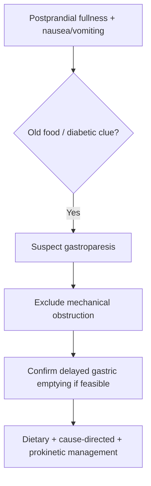

# Gastroparesis clue pattern

Related: [[../Gastroenterology MOC|Gastroenterology MOC]] · [[../Symptom Patterns and Diagnostic Approach|Symptom Patterns and Diagnostic Approach]] · [[Dyspepsia approach]] · [[Nausea and vomiting differential diagnosis]] · [[../Stomach and Duodenal Disorders/Functional dyspepsia|Functional dyspepsia]]

> [!important]
> Gastroparesis is suspected when there is **early satiety, postprandial fullness, nausea, and vomiting of retained food**, especially in a patient with **diabetes or prior gastric surgery**, after mechanical obstruction has been excluded.

## 1. Learning Objectives
- Define gastroparesis and recognize its clinical clue pattern.
- Distinguish it from gastric outlet obstruction and functional dyspepsia.
- Understand the main causes and investigation pathway.
- Outline management principles and cautions.

## 2. Definition
Gastroparesis is delayed gastric emptying without mechanical gastric outlet obstruction.

## 3. Physiology
Normal gastric emptying requires:
- coordinated fundic accommodation
- antral grinding
- pyloric relaxation
- intact autonomic and enteric neural control

Delay in emptying causes food retention, postprandial fullness, nausea, and vomiting.

## 4. Causes
- Diabetes mellitus with autonomic neuropathy
- Post-surgical vagal injury
- Idiopathic gastroparesis
- Drug-induced delayed gastric emptying, especially opioids and some anticholinergic agents
- Systemic illness affecting motility

## 5. Clinical Clue Pattern
- Early satiety
- Postprandial fullness
- Bloating
- Nausea
- Vomiting of undigested food hours after eating
- Erratic glycaemic control in diabetics
- Weight loss in more severe cases

## 6. Red Flags / What Must Be Excluded
- Progressive persistent vomiting with severe weight loss
- GI bleeding
- Palpable mass
- Marked abdominal distension
- Older patient with new outlet-obstruction type symptoms
- Features suggesting mechanical obstruction or malignancy

## 7. Differential Diagnosis
- Gastric outlet obstruction
- Functional dyspepsia
- Peptic ulcer-related narrowing
- Pancreatic or extrinsic compression pathology
- Cyclical vomiting / other functional syndromes

## 8. Investigations
### Key principle
Mechanical obstruction should be excluded before confirming gastroparesis.

### Practical tests
- Upper GI endoscopy when structural disease needs exclusion
- Gastric emptying study where available/appropriate
- Glucose and metabolic review in diabetics
- Electrolytes and nutritional assessment in recurrent vomiting

## 9. Interpretation Framework
### Diagnostic logic
1. Recognize the clue pattern.
2. Exclude obstruction or cancer.
3. Look for diabetes, surgery, and drug causes.
4. Confirm delayed gastric emptying when feasible.
5. Manage symptoms, nutrition, and the cause.

## 10. Management
### General principles
- Small frequent meals
- Reduce high-fat and very large meals if they worsen symptoms
- Optimize diabetes control
- Stop aggravating drugs if possible

### Pharmacologic / supportive logic
- Use prokinetic strategy where appropriate
- Antiemetics may help symptoms but do not correct the motility defect

### Cautions
- Persistent vomiting and weight loss require reconsideration of obstruction.
- Do not diagnose gastroparesis before excluding mechanical causes.

## 11. Complications
- Malnutrition
- Dehydration
- Poor glycaemic control
- Recurrent admissions for vomiting
- Aspiration in severe cases

## 12. FCPS/MRCP High-Yield Points
- Vomiting of retained food hours after meals is a classic clue.
- Diabetes is the exam-favorite association.
- Gastroparesis is a diagnosis of delayed emptying **without obstruction**.

## 13. Common Viva Traps
- Confusing gastroparesis with gastric outlet obstruction.
- Forgetting drug-induced delayed emptying.
- Missing diabetes control issues as both cause and consequence.

## 14. One-Page Summary
- Gastroparesis = delayed gastric emptying without mechanical obstruction.
- Clues: early satiety, fullness, nausea, old food vomiting, diabetic context.
- First exclude obstruction.
- Management: diet adjustment, optimize cause, prokinetics/supportive care.

## 15. Mind Map
- Gastroparesis
  - causes
    - diabetes
    - surgery
    - drugs
  - symptoms
    - fullness
    - early satiety
    - vomiting old food
  - rule out
    - outlet obstruction
    - malignancy
  - manage
    - small meals
    - glycaemic control
    - prokinetics

## 16. Flowchart

## 17. Revision Prompts
- Define gastroparesis.
- What symptom pattern is most suggestive?
- What must be excluded first?
- Name 3 major causes.

## 18. MCQs (10)
1. Gastroparesis is defined as:
   - A. Delayed gastric emptying without mechanical obstruction
   - B. Any diarrhea over 4 weeks
   - C. Lower GI bleeding
   - D. Hepatic encephalopathy
   - **Answer: A**
2. A classic symptom clue is:
   - A. Vomiting undigested food hours after meals
   - B. Pure tenesmus
   - C. Hematuria
   - D. Photophobia only
   - **Answer: A**
3. The exam-favorite association is:
   - A. Diabetes mellitus
   - B. Psoriasis
   - C. Otitis media
   - D. Rheumatic fever
   - **Answer: A**
4. Before diagnosing gastroparesis, exclude:
   - A. Mechanical obstruction
   - B. Hypertension
   - C. Rhinitis
   - D. Cataract
   - **Answer: A**
5. Which drug group may worsen gastric emptying?
   - A. Opioids
   - B. Emollients
   - C. Lubricant eye drops
   - D. Topical antifungals
   - **Answer: A**
6. Early satiety in gastroparesis reflects:
   - A. Delayed gastric emptying / poor gastric transit
   - B. Lower GI bleed only
   - C. Renal colic
   - D. Vertigo only
   - **Answer: A**
7. A key dietary principle is:
   - A. Small frequent meals
   - B. Very large heavy meals
   - C. Ignore meal pattern
   - D. Fasting forever
   - **Answer: A**
8. Which is a major complication?
   - A. Malnutrition
   - B. Glaucoma
   - C. Gout only
   - D. Cellulitis only
   - **Answer: A**
9. Which statement is correct?
   - A. Antiemetics may reduce symptoms but do not correct the motility problem
   - B. Antiemetics cure all gastroparesis
   - C. Obstruction never needs exclusion
   - D. Diabetes is irrelevant
   - **Answer: A**
10. Which broad diagnosis most closely mimics gastroparesis?
   - A. Gastric outlet obstruction
   - B. Haemorrhoids
   - C. Anal fissure
   - D. Ulcerative colitis
   - **Answer: A**

## 19. SBA Questions (10)
1. A 48-year-old woman with longstanding diabetes has postprandial fullness, early satiety, and vomiting of undigested food 4 hours after meals. Best diagnosis pattern?
   - A. Gastroparesis
   - B. Acute lower GI bleed
   - C. Ulcerative colitis
   - D. IBS-C
   - **Answer: A**
2. Which investigation principle comes first in suspected gastroparesis?
   - A. Exclude mechanical obstruction
   - B. Diagnose on symptoms alone forever
   - C. Ignore vomiting
   - D. Start laxatives
   - **Answer: A**
3. Which medication may aggravate symptoms?
   - A. Opioids
   - B. Simple saline rinse
   - C. Topical emollients
   - D. Artificial tears
   - **Answer: A**
4. Which history supports diabetic autonomic involvement?
   - A. Erratic glycaemic control with postprandial vomiting
   - B. Rectal itching only
   - C. Isolated photophobia
   - D. Dry cough only
   - **Answer: A**
5. Best dietary advice?
   - A. Small frequent meals
   - B. Large fatty meals
   - C. One huge meal daily
   - D. Random unrestricted eating despite severe symptoms
   - **Answer: A**
6. What is a dangerous error?
   - A. Calling outlet obstruction gastroparesis without exclusion
   - B. Checking nutritional status
   - C. Reviewing drugs
   - D. Assessing diabetes control
   - **Answer: A**
7. Which finding is more concerning for obstruction than uncomplicated gastroparesis?
   - A. Progressive severe weight loss with structural symptom pattern
   - B. Mild postprandial nausea alone
   - C. Stable appetite
   - D. Brief bloating only
   - **Answer: A**
8. Which symptom cluster is most classic?
   - A. Early satiety, fullness, nausea, old food vomiting
   - B. Massive hematochezia
   - C. Jaundice with dark urine
   - D. Dysuria with frequency
   - **Answer: A**
9. A confirmatory test where available is:
   - A. Gastric emptying study
   - B. Knee X-ray
   - C. Audiogram
   - D. Spirometry
   - **Answer: A**
10. Which statement is true?
   - A. Gastroparesis is a motility disorder, not simply a vague dyspeptic complaint
   - B. It always means cancer
   - C. It excludes diabetes
   - D. It never causes weight loss
   - **Answer: A**

## 20. Flashcards
- Q: Define gastroparesis.
  A: Delayed gastric emptying without mechanical obstruction.
- Q: What symptom strongly suggests gastroparesis?
  A: Vomiting undigested food hours after meals with postprandial fullness.
- Q: What major association is classically tested?
  A: Diabetes mellitus.
- Q: What must be excluded before diagnosing gastroparesis?
  A: Mechanical gastric outlet obstruction.
- Q: Give 2 key management principles.
  A: Small frequent meals and optimization of the underlying cause, especially glycaemic control.

## 21. Must Know / Should Know / Nice to Know
### Must Know
- Key red flags and alarm features for this presentation
- Systematic assessment approach (ABCDE for acute, structured for chronic)
- Investigation logic: stepwise from non-invasive to invasive
- Core management principles: treat underlying cause + symptomatic relief

### Should Know
- Special populations (elderly, immunocompromised, pregnancy)
- Refractory/recurrent management strategies
- Multidisciplinary involvement criteria

### Nice to Know
- Advanced diagnostic modalities
- Emerging treatment options
- Health economic considerations

## 22. Self-Test Scorecard
- Can I list 4 key red flags? /10
- Can I outline the assessment algorithm? /10
- Can I explain the investigation strategy? /10
- Can I describe the management approach? /10

**Interpretation:**
- **<35/40** = weak topic
- **35-36/40** = acceptable but insecure
- **37+/40** = exam-ready

## 23. Answer Key with Explanations

