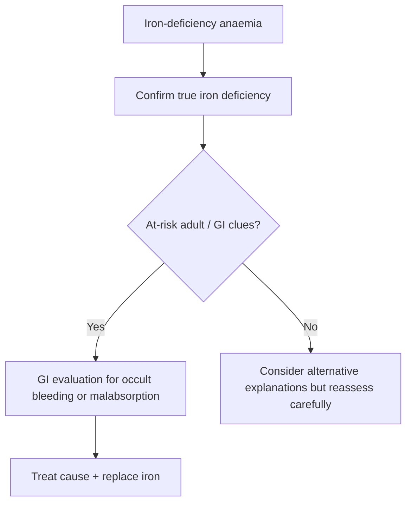

# Iron-deficiency anaemia as a GI clue

Related: [[../Gastroenterology MOC|Gastroenterology MOC]] · [[../Symptom Patterns and Diagnostic Approach|Symptom Patterns and Diagnostic Approach]] · [[Occult GI bleeding and FIT-based triage]] · [[Constipation and altered bowel habit]] · [[../Lower GI Bleeding, Colorectal, and Anal Disorders/Colorectal cancer|Colorectal cancer]]

> [!warning]
> In adults, especially **men and postmenopausal women**, iron-deficiency anaemia should be treated as a potential **occult GI blood-loss clue** until a cause is found. The exam danger is to prescribe iron and miss malignancy or other chronic GI bleeding pathology.

## 1. Learning Objectives
- Explain why iron-deficiency anaemia is a GI red flag.
- Recognize patient groups needing GI evaluation.
- Build a practical investigation approach.
- Avoid common diagnostic traps.

## 2. Definition / Clinical Significance
Iron-deficiency anaemia (IDA) is anaemia caused by depleted iron stores. In Gastroenterology, its major significance is as a signal of **chronic occult blood loss**, malabsorption, or malignancy.

## 3. Why It Matters in GI Practice
GI causes may include:
- colorectal cancer
- upper GI ulceration or malignancy
- inflammatory bowel disease
- angiodysplasia / other chronic occult blood-loss lesions
- coeliac disease causing iron malabsorption

## 4. High-Risk Context
Treat IDA as especially significant in:
- adult men
- postmenopausal women
- any patient with weight loss, altered bowel habit, or GI symptoms
- recurrent or unexplained IDA

## 5. Clinical Clues
- fatigue and pallor
- exertional dyspnoea
- pica or restless legs in classic deficiency patterns
- concomitant altered bowel habit
- weight loss
- subtle rectal bleeding or dark stools history

## 6. Red Flags
- IDA with weight loss
- IDA with altered bowel habit
- IDA with dyspepsia or upper GI alarm features
- recurrent or severe unexplained IDA
- older age

## 7. Investigations
### Core hematinic confirmation
- CBC / red-cell indices
- ferritin and iron studies where appropriate

### GI evaluation logic
- upper and/or lower GI investigation depending on age, symptoms, and local pathway
- colonoscopy / colorectal evaluation when lower-GI concern exists
- upper GI endoscopy when upper-GI symptoms or risk features exist
- coeliac testing where relevant

## 8. Interpretation Framework
### Practical approach
1. Confirm iron deficiency, not just anaemia.
2. Identify whether a physiological explanation exists.
3. In at-risk adults, actively search for GI blood loss or malabsorption.
4. Do not stop after prescribing iron.
5. Reassess response and ensure the underlying cause is addressed.

## 9. Differential Diagnosis / Cause Logic
- occult colorectal malignancy
- peptic ulcer disease or upper GI cancer
- IBD
- coeliac disease
- non-GI blood loss where clinically relevant

## 10. Management
### First principles
- investigate the cause
- replace iron appropriately
- escalate for urgent GI investigation when associated red flags exist

### Cautions
- response to iron does not exclude cancer
- normal-looking stool does not exclude occult GI bleeding
- recurrent IDA deserves renewed evaluation

## 11. Complications of Missed Diagnosis
- delayed cancer diagnosis
- progressive anaemia and reduced functional status
- continued occult bleeding
- missed malabsorptive disease such as coeliac disease

## 12. FCPS/MRCP High-Yield Points
- IDA is a **clue**, not the final diagnosis.
- In adult men/postmenopausal women, think GI blood loss first until shown otherwise.
- Coeliac disease is a classic non-bleeding GI cause.

## 13. Common Viva Traps
- Stopping after iron replacement.
- Forgetting coeliac disease.
- Assuming no visible blood means no GI source.

## 14. One-Page Summary
- Iron-deficiency anaemia in adults may indicate **occult GI bleeding or malabsorption**.
- High-risk groups: **men, postmenopausal women, older adults, anyone with weight loss or altered bowel habit**.
- Confirm iron deficiency, then investigate for GI cause.
- Do not let iron-response falsely reassure you.

## 15. Mind Map
- IDA as GI clue
  - occult bleeding
    - colorectal cancer
    - upper GI lesion
    - IBD
  - malabsorption
    - coeliac disease
  - red flags
    - weight loss
    - altered bowel habit
    - older age
  - action
    - confirm IDA
    - GI evaluation
    - iron replacement

## 16. Flowchart

## 17. Revision Prompts
- Why is IDA a GI clue?
- Which adult groups are highest risk?
- What GI causes should always be considered?
- Why does iron response not end the workup?

## 18. MCQs (10)
1. In Gastroenterology, iron-deficiency anaemia most importantly suggests:
   - A. Possible occult GI blood loss or malabsorption
   - B. Always simple dietary deficiency only
   - C. Migraine
   - D. Asthma
   - **Answer: A**
2. A high-risk group is:
   - A. Adult men
   - B. Healthy infants only
   - C. Teenagers with one skipped meal only
   - D. None
   - **Answer: A**
3. A classic GI malabsorptive cause of IDA is:
   - A. Coeliac disease
   - B. Achalasia
   - C. Otitis media
   - D. Psoriasis
   - **Answer: A**
4. Which statement is correct?
   - A. Response to iron does not exclude serious pathology
   - B. Response to iron rules out cancer completely
   - C. IDA never needs GI evaluation
   - D. Visible blood is required for a GI source
   - **Answer: A**
5. A major lower-GI concern is:
   - A. Colorectal cancer
   - B. Glaucoma
   - C. Dermatitis
   - D. Rhinitis
   - **Answer: A**
6. Which symptom with IDA is especially concerning?
   - A. Altered bowel habit
   - B. Mild yawning
   - C. Dry lips only
   - D. Sneezing
   - **Answer: A**
7. The first analytical step is to:
   - A. Confirm true iron deficiency
   - B. Prescribe iron only and stop
   - C. Ignore age
   - D. Avoid CBC
   - **Answer: A**
8. Which is a common trap?
   - A. Treating the anaemia but not searching for the cause
   - B. Taking a GI history
   - C. Reviewing bowel habit
   - D. Checking ferritin
   - **Answer: A**
9. Which upper-GI pathology may present this way?
   - A. Ulcer disease or upper GI malignancy
   - B. Cataract
   - C. Tinnitus
   - D. Cellulitis
   - **Answer: A**
10. Best exam phrase?
   - A. IDA in adults is a diagnostic clue demanding cause evaluation
   - B. IDA is the diagnosis and endpoint
   - C. IDA excludes GI disease
   - D. IDA never coexists with cancer
   - **Answer: A**

## 19. SBA Questions (10)
1. A 67-year-old man is found to have microcytic iron-deficiency anaemia with no obvious bleeding. Best principle?
   - A. Investigate for occult GI blood loss or malabsorption
   - B. Give iron and never review
   - C. Treat as asthma
   - D. No action required
   - **Answer: A**
2. A postmenopausal woman has IDA and change in bowel habit. Most important diagnostic concern?
   - A. Colorectal malignancy or other GI source
   - B. Functional dyspepsia only
   - C. Migraine
   - D. Vertigo
   - **Answer: A**
3. Which GI disease may cause IDA without overt bleeding?
   - A. Coeliac disease
   - B. Acute otitis media
   - C. Rhinitis
   - D. Cataract
   - **Answer: A**
4. Which is a dangerous error?
   - A. Assuming iron response proves the cause is harmless
   - B. Confirming iron deficiency
   - C. Asking about bowel habit
   - D. Considering coeliac disease
   - **Answer: A**
5. Which feature increases urgency?
   - A. Weight loss
   - B. Stable appetite alone
   - C. Mild belching only
   - D. Sneezing only
   - **Answer: A**
6. Which investigation principle is correct?
   - A. GI workup should be guided by risk profile and symptoms
   - B. GI evaluation is never needed
   - C. Only urine tests matter
   - D. Skin biopsy is the key test
   - **Answer: A**
7. Which statement is true?
   - A. Occult GI bleeding may occur without visible stool blood
   - B. GI bleeding is always obvious
   - C. IDA excludes malignancy
   - D. Coeliac disease cannot cause iron deficiency
   - **Answer: A**
8. Which diagnosis is especially important in older adults with IDA?
   - A. Colorectal cancer
   - B. Tinea corporis
   - C. Allergic conjunctivitis
   - D. Dental caries
   - **Answer: A**
9. What should accompany cause investigation?
   - A. Iron replacement therapy
   - B. No treatment at all
   - C. Routine laxatives
   - D. Spirometry
   - **Answer: A**
10. Best exam summary?
   - A. IDA is a red-flag clue that must trigger cause-based GI thinking
   - B. IDA is always benign
   - C. IDA never relates to bowel disease
   - D. Ferritin is irrelevant
   - **Answer: A**

## 20. Flashcards
- Q: Why is iron-deficiency anaemia important in Gastroenterology?
  A: It may indicate occult GI bleeding or malabsorption.
- Q: Which adults are highest risk when IDA is found?
  A: Men and postmenopausal women.
- Q: Name 3 GI causes of IDA.
  A: Colorectal cancer, upper GI ulcer/malignancy, coeliac disease.
- Q: Does improvement with iron exclude malignancy?
  A: No.
- Q: What key bowel-history clue with IDA raises concern?
  A: Altered bowel habit.

## 21. Must Know / Should Know / Nice to Know
### Must Know
- Key red flags and alarm features for this presentation
- Systematic assessment approach (ABCDE for acute, structured for chronic)
- Investigation logic: stepwise from non-invasive to invasive
- Core management principles: treat underlying cause + symptomatic relief

### Should Know
- Special populations (elderly, immunocompromised, pregnancy)
- Refractory/recurrent management strategies
- Multidisciplinary involvement criteria

### Nice to Know
- Advanced diagnostic modalities
- Emerging treatment options
- Health economic considerations

## 22. Self-Test Scorecard
- Can I list 4 key red flags? /10
- Can I outline the assessment algorithm? /10
- Can I explain the investigation strategy? /10
- Can I describe the management approach? /10

**Interpretation:**
- **<35/40** = weak topic
- **35-36/40** = acceptable but insecure
- **37+/40** = exam-ready

## 23. Answer Key with Explanations

