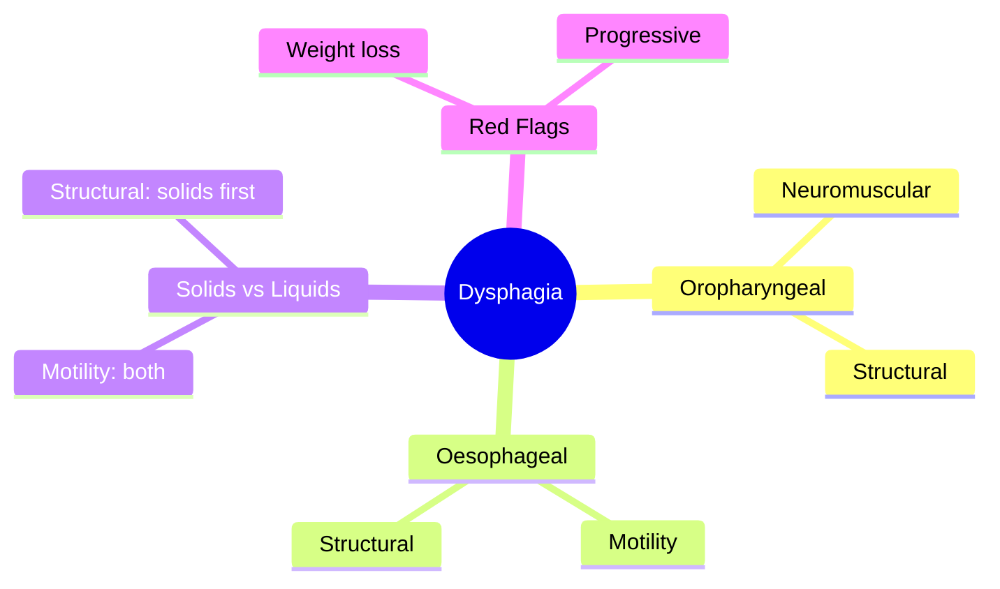
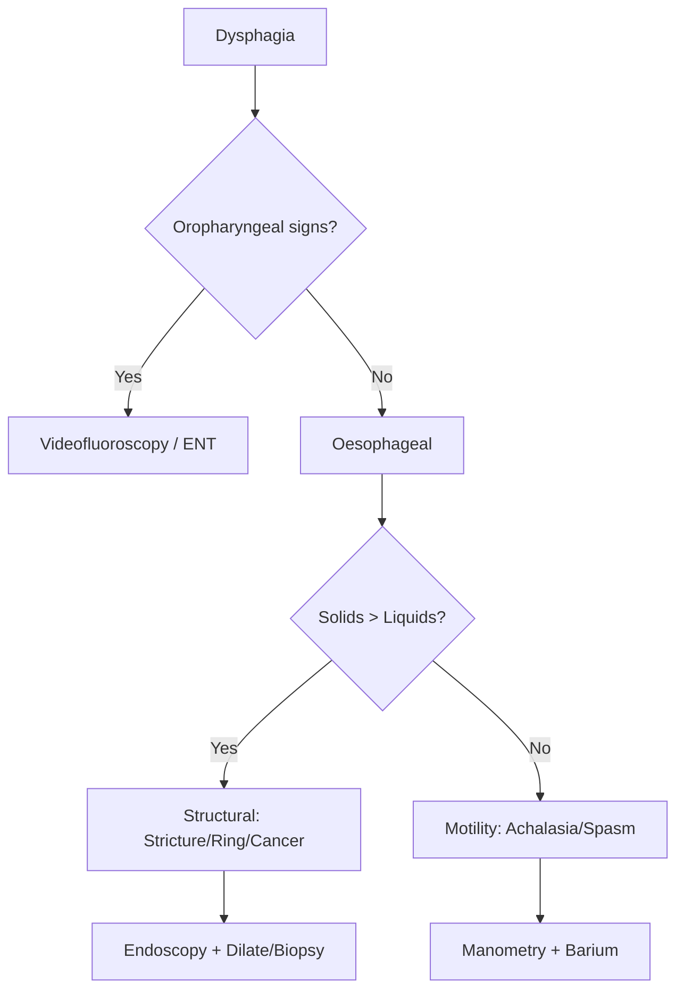

## 1. Learning Objectives
- Distinguish oropharyngeal from oesophageal dysphagia by history and examination
- Recognize the significance of solids vs liquids dysphagia pattern
- Apply the appropriate investigation strategy for each type
- Identify red flags requiring urgent endoscopic evaluation
- Outline the management principles for common causes# Oropharyngeal vs oesophageal dysphagia

Related: [[../Gastroenterology MOC|Gastroenterology MOC]] · [[../Symptom Patterns and Diagnostic Approach|Symptom Patterns and Diagnostic Approach]] · [[Dysphagia alarm features and urgent endoscopy]]

> [!important]
> The first step in dysphagia is to decide whether it is **oropharyngeal** or **oesophageal**. This single distinction drives the history, examination, investigation route, and urgency.

## 2. Definition
- **Oropharyngeal dysphagia**: difficulty initiating a swallow or transferring food from mouth/pharynx into the esophagus.
- **Oesophageal dysphagia**: sensation of food sticking after swallowing, due to structural or motility disease in the esophagus.

## 3. Anatomy
- Oropharyngeal phase involves mouth, pharynx, larynx, upper esophageal sphincter, and neuromuscular coordination.
- Oesophageal phase involves esophageal lumen, peristalsis, LES, and the gastro-esophageal junction.

## 4. Physiology
- Swallowing has oral, pharyngeal, and esophageal phases.
- Failure of initiation/transfer suggests oropharyngeal dysfunction.
- Transit failure after initiation suggests esophageal disease.

## 5. Etiology
### Oropharyngeal causes
- Stroke
- Bulbar palsy/neuromuscular disease
- Parkinsonism
- Myasthenia gravis
- Structural pharyngeal lesions

### Oesophageal causes
- Cancer
- Peptic stricture
- Schatzki ring/web
- Achalasia
- Diffuse motility disorders
- Eosinophilic esophagitis

## 6. Clinical Features
### Oropharyngeal dysphagia clues
- Difficulty **initiating** swallow
- Coughing/choking during meals
- Nasal regurgitation
- Aspiration episodes
- Voice change/wet voice

### Oesophageal dysphagia clues
- Swallow starts normally
- Food feels stuck after swallowing
- Retrosternal sticking sensation
- Regurgitation of undigested food

## 7. Red Flags
- Progressive dysphagia
- Weight loss
- aspiration pneumonia
- neurological deficits
- dehydration/malnutrition

## 8. Investigations
### Oropharyngeal route
- Careful neurological and oral exam
- Speech and swallow assessment
- Videofluoroscopic swallow / FEES where appropriate

### Oesophageal route
- Endoscopy for alarm features/structural lesions
- Barium swallow in selected structural or motility settings
- Manometry for motility disorders

## 9. Interpretation Framework
### Key differentiating question
- **“Can the patient start the swallow?”**
  - No → think oropharyngeal
  - Yes, but food sticks later → think oesophageal

### Complication logic
- Oropharyngeal → aspiration risk
- Oesophageal → obstruction/malignancy/motility workup

## 10. Diagnosis
Diagnosis is primarily clinical at first, then refined by directed testing based on the phase affected.

## 11. Differential Diagnosis
- Globus sensation
- Odynophagia mistaken for dysphagia
- Functional symptoms
- Severe xerostomia or poor dentition contributing to swallowing difficulty

## 12. Management
- Stabilize nutrition/hydration
- Prevent aspiration in oropharyngeal cases
- Investigate urgently when alarm features exist
- Treat underlying structural, neurological, or motility cause

## 13. Complications
- Aspiration pneumonia
- Malnutrition
- Weight loss
- Food impaction
- Missed esophageal cancer if triage is delayed

## 14. Common Exam / Viva Traps
- Not distinguishing site/phase of swallowing problem
- Sending classic oropharyngeal dysphagia directly to manometry before clinical triage
- Missing aspiration risk

## 15. One-Page Summary
- Oropharyngeal dysphagia = **difficulty initiating swallow**.
- Oesophageal dysphagia = **food sticks after swallow begins**.
- Oropharyngeal clues: choking, cough, nasal regurgitation, aspiration.
- Oesophageal clues: retrosternal sticking, regurgitation, progressive obstruction.
- This distinction guides the next investigation.

## 16. Revision Prompts
- Give 3 clues for oropharyngeal dysphagia.
- Give 3 clues for oesophageal dysphagia.
- Which type is more associated with aspiration?

## 17. MCQs (10)
1. Difficulty initiating a swallow suggests:
   - A. Oropharyngeal dysphagia
   - B. Oesophageal dysphagia
   - C. GERD only
   - D. IBS
   - **Answer: A**
2. Food sticking after swallowing suggests:
   - A. Oesophageal dysphagia
   - B. Oropharyngeal dysphagia
   - C. Migraine
   - D. Hemorrhoids
   - **Answer: A**
3. Choking during meals is more typical of:
   - A. Oropharyngeal dysphagia
   - B. Colorectal cancer
   - C. Pancreatitis
   - D. Gastritis
   - **Answer: A**
4. Aspiration pneumonia is classically linked to:
   - A. Oropharyngeal dysfunction
   - B. Anal fissure
   - C. Hemorrhoids
   - D. Pseudocyst
   - **Answer: A**
5. Manometry is mainly useful for:
   - A. Oesophageal motility disorders
   - B. Gallstones
   - C. Colitis
   - D. PEI
   - **Answer: A**
6. Stroke is a common cause of:
   - A. Oropharyngeal dysphagia
   - B. Oesophageal ring
   - C. Peptic ulcer
   - D. VIPoma
   - **Answer: A**
7. A structural esophageal cause is:
   - A. Peptic stricture
   - B. Parkinson disease
   - C. Bulbar palsy
   - D. Stroke
   - **Answer: A**
8. Which test helps structural esophageal assessment?
   - A. Endoscopy
   - B. EEG
   - C. ECG only
   - D. Spirometry
   - **Answer: A**
9. Nasal regurgitation suggests:
   - A. Oropharyngeal dysphagia
   - B. Esophageal cancer only
   - C. IBS-D
   - D. PUD
   - **Answer: A**
10. First major clinical step in dysphagia is to:
   - A. Decide oropharyngeal vs oesophageal
   - B. Give laxatives
   - C. Diagnose GERD immediately
   - D. Ignore history
   - **Answer: A**

## 18. SBA Questions (10)
1. A 74-year-old man coughs and chokes immediately on attempting to swallow water after a stroke. Best dysphagia category?
   - A. Oropharyngeal dysphagia
   - B. Oesophageal dysphagia
   - C. IBS
   - D. PUD
   - **Answer: A**
2. A patient swallows normally but then feels solid food stick behind the sternum. Best category?
   - A. Oesophageal dysphagia
   - B. Oropharyngeal dysphagia
   - C. Functional constipation
   - D. Acute pancreatitis
   - **Answer: A**
3. Which symptom most supports aspiration risk?
   - A. Coughing during meals
   - B. Rectal bleeding
   - C. Jaundice
   - D. Steatorrhoea
   - **Answer: A**
4. Which investigation is useful for swallow-phase assessment in suspected oropharyngeal dysphagia?
   - A. Videofluoroscopic swallow study
   - B. Colonoscopy
   - C. MRCP
   - D. Echocardiography
   - **Answer: A**
5. Which cause fits oesophageal dysphagia best?
   - A. Achalasia
   - B. Stroke
   - C. Myasthenia only
   - D. Bulbar palsy
   - **Answer: A**
6. A classic oropharyngeal clue is:
   - A. Nasal regurgitation
   - B. Food sticking low in chest only
   - C. Pancreatic back pain
   - D. Rectal tenesmus
   - **Answer: A**
7. Which statement is correct?
   - A. Oropharyngeal and oesophageal dysphagia require different workup routes
   - B. They are worked up identically
   - C. Aspiration is irrelevant
   - D. Dysphagia never needs triage
   - **Answer: A**
8. Which is a key esophageal structural differential?
   - A. Cancer
   - B. Hemorrhoids
   - C. VIPoma
   - D. Pancreatic pseudocyst
   - **Answer: A**
9. Which question is most useful first?
   - A. Can you start the swallow?
   - B. Do you have knee pain?
   - C. What is your blood group?
   - D. Do you snore?
   - **Answer: A**
10. Why is correct triage important?
   - A. It changes urgency and investigation pathway
   - B. It has no practical effect
   - C. It only affects note style
   - D. It only matters in surgery
   - **Answer: A**

## 19. Flashcards
- Q: Oropharyngeal dysphagia means what?  
  A: Difficulty initiating a swallow.
- Q: Oesophageal dysphagia means what?  
  A: Food sticks after the swallow starts.
- Q: Which type is linked to aspiration?  
  A: Oropharyngeal dysphagia.
- Q: Key first triage question?  
  A: Can the patient start the swallow?
- Q: Esophageal motility test?  
  A: Manometry.

## 20. Mind Map

## 21. Flowchart

## 22. Must Know / Should Know / Nice to Know
### Must Know
- Oropharyngeal: nasal regurgitation, cough, voice change; neurological/structural causes
- Oesophageal: retrosternal, both solids/liquids if motility, solids first if structural
- Solids > liquids = structural (stricture, ring, cancer, web)
- Both equally = motility (achalasia, spasm, scleroderma)
- Urgent endoscopy for progressive dysphagia + weight loss

### Should Know
- Videofluoroscopy for oropharyngeal
- Manometry for motility disorders
- EoE: rings/furrows, biopsy despite normal endoscopy
- Pill oesophagitis: bisphosphonates, doxycycline

### Nice to Know
- POEM for achalasia
- EndoFLIP for distensibility
- Cricopharyngeal myotomy

## 23. Self-Test Scorecard
- Can I distinguish oropharyngeal from oesophageal? /10
- Can I explain solids vs liquids pattern? /10
- Can I list 3 causes of each type? /10
- Can I outline the investigation algorithm? /10

**Interpretation:**
- **<35/40** = weak topic
- **35-36/40** = acceptable but insecure
- **37+/40** = exam-ready

## 24. Revision Prompts
- How do you distinguish oropharyngeal from oesophageal dysphagia?
- What does solids > liquids pattern indicate?
- What are the urgent endoscopy criteria?

## 25. Answer Key with Explanations

## 26. Answer Key Pearls
- A concise high-scoring viva answer is: **“Oropharyngeal dysphagia is initiation difficulty with choking/aspiration; oesophageal dysphagia is post-swallow sticking from structural or motility disease.”**
