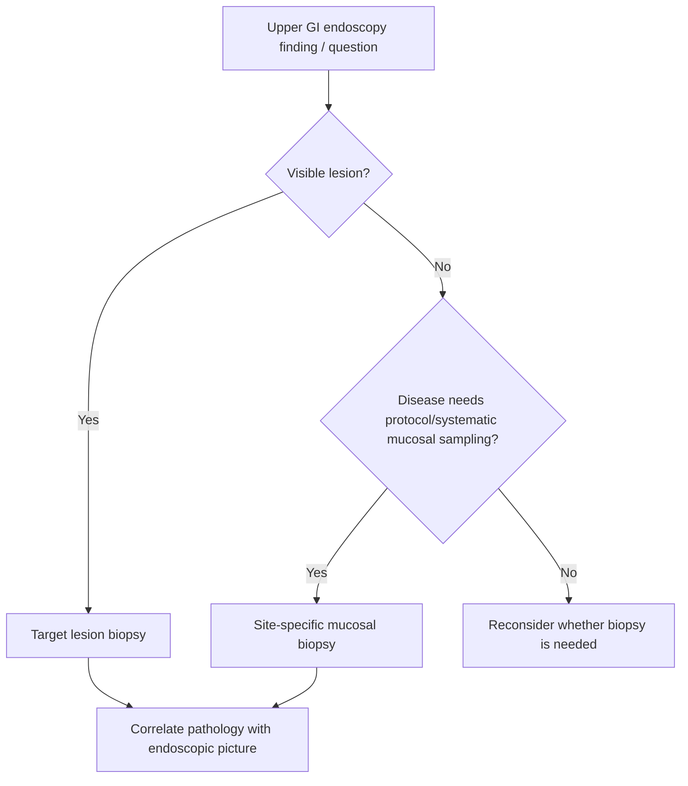

# Biopsy strategy at upper GI endoscopy

Related: [[../Gastroenterology MOC|Gastroenterology MOC]] · [[../Endoscopy and Gastroenterology Investigations|Endoscopy and Gastroenterology Investigations]] · [[Indications for upper GI endoscopy]] · [[../Stomach and Duodenal Disorders/Helicobacter pylori infection|Helicobacter pylori infection]] · [[../Small Bowel Malabsorption and Coeliac Disease/Coeliac disease|Coeliac disease]]

> [!important]
> Biopsy strategy in upper GI endoscopy should be **question-driven**: sample the lesion or mucosa needed to answer the diagnostic question, and do not rely on a vague “random biopsy” habit when a targeted plan is required.

## 1. Learning Objectives
- Explain why biopsy strategy must be indication-based.
- Recognize common upper-GI biopsy targets.
- Understand when targeted and when systematic sampling is needed.
- Avoid sampling errors that miss diagnosis.

## 2. Core Principle
Biopsy is not taken “just because an endoscope is there”; it is taken to answer a specific question such as:
- malignancy?
- eosinophilic/inflammatory disease?
- *H. pylori*-associated gastritis?
- coeliac disease?
- Barrett or other mucosal change?

## 3. Practical Biopsy Situations
### Visible focal lesion
- target the lesion directly
- obtain adequate representative samples
- include suspicious edges/areas when appropriate

### Diffuse inflammatory or abnormal mucosa
- biopsy the areas most likely to show pathology
- consider systematic sampling if the disease pattern requires it

### Dysphagia / esophageal mucosal disease
- biopsy suspicious strictures, masses, or inflammatory mucosa
- eosinophilic oesophagitis suspicion needs appropriate sampling despite sometimes subtle endoscopic appearance

### Gastric questions
- abnormal ulcers, masses, nodularity, or suspicious mucosa should be sampled
- biopsy strategy may also support *H. pylori* and gastritis evaluation depending on context

### Duodenal questions
- duodenal biopsy is high yield when coeliac disease or proximal small-bowel mucosal disease is suspected

## 4. Red Flags / High-Stakes Context
- visible mass
- ulcer with malignant features
- unexplained stricture
- weight loss / anemia with suspicious mucosa
- persistent symptoms despite prior negative or incomplete evaluation

## 5. Preparation and Safety Considerations
- know the diagnostic aim before sedation/endoscopy
- consider anticoagulants/antiplatelets and bleeding risk
- communicate the clinical question clearly to pathology when relevant

## 6. Interpretation Framework
### Biopsy decision algorithm
1. What is the diagnostic question?
2. Is there a visible lesion, diffuse mucosal abnormality, or disease requiring protocol sampling?
3. Sample the relevant site(s) adequately.
4. Ensure the pathology request reflects the real clinical suspicion.
5. Reassess if pathology and clinical picture do not fit.

## 7. Common Diagnostic Use-Cases
- suspected upper-GI cancer
- eosinophilic oesophagitis
- gastric ulcer/mass evaluation
- coeliac disease
- chronic gastritis / *H. pylori*-related disease

## 8. Cautions
- a normal-looking mucosa does not always exclude histologic disease
- inadequate/poorly targeted biopsy may produce false reassurance
- pathology results must be interpreted with the endoscopic and clinical picture together

## 9. FCPS/MRCP High-Yield Points
- Sample the lesion that answers the question.
- Coeliac suspicion requires duodenal biopsy logic.
- Eosinophilic oesophagitis may require biopsies despite modest visual changes.
- Malignant-looking ulcers and strictures should not be left unbiopsied.

## 10. Common Viva Traps
- Taking too few or poorly targeted samples.
- Forgetting to biopsy suspicious but non-mass lesions.
- Treating a negative inadequate biopsy as definitive.

## 11. One-Page Summary
- Biopsy strategy is **indication-driven**.
- Biopsy focal lesions directly and sample disease-specific mucosa when protocol-based diagnosis is needed.
- Key use-cases: cancer, eosinophilic esophagitis, gastritis/*H. pylori*, coeliac disease.
- Poor sampling can miss real disease.

## 12. Mind Map
- UGI biopsy strategy
  - lesion-directed
  - esophagus
    - stricture
    - EoE
    - mass
  - stomach
    - ulcer
    - suspicious mucosa
    - H. pylori
  - duodenum
    - coeliac
  - cautions
    - inadequate sampling
    - wrong target

## 13. Flowchart

## 14. Revision Prompts
- Why must biopsy be question-driven?
- When should you think of duodenal biopsy?
- Why can a normal-looking mucosa still require biopsy?
- What is the danger of inadequate sampling?

## 15. MCQs (10)
1. The best biopsy principle is:
   - A. Indication-driven targeted sampling
   - B. Random biopsy of everything always
   - C. Never biopsy visible lesions
   - D. Depend only on visual impression
   - **Answer: A**
2. Suspicious upper-GI masses should:
   - A. Be biopsied
   - B. Be ignored if the patient is stable
   - C. Never be sampled
   - D. Be treated as functional disease
   - **Answer: A**
3. A classic reason for duodenal biopsy is suspicion of:
   - A. Coeliac disease
   - B. Asthma
   - C. Otitis media
   - D. Cataract
   - **Answer: A**
4. Which statement is correct?
   - A. Normal-looking mucosa may still harbor histologic disease
   - B. Normal appearance excludes all pathology
   - C. Pathology correlation is unnecessary
   - D. Biopsies are never needed in dysphagia workup
   - **Answer: A**
5. Eosinophilic oesophagitis may require biopsy even when:
   - A. Endoscopic changes are subtle
   - B. Stool is loose
   - C. The patient coughs once
   - D. There is rhinitis only
   - **Answer: A**
6. A dangerous mistake is:
   - A. Taking inadequate or poorly targeted samples
   - B. Stating the clinical question
   - C. Assessing bleeding risk
   - D. Reviewing pathology together with the clinical picture
   - **Answer: A**
7. Gastric abnormal ulcers should generally:
   - A. Be considered for biopsy
   - B. Never be sampled
   - C. Be managed only by reassurance
   - D. Replace history taking
   - **Answer: A**
8. Which helps pathology interpretation?
   - A. Clear clinical information on the request
   - B. Empty request forms
   - C. No history at all
   - D. Avoiding communication
   - **Answer: A**
9. Biopsy strategy is especially important because it:
   - A. Reduces false reassurance from poor sampling
   - B. Prevents all need for pathology
   - C. Makes endoscopy obsolete
   - D. Always removes lesions completely
   - **Answer: A**
10. Best summary?
   - A. Sample the site most likely to answer the diagnostic question
   - B. Biopsy randomly without a plan
   - C. Visual diagnosis alone is always enough
   - D. Suspicious lesions do not need tissue diagnosis
   - **Answer: A**

## 16. SBA Questions (10)
1. A patient has progressive dysphagia and a tight irregular distal oesophageal stricture. Best biopsy principle?
   - A. Targeted biopsy of the suspicious lesion/stricture
   - B. Ignore it if the patient can swallow liquids
   - C. Biopsy only the duodenum
   - D. No tissue diagnosis is needed
   - **Answer: A**
2. A patient with chronic dyspepsia has an irregular gastric ulcer on endoscopy. Best next step?
   - A. Biopsy the lesion appropriately
   - B. Assume it is benign without histology
   - C. Stop the procedure immediately and never sample
   - D. Treat as IBS
   - **Answer: A**
3. Which scenario most strongly supports duodenal biopsy?
   - A. Suspected coeliac disease
   - B. Isolated tinnitus
   - C. Knee pain only
   - D. Dry eyes only
   - **Answer: A**
4. What is a dangerous error?
   - A. Accepting a poor or inadequate biopsy as final truth when suspicion remains high
   - B. Reviewing pathology with endoscopic findings
   - C. Stating the clinical suspicion
   - D. Sampling a visible mass
   - **Answer: A**
5. Which statement is true?
   - A. Histologic disease may exist even when mucosa does not look dramatic
   - B. Endoscopic appearance alone always excludes disease
   - C. Biopsy never helps dysphagia evaluation
   - D. Pathology is unrelated to endoscopy
   - **Answer: A**
6. Eosinophilic oesophagitis requires attention because:
   - A. Endoscopic findings may be subtle yet biopsies still matter
   - B. It is purely a liver disease
   - C. It excludes dysphagia
   - D. It is diagnosed from stool culture
   - **Answer: A**
7. Which site is most logical to biopsy when coeliac disease is suspected?
   - A. Duodenum
   - B. Colon only
   - C. Ear canal
   - D. Bronchus
   - **Answer: A**
8. What should guide sampling?
   - A. The diagnostic question and lesion/site pattern
   - B. Chance alone
   - C. The patient’s shoe size
   - D. Hair color
   - **Answer: A**
9. Why is anticoagulant planning relevant?
   - A. Biopsy can involve bleeding risk
   - B. It improves vision testing
   - C. It treats *H. pylori*
   - D. It prevents all pathology errors
   - **Answer: A**
10. Best exam phrase?
   - A. Biopsy strategy at upper GI endoscopy is targeted, disease-specific, and clinically contextual
   - B. Biopsy is random by default
   - C. Suspicious lesions should not be sampled
   - D. Pathology correlation is unnecessary
   - **Answer: A**

## 17. Flashcards
- Q: What is the main principle of upper-GI biopsy strategy?
  A: Biopsy should be targeted and driven by the diagnostic question.
- Q: Which upper-GI suspicion classically requires duodenal biopsy?
  A: Coeliac disease.
- Q: Why can eosinophilic oesophagitis be missed?
  A: Because visual changes may be subtle if biopsies are not taken.
- Q: Should suspicious ulcers and masses be biopsied?
  A: Yes.
- Q: Why is a negative inadequate biopsy not always reassuring?
  A: Because poor sampling can miss real disease.

## 18. Must Know / Should Know / Nice to Know
### Must Know
- Biopsy is question-driven: sample the lesion/mucosa needed to answer the clinical question
- Visible lesions: target directly; diffuse disease: systematic or targeted sampling
- Coeliac = duodenal biopsies (bulb + distal); H. pylori = antrum+body; EoE = mid+distal oesophagus despite normal appearance
- Inadequate sampling = false reassurance; communicate clinical question to pathologist

### Should Know
- Appropriate use criteria
- Patient preparation requirements
- Alternative investigations

### Nice to Know
- Emerging technologies
- Cost-effectiveness data
- AI-assisted interpretation

## 19. Self-Test Scorecard
- Can I state the key indication for this investigation? /10
- Can I name 3 quality metrics? /10
- Can I explain the interpretation framework? /10
- Can I outline the limitations? /10

**Interpretation:**
- **<35/40** = weak topic
- **35-36/40** = acceptable but insecure
- **37+/40** = exam-ready

## 20. Answer Key with Explanations

