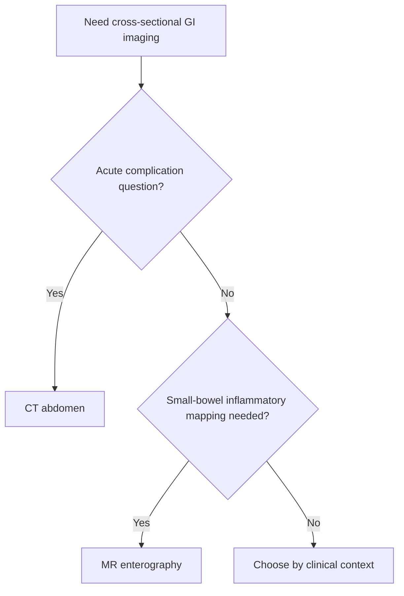

# CT abdomen and MR enterography selection

Related: [[../Gastroenterology MOC|Gastroenterology MOC]] · [[../Endoscopy and Gastroenterology Investigations|Endoscopy and Gastroenterology Investigations]] · [[Capsule endoscopy and enteroscopy basics]] · [[../Inflammatory and Functional Bowel Disorders/Crohn disease|Crohn disease]]

> [!important]
> The practical question is not which scan is more advanced, but **which modality best answers the current GI problem**: acute abdomen/complication assessment versus dedicated small-bowel inflammatory mapping.

## 1. Learning Objectives
- Distinguish the roles of CT abdomen and MR enterography.
- Choose the appropriate study for acute vs chronic inflammatory small-bowel questions.
- Recognize where each modality performs best.
- Avoid common imaging-selection mistakes.

## 2. Core Principle
- **CT abdomen** is rapid and high yield for acute abdominal pathology and many complications.
- **MR enterography** is particularly useful for detailed small-bowel assessment, especially inflammatory disease patterns such as Crohn disease.

## 3. CT Abdomen
### Best suited for
- acute abdominal pain
- suspected obstruction, perforation, abscess, or urgent complication
- rapid cross-sectional evaluation in the acutely unwell patient

### Strengths
- fast
- widely used in urgent settings
- excellent complication survey tool

## 4. MR Enterography
### Best suited for
- small-bowel inflammatory assessment
- mapping extent/activity of Crohn disease
- repeated assessment where detailed bowel characterization is needed

### Strengths
- dedicated bowel evaluation
- useful for disease extent and complications in chronic inflammatory bowel disease pathways

## 5. Selection Logic
Choose **CT** when you need:
- speed
- broad acute abdominal complication assessment
- urgent surgical/complication overview

Choose **MR enterography** when you need:
- focused small-bowel inflammatory detail
- Crohn mapping and extent
- more elective detailed bowel characterization

## 6. Red Flags Favouring Urgent CT
- peritonism
- sepsis
- suspected perforation
- suspected obstruction
- severe acute deterioration

## 7. Cautions
- do not delay urgent CT in an acutely unstable/complicated patient while chasing the “ideal” bowel study
- do not overuse generic CT when the real question is small-bowel inflammatory mapping better answered by MR enterography

## 8. FCPS/MRCP High-Yield Points
- CT abdomen = acute complications / rapid survey.
- MR enterography = small-bowel inflammatory detail, especially Crohn disease.
- Imaging choice is indication-specific.

## 9. Common Viva Traps
- Choosing MR enterography in an urgent perforation/obstruction scenario.
- Choosing only plain CT when detailed Crohn extent/activity assessment is the real aim.

## 10. One-Page Summary
- **CT abdomen**: acute, rapid, complication-focused.
- **MR enterography**: elective/targeted small-bowel inflammatory assessment.
- Match the modality to the question.

## 11. Mind Map
- CT vs MRE
  - CT
    - acute pain
    - obstruction
    - perforation
    - abscess
  - MR enterography
    - Crohn
    - small bowel
    - mapping extent

## 12. Flowchart

## 13. Revision Prompts
- When is CT abdomen preferred?
- Why is MR enterography valuable in Crohn disease?
- What acute red flags should not wait for elective imaging?

## 14. MCQs (10)
1. CT abdomen is especially useful for:
   - A. Acute abdominal complications
   - B. Hearing loss
   - C. Cataract staging
   - D. Migraine diagnosis
   - **Answer: A**
2. MR enterography is especially useful for:
   - A. Small-bowel inflammatory assessment
   - B. Distal ear disease
   - C. Pleural effusion diagnosis
   - D. Renal biopsy guidance
   - **Answer: A**
3. In suspected Crohn extent mapping, the better focused test is often:
   - A. MR enterography
   - B. Audiogram
   - C. CT head
   - D. ECG
   - **Answer: A**
4. In suspected perforation with acute deterioration, initial imaging logic favors:
   - A. CT abdomen
   - B. Elective MR enterography first
   - C. No imaging
   - D. Stool antigen
   - **Answer: A**
5. Which statement is correct?
   - A. CT is rapid and complication-focused; MRE is bowel-detail focused
   - B. The scans are identical in purpose
   - C. MRE is always first in unstable patients
   - D. CT never helps Crohn complications
   - **Answer: A**
6. A common trap is:
   - A. Delaying urgent CT while seeking the ideal elective bowel study
   - B. Matching scan to the question
   - C. Asking whether the problem is acute
   - D. Considering Crohn extent
   - **Answer: A**
7. Which red flag most favors CT?
   - A. Suspected obstruction
   - B. Mild chronic bloating only
   - C. Stable IBS symptoms
   - D. Simple heartburn
   - **Answer: A**
8. MR enterography best helps with:
   - A. Detailed small-bowel inflammatory mapping
   - B. Upper airway exam
   - C. Valve lesion grading
   - D. Stroke triage
   - **Answer: A**
9. Best principle?
   - A. Choose imaging by the clinical question, not by prestige
   - B. Always choose MR enterography
   - C. Always choose CT
   - D. Never image Crohn disease
   - **Answer: A**
10. Best summary?
   - A. CT answers urgent complication questions; MR enterography answers small-bowel inflammatory-detail questions
   - B. Both scans are interchangeable in all cases
   - C. CT is obsolete
   - D. MRE is only for liver disease
   - **Answer: A**

## 15. SBA Questions (10)
1. A patient with Crohn disease has chronic symptoms and you need small-bowel extent/activity assessment. Best modality principle?
   - A. MR enterography
   - B. Chest X-ray
   - C. ECG
   - D. Flexible sigmoidoscopy
   - **Answer: A**
2. A patient presents with severe abdominal pain, fever, and suspected obstruction. Best modality principle?
   - A. CT abdomen urgently
   - B. Elective MR enterography later as first test
   - C. No imaging
   - D. Stool culture
   - **Answer: A**
3. Which is a dangerous error?
   - A. Delaying urgent CT in an acutely deteriorating patient
   - B. Using MRE for elective Crohn mapping
   - C. Asking if the patient is septic
   - D. Looking for perforation clues
   - **Answer: A**
4. Why is MRE helpful in Crohn disease?
   - A. It gives dedicated small-bowel inflammatory detail
   - B. It diagnoses hemorrhoids
   - C. It measures troponin
   - D. It replaces endoscopy in every case
   - **Answer: A**
5. Which scan is quicker in many acute settings?
   - A. CT abdomen
   - B. MR enterography
   - C. Capsule endoscopy
   - D. Stool antigen
   - **Answer: A**
6. Which scenario most fits MR enterography?
   - A. Elective detailed small-bowel inflammatory evaluation
   - B. Suspected perforation with shock
   - C. Massive hematemesis
   - D. Acute stridor
   - **Answer: A**
7. Which is true?
   - A. Imaging choice depends on whether the problem is acute/complicated or chronic/inflammatory-detail focused
   - B. CT and MRE are identical
   - C. Only CT has GI value
   - D. Only MRE has complication value
   - **Answer: A**
8. Which red flag most pushes CT over MRE?
   - A. Peritonism
   - B. Stable mild IBS symptoms
   - C. Seasonal rhinitis
   - D. Dry scalp
   - **Answer: A**
9. Main exam pearl?
   - A. CT for urgency, MRE for bowel-detail mapping
   - B. MRE for all acute abdomens
   - C. CT never assesses complications
   - D. Neither helps Crohn disease
   - **Answer: A**
10. Best summary?
   - A. Indication-specific imaging selection is the key
   - B. Scan choice is random
   - C. CT is always wrong
   - D. MRE is always wrong
   - **Answer: A**

## 16. Flashcards
- Q: When is CT abdomen preferred?
  A: In acute abdominal complications such as obstruction, perforation, abscess, or severe deterioration.
- Q: When is MR enterography preferred?
  A: For detailed small-bowel inflammatory assessment, especially Crohn disease.
- Q: What is the key selection principle?
  A: Match the modality to the clinical question.
- Q: What dangerous delay must be avoided?
  A: Delaying urgent CT in an unstable acute abdomen.
- Q: What does MRE add in IBD?
  A: Extent/activity mapping of small-bowel disease.

## 17. Must Know / Should Know / Nice to Know
### Must Know
- CT abdomen: first-line for acute abdominal pain, pancreatitis complications, obstruction, masses
- MR enterography: radiation-free for young/Crohn patients; excellent for small bowel inflammation/fistulae/strictures
- CT for calcifications, acute bleeding, vascular; MR for chronic inflammation, young patients, pregnancy
- Oral contrast (CT) vs enteric contrast (MRE) for bowel distension

### Should Know
- Appropriate use criteria
- Patient preparation requirements
- Alternative investigations

### Nice to Know
- Emerging technologies
- Cost-effectiveness data
- AI-assisted interpretation

## 18. Self-Test Scorecard
- Can I state the key indication for this investigation? /10
- Can I name 3 quality metrics? /10
- Can I explain the interpretation framework? /10
- Can I outline the limitations? /10

**Interpretation:**
- **<35/40** = weak topic
- **35-36/40** = acceptable but insecure
- **37+/40** = exam-ready

## 19. Answer Key with Explanations

