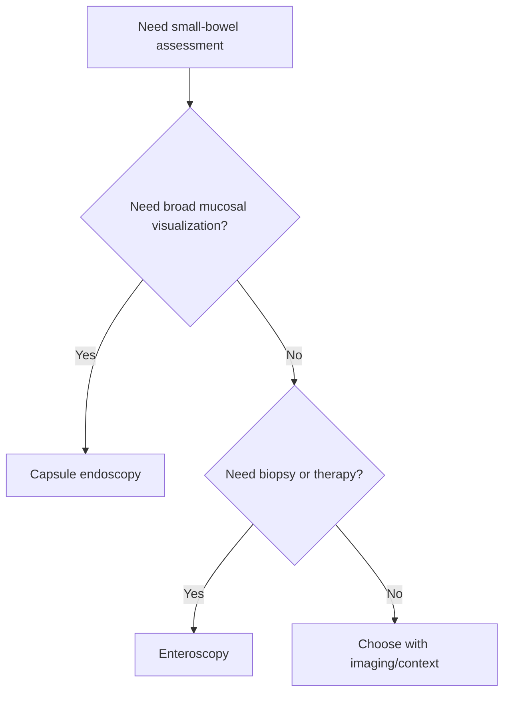

# Capsule endoscopy and enteroscopy basics

Related: [[../Gastroenterology MOC|Gastroenterology MOC]] · [[../Endoscopy and Gastroenterology Investigations|Endoscopy and Gastroenterology Investigations]] · [[CT abdomen and MR enterography selection]]

> [!important]
> Capsule endoscopy is mainly a **small-bowel mucosal visualization tool**, while enteroscopy is the **deeper endoscopic access tool** that allows intervention and tissue sampling when needed.

## 1. Learning Objectives
- Define capsule endoscopy and enteroscopy.
- Explain when capsule endoscopy is useful.
- Distinguish diagnostic visualization from therapeutic/interventional enteroscopy.
- Recognize major cautions.

## 2. Definitions
- **Capsule endoscopy**: swallowable camera system for small-bowel mucosal visualization.
- **Enteroscopy**: deeper endoscopic access into the small bowel for direct examination, biopsy, and selected therapy.

## 3. Capsule Endoscopy
### Uses
- obscure GI bleeding pathway
- suspected small-bowel mucosal pathology
- situations where small-bowel visual survey is required after standard endoscopy is unrevealing

### Strengths
- non-invasive relative to deep enteroscopy
- broad mucosal survey of the small bowel

### Limitations
- no biopsy
- no therapy
- not ideal if obstruction/retention risk is high

## 4. Enteroscopy
### Uses
- targeted direct assessment after capsule/imaging clues
- need for biopsy
- need for endoscopic therapy in the small bowel

### Strengths
- tissue diagnosis
- therapeutic capability

### Limitations
- more invasive and technically demanding

## 5. Selection Logic
Use **capsule endoscopy** when the key question is:
- "What is in the small-bowel mucosa?"

Use **enteroscopy** when the key question is:
- "Can I reach it, biopsy it, or treat it?"

## 6. Red Flags / Cautions
- suspected stricture or obstruction → retention risk with capsule
- severe ongoing bleeding or instability may need a different urgent pathway
- do not expect capsule to replace therapeutic endoscopy

## 7. FCPS/MRCP High-Yield Points
- Capsule = diagnosis/visualization.
- Enteroscopy = access/biopsy/therapy.
- Capsule is very useful in obscure GI bleeding pathways.

## 8. Common Viva Traps
- Forgetting capsule cannot biopsy or treat.
- Ignoring obstruction risk before capsule.
- Forgetting enteroscopy is usually the targeted follow-up/intervention tool.

## 9. One-Page Summary
- Capsule endoscopy visualizes the small bowel.
- Enteroscopy reaches the small bowel for biopsy and therapy.
- Think “see” versus “reach and act”.

## 10. Mind Map
- Small-bowel endoscopy
  - capsule
    - visualize
    - obscure bleed
    - no biopsy
  - enteroscopy
    - reach lesion
    - biopsy
    - therapy

## 11. Flowchart

## 12. Revision Prompts
- What can capsule endoscopy do that routine scope may miss?
- Why can’t capsule replace enteroscopy?
- What important risk must be checked before capsule use?

## 13. MCQs (10)
1. Capsule endoscopy mainly provides:
   - A. Small-bowel mucosal visualization
   - B. Colon resection
   - C. Liver biopsy
   - D. ECG tracing
   - **Answer: A**
2. Enteroscopy is especially useful when:
   - A. Biopsy or therapy is needed in the small bowel
   - B. Only a hearing test is needed
   - C. Cataract is suspected
   - D. Stroke is suspected
   - **Answer: A**
3. A key limitation of capsule endoscopy is:
   - A. It cannot biopsy or treat
   - B. It cannot image bowel mucosa
   - C. It always causes perforation
   - D. It is only for the oesophagus
   - **Answer: A**
4. Capsule endoscopy is high yield in:
   - A. Obscure GI bleeding pathway
   - B. Otitis media
   - C. Asthma staging
   - D. Migraine with aura
   - **Answer: A**
5. Which risk matters before capsule use?
   - A. Stricture/obstruction with retention risk
   - B. Rhinitis
   - C. Dry scalp
   - D. Cataract
   - **Answer: A**
6. Which statement is correct?
   - A. Capsule helps you see; enteroscopy helps you reach/biopsy/treat
   - B. Capsule and enteroscopy are identical
   - C. Capsule treats bleeding lesions directly
   - D. Enteroscopy cannot biopsy
   - **Answer: A**
7. A common trap is:
   - A. Expecting capsule to provide tissue diagnosis
   - B. Using enteroscopy for biopsy
   - C. Considering obscure bleed pathway
   - D. Reviewing stricture risk
   - **Answer: A**
8. Which is more invasive?
   - A. Enteroscopy
   - B. Capsule endoscopy
   - C. Stool antigen
   - D. FIT
   - **Answer: A**
9. Which patient most suits capsule first?
   - A. Unexplained small-bowel bleeding suspicion after routine evaluation
   - B. Need for immediate tissue biopsy
   - C. Known obstructing stricture
   - D. Acute airway compromise
   - **Answer: A**
10. Best summary?
   - A. Capsule visualizes; enteroscopy intervenes
   - B. Capsule replaces all endoscopy
   - C. Enteroscopy has no therapeutic role
   - D. Both are for liver disease only
   - **Answer: A**

## 14. SBA Questions (10)
1. A patient has obscure GI bleeding after standard upper and lower endoscopy. Best next principle?
   - A. Consider capsule endoscopy for small-bowel mucosal visualization
   - B. No further GI evaluation
   - C. Ear examination
   - D. Spirometry
   - **Answer: A**
2. Capsule shows a suspected small-bowel lesion needing tissue diagnosis. Best next principle?
   - A. Enteroscopy
   - B. Repeat capsule only forever
   - C. Stop evaluation
   - D. Nebulization
   - **Answer: A**
3. Which is a dangerous error?
   - A. Ignoring obstruction risk before capsule use
   - B. Asking about small-bowel bleed suspicion
   - C. Reviewing whether tissue is needed
   - D. Distinguishing visualization from therapy
   - **Answer: A**
4. Which statement is true?
   - A. Enteroscopy allows biopsy and therapeutic intervention
   - B. Capsule allows biopsy
   - C. Capsule is always therapeutic
   - D. Enteroscopy cannot inspect bowel directly
   - **Answer: A**
5. Which best describes capsule endoscopy?
   - A. Broad small-bowel visualization tool
   - B. Immediate coagulation therapy tool
   - C. Liver stiffness measurement
   - D. Colon cancer surgery
   - **Answer: A**
6. Why might capsule be avoided or used cautiously?
   - A. Risk of retention in suspected stricture/obstruction
   - B. Because it can always treat disease
   - C. Because it only sees the colon
   - D. Because it measures CRP
   - **Answer: A**
7. Which question best points to enteroscopy?
   - A. Do I need to biopsy or treat a small-bowel lesion?
   - B. Do I need a broad noninvasive visual survey?
   - C. Is the patient febrile from pneumonia?
   - D. Is there nephrotic syndrome?
   - **Answer: A**
8. Main exam pearl?
   - A. Capsule is diagnostic visualization; enteroscopy is interventional access
   - B. Capsule and enteroscopy are interchangeable
   - C. Enteroscopy is obsolete
   - D. Capsule treats active bleeding directly
   - **Answer: A**
9. Which scenario fits enteroscopy better than capsule?
   - A. Need for biopsy of a known small-bowel lesion
   - B. Initial broad survey for obscure bleeding
   - C. Mild dyspepsia triage
   - D. Ear discharge
   - **Answer: A**
10. Best summary?
   - A. Think “see with capsule” and “reach/act with enteroscopy”
   - B. Think “capsule does everything”
   - C. Think “enteroscopy never biopsies”
   - D. Think “neither has a role in GI bleeding”
   - **Answer: A**

## 15. Flashcards
- Q: What is the main role of capsule endoscopy?
  A: Small-bowel mucosal visualization.
- Q: What is the main role of enteroscopy?
  A: Direct access for biopsy and therapy in the small bowel.
- Q: What major limitation does capsule have?
  A: It cannot biopsy or treat.
- Q: What major risk must be considered before capsule use?
  A: Capsule retention in suspected stricture/obstruction.
- Q: In obscure GI bleeding, which tool is often useful for initial small-bowel visualization?
  A: Capsule endoscopy.

## 16. Must Know / Should Know / Nice to Know
### Must Know
- Capsule endoscopy = first-line for obscure GI bleeding (OGIB) after negative upper/lower endoscopy
- Retention risk: strictures, Crohn, radiation; patency capsule if uncertain
- Device-assisted enteroscopy (balloon/spiral/motorized) for therapy after capsule finding
- Capsule does not replace colonoscopy for colorectal screening

### Should Know
- Appropriate use criteria
- Patient preparation requirements
- Alternative investigations

### Nice to Know
- Emerging technologies
- Cost-effectiveness data
- AI-assisted interpretation

## 17. Self-Test Scorecard
- Can I state the key indication for this investigation? /10
- Can I name 3 quality metrics? /10
- Can I explain the interpretation framework? /10
- Can I outline the limitations? /10

**Interpretation:**
- **<35/40** = weak topic
- **35-36/40** = acceptable but insecure
- **37+/40** = exam-ready

## 18. Answer Key with Explanations

