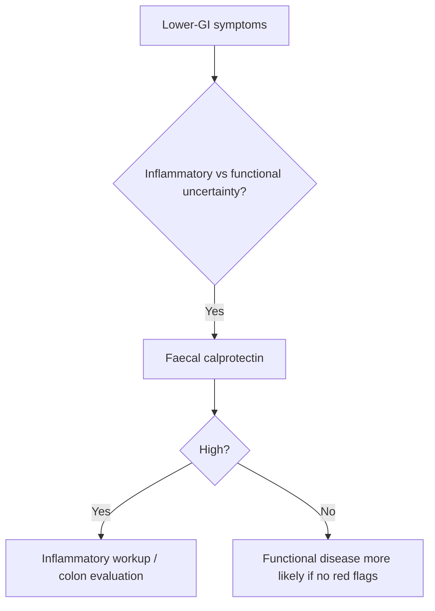

# Faecal calprotectin and inflammatory marker interpretation

Related: [[../Gastroenterology MOC|Gastroenterology MOC]] · [[../Endoscopy and Gastroenterology Investigations|Endoscopy and Gastroenterology Investigations]] · [[../Inflammatory and Functional Bowel Disorders/Ulcerative colitis|Ulcerative colitis]] · [[../Inflammatory and Functional Bowel Disorders/Crohn disease|Crohn disease]]

> [!important]
> Faecal calprotectin helps separate **inflammatory bowel disease** from many functional bowel syndromes, but it is a **triage biomarker**, not a stand-alone diagnosis.

## 1. Learning Objectives
- Explain what faecal calprotectin reflects.
- Use it to distinguish inflammatory from functional patterns.
- Understand how it complements CRP/ESR and colonoscopy.
- Recognize false reassurance and false alarm pitfalls.

## 2. Definition
Faecal calprotectin is a stool biomarker reflecting neutrophil-driven intestinal inflammation.

## 3. Clinical Role
It is most useful when the question is:
- inflammatory bowel disease versus IBS/functional symptoms
- whether bowel inflammation is likely enough to justify further lower-GI evaluation

## 4. Interpretation Logic
### Higher values suggest
- intestinal inflammation
- IBD or other organic inflammatory pathology
- need for more definitive assessment

### Lower values suggest
- functional bowel disorder is more likely
- significant inflammatory pathology is less likely, though not impossible

## 5. Relationship to Blood Markers
- CRP/ESR may support systemic inflammatory assessment
- stool calprotectin is more gut-focused
- discordant results require clinical interpretation rather than blind rule-following

## 6. Red Flags
Regardless of biomarker result, these still matter:
- weight loss
- rectal bleeding
- anemia
- fever/systemic illness
- persistent nocturnal symptoms
- strong family history or severe deterioration

## 7. Interpretation Framework
1. Are symptoms likely functional or inflammatory?
2. Use calprotectin when that distinction is genuinely useful.
3. If high or clearly concerning → move toward definitive GI evaluation.
4. If low and no red flags → functional disease becomes more likely.
5. Never let a single marker overrule strong alarming clinical features.

## 8. Management Link
- suspected IBS but organic doubt → calprotectin can help triage
- suspected IBD with inflammatory symptoms → calprotectin supports escalation to colon evaluation

## 9. FCPS/MRCP High-Yield Points
- Calprotectin is an inflammation marker, not an IBD diagnosis by itself.
- Low result supports but does not prove functional disease.
- High result supports inflammatory workup.

## 10. Common Viva Traps
- Calling every high calprotectin “IBD” without context.
- Ignoring strong red flags because calprotectin is low.
- Forgetting that stool markers and blood markers answer slightly different questions.

## 11. One-Page Summary
- Faecal calprotectin is a **gut inflammation biomarker**.
- Helpful in **IBD vs IBS** triage.
- High result → consider organic inflammation.
- Low result → functional disease more likely if no red flags.

## 12. Mind Map
- Calprotectin
  - high → inflammation likely
  - low → functional more likely
  - not definitive alone
  - red flags still matter

## 13. Flowchart

## 14. Revision Prompts
- What does calprotectin measure?
- Why is it useful in IBS vs IBD?
- Why can a low result still be unsafe in a red-flag patient?

## 15. MCQs (10)
1. Faecal calprotectin mainly reflects:
   - A. Intestinal inflammation
   - B. Liver synthetic function
   - C. Renal concentrating ability
   - D. Pancreatic endocrine output
   - **Answer: A**
2. It is especially useful in distinguishing:
   - A. IBD from functional bowel disease
   - B. Asthma from COPD
   - C. Stroke from seizure
   - D. AKI from CKD
   - **Answer: A**
3. A high calprotectin suggests:
   - A. Organic inflammatory pathology is more likely
   - B. IBS is proven
   - C. Cancer is excluded
   - D. No further testing is needed
   - **Answer: A**
4. A low calprotectin means:
   - A. Functional disease is more likely if no red flags
   - B. Red flags are irrelevant
   - C. IBD is impossible in every case
   - D. Colonoscopy is forbidden
   - **Answer: A**
5. Which statement is correct?
   - A. Calprotectin is a triage marker, not a diagnosis by itself
   - B. It alone diagnoses UC
   - C. It replaces history and examination
   - D. It is unrelated to GI disease
   - **Answer: A**
6. Which still overrides a reassuring low result?
   - A. Weight loss and bleeding
   - B. Stable appetite only
   - C. Dry skin
   - D. Sneezing
   - **Answer: A**
7. Which marker is more gut-focused than CRP?
   - A. Faecal calprotectin
   - B. Troponin
   - C. PSA
   - D. CK-MB
   - **Answer: A**
8. A common trap is:
   - A. Calling every raised result definite IBD
   - B. Integrating biomarker with symptoms
   - C. Using it for triage
   - D. Considering colon evaluation when high
   - **Answer: A**
9. A best use-case is:
   - A. Chronic bowel symptoms with uncertainty between inflammatory and functional disease
   - B. Isolated dysphagia
   - C. Otitis externa
   - D. Cataract
   - **Answer: A**
10. Best summary?
   - A. Calprotectin supports risk stratification for intestinal inflammation
   - B. It diagnoses every bowel disease
   - C. It excludes cancer universally
   - D. It is a blood test only
   - **Answer: A**

## 16. SBA Questions (10)
1. A 29-year-old with chronic abdominal pain and loose stool but no weight loss or bleeding has diagnostic uncertainty between IBS and IBD. Useful test?
   - A. Faecal calprotectin
   - B. Troponin
   - C. Audiogram
   - D. Thyroid ultrasound
   - **Answer: A**
2. A patient has low calprotectin but clear rectal bleeding and weight loss. Best interpretation?
   - A. Red flags still require further evaluation
   - B. IBD/cancer are impossible
   - C. No follow-up is needed
   - D. It must be IBS
   - **Answer: A**
3. What is a dangerous error?
   - A. Letting a low biomarker overrule strong clinical alarm features
   - B. Using calprotectin in IBS-vs-IBD uncertainty
   - C. Considering CRP alongside it
   - D. Asking about nocturnal symptoms
   - **Answer: A**
4. Which statement is true?
   - A. High calprotectin supports inflammatory workup but is not specific for one disease alone
   - B. High result proves UC specifically
   - C. Low result makes all pathology impossible
   - D. Stool testing never helps lower-GI triage
   - **Answer: A**
5. Which symptom pattern most supports using this test?
   - A. Chronic lower-GI symptoms with uncertainty between functional and inflammatory disease
   - B. Acute earache
   - C. Chest trauma
   - D. Blurred vision
   - **Answer: A**
6. Which is more likely with a low result and no red flags?
   - A. Functional bowel disorder
   - B. Severe active IBD proven
   - C. Upper GI bleed
   - D. Acute pancreatitis
   - **Answer: A**
7. CRP and calprotectin differ because:
   - A. Calprotectin is more bowel-focused
   - B. CRP is stool-specific
   - C. They are identical tests
   - D. Neither reflects inflammation
   - **Answer: A**
8. Which red flag should keep concern high even with a low test?
   - A. Iron-deficiency anaemia
   - B. Mild fatigue only
   - C. Seasonal rhinitis
   - D. Dry scalp
   - **Answer: A**
9. Main role?
   - A. Triage toward or away from inflammatory lower-GI disease
   - B. Replace colonoscopy in all patients
   - C. Diagnose H pylori
   - D. Stage pancreatic cancer
   - **Answer: A**
10. Best exam phrase?
   - A. Faecal calprotectin is best used as a gut-inflammation triage marker interpreted in clinical context
   - B. It is definitive alone
   - C. It makes red flags obsolete
   - D. It is useless in bowel disease
   - **Answer: A**

## 17. Flashcards
- Q: What does faecal calprotectin reflect?
  A: Neutrophil-driven intestinal inflammation.
- Q: What common differential is it used for?
  A: IBD vs IBS/functional disease.
- Q: Does a low result overrule weight loss and bleeding?
  A: No.
- Q: What does a high result imply?
  A: Organic inflammatory disease is more likely.
- Q: Is calprotectin a stand-alone diagnosis?
  A: No.

## 18. Must Know / Should Know / Nice to Know
### Must Know
- Calprotectin: neutrophil protein; <50 μg/g = normal; 50-250 = indeterminate; >250 = likely IBD/inflammation
- Distinguishes IBD from IBS; monitors disease activity; predicts relapse
- False +ve: NSAIDs, PPIs, infection, colorectal cancer; False -ve: proximal small bowel disease
- CRP + calprotectin together improve specificity; serology (ASCA, pANCA) for IBD typing

### Should Know
- Appropriate use criteria
- Patient preparation requirements
- Alternative investigations

### Nice to Know
- Emerging technologies
- Cost-effectiveness data
- AI-assisted interpretation

## 19. Self-Test Scorecard
- Can I state the key indication for this investigation? /10
- Can I name 3 quality metrics? /10
- Can I explain the interpretation framework? /10
- Can I outline the limitations? /10

**Interpretation:**
- **<35/40** = weak topic
- **35-36/40** = acceptable but insecure
- **37+/40** = exam-ready

## 20. Answer Key with Explanations

