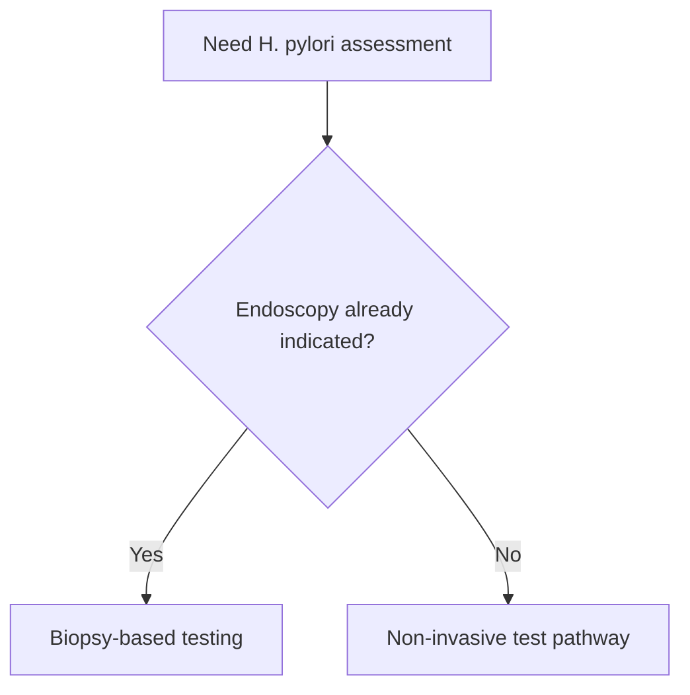

# Helicobacter pylori testing strategy

Related: [[../Gastroenterology MOC|Gastroenterology MOC]] · [[../Endoscopy and Gastroenterology Investigations|Endoscopy and Gastroenterology Investigations]] · [[../Stomach and Duodenal Disorders/Helicobacter pylori infection|Helicobacter pylori infection]] · [[Indications for upper GI endoscopy]]

> [!important]
> *H. pylori* testing should match the clinical context: **non-invasive testing in appropriate unscoped patients**, and **biopsy-based diagnosis when endoscopy is already indicated**.

## 1. Learning Objectives
- Choose between non-invasive and endoscopic *H. pylori* tests.
- Understand how clinical context changes the testing pathway.
- Recognize common pitfalls causing false reassurance.
- Link testing to dyspepsia and ulcer pathways.

## 2. Core Principle
Two broad pathways exist:
1. **Non-invasive testing** when endoscopy is not otherwise required.
2. **Biopsy-based testing** when upper GI endoscopy is already indicated.

## 3. Non-Invasive Tests
- urea breath test
- stool antigen test

### Advantages
- no endoscopy needed
- useful in uninvestigated dyspepsia pathways
- suitable for confirmation strategies in selected contexts

## 4. Endoscopic / Biopsy-Based Tests
- histology / biopsy-based detection when scoped
- rapid urease-type logic depending on local pathway

### Best used when
- alarm features mandate endoscopy anyway
- ulcer, malignancy concern, or structural disease needs direct visualization

## 5. Clinical Use-Cases
- uninvestigated low-risk dyspepsia → non-invasive test strategy often appropriate
- alarm dyspepsia / bleeding / ulcer complication concern → endoscopy first, with biopsy-based testing if indicated

## 6. Cautions and Pitfalls
- recent acid suppression, antibiotics, or bismuth can affect some tests
- do not choose a non-invasive pathway when alarm features already require endoscopy
- a negative test should be interpreted in clinical context, especially if ulcer/cancer concern remains

## 7. Interpretation Framework
1. Does the patient need endoscopy for another reason?
2. If yes → biopsy-based testing can be incorporated.
3. If no → choose appropriate non-invasive testing.
4. Interpret results alongside symptoms, ulcer history, and treatment context.

## 8. FCPS/MRCP High-Yield Points
- Breath test and stool antigen are major non-invasive tests.
- Endoscopy plus biopsy is appropriate when the patient already needs a scope.
- Testing strategy is context-driven, not one-method-for-all.

## 9. Common Viva Traps
- Sending alarm dyspepsia patients only for non-invasive testing.
- Forgetting medication/test-interference issues.
- Treating a test result as more important than the clinical red-flag pathway.

## 10. One-Page Summary
- *H. pylori* testing is either **non-invasive** or **biopsy-based**.
- Low-risk dyspepsia often fits a non-invasive pathway.
- Alarm features or ulcer/bleeding concern usually push to endoscopy first.

## 11. Mind Map
- H. pylori testing
  - non-invasive
    - breath test
    - stool antigen
  - invasive
    - biopsy / histology
  - choose by context
    - low risk dyspepsia
    - alarm features

## 12. Flowchart

## 13. Revision Prompts
- Name 2 non-invasive tests.
- When is biopsy-based testing preferred?
- Why must alarm dyspepsia not be trapped in a test-only pathway?

## 14. MCQs (10)
1. A major non-invasive *H. pylori* test is:
   - A. Urea breath test
   - B. Colonoscopy
   - C. MRI brain
   - D. Audiogram
   - **Answer: A**
2. Stool antigen testing is:
   - A. A non-invasive *H. pylori* test
   - B. A liver biopsy
   - C. A pancreatic enzyme test
   - D. An ECG
   - **Answer: A**
3. Biopsy-based *H. pylori* testing is especially appropriate when:
   - A. Endoscopy is already indicated
   - B. No GI symptoms exist
   - C. Only skin disease exists
   - D. Colon-only disease is being assessed
   - **Answer: A**
4. Alarm dyspepsia should usually lead to:
   - A. Endoscopic pathway rather than test-only shortcut
   - B. No further evaluation
   - C. Breath test only always
   - D. Ear examination
   - **Answer: A**
5. Which can affect test accuracy?
   - A. Acid suppression or recent antibiotics
   - B. Shoe size
   - C. Hair texture
   - D. Eye colour
   - **Answer: A**
6. Which statement is correct?
   - A. Test choice depends on the clinical context
   - B. One test fits every patient
   - C. Endoscopy is never needed
   - D. Breath test replaces all judgment
   - **Answer: A**
7. A common trap is:
   - A. Using non-invasive testing when alarm features already mandate scope
   - B. Checking for red flags
   - C. Linking test choice to indication
   - D. Considering ulcer concern
   - **Answer: A**
8. Which is a biopsy-based method?
   - A. Histology at endoscopy
   - B. Stool antigen
   - C. Breath test
   - D. FIT
   - **Answer: A**
9. Low-risk uninvestigated dyspepsia often fits:
   - A. Non-invasive testing strategy
   - B. Mandatory surgery
   - C. Colonoscopy only
   - D. No GI pathway
   - **Answer: A**
10. Best summary?
   - A. *H. pylori* testing should match whether endoscopy is already needed
   - B. Breath test is always best regardless of context
   - C. Biopsy is never useful
   - D. Alarm features do not matter
   - **Answer: A**

## 15. SBA Questions (10)
1. A 30-year-old with low-risk dyspepsia and no alarm features needs *H. pylori* assessment. Best principle?
   - A. Non-invasive testing pathway
   - B. Immediate therapeutic colonoscopy
   - C. No assessment ever
   - D. Brain MRI first
   - **Answer: A**
2. A 61-year-old with weight loss and dyspepsia needs *H. pylori* assessment. Best principle?
   - A. Endoscopy first because alarm features are present
   - B. Stool antigen only and no scope
   - C. Ignore symptoms
   - D. Dermatology review
   - **Answer: A**
3. Which is a dangerous error?
   - A. Letting a non-invasive test replace the alarm-feature endoscopy pathway
   - B. Asking about bleeding
   - C. Checking weight loss
   - D. Linking test choice to risk level
   - **Answer: A**
4. Which statement is true?
   - A. Biopsy-based *H. pylori* testing fits naturally into indicated upper GI endoscopy
   - B. Endoscopy and testing are unrelated
   - C. Non-invasive tests are never useful
   - D. Alarm features are irrelevant
   - **Answer: A**
5. Which medication issue matters?
   - A. Recent PPI/antibiotic exposure may affect some tests
   - B. Hand lotion use
   - C. Shoe polish use
   - D. Hair gel
   - **Answer: A**
6. A patient with suspected bleeding ulcer is going for endoscopy. Best testing logic?
   - A. Use the scope-based pathway if appropriate
   - B. Delay all endoscopy for stool antigen only
   - C. No GI testing
   - D. Only FIT
   - **Answer: A**
7. Which is a non-invasive test?
   - A. Stool antigen
   - B. Histology
   - C. Endoscopic biopsy
   - D. Duodenal resection
   - **Answer: A**
8. Main principle?
   - A. Match test method to indication and need for endoscopy
   - B. Use one test for everyone
   - C. Never interpret results clinically
   - D. Ignore red flags
   - **Answer: A**
9. Which pathway is most appropriate in a patient already being scoped for dysphagia?
   - A. Biopsy-based testing if clinically relevant
   - B. Breath test only always
   - C. No tissue sampling ever
   - D. Colon prep first
   - **Answer: A**
10. Best exam phrase?
   - A. *H. pylori* strategy is contextual and must not bypass urgent endoscopic indications
   - B. Non-invasive tests replace all pathways
   - C. Biopsy never helps
   - D. Dyspepsia never needs risk stratification
   - **Answer: A**

## 16. Flashcards
- Q: Name 2 major non-invasive *H. pylori* tests.
  A: Urea breath test and stool antigen test.
- Q: When is biopsy-based testing preferred?
  A: When upper GI endoscopy is already indicated.
- Q: What is the key principle of *H. pylori* testing strategy?
  A: Match the test to the clinical context.
- Q: What common mistake must be avoided?
  A: Letting non-invasive testing replace endoscopy when alarm features are present.
- Q: What can reduce accuracy of some tests?
  A: Recent acid suppression or antibiotics.

## 17. Must Know / Should Know / Nice to Know
### Must Know
- Test-and-treat for uninvestigated dyspepsia <60yo without alarm features
- Non-invasive: urea breath test (UBT) = gold standard; stool antigen = alternative
- Invasive: rapid urease test (RUT) during endoscopy; histology if RUT negative/high suspicion
- Stop PPI 2 weeks, antibiotics 4 weeks before testing; confirm eradication post-treatment with UBT/stool Ag

### Should Know
- Appropriate use criteria
- Patient preparation requirements
- Alternative investigations

### Nice to Know
- Emerging technologies
- Cost-effectiveness data
- AI-assisted interpretation

## 18. Self-Test Scorecard
- Can I state the key indication for this investigation? /10
- Can I name 3 quality metrics? /10
- Can I explain the interpretation framework? /10
- Can I outline the limitations? /10

**Interpretation:**
- **<35/40** = weak topic
- **35-36/40** = acceptable but insecure
- **37+/40** = exam-ready

## 19. Answer Key with Explanations

