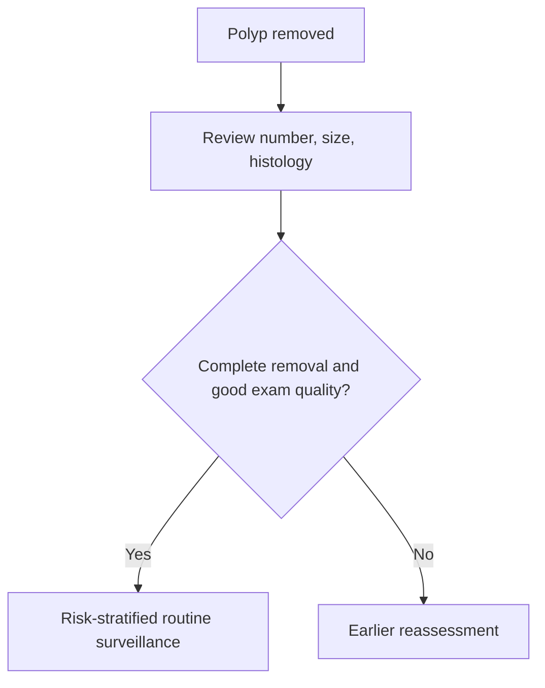

# Post-polypectomy surveillance logic

Related: [[../Gastroenterology MOC|Gastroenterology MOC]] · [[../Endoscopy and Gastroenterology Investigations|Endoscopy and Gastroenterology Investigations]] · [[Colonoscopy indications and bowel preparation]]

> [!important]
> Post-polypectomy surveillance is based on **future colorectal neoplasia risk**, which depends on the number, size, histology, completeness of removal, and quality of the initial colonoscopy.

## 1. Learning Objectives
- Explain why surveillance is needed after polyp removal.
- List key determinants of surveillance interval.
- Recognize when earlier reassessment is needed.
- Understand the importance of index-colonoscopy quality.

## 2. Core Principle
Surveillance is not automatic at the same interval for everyone. The logic depends on:
- number of polyps
- size of polyps
- histology / advanced features
- completeness of excision
- adequacy of bowel prep and exam quality

## 3. Why Surveillance Matters
Some polyps are markers of increased future adenoma/cancer risk. Good surveillance aims to:
- detect metachronous lesions
- reduce interval cancer risk
- avoid unnecessary over-scoping in truly low-risk patients

## 4. Risk Logic
### Lower risk
- few small low-risk lesions
- complete removal
- good-quality colonoscopy

### Higher risk
- multiple lesions
- larger lesions
- advanced histology / dysplasia
- piecemeal resection or uncertainty about complete removal
- poor prep or incomplete exam

## 5. Red Flags for Earlier Reassessment
- incomplete excision concern
- large/piecemeal resection
- poor bowel preparation
- histology suggesting advanced neoplasia
- ongoing symptoms not explained by prior findings

## 6. Practical Management Framework
1. Confirm pathology and number/size of removed lesions.
2. Assess whether excision was complete.
3. Review prep quality and completeness of colonoscopy.
4. Assign lower-risk vs higher-risk follow-up pathway.
5. Bring surveillance earlier if the index exam was inadequate.

## 7. Cautions
- a poor-quality baseline colonoscopy weakens surveillance decisions
- interval logic should not override new alarm symptoms
- post-polypectomy follow-up is about both **lesion risk** and **exam quality**

## 8. FCPS/MRCP High-Yield Points
- Size, number, histology, and completeness are the big determinants.
- Poor prep can force earlier reassessment.
- New symptoms still need fresh clinical thinking even in a surveillance patient.

## 9. Common Viva Traps
- Giving every patient the same interval.
- Ignoring incomplete or piecemeal resection.
- Forgetting that poor prep undermines reassurance.

## 10. One-Page Summary
- Surveillance after polypectomy depends on **polyp risk + quality of the initial exam**.
- Multiple, large, dysplastic, or incompletely removed lesions need closer follow-up.
- Poor prep or incomplete colonoscopy can shorten follow-up timing.

## 11. Mind Map
- Post-polypectomy surveillance
  - number
  - size
  - histology
  - complete removal?
  - prep quality
  - interval risk

## 12. Flowchart

## 13. Revision Prompts
- What determines surveillance interval?
- Why does poor prep matter?
- Why can incomplete resection require earlier review?

## 14. MCQs (10)
1. Surveillance interval after polypectomy depends on:
   - A. Polyp risk features and exam quality
   - B. Eye colour
   - C. Blood group only
   - D. Shoe size
   - **Answer: A**
2. A factor pushing earlier reassessment is:
   - A. Piecemeal resection
   - B. Mild thirst only
   - C. Sneezing
   - D. Dry skin
   - **Answer: A**
3. Which matters for risk?
   - A. Number of polyps
   - B. Hair colour
   - C. Height only
   - D. Hand dominance
   - **Answer: A**
4. Poor bowel prep is important because it:
   - A. Weakens reassurance from the index exam
   - B. Has no effect on surveillance
   - C. Prevents pathology reporting only
   - D. Improves lesion detection
   - **Answer: A**
5. Which is a higher-risk feature?
   - A. Advanced dysplasia
   - B. One trivial symptom-free event only
   - C. Short fingernails
   - D. Myopia
   - **Answer: A**
6. Which statement is correct?
   - A. Not all patients need the same follow-up interval
   - B. Everyone needs identical surveillance
   - C. Histology is irrelevant
   - D. Exam completeness does not matter
   - **Answer: A**
7. New alarm symptoms after prior polypectomy:
   - A. Still require fresh evaluation
   - B. Can always be ignored
   - C. Never change management
   - D. Exclude cancer automatically
   - **Answer: A**
8. A common trap is:
   - A. Ignoring incomplete excision
   - B. Reviewing pathology
   - C. Checking prep quality
   - D. Counting lesions
   - **Answer: A**
9. Which is most reassuring?
   - A. Few small low-risk lesions completely removed in a good exam
   - B. Multiple large dysplastic lesions
   - C. Poor prep and uncertain removal
   - D. Incomplete colonoscopy
   - **Answer: A**
10. Best summary?
   - A. Surveillance logic integrates lesion biology with the quality of the baseline colonoscopy
   - B. Surveillance is random
   - C. Removal ends all future risk
   - D. Pathology is unnecessary
   - **Answer: A**

## 15. SBA Questions (10)
1. A patient had a large sessile lesion removed piecemeal. Best follow-up principle?
   - A. Earlier surveillance because complete excision may be uncertain
   - B. No follow-up ever
   - C. Annual upper GI endoscopy only
   - D. Treat as cured without review
   - **Answer: A**
2. A patient had a few small low-risk adenomas removed during a good-quality colonoscopy. Best surveillance concept?
   - A. Lower-risk follow-up pathway
   - B. Immediate surgery
   - C. Daily colonoscopy
   - D. No pathology review needed
   - **Answer: A**
3. Why can poor bowel prep change surveillance timing?
   - A. Important lesions may have been missed
   - B. It guarantees a clean colon
   - C. It improves certainty
   - D. It prevents histology
   - **Answer: A**
4. Which is a dangerous error?
   - A. Giving the same interval to all patients regardless of findings
   - B. Considering lesion size
   - C. Reviewing completeness of removal
   - D. Checking pathology
   - **Answer: A**
5. Which factor is central to surveillance planning?
   - A. Histology
   - B. Eye colour
   - C. Voice pitch
   - D. Foot size
   - **Answer: A**
6. New rectal bleeding after earlier polypectomy should:
   - A. Be evaluated clinically rather than dismissed by surveillance history alone
   - B. Always be ignored
   - C. Mean no colon disease exists
   - D. Delay all review
   - **Answer: A**
7. Which statement is true?
   - A. Exam quality and lesion risk both matter
   - B. Only lesion count matters
   - C. Only symptoms matter
   - D. Completeness of resection is irrelevant
   - **Answer: A**
8. A high-risk histology result generally implies:
   - A. Closer follow-up logic
   - B. No surveillance at all
   - C. Only stool culture
   - D. No relevance
   - **Answer: A**
9. What is the aim of surveillance?
   - A. Detect future significant lesions and reduce interval cancer risk
   - B. Replace pathology
   - C. Eliminate all need for clinical judgment
   - D. Avoid all future colonoscopy
   - **Answer: A**
10. Best exam phrase?
   - A. Post-polypectomy surveillance is risk-stratified, not one-size-fits-all
   - B. Every patient follows the same interval
   - C. Poor prep improves confidence
   - D. Histology is optional
   - **Answer: A**

## 16. Flashcards
- Q: Name 4 key determinants of post-polypectomy surveillance.
  A: Number, size, histology, completeness of removal/exam quality.
- Q: Why can poor bowel prep shorten follow-up?
  A: Because lesions may have been missed.
- Q: Why is piecemeal resection important?
  A: It raises concern about incomplete removal.
- Q: Are surveillance intervals identical for all patients?
  A: No.
- Q: Do new alarm symptoms still matter after prior polypectomy?
  A: Yes.

## 17. Must Know / Should Know / Nice to Know
### Must Know
- High-risk adenomas: ≥1cm, villous, HGD, ≥3 adenomas, serrated with dysplasia, piecemeal resection → 3-year surveillance
- Low-risk: 1-2 tubular adenomas <1cm → 7-10 year surveillance
- Serrated polyps: ≥10mm or dysplasia → 3-year; <10mm no dysplasia → 5-10 year
- Incomplete resection / piecemeal → early repeat (2-6 months)

### Should Know
- Appropriate use criteria
- Patient preparation requirements
- Alternative investigations

### Nice to Know
- Emerging technologies
- Cost-effectiveness data
- AI-assisted interpretation

## 18. Self-Test Scorecard
- Can I state the key indication for this investigation? /10
- Can I name 3 quality metrics? /10
- Can I explain the interpretation framework? /10
- Can I outline the limitations? /10

**Interpretation:**
- **<35/40** = weak topic
- **35-36/40** = acceptable but insecure
- **37+/40** = exam-ready

## 19. Answer Key with Explanations

