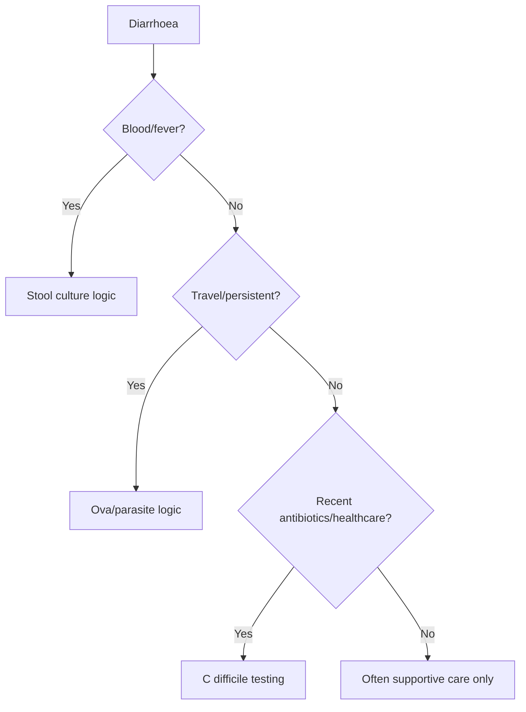

# Stool culture, ova-parasite, and C difficile testing

Related: [[../Gastroenterology MOC|Gastroenterology MOC]] · [[../Endoscopy and Gastroenterology Investigations|Endoscopy and Gastroenterology Investigations]] · [[../Symptom Patterns and Diagnostic Approach/Acute diarrhoea initial approach|Acute diarrhoea initial approach]]

> [!important]
> Stool testing should be **selective and question-driven**. The exam point is knowing **when stool microbiology is worth doing**, not sending every diarrhoea patient for every test.

## 1. Learning Objectives
- Distinguish stool culture, ova-parasite testing, and *C. difficile* testing.
- Recognize the clinical scenarios for each.
- Avoid over-testing mild self-limiting disease.
- Integrate stool testing into acute and persistent diarrhoea pathways.

## 2. Core Principle
Request the test that answers the likely microbiologic question:
- **stool culture** for bacterial enteric infection patterns
- **ova/parasite testing** for parasitic or travel/persistent diarrhoea clues
- **C. difficile** testing for antibiotic/healthcare-associated diarrhoea

## 3. Stool Culture
Useful when there is:
- dysentery/bloody diarrhoea
- fever/systemic illness
- outbreak/public-health concern
- significant persistent infective suspicion

## 4. Ova and Parasite Testing
Think of it when there is:
- travel exposure
- chronic/persistent diarrhoea
- parasitic epidemiologic risk
- immunocompromise with prolonged symptoms

## 5. C difficile Testing
High-yield clues:
- recent antibiotics
- recent hospitalization/healthcare exposure
- profuse diarrhoea with colitis concern
- older/frail patient with unexplained post-antibiotic diarrhoea

## 6. Red Flags
- severe dehydration
- sepsis
- bloody diarrhea
- immunocompromised host
- severe abdominal pain/toxic colitis concern

## 7. Interpretation Framework
1. Is diarrhoea mild/self-limiting or severe/high-risk?
2. Is there blood, fever, travel, chronicity, or antibiotic exposure?
3. Select culture vs ova/parasite vs *C. difficile* accordingly.
4. Do not send indiscriminate broad panels without a question.

## 8. Management Link
- mild watery short-lived illness → often no stool testing
- dysenteric illness → stool culture logic
- post-antibiotic diarrhoea → *C. difficile* logic
- prolonged travel-related illness → ova/parasite logic

## 9. FCPS/MRCP High-Yield Points
- *C. difficile* is an antibiotic/healthcare clue diagnosis.
- Ova/parasite testing is higher yield in travel or persistent diarrhoea.
- Stool culture is most useful in inflammatory/invasive infective patterns.

## 10. Common Viva Traps
- Sending stool cultures in trivial self-limiting diarrhea without indication.
- Forgetting *C. difficile* after antibiotics.
- Ignoring travel history before choosing tests.

## 11. One-Page Summary
- Stool tests are **indication-based**.
- Culture = bacterial/inflammatory pattern.
- Ova/parasites = travel/persistent/parasitic suspicion.
- *C. difficile* = antibiotic/healthcare-associated diarrhoea.

## 12. Mind Map
- Stool tests
  - culture
  - ova/parasite
  - C difficile
  - choose by clues
    - blood/fever
    - travel
    - chronicity
    - antibiotics

## 13. Flowchart

## 14. Revision Prompts
- When do you test for *C. difficile*?
- When is ova/parasite testing useful?
- Why not culture every loose stool?

## 15. MCQs (10)
1. *C. difficile* testing is most strongly suggested by:
   - A. Recent antibiotics
   - B. Cataract
   - C. Asthma
   - D. Migraine
   - **Answer: A**
2. Ova/parasite testing is most useful in:
   - A. Travel-related persistent diarrhoea
   - B. One self-limited loose stool
   - C. Dry skin
   - D. Tinnitus
   - **Answer: A**
3. Stool culture is most useful in:
   - A. Bloody or febrile diarrhoea
   - B. Stable eczema
   - C. Knee pain
   - D. Myopia
   - **Answer: A**
4. Which statement is correct?
   - A. Stool testing should be question-driven
   - B. Every diarrhoea case needs all tests
   - C. Travel history is irrelevant
   - D. Antibiotics never matter
   - **Answer: A**
5. Which is a common trap?
   - A. Forgetting *C. difficile* after antibiotics
   - B. Asking about travel
   - C. Checking duration
   - D. Looking for blood/fever
   - **Answer: A**
6. Severe dehydration with diarrhoea means:
   - A. Higher-risk assessment is needed
   - B. No stool history is needed
   - C. It is always IBS
   - D. Lab testing is forbidden
   - **Answer: A**
7. A major clue to invasive bacterial disease is:
   - A. Dysentery
   - B. Alopecia
   - C. Rhinitis
   - D. Otitis
   - **Answer: A**
8. Which is true of mild brief watery diarrhea?
   - A. It often does not need microbiologic testing
   - B. It always needs ova/parasite testing
   - C. It always means C diff
   - D. It always needs colonoscopy
   - **Answer: A**
9. Healthcare exposure mainly raises concern for:
   - A. *C. difficile*
   - B. Achalasia
   - C. Barrett oesophagus
   - D. Coeliac disease
   - **Answer: A**
10. Best summary?
   - A. Match the stool test to the infective question and risk pattern
   - B. Order all tests for every patient
   - C. Culture is always enough
   - D. Travel is irrelevant
   - **Answer: A**

## 16. SBA Questions (10)
1. A 74-year-old develops profuse diarrhea 1 week after antibiotics. Best test principle?
   - A. Test for *C. difficile*
   - B. Ova/parasite only
   - C. No stool testing needed
   - D. Brain MRI
   - **Answer: A**
2. A traveler has 3 weeks of loose stool and weight loss. Which test type is especially relevant?
   - A. Ova and parasite testing
   - B. Ear swab
   - C. Spirometry
   - D. ECG
   - **Answer: A**
3. Which pattern most supports stool culture?
   - A. Fever and bloody diarrhea
   - B. One day of mild soft stool
   - C. Dry cough only
   - D. Stable constipation
   - **Answer: A**
4. A dangerous error is:
   - A. Missing *C. difficile* in post-antibiotic diarrhea
   - B. Asking about healthcare exposure
   - C. Assessing severity
   - D. Checking chronicity
   - **Answer: A**
5. Which statement is true?
   - A. Travel history helps determine whether parasitic testing is worthwhile
   - B. Travel history never matters
   - C. Ova/parasite testing is best in every acute case
   - D. Culture detects all noninfective pathology
   - **Answer: A**
6. Which host factor lowers threshold for stool testing?
   - A. Immunocompromise
   - B. No symptoms
   - C. Dry skin
   - D. Mild dandruff
   - **Answer: A**
7. Which is a reasonable principle?
   - A. Severe or persistent diarrhoea deserves more targeted testing than trivial self-limited illness
   - B. All loose stools are identical
   - C. No red flags matter
   - D. Antibiotics are irrelevant
   - **Answer: A**
8. Why avoid indiscriminate stool testing?
   - A. Because testing should answer a specific clinical question
   - B. Because stool tests never work
   - C. Because culture diagnoses IBS
   - D. Because all diarrhoea is surgical
   - **Answer: A**
9. Which clue best suggests *C. difficile* rather than parasite?
   - A. Recent antibiotics
   - B. Backpacking travel months ago only
   - C. Dysphagia
   - D. Heartburn
   - **Answer: A**
10. Best exam phrase?
   - A. Stool microbiology is selective, contextual, and driven by severity, exposure, and chronicity
   - B. Every diarrhea episode requires the full stool panel
   - C. Culture replaces clinical history
   - D. Parasite testing is obsolete
   - **Answer: A**

## 17. Flashcards
- Q: When is *C. difficile* testing high yield?
  A: After recent antibiotics or healthcare exposure.
- Q: When is ova/parasite testing most useful?
  A: Travel-related or persistent diarrhea.
- Q: When is stool culture most useful?
  A: Bloody/febrile or invasive-appearing diarrhea.
- Q: Why not test every mild acute diarrhoea?
  A: Because many cases are self-limiting and testing should be targeted.
- Q: Which history items guide stool test choice?
  A: Blood, fever, travel, chronicity, antibiotics, immunocompromise.

## 18. Must Know / Should Know / Nice to Know
### Must Know
- Stool culture: Salmonella, Campylobacter, Shigella, Yersinia; request selectively (bloody diarrhoea, fever, travel)
- O&P: Giardia, Entamoeba, Cryptosporidium, Cyclospora; ≥3 samples on alternate days for O&P
- C. diff: NAAT (sensitive) + toxin EIA/GDH (specific); PCR-only may overdiagnose; test only if diarrhoea + risk factors
- Avoid routine culture for watery community-acquired diarrhoea; target testing

### Should Know
- Appropriate use criteria
- Patient preparation requirements
- Alternative investigations

### Nice to Know
- Emerging technologies
- Cost-effectiveness data
- AI-assisted interpretation

## 19. Self-Test Scorecard
- Can I state the key indication for this investigation? /10
- Can I name 3 quality metrics? /10
- Can I explain the interpretation framework? /10
- Can I outline the limitations? /10

**Interpretation:**
- **<35/40** = weak topic
- **35-36/40** = acceptable but insecure
- **37+/40** = exam-ready

## 20. Answer Key with Explanations

