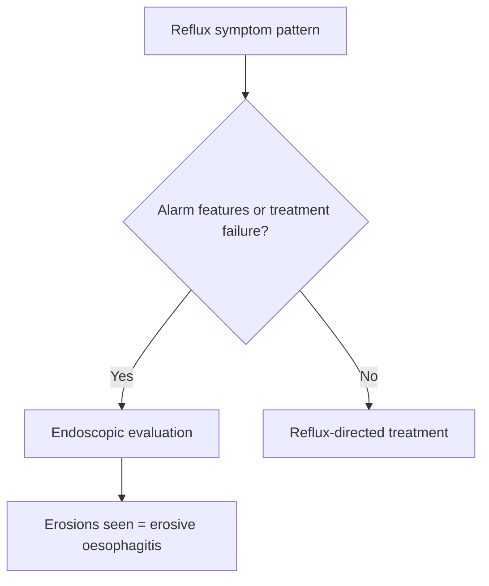

# Erosive reflux oesophagitis

Related: [[../Gastroenterology MOC|Gastroenterology MOC]] · [[../Oesophageal Disorders|Oesophageal Disorders]] · [[Gastro-oesophageal reflux disease]] · [[Barrett oesophagus and dysplasia]]

> [!important]
> Erosive reflux oesophagitis is reflux disease with **mucosal injury visible at endoscopy**. The exam distinction is between symptom-only reflux and endoscopically proven erosive disease.

## 1. Learning Objectives
- Define erosive reflux oesophagitis.
- Explain the pathophysiology of reflux injury.
- Recognize complications and alarm features.
- Outline treatment and follow-up principles.

## 2. Definition
Erosive reflux oesophagitis is oesophageal mucosal inflammation/injury caused by reflux of gastric contents, with erosions visible endoscopically.

## 3. Pathophysiology
- lower oesophageal sphincter incompetence
- transient relaxations / reflux burden
- acid-peptic mucosal injury
- impaired clearance and mucosal defense in some patients

## 4. Clinical Features
- heartburn
- acid regurgitation
- retrosternal discomfort
- odynophagia in more inflamed cases
- nocturnal symptoms may occur

## 5. Alarm Features
- dysphagia
- odynophagia with weight loss
- GI bleeding or anemia
- persistent vomiting
- older age/new severe symptoms

## 6. Complications
- ulceration
- bleeding
- stricture
- Barrett oesophagus in chronic reflux pathways

## 7. Diagnosis
- suspected clinically in reflux symptom patterns
- confirmed when endoscopy shows erosive inflammatory mucosal damage

## 8. Management
### General
- weight reduction if relevant
- lifestyle/reflux measures
- avoid late heavy meals and aggravating exposures

### Medical
- acid suppression is the core treatment principle
- optimize adherence and symptom timing review

### When to Scope / Reassess
- alarm features
- treatment failure
- recurrent dysphagia or bleeding concern

## 9. Red Flags / Emergencies
- food impaction
- GI bleeding
- progressive dysphagia
- severe odynophagia with systemic concern

## 10. FCPS/MRCP High-Yield Points
- Erosive oesophagitis is **endoscopic mucosal injury** due to reflux.
- Long-standing reflux disease raises concern for stricture and Barrett change.
- Alarm features override simple empirical management pathways.

## 11. Common Viva Traps
- Treating progressive dysphagia as “just reflux”.
- Forgetting stricture/Barrett complications.
- Confusing symptom severity with definite erosive disease without endoscopy.

## 12. One-Page Summary
- Reflux symptoms + visible erosions = erosive reflux oesophagitis.
- Acid suppression and reflux control are central.
- Dysphagia, bleeding, weight loss, or treatment failure need escalation.

## 13. Mind Map
- Erosive reflux oesophagitis
  - reflux injury
  - endoscopic erosions
  - heartburn/regurgitation
  - stricture
  - Barrett risk

## 14. Flowchart

## 15. Revision Prompts
- What makes reflux oesophagitis “erosive”?
- Name 3 complications.
- Which alarm features should prompt endoscopy?

## 16. MCQs (10)
1. Erosive reflux oesophagitis is best defined by:
   - A. Endoscopic mucosal injury due to reflux
   - B. Pancreatic inflammation
   - C. Colonic ulceration
   - D. Duodenal villous atrophy
   - **Answer: A**
2. A typical symptom is:
   - A. Heartburn
   - B. Hematuria
   - C. Polyuria
   - D. Vertigo
   - **Answer: A**
3. A major complication is:
   - A. Stricture
   - B. Otitis externa
   - C. Glaucoma
   - D. Nephrotic syndrome
   - **Answer: A**
4. Which finding is an alarm feature?
   - A. Progressive dysphagia
   - B. Mild sneezing
   - C. Hair fall
   - D. Foot pain
   - **Answer: A**
5. Core treatment principle is:
   - A. Acid suppression
   - B. Colon lavage
   - C. Diuretics only
   - D. Anticoagulation
   - **Answer: A**
6. Which statement is correct?
   - A. Long-standing reflux injury may be associated with Barrett change
   - B. Reflux never causes stricture
   - C. Dysphagia is reassuring
   - D. Endoscopy has no role
   - **Answer: A**
7. A common trap is:
   - A. Ignoring progressive dysphagia in a reflux patient
   - B. Asking about bleeding
   - C. Considering endoscopy when alarm features occur
   - D. Linking symptoms to complications
   - **Answer: A**
8. Odynophagia may suggest:
   - A. Significant oesophageal inflammation/injury
   - B. Normal renal function
   - C. Thyroid disease only
   - D. Pure IBS
   - **Answer: A**
9. Endoscopy is particularly needed when:
   - A. Alarm symptoms or treatment failure occur
   - B. Symptoms are trivial and brief without concerns
   - C. The patient has rhinitis only
   - D. There is isolated knee pain
   - **Answer: A**
10. Best summary?
   - A. Erosive reflux oesophagitis is reflux with visible oesophageal injury and important complication risk
   - B. Reflux never injures mucosa
   - C. All reflux requires surgery
   - D. Dysphagia is unimportant
   - **Answer: A**

## 17. SBA Questions (10)
1. A 49-year-old with chronic heartburn now has progressive dysphagia. Best next principle?
   - A. Escalate to endoscopic evaluation
   - B. Reassure only
   - C. Increase fibre only
   - D. Order stool culture
   - **Answer: A**
2. Endoscopy shows erosions in a patient with reflux symptoms. Diagnosis?
   - A. Erosive reflux oesophagitis
   - B. Coeliac disease
   - C. Ulcerative colitis
   - D. Pancreatitis
   - **Answer: A**
3. Which is a dangerous error?
   - A. Calling dysphagia “just reflux” without further assessment
   - B. Asking about weight loss
   - C. Considering Barrett risk
   - D. Using acid suppression
   - **Answer: A**
4. Which complication may follow chronic reflux injury?
   - A. Oesophageal stricture
   - B. Nephrolithiasis
   - C. Pleural empyema
   - D. Cataract
   - **Answer: A**
5. Why is Barrett relevant here?
   - A. Chronic reflux injury can predispose to metaplastic change
   - B. Barrett is a renal disease
   - C. It excludes reflux
   - D. It is unrelated to the oesophagus
   - **Answer: A**
6. Best initial medical treatment principle?
   - A. Reflux control with acid suppression
   - B. Anthelmintics only
   - C. Warfarin
   - D. Bronchodilator alone
   - **Answer: A**
7. Which symptom cluster most fits erosive reflux disease?
   - A. Heartburn, regurgitation, retrosternal discomfort
   - B. Hemoptysis and wheeze only
   - C. Polyuria and edema
   - D. Ataxia and diplopia
   - **Answer: A**
8. What makes the disease “erosive”?
   - A. Visible mucosal injury at endoscopy
   - B. Symptom severity alone
   - C. Positive stool antigen
   - D. Elevated troponin
   - **Answer: A**
9. Which alarm clue must not be ignored?
   - A. Weight loss with odynophagia
   - B. Mild transient bloating
   - C. Occasional hiccup
   - D. Seasonal allergies
   - **Answer: A**
10. Best exam phrase?
   - A. Erosive reflux oesophagitis is endoscopically proven reflux injury with stricture and Barrett implications
   - B. Reflux is always non-erosive
   - C. Endoscopy is never required
   - D. Barrett has no link to reflux
   - **Answer: A**

## 18. Flashcards
- Q: What defines erosive reflux oesophagitis?
  A: Endoscopically visible reflux-related oesophageal mucosal injury.
- Q: Name 3 complications.
  A: Stricture, bleeding/ulceration, Barrett oesophagus.
- Q: What are major alarm features?
  A: Dysphagia, bleeding/anemia, weight loss, persistent vomiting.
- Q: What is the core treatment principle?
  A: Acid suppression and reflux control.
- Q: What common trap must be avoided?
  A: Assuming progressive dysphagia is just uncomplicated reflux.

## 19. Must Know / Should Know / Nice to Know
### Must Know
- Erosive oesophagitis = visible mucosal breaks on endoscopy
- LA classification (A-D) grades severity
- PPI is first-line; heal erosions then maintain
- Complications: ulcer, stricture, Barrett
- NERD = symptomatic GERD with normal endoscopy

### Should Know
- LA grade A: <5mm breaks; D: >75% circumferential
- Maintenance PPI after healing
- Refractory: check compliance, then pH/impedance

### Nice to Know
- Mucosal impedance testing
- Potassium-competitive acid blockers (PCABs)

## 20. Self-Test Scorecard
- Can I describe the LA classification? /10
- Can I distinguish erosive from non-erosive GERD? /10
- Can I outline the PPI healing and maintenance strategy? /10

**Interpretation:**
- **<35/40** = weak topic
- **35-36/40** = acceptable but insecure
- **37+/40** = exam-ready

## 21. Revision Prompts
How is erosive oesophagitis graded?
What is NERD and how is it managed?

## 22. Answer Key with Explanations

