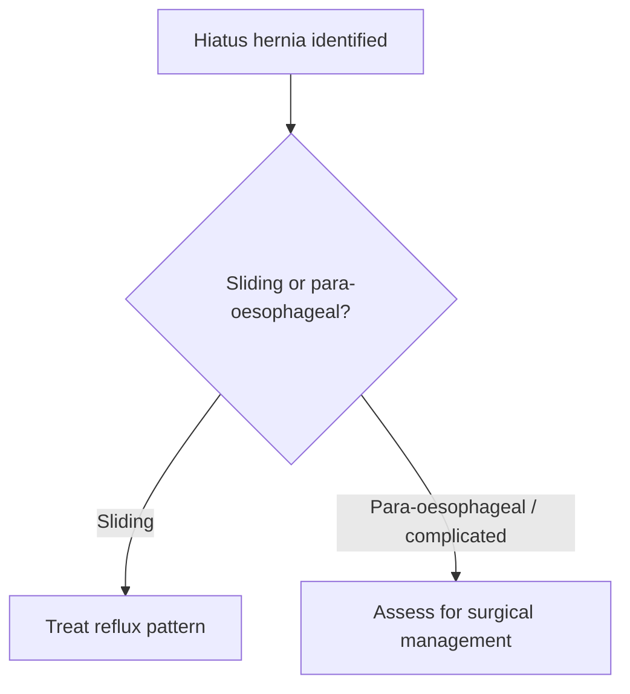

# Hiatus hernia

Related: [[../Gastroenterology MOC|Gastroenterology MOC]] · [[../Oesophageal Disorders|Oesophageal Disorders]] · [[Gastro-oesophageal reflux disease]] · [[Schatzki ring and oesophageal webs]]

> [!important]
> Hiatus hernia matters mainly because of its relationship with **reflux symptoms and complications**, not merely because it exists on imaging.

## 1. Learning Objectives
- Define hiatus hernia and types.
- Explain its relationship with reflux.
- Recognize when it becomes clinically important.
- Outline management.

## 2. Definition
Hiatus hernia is herniation of part of the stomach through the diaphragmatic oesophageal hiatus into the thorax.

## 3. Types
- sliding hiatus hernia
- para-oesophageal hernia

## 4. Clinical Significance
### Sliding hernia
- commonly associated with reflux
- often found in dyspeptic/reflux patients

### Para-oesophageal hernia
- may cause mechanical symptoms or complications
- less about acid reflux alone, more about anatomical risk

## 5. Clinical Features
- heartburn/regurgitation
- postprandial discomfort
- dysphagia in some patients
- anemia or volvulus-type complication rarely in complex cases

## 6. Investigations
- endoscopy
- contrast imaging in selected anatomical assessment
- evaluate associated reflux or complications

## 7. Management
- treat reflux if sliding hernia with GERD pattern
- lifestyle and acid suppression where appropriate
- surgical opinion when para-oesophageal hernia or complication risk is significant

## 8. Red Flags
- persistent dysphagia
- GI bleeding/anemia
- severe chest/epigastric pain with obstruction/volvulus concern
- recurrent vomiting or inability to tolerate intake

## 9. FCPS/MRCP High-Yield Points
- Sliding hernia is common and reflux-associated.
- Para-oesophageal hernia carries more structural complication concern.
- Do not treat the image alone; treat the clinical syndrome and complication risk.

## 10. Common Viva Traps
- Equating all hiatus hernias with severe disease.
- Forgetting the para-oesophageal complication risk.
- Ignoring reflux complications in symptomatic sliding hernia.

## 11. One-Page Summary
- Hiatus hernia = stomach through diaphragm.
- Sliding type links with reflux.
- Para-oesophageal type is more important for mechanical complications.

## 12. Mind Map
- Hiatus hernia
  - sliding
    - reflux
  - para-oesophageal
    - obstruction risk
    - volvulus concern
  - dysphagia
  - surgery if complicated

## 13. Flowchart

## 14. MCQs (10)
1. Hiatus hernia is:
   - A. Herniation of stomach through the diaphragmatic hiatus
   - B. Colonic volvulus
   - C. Pancreatic cyst
   - D. Biliary fistula
   - **Answer: A**
2. Sliding hiatus hernia is commonly associated with:
   - A. Reflux
   - B. Nephrotic syndrome
   - C. Asthma only
   - D. Stroke only
   - **Answer: A**
3. The type with greater mechanical complication concern is:
   - A. Para-oesophageal hernia
   - B. Sliding hernia always
   - C. Web only
   - D. Stricture only
   - **Answer: A**
4. A common symptom is:
   - A. Heartburn
   - B. Polyuria
   - C. Hematuria
   - D. Diplopia
   - **Answer: A**
5. Which investigation can assess associated mucosal disease?
   - A. Endoscopy
   - B. EEG
   - C. Spirometry
   - D. Audiogram
   - **Answer: A**
6. Which statement is true?
   - A. Not every hiatus hernia requires intervention beyond symptom/context management
   - B. All hiatus hernias require emergency surgery
   - C. Sliding hernias are never related to reflux
   - D. Para-oesophageal hernias are always asymptomatic and irrelevant
   - **Answer: A**
7. A common trap is:
   - A. Treating the image instead of the syndrome
   - B. Asking about reflux
   - C. Classifying the type
   - D. Reviewing dysphagia
   - **Answer: A**
8. A red flag concern in para-oesophageal hernia is:
   - A. Obstruction/volvulus
   - B. Rhinitis
   - C. Hair loss
   - D. Otitis
   - **Answer: A**
9. Which management principle fits symptomatic sliding hernia?
   - A. Reflux-directed therapy
   - B. Dialysis
   - C. Anticoagulation only
   - D. Nebulization
   - **Answer: A**
10. Best summary?
   - A. Sliding hernia usually matters because of reflux; para-oesophageal hernia matters because of structural risk
   - B. All hernias are identical
   - C. Hiatus hernia excludes reflux
   - D. Imaging alone decides everything
   - **Answer: A**

## 15. SBA Questions (10)
1. A patient with long-standing heartburn is found to have a sliding hiatus hernia. Main management focus?
   - A. Reflux control
   - B. Immediate bowel resection
   - C. No clinical interpretation needed
   - D. Antibiotics for all
   - **Answer: A**
2. A patient has para-oesophageal hernia with postprandial pain and vomiting. Main concern?
   - A. Mechanical complication/obstruction
   - B. IBS only
   - C. Migraine
   - D. Hemorrhoids
   - **Answer: A**
3. Which is a dangerous error?
   - A. Assuming para-oesophageal hernia is clinically trivial
   - B. Asking about reflux symptoms
   - C. Distinguishing type
   - D. Checking dysphagia
   - **Answer: A**
4. Which type is most linked to GERD?
   - A. Sliding hiatus hernia
   - B. Oesophageal web
   - C. Achalasia
   - D. Boerhaave syndrome
   - **Answer: A**
5. Which symptom can arise from associated reflux?
   - A. Heartburn
   - B. Polyphagia
   - C. Hematuria
   - D. Wheeze only
   - **Answer: A**
6. Which investigation helps evaluate mucosal complications and reflux-related disease?
   - A. Endoscopy
   - B. CT head
   - C. EEG
   - D. Bone scan
   - **Answer: A**
7. What should prompt urgent concern?
   - A. Severe pain with vomiting and obstructive symptoms
   - B. Mild transient burp only
   - C. Seasonal rhinitis
   - D. Dry scalp
   - **Answer: A**
8. Best exam pearl?
   - A. Classify the type and then decide whether the issue is reflux or structural complication
   - B. All hiatus hernias behave the same
   - C. Sliding hernia never causes symptoms
   - D. Para-oesophageal hernia never matters
   - **Answer: A**
9. Why can anemia occur?
   - A. From associated upper-GI mucosal lesions/bleeding in some patients
   - B. Because all hernias destroy bone marrow
   - C. Because hernias cause nephrosis
   - D. Because dysphagia lowers platelets directly
   - **Answer: A**
10. Best summary?
   - A. Understand type, symptoms, and complication risk before deciding management
   - B. Operate on every imaging finding
   - C. Ignore symptoms if a hernia is small
   - D. GERD and hiatus hernia are unrelated always
   - **Answer: A**

## 16. Flashcards
- Q: What are the 2 main types of hiatus hernia?
  A: Sliding and para-oesophageal.
- Q: Which type is commonly reflux-associated?
  A: Sliding hiatus hernia.
- Q: Which type carries more structural complication risk?
  A: Para-oesophageal hernia.
- Q: What common trap must be avoided?
  A: Treating the image rather than the clinical syndrome.
- Q: What red flags suggest urgent reassessment?
  A: Severe pain, vomiting, obstruction, bleeding, or progressive dysphagia.

## 17. Must Know / Should Know / Nice to Know
### Must Know
- Sliding (type I) = most common; GEJ above diaphragm
- Paraoesophageal (type II-IV) = risk of volvulus/obstruction
- Hiatus hernia promotes GERD by disrupting anti-reflux barrier
- Large paraoesophageal = surgical referral
- Asymptomatic sliding hernia = no treatment needed

### Should Know
- Hill grade for hernia size
- Camera sign and retrocardiac air on imaging
- Gastric volvulus = emergency surgery

### Nice to Know
- Mesh reinforcement in repair
- Endoluminal fundoplication devices

## 18. Self-Test Scorecard
- Can I distinguish sliding from paraoesophageal hernia? /10
- Can I explain how hiatus hernia causes GERD? /10
- Can I name the red flags for paraoesophageal hernia? /10

**Interpretation:**
- **<35/40** = weak topic
- **35-36/40** = acceptable but insecure
- **37+/40** = exam-ready

## 19. Revision Prompts
What is the difference between type I and type II-IV hiatus hernia?
When is surgery indicated for hiatus hernia?

## 20. Answer Key with Explanations

