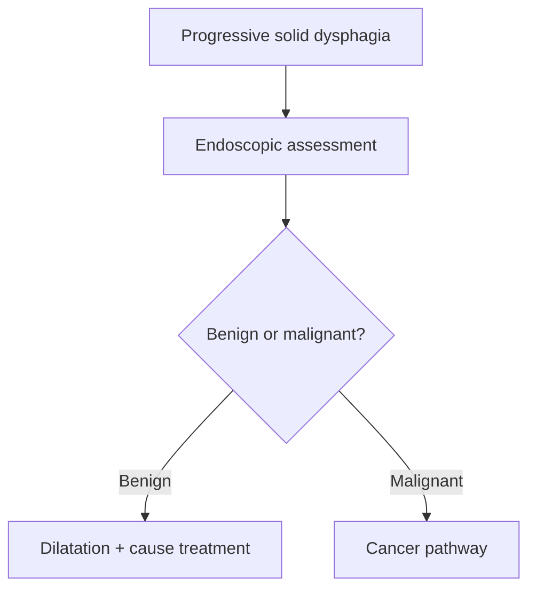

# Oesophageal stricture

Related: [[../Gastroenterology MOC|Gastroenterology MOC]] · [[../Oesophageal Disorders|Oesophageal Disorders]] · [[Erosive reflux oesophagitis]] · [[Oesophageal cancer]]

> [!important]
> Progressive **solid-food dysphagia** is the classic clue. Always separate benign stricture from malignancy.

## 1. Learning Objectives
- Define oesophageal stricture.
- Recognize common causes and symptom pattern.
- Distinguish benign from malignant concern.
- Outline investigation and treatment.

## 2. Definition
Oesophageal stricture is a structural narrowing of the oesophageal lumen causing impaired passage of food.

## 3. Causes
- chronic reflux-related peptic stricture
- caustic injury
- post-inflammatory or post-radiation injury
- eosinophilic oesophagitis-related remodelling
- malignant narrowing must always be excluded

## 4. Clinical Features
- progressive dysphagia for solids first
- food sticking sensation
- regurgitation of undigested food in some cases
- weight loss if severe or malignant

## 5. Red Flags
- rapid progression
- major weight loss
- anemia/bleeding
- older patient with short history
- complete obstruction or recurrent impaction

## 6. Investigations
- upper GI endoscopy with biopsy where needed
- contrast study in selected structural assessment pathways
- evaluate for underlying cause such as reflux or EoE

## 7. Management
- treat the cause
- endoscopic dilatation for significant benign stricture
- acid suppression in peptic strictures
- manage malignant strictures via cancer pathway

## 8. FCPS/MRCP High-Yield Points
- Progressive solid dysphagia = mechanical lesion until proven otherwise.
- Peptic reflux stricture is a common benign cause.
- Malignancy must be excluded.

## 9. Common Viva Traps
- Assuming all strictures are benign.
- Ignoring eosinophilic oesophagitis in recurrent narrowing.
- Forgetting long-term reflux control after dilation.

## 10. One-Page Summary
- Oesophageal stricture causes progressive solid dysphagia.
- Causes include reflux, EoE, caustic injury, and cancer.
- Endoscopy is central for diagnosis and treatment planning.

## 11. Mind Map
- Stricture
  - solids first
  - peptic
  - EoE
  - caustic
  - cancer exclusion
  - dilatation

## 12. Flowchart

## 13. MCQs (10)
1. The classic symptom of oesophageal stricture is:
   - A. Progressive solid-food dysphagia
   - B. Polyuria
   - C. Wheeze
   - D. Dysuria
   - **Answer: A**
2. A common benign cause is:
   - A. Chronic reflux
   - B. Cataract
   - C. Otitis media
   - D. Migraine
   - **Answer: A**
3. A dangerous diagnosis to exclude is:
   - A. Oesophageal cancer
   - B. IBS
   - C. Tension headache
   - D. Asthma
   - **Answer: A**
4. The key investigation is:
   - A. Upper GI endoscopy
   - B. Spirometry
   - C. Audiogram
   - D. EEG
   - **Answer: A**
5. Which condition can contribute to stricturing?
   - A. Eosinophilic oesophagitis
   - B. Rhinitis
   - C. Acne
   - D. Otitis externa
   - **Answer: A**
6. Which statement is true?
   - A. Mechanical dysphagia usually affects solids first
   - B. Stricture causes liquid dysphagia first always
   - C. Cancer never mimics stricture
   - D. Endoscopy has no role
   - **Answer: A**
7. A common trap is:
   - A. Assuming every stricture is benign
   - B. Taking dysphagia seriously
   - C. Considering biopsy
   - D. Reviewing reflux history
   - **Answer: A**
8. Treatment of symptomatic benign stricture often includes:
   - A. Endoscopic dilation
   - B. Bronchodilator
   - C. Dialysis
   - D. Diuretic only
   - **Answer: A**
9. A red flag suggesting malignancy is:
   - A. Rapid progression with weight loss
   - B. Stable mild bloating
   - C. Rhinitis
   - D. Dry skin
   - **Answer: A**
10. Best summary?
   - A. Progressive solid dysphagia needs evaluation for structural narrowing and cancer exclusion
   - B. Dysphagia is always functional
   - C. Strictures never need dilation
   - D. Reflux never causes stricture
   - **Answer: A**

## 14. SBA Questions (10)
1. A 62-year-old with 4 months of worsening difficulty swallowing solids most needs:
   - A. Endoscopic assessment for structural lesion
   - B. Pure reassurance
   - C. Nebulization
   - D. Stool culture
   - **Answer: A**
2. A patient with chronic reflux develops progressive solid dysphagia. Most likely benign explanation?
   - A. Peptic stricture
   - B. Coeliac disease
   - C. Ulcerative colitis
   - D. Pancreatitis
   - **Answer: A**
3. Which is a dangerous error?
   - A. Missing malignancy in a stricture-like presentation
   - B. Asking about weight loss
   - C. Doing endoscopy
   - D. Considering biopsy
   - **Answer: A**
4. Which symptom profile best fits a stricture?
   - A. Solids first, progressive
   - B. Sudden isolated wheeze
   - C. Diarrhoea only
   - D. Hematuria only
   - **Answer: A**
5. Which disease can cause remodeling and narrowing?
   - A. Eosinophilic oesophagitis
   - B. Tension headache
   - C. Cellulitis
   - D. Cataract
   - **Answer: A**
6. Which intervention often relieves benign narrowing?
   - A. Dilation
   - B. Insulin
   - C. Thoracostomy
   - D. Bronchoscopy
   - **Answer: A**
7. Why is reflux control important after dilation?
   - A. To reduce recurrent peptic injury and restricture
   - B. To treat asthma
   - C. To prevent nephrosis
   - D. To raise haemoglobin directly
   - **Answer: A**
8. Which clue most pushes toward cancer exclusion?
   - A. Older age, weight loss, rapid progression
   - B. Seasonal rhinitis
   - C. Mild transient hiccup
   - D. Hair fall
   - **Answer: A**
9. Best exam pearl?
   - A. Progressive solid dysphagia is mechanical until proven otherwise
   - B. All progressive dysphagia is functional
   - C. Strictures affect liquids first only
   - D. Cancer cannot mimic peptic disease
   - **Answer: A**
10. Best summary?
   - A. Diagnose the narrowing, exclude malignancy, and treat the cause
   - B. Reassure without investigation
   - C. Avoid endoscopy always
   - D. Consider only IBS
   - **Answer: A**

## 15. Flashcards
- Q: What is the classic symptom of oesophageal stricture?
  A: Progressive solid-food dysphagia.
- Q: What common benign cause exists?
  A: Chronic reflux-related peptic stricture.
- Q: What diagnosis must always be excluded?
  A: Oesophageal cancer.
- Q: What therapeutic endoscopic option is common?
  A: Dilation.
- Q: What inflammatory disease can also lead to narrowing?
  A: Eosinophilic oesophagitis.

## 16. Must Know / Should Know / Nice to Know
### Must Know
- Benign stricture = fibrotic narrowing, usually from chronic GERD
- Dysphagia to solids > liquids
- Endoscopic dilation = mainstay (balloon/bougie)
- PPI essential after dilation to prevent recurrence
- Malignant stricture = irregular, shouldered, fixed on endoscopy - biopsy!

### Should Know
- Eosinophilic oesophagitis strictures: treat inflammation first
- Caustic stricture: wait for maturation before dilation
- Anastomotic stricture: post-surgical

### Nice to Know
- Biodegradable stents for refractory strictures
- Intralesional steroid injection

## 17. Self-Test Scorecard
- Can I distinguish benign from malignant stricture on endoscopy? /10
- Can I outline the dilation technique and follow-up? /10
- Can I explain the role of PPI after dilation? /10

**Interpretation:**
- **<35/40** = weak topic
- **35-36/40** = acceptable but insecure
- **37+/40** = exam-ready

## 18. Revision Prompts
What is the most common cause of benign oesophageal stricture?
How is oesophageal stricture managed?
What features suggest malignancy?

## 19. Answer Key with Explanations

