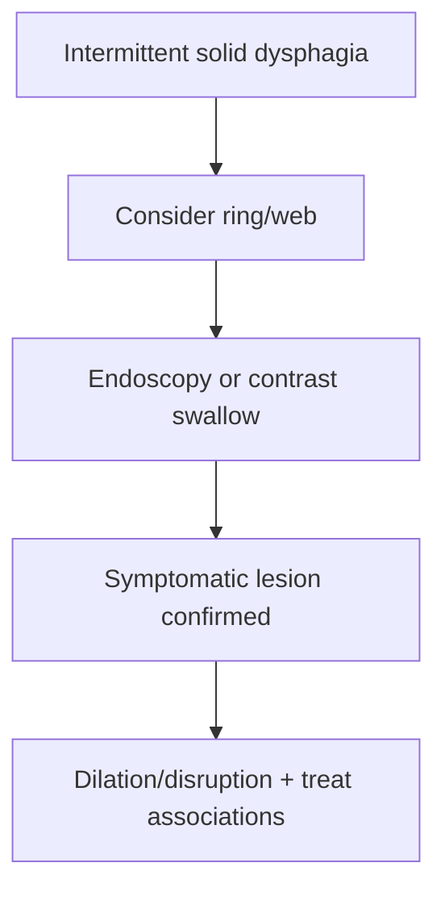

# Schatzki ring and oesophageal webs

Related: [[../Gastroenterology MOC|Gastroenterology MOC]] · [[../Oesophageal Disorders|Oesophageal Disorders]] · [[Oesophageal stricture]]

> [!important]
> Intermittent **solid-food dysphagia** with relatively preserved liquid swallowing is the classic exam clue.

## 1. Learning Objectives
- Define Schatzki ring and oesophageal webs.
- Recognize how they present.
- Distinguish them from diffuse strictures and cancer.
- Outline treatment.

## 2. Definition
- **Schatzki ring**: thin mucosal ring, usually at the distal oesophagus near the gastro-oesophageal junction.
- **Oesophageal web**: thin mucosal membrane, usually in the upper oesophagus.

## 3. Clinical Features
- intermittent dysphagia for solids
- food sticking episodes
- acute food bolus episodes can occur
- usually less progressive than cancer/peptic stricture early on

## 4. Associations
- Schatzki ring may coexist with reflux/hiatus hernia.
- Oesophageal webs may be associated with iron deficiency in classic teaching.

## 5. Investigations
- endoscopy
- contrast swallow can demonstrate subtle rings/webs in selected cases
- assess for associated reflux or anemia context

## 6. Management
- endoscopic disruption/dilation when symptomatic
- treat associated reflux if present
- correct associated deficiency states when relevant

## 7. Red Flags
- progressive rather than intermittent dysphagia
- marked weight loss
- anemia with major systemic symptoms
- complete obstruction/impaction

## 8. FCPS/MRCP High-Yield Points
- Schatzki ring = distal ring, intermittent solid dysphagia.
- Web = thin proximal mucosal shelf.
- Distinguish intermittent non-progressive symptoms from malignant progressive dysphagia.

## 9. Common Viva Traps
- Calling all ring/web dysphagia cancer.
- Missing associated reflux or iron-deficiency context.
- Forgetting endoscopic therapy can be effective.

## 10. One-Page Summary
- Rings and webs cause intermittent structural dysphagia for solids.
- Endoscopy/contrast imaging can identify them.
- Symptomatic lesions are treated by dilation/disruption and associated-cause management.

## 11. Mind Map
- Ring/web
  - intermittent solids dysphagia
  - Schatzki distal
  - web proximal
  - reflux/IDA associations
  - dilation

## 12. Flowchart

## 13. MCQs (10)
1. Schatzki ring usually causes:
   - A. Intermittent solid-food dysphagia
   - B. Polyuria
   - C. Hemoptysis
   - D. Diarrhoea only
   - **Answer: A**
2. Schatzki ring is typically located:
   - A. Distal oesophagus
   - B. Colon
   - C. Rectum
   - D. Duodenum
   - **Answer: A**
3. Oesophageal webs are often:
   - A. Thin mucosal membranes
   - B. Pancreatic cysts
   - C. Gastric ulcers
   - D. Colonic polyps
   - **Answer: A**
4. A typical pattern is:
   - A. Solids affected more than liquids
   - B. Liquids only from the start always
   - C. Pure heart failure symptoms
   - D. Pure constipation
   - **Answer: A**
5. Which investigation can help show rings/webs?
   - A. Endoscopy or contrast swallow
   - B. Spirometry
   - C. ECG
   - D. EEG
   - **Answer: A**
6. Schatzki ring may be associated with:
   - A. Reflux/hiatus hernia
   - B. Glomerulonephritis
   - C. Asthma only
   - D. Stroke only
   - **Answer: A**
7. A common trap is:
   - A. Missing intermittent structural dysphagia because symptoms are not continuous
   - B. Asking about solids vs liquids
   - C. Considering endoscopy
   - D. Reviewing reflux history
   - **Answer: A**
8. Symptomatic treatment often includes:
   - A. Dilation/disruption
   - B. Dialysis
   - C. Insulin only
   - D. Pleural drainage
   - **Answer: A**
9. Which feature pushes concern away from simple ring/web and toward cancer?
   - A. Progressive weight-loss-associated dysphagia
   - B. Intermittent nonprogressive symptoms
   - C. Preserved liquid swallowing
   - D. Occasional food sticking for years
   - **Answer: A**
10. Best summary?
   - A. Schatzki ring and webs are thin structural lesions causing intermittent solid dysphagia
   - B. They always cause liquid dysphagia first
   - C. They are malignant by definition
   - D. Endoscopy is useless
   - **Answer: A**

## 14. SBA Questions (10)
1. A patient has years of intermittent solid dysphagia without weight loss. Best structural diagnosis to consider?
   - A. Schatzki ring
   - B. Oesophageal cancer first most likely
   - C. Ulcerative colitis
   - D. Coeliac disease
   - **Answer: A**
2. Why is liquids swallowing often preserved early?
   - A. The lesion is a partial structural narrowing affecting solids more
   - B. Liquids are always larger
   - C. Because it is a motility disorder only
   - D. Because the stomach is normal
   - **Answer: A**
3. Which is a dangerous error?
   - A. Ignoring progression and weight loss in a patient assumed to have a simple ring
   - B. Distinguishing solids from liquids
   - C. Considering endoscopy
   - D. Reviewing anemia
   - **Answer: A**
4. A proximal thin mucosal lesion is best called:
   - A. Oesophageal web
   - B. Gastric varix
   - C. Hiatus hernia
   - D. Boerhaave tear
   - **Answer: A**
5. Best treatment principle in symptomatic disease?
   - A. Endoscopic disruption/dilation
   - B. Bronchodilator
   - C. Diuretic only
   - D. Antibiotic for all
   - **Answer: A**
6. Which association may accompany webs?
   - A. Iron-deficiency context
   - B. Hyperthyroidism only
   - C. COPD only
   - D. Otitis externa
   - **Answer: A**
7. Which pattern best fits ring/web rather than cancer?
   - A. Intermittent, long-standing, solids-first dysphagia
   - B. Rapid progression with weight loss
   - C. Severe odynophagia with immunosuppression
   - D. Profound anemia and cachexia
   - **Answer: A**
8. Which investigation may highlight subtle rings well?
   - A. Contrast swallow
   - B. CT head
   - C. Echocardiography
   - D. Stool antigen
   - **Answer: A**
9. Best exam pearl?
   - A. Intermittent solids-first dysphagia suggests a structural lesion like ring/web
   - B. Intermittent symptoms exclude structural disease
   - C. Webs are pancreatic lesions
   - D. Rings never need treatment
   - **Answer: A**
10. Best summary?
   - A. Think ring/web in intermittent structural dysphagia and confirm endoscopically or radiologically
   - B. Rings and webs are functional disorders only
   - C. Liquids are always affected first
   - D. Weight loss is expected in all cases
   - **Answer: A**

## 15. Flashcards
- Q: What dysphagia pattern is classic for Schatzki ring/web?
  A: Intermittent solids-first dysphagia.
- Q: Where is a Schatzki ring usually located?
  A: Distal oesophagus.
- Q: What is a web?
  A: A thin mucosal membrane, usually proximal.
- Q: What common procedure treats symptomatic rings/webs?
  A: Endoscopic dilation/disruption.
- Q: What major alternative diagnosis must be excluded if symptoms are progressive with weight loss?
  A: Oesophageal cancer.

## 16. Must Know / Should Know / Nice to Know
### Must Know
- Schatzki ring = mucosal ring at squamocolumnar junction, intermittent dysphagia to solids
- Web = thin membrane in upper/mid oesophagus, Plummer-Vinson (iron deficiency)
- Barium: ring = "steakhouse syndrome"
- Dilation = effective for both

### Should Know
- Schatzki ring often with hiatus hernia
- Webs associated with iron deficiency anaemia, autoimmunity
- Eosinophilic oesophagitis may have rings

### Nice to Know
- Historical: Plummer-Vinson syndrome
- Association with post-cricoid cancer

## 17. Self-Test Scorecard
- Can I distinguish Schatzki ring from oesophageal web? /10
- Can I describe the Plummer-Vinson syndrome? /10
- What is the treatment for food bolus impaction? /10

**Interpretation:**
- **<35/40** = weak topic
- **35-36/40** = acceptable but insecure
- **37+/40** = exam-ready

## 18. Revision Prompts
What is a Schatzki ring and where is it located?
What is Plummer-Vinson syndrome?

## 19. Answer Key with Explanations

