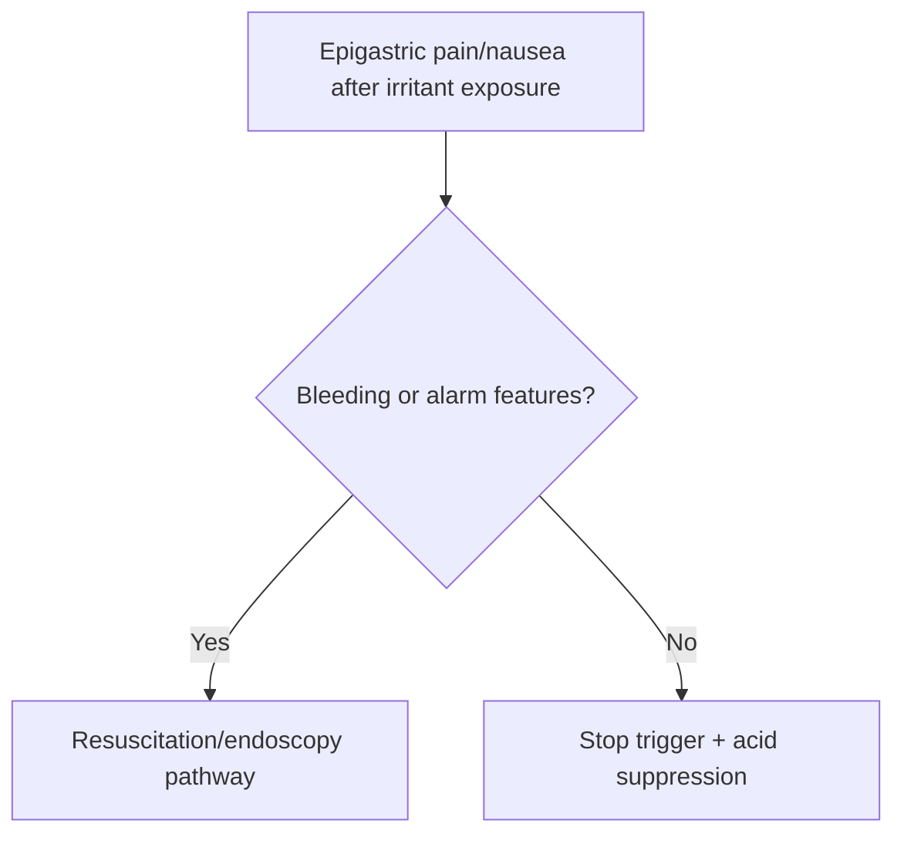

# Acute gastritis and erosive gastropathy

Related: [[../Gastroenterology MOC|Gastroenterology MOC]] · [[../Stomach and Duodenal Disorders|Stomach and Duodenal Disorders]] · [[Functional dyspepsia]] · [[Upper GI bleeding resuscitation priorities]]

> [!important]
> Acute gastritis and erosive gastropathy often present with **epigastric pain, nausea, or upper-GI bleeding risk**, especially after NSAIDs, alcohol, or critical illness stress.

## 1. Learning Objectives
- Define gastritis versus erosive gastropathy.
- Recognize common triggers.
- Understand bleeding relevance.
- Outline treatment and prevention.

## 2. Definition
- **Acute gastritis**: acute gastric mucosal inflammation.
- **Erosive gastropathy**: gastric mucosal injury/erosion, often from irritant or ischemic/stress factors, with less emphasis on classic inflammatory histology.

## 3. Causes
- NSAIDs/aspirin
- alcohol
- severe physiological stress/critical illness
- bile reflux or other mucosal irritants

## 4. Clinical Features
- epigastric pain/burning
- nausea/vomiting
- hematemesis or melaena if bleeding occurs
- dyspeptic symptoms after offending exposures

## 5. Red Flags
- hematemesis/melaena
- anemia/hemodynamic compromise
- persistent vomiting
- older patient with alarm symptoms requiring exclusion of other pathology

## 6. Investigations
- history of offending agents
- CBC/assessment of blood loss when bleeding suspected
- endoscopy if bleeding, alarm features, or uncertainty

## 7. Management
- stop offending agent if possible
- acid suppression
- supportive care and hydration
- stress-ulcer prophylaxis logic in high-risk critical care settings

## 8. FCPS/MRCP High-Yield Points
- NSAIDs and alcohol are classic triggers.
- Erosive gastropathy can bleed.
- Treat the cause and protect the mucosa.

## 9. Common Viva Traps
- Missing NSAID exposure.
- Forgetting that upper-GI bleeding may arise from erosive disease.
- Labeling alarm symptoms as simple dyspepsia.

## 10. One-Page Summary
- Acute gastritis/erosive gastropathy = acute gastric mucosal injury.
- Common triggers: NSAIDs, alcohol, stress.
- Major concern: bleeding.

## 11. Mind Map
- Gastritis/gastropathy
  - NSAID
  - alcohol
  - stress
  - epigastric pain
  - bleeding
  - acid suppression

## 12. Flowchart

## 13. MCQs (10)
1. A classic trigger of erosive gastropathy is:
   - A. NSAID use
   - B. Cataract
   - C. Migraine
   - D. Otitis
   - **Answer: A**
2. A major complication is:
   - A. Upper GI bleeding
   - B. Nephrosis
   - C. Stroke
   - D. Asthma
   - **Answer: A**
3. Common symptoms include:
   - A. Epigastric pain and nausea
   - B. Polyuria and thirst
   - C. Diplopia only
   - D. Dysuria only
   - **Answer: A**
4. Alcohol can:
   - A. Trigger acute erosive gastric injury
   - B. Cure gastritis
   - C. Exclude ulcer disease
   - D. Prevent bleeding
   - **Answer: A**
5. Management includes:
   - A. Stop offending agent and use acid suppression
   - B. Continue NSAIDs regardless
   - C. Avoid hydration
   - D. Ignore melena
   - **Answer: A**
6. A common trap is:
   - A. Missing the drug history
   - B. Asking about bleeding
   - C. Considering endoscopy in alarm features
   - D. Reviewing alcohol exposure
   - **Answer: A**
7. Which setting increases stress-related mucosal injury risk?
   - A. Critical illness
   - B. Mild hay fever
   - C. Acne
   - D. Myopia
   - **Answer: A**
8. Which red flag prompts urgent escalation?
   - A. Hematemesis
   - B. Mild burping only
   - C. Dry scalp
   - D. Sneezing
   - **Answer: A**
9. Endoscopy is especially useful when:
   - A. Bleeding or alarm features are present
   - B. Symptoms are trivial and self-limited without concern
   - C. Ear pain exists
   - D. Vision is blurred
   - **Answer: A**
10. Best summary?
   - A. Acute gastric mucosal injury often follows NSAIDs/alcohol/stress and may bleed
   - B. Gastritis never bleeds
   - C. Endoscopy never helps
   - D. Drug history is irrelevant
   - **Answer: A**

## 14. SBA Questions (10)
1. A patient develops epigastric pain and melaena after heavy NSAID use. Most likely pathology?
   - A. Acute erosive gastropathy
   - B. Achalasia
   - C. IBS
   - D. Hemorrhoids
   - **Answer: A**
2. What is the best first management principle in non-massive disease?
   - A. Stop the offending agent and start acid suppression
   - B. Continue NSAID and reassure
   - C. Give laxatives only
   - D. Ignore bleeding history
   - **Answer: A**
3. Which is a dangerous error?
   - A. Dismissing melaena as simple dyspepsia
   - B. Reviewing NSAID exposure
   - C. Considering endoscopy
   - D. Checking haemodynamics
   - **Answer: A**
4. Which host setting raises stress erosive disease risk?
   - A. Critical illness/ICU-type physiology
   - B. Mild rhinitis
   - C. Tinea infection
   - D. Hair loss
   - **Answer: A**
5. Which symptom cluster best fits?
   - A. Epigastric pain, nausea, possible bleed
   - B. Painless jaundice only
   - C. Chronic diarrhea only
   - D. Solids-and-liquids dysphagia only
   - **Answer: A**
6. Why is endoscopy helpful?
   - A. It assesses source and severity if bleeding/alarm features exist
   - B. It diagnoses asthma
   - C. It measures eGFR
   - D. It confirms stroke
   - **Answer: A**
7. Best exam pearl?
   - A. Think of erosive gastric injury in epigastric symptoms after NSAIDs/alcohol or stress
   - B. NSAIDs protect the stomach
   - C. Gastritis cannot cause bleeding
   - D. Stress never affects gastric mucosa
   - **Answer: A**
8. Which major complication can lead to hemodynamic instability?
   - A. Upper GI hemorrhage
   - B. Dry mouth
   - C. Sneezing
   - D. Tinnitus
   - **Answer: A**
9. Which medication history is especially important?
   - A. NSAID/aspirin use
   - B. Eye drops only
   - C. Nasal saline only
   - D. Shampoo type
   - **Answer: A**
10. Best summary?
   - A. Remove triggers, protect mucosa, and treat bleeding aggressively when present
   - B. Continue the cause and observe indefinitely
   - C. Ignore hematemesis
   - D. Treat as IBS
   - **Answer: A**

## 15. Flashcards
- Q: Name 3 common causes of acute erosive gastropathy.
  A: NSAIDs, alcohol, severe physiological stress.
- Q: What major complication can occur?
  A: Upper GI bleeding.
- Q: What is the core treatment principle?
  A: Stop the trigger and give acid suppression.
- Q: When is endoscopy especially needed?
  A: Bleeding or alarm-feature cases.
- Q: What common trap must be avoided?
  A: Missing NSAID exposure.

## 16. Must Know / Should Know / Nice to Know
### Must Know
- Acute gastritis = inflammation; erosive gastropathy = mucosal breaks without significant inflammation
- NSAIDs, alcohol, stress, H. pylori, bile reflux
- Erosive gastropathy: often asymptomatic, found incidentally
- Management: remove offending agent, PPI, sucralfate
- Stress ulcer prophylaxis in ICU: PPI or H2 blocker

### Should Know
- Portal hypertensive gastropathy vs erosive
- H. pylori acute gastritis = hypochlorhydria
- Caustic ingestion management

### Nice to Know
- Rebamipide/mucosal protectants
- Endoscopic hemostasis for bleeding erosions

## 17. Self-Test Scorecard
- Can I distinguish acute gastritis from erosive gastropathy? /10
- Can I list 5 causes of erosive gastropathy? /10
- Can I outline stress ulcer prophylaxis indications? /10

**Interpretation:**
- **<35/40** = weak topic
- **35-36/40** = acceptable but insecure
- **37+/40** = exam-ready

## 18. Revision Prompts
What is the difference between acute gastritis and erosive gastropathy?
What is the management of NSAID-induced erosive gastropathy?

## 19. Answer Key with Explanations

