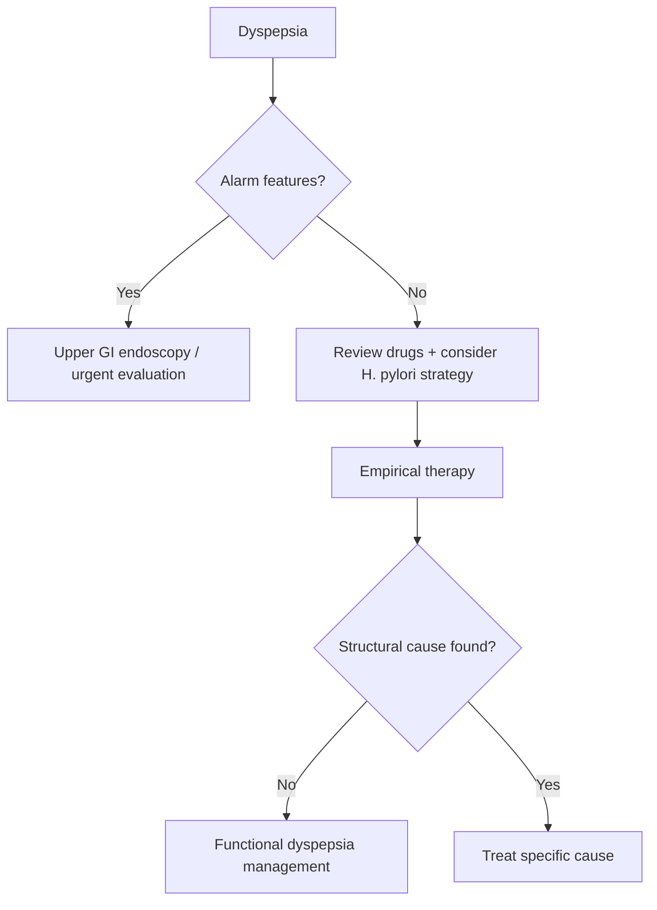

# Functional dyspepsia

Related: [[../Gastroenterology MOC|Gastroenterology MOC]] · [[../Stomach and Duodenal Disorders|Stomach and Duodenal Disorders]] · [[Dyspepsia spectrum|Dyspepsia spectrum]] · [[Helicobacter pylori infection]] · [[Duodenal ulcer disease]] · [[../Symptom Patterns and Diagnostic Approach/Alarm features in dyspepsia and weight loss|Alarm features in dyspepsia and weight loss]]

## 1. Learning Objectives
- Define functional dyspepsia and recognize its symptom subtypes.
- Distinguish it from organic dyspepsia, peptic ulcer disease, and gastric cancer.
- Use alarm-feature logic to decide when endoscopy is needed.
- Outline practical management for FCPS/MRCP answers.

## 2. Definition
**Functional dyspepsia (FD)** is chronic dyspeptic symptoms without an explanatory structural, inflammatory, or biochemical cause on routine evaluation.

### Core symptom domains
- epigastric pain/burning
- postprandial fullness
- early satiety

## 3. Anatomy
Relevant anatomy is upper GI mucosal and motor function involving:
- stomach fundus and antrum
- pylorus and proximal duodenum
- visceral afferent pathways

## 4. Physiology
Mechanisms implicated in FD include:
- impaired gastric accommodation
- visceral hypersensitivity
- altered gastric emptying in some patients
- brain-gut axis dysfunction
- psychosocial amplification of symptom perception

## 5. Classification
### Symptom-based subtypes
1. **Postprandial distress syndrome (PDS)**
   - postprandial fullness
   - early satiety
2. **Epigastric pain syndrome (EPS)**
   - epigastric pain/burning

Many patients have overlap.

## 6. Etiology / Risk Factors
- prior gastroenteritis in some cases
- psychosocial stress/anxiety
- altered visceral sensitivity
- possible H. pylori association in selected patients
- dietary triggers in susceptible individuals

## 7. Pathophysiology
FD is not a simple acid disorder. Symptoms arise from interaction of:
- altered gastric sensorimotor function
- mucosal/immune activation in some patients
- central processing of visceral sensation

## 8. Clinical Features
- upper abdominal discomfort centered in epigastrium
- post-meal fullness
- early satiety
- epigastric burning/pain
- nausea may coexist
- bloating may occur

### What usually points away from pure FD
- progressive dysphagia
- overt GI bleeding
- anaemia
- persistent vomiting
- unintentional weight loss
- palpable mass
- jaundice or hepatobiliary pattern

## 9. Investigations
### Initial approach
Most diagnosis is clinical **after exclusion of alarm features and important organic disease**.

### Basic evaluation
- history and examination
- medication review: NSAIDs, iron, steroids, etc.
- CBC if anaemia suspected
- H. pylori testing strategy where appropriate

### When to do upper GI endoscopy
- alarm features present
- older patient / high-risk context with new persistent dyspepsia
- failure of reasonable empirical therapy
- recurrent vomiting / anaemia / weight loss / GI bleed

## 10. Interpretation Framework
### Dyspepsia logic
1. Confirm this is upper abdominal dyspepsia, not biliary pain or cardiac pain.
2. Look for alarm features.
3. Exclude NSAID injury, ulcer disease, gastric malignancy, and H. pylori-related disease.
4. If no structural explanation and persistent symptom complex fits FD → diagnose functional dyspepsia.

## 11. Diagnosis
Functional dyspepsia is diagnosed when:
- chronic dyspeptic symptoms are present
- no alarming organic explanation is found on routine evaluation
- upper GI structural disease does not explain symptoms when investigated

## 12. Differential Diagnosis
- [[Helicobacter pylori infection]]
- [[Duodenal ulcer disease]]
- gastric ulcer / gastric cancer
- GERD
- biliary colic
- pancreatobiliary disease
- medication-related dyspepsia
- gastroparesis
- cardiac ischaemia presenting atypically

## 13. Management
### General measures
- explanation and reassurance
- identify food-related triggers
- small frequent meals if helpful
- avoid NSAIDs where possible

### H. pylori strategy
- test and eradicate if indicated/positive
- some patients improve after eradication

### Drug treatment
- **PPI trial** especially if pain/burning prominent
- **prokinetic-oriented approach** if meal-related fullness/early satiety dominant
- low-dose neuromodulator strategies in selected refractory cases

### Psychosocial care
- anxiety/stress management may help symptom burden
- functional GI disorders often require explanation rather than repeated negative testing alone

## 14. Complications
FD does not itself cause bleeding or malignancy, but complications arise from:
- impaired quality of life
- repeated healthcare visits
- weight loss from food avoidance in severe cases
- mislabelling organic disease as functional

## 15. Red Flags / Emergencies
Functional dyspepsia has **no intrinsic emergency**, but these features mean reconsider diagnosis urgently:
- haematemesis/melaena
- anaemia
- progressive vomiting
- weight loss
- dysphagia
- palpable mass

## 16. One-Page Summary
- Functional dyspepsia = chronic dyspepsia without explanatory organic lesion.
- Core symptoms: epigastric pain/burning, early satiety, postprandial fullness.
- Subtypes: **PDS** and **EPS**.
- Always look for alarm features before calling it functional.
- Exclude ulcer disease, malignancy, NSAID injury, H. pylori-related disease, GERD, biliary pain.
- Management: explanation + trigger review + H. pylori strategy + PPI/prokinetic-based treatment.

## 17. FCPS/MRCP High-Yield Points
- FD is a **diagnosis after appropriate exclusion**, not after exhaustive unnecessary testing.
- Early satiety and postprandial fullness suggest PDS.
- Epigastric pain/burning suggests EPS.
- Alarm features change the pathway to endoscopy.

## 18. Common Viva Traps
- Calling weight-loss dyspepsia “functional”.
- Forgetting H. pylori assessment.
- Overlooking NSAID use.
- Confusing GERD with dyspepsia.

## 19. Mind Map
- Functional dyspepsia
  - Symptoms
    - postprandial fullness
    - early satiety
    - epigastric pain
  - Subtypes
    - PDS
    - EPS
  - Exclude
    - ulcer
    - cancer
    - GERD
    - biliary disease
  - Manage
    - explanation
    - H. pylori strategy
    - PPI
    - prokinetic approach

## 20. Flowchart

## 21. Revision Prompts
- What is the definition of functional dyspepsia?
- Distinguish PDS from EPS.
- What alarm features exclude a casual FD diagnosis?
- How do you manage persistent FD symptoms?

## 22. MCQs (10)
1. Functional dyspepsia is best defined as:
A. Dyspepsia due to gastric cancer
B. Chronic dyspeptic symptoms without explanatory organic disease on routine evaluation
C. Dysphagia due to stroke
D. Bleeding ulcer disease

2. Postprandial fullness and early satiety are typical of:
A. PDS
B. Acute pancreatitis
C. Ulcerative colitis
D. Haemorrhoids

3. Epigastric pain syndrome is characterized mainly by:
A. Rectal bleeding
B. Epigastric pain or burning
C. Dysphagia only
D. Steatorrhoea only

4. Which is an alarm feature in dyspepsia?
A. Mild bloating
B. Weight loss
C. Belching
D. Transient nausea

5. Before diagnosing FD, an important reversible association to consider is:
A. H. pylori infection
B. Stroke
C. Renal stone
D. Asthma

6. Which drug commonly causes organic dyspepsia and must be reviewed?
A. NSAID
B. Insulin
C. Salbutamol
D. Levothyroxine

7. Which statement is correct?
A. FD always causes GI bleeding
B. FD is an emergency condition
C. FD often overlaps with altered gut-brain interaction
D. FD always requires surgery

8. Which symptom cluster best fits PDS?
A. Early satiety and meal-related fullness
B. Massive haematemesis
C. Progressive dysphagia
D. Jaundice

9. A normal endoscopy in persistent dyspepsia with compatible symptoms supports:
A. Functional dyspepsia if no other cause explains symptoms
B. Colon cancer
C. Acute cholecystitis
D. Oesophageal perforation

10. First-line empirical therapy often includes:
A. Lifelong antibiotics
B. PPI-based approach
C. Immediate colectomy
D. Thrombolysis

## 23. SBA Questions (10)
1. A 28-year-old woman has 8 months of early satiety and postprandial fullness, normal examination, no weight loss, and normal basic work-up. Best syndrome label?
A. Postprandial distress syndrome
B. Massive upper GI bleed
C. Achalasia
D. Acute severe ulcerative colitis

2. A 60-year-old man presents with new persistent dyspepsia and weight loss. Best next step?
A. Reassure only
B. Upper GI endoscopy
C. Oral iron only
D. Loperamide

3. A patient has persistent epigastric burning; endoscopy is normal and no alarm feature is present. Best next concept?
A. Functional dyspepsia remains possible
B. Therefore cancer is proven
C. Therefore pancreatitis is certain
D. Therefore no treatment is needed

4. Which feature most supports functional rather than structural disease?
A. Chronic meal-related fullness without alarm signs
B. Haematemesis
C. Iron-deficiency anaemia
D. Progressive dysphagia

5. Which action is especially important before diagnosing FD?
A. Review NSAID use and alarm features
B. Bone marrow biopsy
C. Pleural aspiration
D. Cataract surgery

6. A patient with FD and positive H. pylori test should generally:
A. Be considered unrelated always
B. Be offered eradication strategy
C. Receive thrombolysis
D. Receive colonoscopy first only

7. Early satiety in FD is mainly classified under:
A. PDS
B. EPS
C. Crohn disease
D. IBS with constipation only

8. Which is a common management pillar?
A. Explanation and reassurance
B. Emergency laparotomy
C. Chemotherapy
D. Haemodialysis

9. Which of the following argues against simple FD?
A. Postprandial fullness
B. Epigastric pain
C. Weight loss and vomiting
D. Normal examination

10. A refractory functional dyspepsia patient may need:
A. No follow-up ever
B. Stepwise symptom-directed therapy and reconsideration of diagnosis
C. Automatic surgery
D. Stroke rehabilitation

## 24. Flashcards
- Q: What are the 2 main FD subtypes?  
  A: Postprandial distress syndrome and epigastric pain syndrome.
- Q: Name 2 core symptoms of PDS.  
  A: Early satiety and postprandial fullness.
- Q: What symptom defines EPS?  
  A: Epigastric pain or burning.
- Q: What important infection should be considered in dyspepsia?  
  A: H. pylori.
- Q: What must be excluded before labeling dyspepsia functional?  
  A: Alarm-feature organic disease such as ulcer or cancer.

## 25. Answer Key with Explanations
### MCQs
1. **B** — FD is dyspepsia without explanatory organic disease on routine evaluation.
2. **A** — this is classic PDS.
3. **B** — EPS centers on epigastric pain/burning.
4. **B** — weight loss is an alarm feature.
5. **A** — H. pylori is important to assess.
6. **A** — NSAIDs can cause organic dyspeptic disease.
7. **C** — FD is a gut-brain interaction disorder, not an emergency or bleeding condition.
8. **A** — PDS is meal-related fullness/early satiety.
9. **A** — normal structural evaluation supports FD if no other cause exists.
10. **B** — PPI-based empirical therapy is commonly used.

### SBAs
1. **A** — classic PDS.
2. **B** — new dyspepsia with weight loss requires endoscopy.
3. **A** — compatible symptoms with normal endoscopy can fit FD.
4. **A** — chronic symptoms without alarms fit FD best.
5. **A** — review drugs and alarm signs first.
6. **B** — H. pylori eradication is appropriate when positive.
7. **A** — early satiety belongs to PDS.
8. **A** — explanation and reassurance are core.
9. **C** — weight loss and vomiting argue against straightforward FD.
10. **B** — refractory symptoms need re-evaluation and stepwise care.

## 26. Must Know / Should Know / Nice to Know
### Must Know
- Functional dyspepsia = Rome IV: bothersome postprandial fullness/early satiety/epigastric pain/burning + no structural cause
- Subtypes: PDS (meal-related) vs EPS (pain-specific); overlap common
- Alarm features → endoscopy; <60yo no alarms → test-and-treat H. pylori
- Management: H. pylori eradication first → PPI 4-8w → prokinetic for PDS → TCA for EPS → neuromodulators
- Exclude: PUD, GERD, malignancy, pancreatic, biliary, medication-induced

### Should Know
- Advanced management options
- Special populations (pregnancy, elderly)
- Emerging therapies

### Nice to Know
- Molecular pathogenesis
- Genetic risk scores
- Global epidemiology

## 27. Self-Test Scorecard
- Can I define the condition? /10
- Can I list 4 diagnostic criteria? /10
- Can I outline the management algorithm? /10
- Can I name 3 complications? /10

**Interpretation:**
- **<35/40** = weak topic
- **35-36/40** = acceptable but insecure
- **37+/40** = exam-ready

