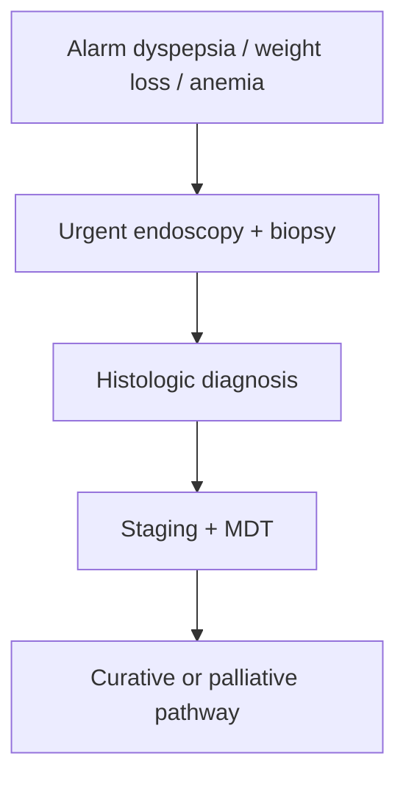

# Gastric adenocarcinoma

Related: [[../Gastroenterology MOC|Gastroenterology MOC]] · [[../Stomach and Duodenal Disorders|Stomach and Duodenal Disorders]] · [[Gastric ulcer disease]]

> [!warning]
> Think of gastric adenocarcinoma in **persistent dyspepsia with alarm features**, weight loss, anemia, vomiting, or early satiety.

## 1. Learning Objectives
- Recognize the presentation of gastric cancer.
- Understand major risk backgrounds.
- Outline diagnosis and staging principles.
- Distinguish curative from palliative thinking.

## 2. Definition
Gastric adenocarcinoma is the commonest primary malignant epithelial tumor of the stomach.

## 3. Risk Background
- H pylori-related carcinogenic pathway
- chronic atrophic/metaplastic changes
- dietary/environmental influences
- older age and alarm-feature phenotype

## 4. Clinical Features
- persistent dyspepsia or epigastric discomfort
- weight loss/anorexia
- early satiety
- vomiting or outlet-obstruction-type symptoms
- anemia/occult bleeding

## 5. Investigations
- urgent upper GI endoscopy with biopsy
- staging imaging after histologic confirmation
- nutritional assessment and MDT review

## 6. Management Principles
- stage disease and assess operability
- curative surgery/perioperative oncology when appropriate
- palliative/supportive pathway when advanced
- nutrition and symptom relief matter greatly

## 7. Red Flags
- new dyspepsia with weight loss
- persistent vomiting
- iron-deficiency anemia/bleeding
- early satiety and progressive decline

## 8. FCPS/MRCP High-Yield Points
- Gastric cancer may masquerade as dyspepsia.
- Alarm features should trigger urgent endoscopy.
- Biopsy is essential.

## 9. Common Viva Traps
- Treating persistent alarm dyspepsia empirically for too long.
- Forgetting cancer behind a “gastric ulcer”.
- Ignoring nutrition and obstruction issues.

## 10. One-Page Summary
- Gastric adenocarcinoma often presents with dyspepsia plus alarm features.
- Diagnose with endoscopic biopsy.
- Stage, decide intent, and manage in MDT.

## 11. Mind Map
- Gastric cancer
  - dyspepsia
  - weight loss
  - early satiety
  - anemia
  - biopsy
  - stage

## 12. Flowchart

## 13. MCQs (10)
1. Gastric adenocarcinoma may present as:
   - A. Persistent dyspepsia with alarm features
   - B. Polyuria only
   - C. Rhinitis only
   - D. Hematuria only
   - **Answer: A**
2. A major alarm feature is:
   - A. Weight loss
   - B. Sneezing
   - C. Dry scalp
   - D. Mild hiccup only
   - **Answer: A**
3. Key diagnostic test:
   - A. Upper GI endoscopy with biopsy
   - B. Audiogram
   - C. Spirometry
   - D. EEG
   - **Answer: A**
4. Which symptom suggests gastric outlet involvement?
   - A. Persistent vomiting/early satiety
   - B. Dysuria
   - C. Polyphagia
   - D. Otalgia
   - **Answer: A**
5. Which risk pathway is important?
   - A. H pylori-related carcinogenesis
   - B. Asthma only
   - C. Rhinitis only
   - D. Cataract only
   - **Answer: A**
6. A common trap is:
   - A. Treating alarm dyspepsia empirically for too long
   - B. Asking about anorexia
   - C. Considering biopsy
   - D. Reviewing vomiting
   - **Answer: A**
7. After tissue diagnosis, the next key step is:
   - A. Staging
   - B. Ignore extent
   - C. Stop all evaluation
   - D. Audiometry
   - **Answer: A**
8. Which issue is important in advanced disease?
   - A. Nutritional and palliative support
   - B. No symptom control needed
   - C. Cancer never obstructs
   - D. Weight loss is irrelevant
   - **Answer: A**
9. Which pathology can mimic gastric ulcer disease?
   - A. Gastric adenocarcinoma
   - B. Otitis
   - C. UTI
   - D. Rhinitis
   - **Answer: A**
10. Best summary?
   - A. Alarm-feature dyspepsia needs urgent endoscopy to exclude gastric cancer
   - B. Dyspepsia never hides cancer
   - C. Biopsy is optional
   - D. Weight loss is non-specific and irrelevant
   - **Answer: A**

## 14. SBA Questions (10)
1. A 64-year-old with new dyspepsia, weight loss, and early satiety most needs:
   - A. Urgent upper GI endoscopy with biopsy
   - B. Reassurance only
   - C. Stool culture only
   - D. Bronchodilator only
   - **Answer: A**
2. Which is a dangerous error?
   - A. Delaying endoscopy in alarm-feature dyspepsia
   - B. Asking about vomiting
   - C. Reviewing anemia
   - D. Considering cancer
   - **Answer: A**
3. Which symptom cluster best fits gastric cancer?
   - A. Dyspepsia, weight loss, early satiety, anemia
   - B. Polyuria, polydipsia, dysuria
   - C. Wheeze, cough, hemoptysis
   - D. Photophobia, diplopia, ataxia
   - **Answer: A**
4. Why is biopsy essential?
   - A. To establish histologic diagnosis
   - B. To treat obstruction directly
   - C. To diagnose asthma
   - D. To measure eGFR
   - **Answer: A**
5. What may mimic benign gastric ulcer disease?
   - A. Gastric adenocarcinoma
   - B. Hay fever
   - C. Otitis externa
   - D. Dry scalp
   - **Answer: A**
6. What follows diagnosis?
   - A. Staging and MDT planning
   - B. No further workup
   - C. Blind PPI therapy only forever
   - D. Eye examination only
   - **Answer: A**
7. Which risk factor/pathway is relevant?
   - A. H pylori-associated carcinogenic change
   - B. Hearing aid use
   - C. Myopia
   - D. Acne
   - **Answer: A**
8. Best exam pearl?
   - A. New dyspepsia with alarm features in older patients is cancer until excluded
   - B. Weight loss argues against cancer
   - C. Endoscopy is optional in vomiting/anemia
   - D. Cancer never causes early satiety
   - **Answer: A**
9. Which management issue matters even in advanced disease?
   - A. Nutrition and palliation
   - B. Ignore symptoms
   - C. Never relieve obstruction
   - D. Avoid MDT discussion
   - **Answer: A**
10. Best summary?
   - A. Biopsy, stage, and treat with clear curative-vs-palliative intent
   - B. Treat all as functional dyspepsia
   - C. Ignore alarm features
   - D. Never think of cancer in gastric ulcer-like symptoms
   - **Answer: A**

## 15. Flashcards
- Q: What common symptoms suggest gastric adenocarcinoma?
  A: Persistent dyspepsia, weight loss, early satiety, vomiting, anemia.
- Q: What test confirms diagnosis?
  A: Endoscopy with biopsy.
- Q: What major bacterium-related pathway is linked?
  A: H pylori-related carcinogenesis.
- Q: What follows diagnosis?
  A: Staging and MDT planning.
- Q: What common trap must be avoided?
  A: Delaying endoscopy in alarm-feature dyspepsia.

## 16. Must Know / Should Know / Nice to Know
### Must Know
- Gastric cancer = adenocarcinoma >90%, often advanced at presentation
- Risk: H. pylori, smoked/salted foods, smoking, family history, blood group A
- Early gastric cancer (EGC): confined to mucosa/submucosa - ESD candidate
- Advanced: linitis plastica, Borrmann classification
- Signs: Virchow node, Sister Mary Joseph, Krukenberg, Blumer

### Should Know
- Lauren classification: intestinal vs diffuse
- HER2 testing for advanced disease (trastuzumab)
- Perioperative chemo (FLOT) for resectable
- D2 lymphadenectomy standard

### Nice to Know
- Molecular subtypes (TCGA): EBV, MSI, CIN, GS
- Immunotherapy in MSI-H
- HIPEC for peritoneal mets

## 17. Self-Test Scorecard
- Can I name the risk factors for gastric cancer? /10
- Can I distinguish early from advanced gastric cancer? /10
- Can I outline the staging and treatment algorithm? /10

**Interpretation:**
- **<35/40** = weak topic
- **35-36/40** = acceptable but insecure
- **37+/40** = exam-ready

## 18. Revision Prompts
What is the main risk factor for gastric adenocarcinoma?
How does H. pylori cause gastric cancer?
What is early gastric cancer and how is it treated?

## 19. Answer Key with Explanations

