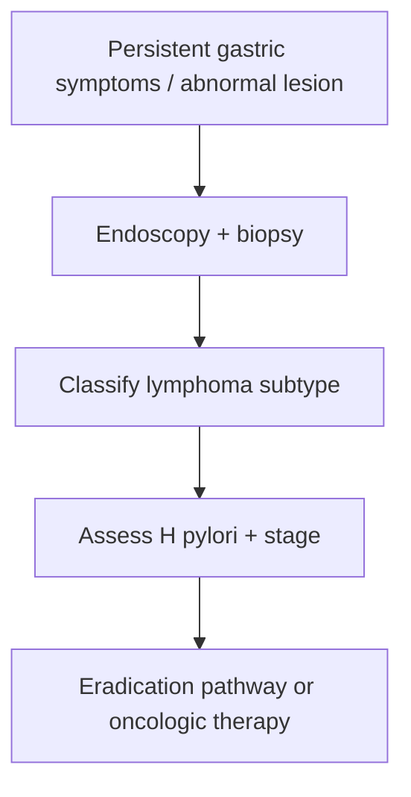

# Gastric lymphoma and MALT-related disease

Related: [[../Gastroenterology MOC|Gastroenterology MOC]] · [[../Stomach and Duodenal Disorders|Stomach and Duodenal Disorders]] · [[Helicobacter pylori infection]] · [[Gastric adenocarcinoma]]

> [!important]
> MALT-related gastric lymphoma is exam-important because of its strong relationship with **H pylori** and because some cases improve with eradication therapy.

## 1. Learning Objectives
- Define gastric lymphoma and MALT-related disease.
- Recognize the H pylori association.
- Understand diagnosis and staging principles.
- Outline treatment concepts.

## 2. Definition
Gastric lymphoma refers to primary lymphoid malignancy involving the stomach. MALT lymphoma is a key indolent subtype arising from mucosa-associated lymphoid tissue.

## 3. Pathophysiology / Association
- chronic H pylori-driven lymphoid stimulation is a classic pathogenic association for MALT lymphoma
- higher-grade lymphomas behave more aggressively and require broader oncologic treatment

## 4. Clinical Features
- dyspepsia/epigastric discomfort
- nausea or early satiety
- bleeding or anemia
- weight loss in more advanced disease
- presentation may mimic ordinary gastritis or gastric cancer

## 5. Investigations
- endoscopy with multiple biopsies
- histopathology/lymphoma classification
- staging after diagnosis
- H pylori assessment is important

## 6. Management Principles
- H pylori eradication is central in relevant MALT disease
- oncology/hematology pathway for higher-grade or persistent disease
- endoscopic and imaging follow-up according to stage/response

## 7. Red Flags
- bleeding/anemia
- weight loss
- obstruction or progressive symptoms
- failure to respond when disease is not simple H pylori-driven MALT biology

## 8. FCPS/MRCP High-Yield Points
- Gastric MALT lymphoma is strongly linked to H pylori.
- Endoscopic biopsy is essential.
- Not all gastric lymphomas are treated the same; subtype and stage matter.

## 9. Common Viva Traps
- Forgetting to test/treat H pylori.
- Treating all gastric lymphomas like adenocarcinoma.
- Missing the diagnosis because symptoms resemble ordinary dyspepsia.

## 10. One-Page Summary
- Gastric lymphoma can mimic common dyspeptic disease.
- MALT lymphoma has an important H pylori link.
- Diagnose by biopsy and stage before choosing therapy.

## 11. Mind Map
- Gastric lymphoma
  - MALT
  - H pylori
  - biopsy
  - stage
  - eradication vs oncology

## 12. Flowchart

## 13. MCQs (10)
1. Gastric MALT lymphoma is classically associated with:
   - A. H pylori
   - B. Asthma
   - C. Cataract
   - D. Migraine
   - **Answer: A**
2. The key diagnostic test is:
   - A. Endoscopy with biopsy
   - B. Spirometry
   - C. Audiogram
   - D. EEG
   - **Answer: A**
3. Which symptom profile may occur?
   - A. Dyspepsia, anemia, early satiety
   - B. Polyuria only
   - C. Rhinitis only
   - D. Otalgia only
   - **Answer: A**
4. Why is MALT lymphoma high-yield in exams?
   - A. Some cases respond to H pylori eradication
   - B. It always needs immediate gastrectomy
   - C. It never requires biopsy
   - D. It is identical to IBS
   - **Answer: A**
5. Which statement is true?
   - A. Not all gastric lymphomas are managed the same way
   - B. All are treated exactly like adenocarcinoma
   - C. H pylori never matters
   - D. Histology is irrelevant
   - **Answer: A**
6. A common trap is:
   - A. Forgetting H pylori in gastric MALT disease
   - B. Taking biopsies
   - C. Staging disease
   - D. Classifying subtype
   - **Answer: A**
7. Which feature raises concern for more advanced/aggressive disease?
   - A. Weight loss/bleeding/progression
   - B. Mild isolated burping only
   - C. Dry scalp
   - D. Sneezing
   - **Answer: A**
8. After diagnosis, what matters next?
   - A. Staging and subtype classification
   - B. No further assessment
   - C. Only stool culture
   - D. Only hearing test
   - **Answer: A**
9. Why can this diagnosis be missed?
   - A. It can mimic ordinary dyspepsia/gastritis
   - B. It always presents with massive hematemesis
   - C. It always causes jaundice first
   - D. It always causes dysphagia first
   - **Answer: A**
10. Best summary?
   - A. Gastric lymphoma needs biopsy diagnosis, H pylori assessment, and subtype-directed treatment
   - B. It is diagnosed by symptoms alone
   - C. Eradication therapy never matters
   - D. Histology is optional
   - **Answer: A**

## 14. SBA Questions (10)
1. A patient has dyspepsia and a gastric lesion biopsied as MALT lymphoma. Next important treatment principle?
   - A. Assess and eradicate H pylori if relevant
   - B. Ignore H pylori
   - C. Treat as IBS
   - D. Reassure only
   - **Answer: A**
2. Which is a dangerous error?
   - A. Forgetting the H pylori link in gastric MALT disease
   - B. Taking biopsies
   - C. Staging the disease
   - D. Classifying lymphoma subtype
   - **Answer: A**
3. Why is histology essential?
   - A. It distinguishes lymphoma subtype and guides therapy
   - B. It cures the disease
   - C. It replaces staging
   - D. It diagnoses asthma
   - **Answer: A**
4. Which symptom combination can occur?
   - A. Epigastric discomfort, anemia, early satiety
   - B. Polyuria, polydipsia, dysuria
   - C. Wheeze, cough, hemoptysis
   - D. Diplopia, ptosis, ataxia
   - **Answer: A**
5. Why is gastric lymphoma not identical to gastric adenocarcinoma?
   - A. Biology and treatment pathways differ
   - B. They are the same disease
   - C. Both always need identical surgery
   - D. H pylori is never relevant
   - **Answer: A**
6. What should follow biopsy diagnosis?
   - A. Staging
   - B. No further assessment
   - C. Avoid MDT review
   - D. Ignore symptoms
   - **Answer: A**
7. Which feature may suggest more aggressive disease?
   - A. Progressive weight loss and bleeding
   - B. Stable rhinitis only
   - C. Mild hiccups only
   - D. Dry lips only
   - **Answer: A**
8. Best exam pearl?
   - A. Gastric MALT lymphoma is one of the key places where H pylori eradication has oncologic importance
   - B. H pylori has no role in gastric lymphoma
   - C. Biopsy is unnecessary
   - D. All lymphoma is purely surgical
   - **Answer: A**
9. Which test confirms diagnosis?
   - A. Gastric biopsy histology
   - B. ECG
   - C. Spirometry
   - D. Audiometry
   - **Answer: A**
10. Best summary?
   - A. Diagnose by biopsy, classify and stage, then treat according to MALT/H pylori versus more aggressive lymphoma biology
   - B. Treat all as gastritis forever
   - C. Ignore anemia
   - D. Never test for H pylori
   - **Answer: A**

## 15. Flashcards
- Q: Which gastric lymphoma subtype is classically linked to H pylori?
  A: MALT lymphoma.
- Q: What test confirms gastric lymphoma?
  A: Endoscopic biopsy with histology.
- Q: Why is subtype classification important?
  A: Because treatment differs between indolent MALT disease and higher-grade lymphoma.
- Q: What major management step may help MALT disease?
  A: H pylori eradication.
- Q: What common trap must be avoided?
  A: Forgetting the H pylori association.

## 16. Must Know / Should Know / Nice to Know
### Must Know
- MALT lymphoma = B-cell lymphoma from chronic H. pylori gastritis
- H. pylori eradication = first-line for early stage (90% remission)
- t(11;18) translocation predicts non-response to eradication
- Staging: EUS, CT, PET, bone marrow
- Advanced: rituximab + chemo (CHOP/R-CHOP)

### Should Know
- DLBCL of stomach may arise from MALT transformation
- IGF1/MALT1 fusion
- Response assessment by endoscopy + biopsy

### Nice to Know
- Low-dose radiation for localized
- Maintenance rituximab trials

## 17. Self-Test Scorecard
- Can I explain the H. pylori → MALT lymphoma pathway? /10
- Can I name the first-line treatment for localized gastric MALT? /10
- Can I identify the feature predicting eradication failure? /10

**Interpretation:**
- **<35/40** = weak topic
- **35-36/40** = acceptable but insecure
- **37+/40** = exam-ready

## 18. Revision Prompts
How does H. pylori cause gastric MALT lymphoma?
When is H. pylori eradication alone insufficient?

## 19. Answer Key with Explanations

