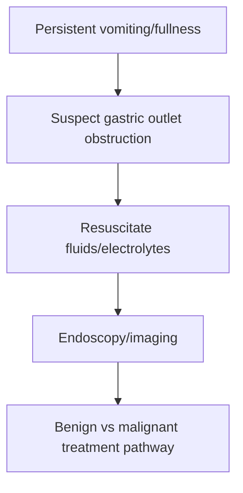

# Gastric outlet obstruction

Related: [[../Gastroenterology MOC|Gastroenterology MOC]] · [[../Stomach and Duodenal Disorders|Stomach and Duodenal Disorders]] · [[Perforated peptic ulcer]] · [[Gastric adenocarcinoma]]

> [!important]
> Gastric outlet obstruction causes **persistent postprandial vomiting and retained gastric contents**; think of both peptic scarring and malignancy.

## 1. Learning Objectives
- Define gastric outlet obstruction.
- Recognize its symptom pattern.
- Understand major benign and malignant causes.
- Outline management priorities.

## 2. Definition
Gastric outlet obstruction is mechanical blockage at the distal stomach/pylorus/proximal duodenum causing impaired gastric emptying.

## 3. Causes
- chronic peptic ulcer scarring/edema
- gastric or peri-pyloric malignancy
- other obstructing lesions at the outlet region

## 4. Clinical Features
- recurrent vomiting, often of stale food
- early satiety/fullness
- epigastric distension
- dehydration and weight loss

## 5. Examination / Metabolic Clues
- dehydration
- visible epigastric fullness/succussion splash in classic teaching
- electrolyte disturbance from vomiting may occur

## 6. Investigations
- upper GI endoscopy
- imaging when malignancy/extent is a concern
- assess fluid/electrolyte consequences

## 7. Management
- rehydrate and correct electrolytes
- gastric decompression if needed
- identify cause
- definitive treatment depends on benign versus malignant pathology

## 8. Red Flags
- significant weight loss
- anemia/bleeding
- older patient/new obstruction symptoms
- persistent inability to tolerate oral intake

## 9. FCPS/MRCP High-Yield Points
- Stale-food vomiting is classic.
- Think peptic ulcer scarring and cancer.
- Correct fluid/electrolyte problems early.

## 10. Common Viva Traps
- Treating repeated vomiting as simple gastritis.
- Forgetting malignancy.
- Ignoring metabolic consequences of prolonged vomiting.

## 11. One-Page Summary
- Gastric outlet obstruction = blocked gastric emptying.
- Main clues: postprandial fullness, stale vomiting, dehydration, weight loss.
- Endoscopy and cause-directed treatment are essential.

## 12. Mind Map
- GOO
  - peptic scar
  - cancer
  - vomiting stale food
  - dehydration
  - endoscopy
  - decompression

## 13. Flowchart

## 14. MCQs (10)
1. Gastric outlet obstruction most commonly causes:
   - A. Persistent vomiting
   - B. Hematuria
   - C. Polyuria
   - D. Diplopia
   - **Answer: A**
2. A classic vomitus clue is:
   - A. Stale retained food
   - B. Pure bile always
   - C. Urine
   - D. Sputum
   - **Answer: A**
3. A benign cause is:
   - A. Peptic ulcer scarring
   - B. Otitis externa
   - C. Rhinitis
   - D. Myopia
   - **Answer: A**
4. An important malignant cause is:
   - A. Gastric cancer
   - B. Asthma
   - C. Migraine
   - D. Acne
   - **Answer: A**
5. Early management includes:
   - A. Rehydration and electrolyte correction
   - B. Encourage repeated oral meals
   - C. Ignore vomiting
   - D. Bronchodilator only
   - **Answer: A**
6. Key investigation:
   - A. Upper GI endoscopy
   - B. EEG
   - C. Audiogram
   - D. Spirometry
   - **Answer: A**
7. A common trap is:
   - A. Missing malignancy in outlet obstruction
   - B. Asking about weight loss
   - C. Correcting fluids
   - D. Considering decompression
   - **Answer: A**
8. Which examination clue is classic?
   - A. Succussion splash/fullness
   - B. Clubbing only
   - C. Rash only
   - D. Hemarthrosis
   - **Answer: A**
9. Which systemic consequence is expected?
   - A. Dehydration/electrolyte disturbance
   - B. Hyperacusis
   - C. Alopecia only
   - D. Pure hemoptysis
   - **Answer: A**
10. Best summary?
   - A. Recurrent stale vomiting should trigger consideration of distal gastric obstruction from benign or malignant disease
   - B. Vomiting excludes obstruction
   - C. Endoscopy is irrelevant
   - D. Weight loss does not matter
   - **Answer: A**

## 15. SBA Questions (10)
1. A patient reports repeated vomiting of food eaten the previous day, early satiety, and weight loss. Best diagnosis to consider?
   - A. Gastric outlet obstruction
   - B. Simple GERD
   - C. IBS
   - D. Hemorrhoids
   - **Answer: A**
2. What is the best first management principle?
   - A. Restore fluids/electrolytes and evaluate the obstruction
   - B. Encourage normal diet immediately
   - C. Give laxatives only
   - D. Ignore the vomiting pattern
   - **Answer: A**
3. Which is a dangerous error?
   - A. Treating obstructive vomiting as uncomplicated gastritis
   - B. Asking about weight loss
   - C. Arranging endoscopy
   - D. Correcting dehydration
   - **Answer: A**
4. Which cause must be excluded in an older patient?
   - A. Gastric malignancy
   - B. Rhinitis
   - C. Dry scalp
   - D. Otitis media
   - **Answer: A**
5. Which benign pathology can lead to obstruction?
   - A. Chronic peptic scarring
   - B. Asthma
   - C. Migraine
   - D. Cystitis
   - **Answer: A**
6. What simple bedside issue should not be neglected?
   - A. Dehydration
   - B. Hearing loss
   - C. Vision testing
   - D. Knee reflexes
   - **Answer: A**
7. Why is endoscopy important?
   - A. It helps define the obstructing cause
   - B. It treats asthma
   - C. It diagnoses stroke
   - D. It measures eGFR
   - **Answer: A**
8. Best exam pearl?
   - A. Vomiting of stale food is a classic clue to outlet obstruction
   - B. Stale vomiting rules obstruction out
   - C. Outlet obstruction never causes weight loss
   - D. Cancer is not relevant
   - **Answer: A**
9. Which additional procedure may be needed early in severe cases?
   - A. Gastric decompression
   - B. Dialysis
   - C. Pleural tap
   - D. Bronchoscopy
   - **Answer: A**
10. Best summary?
   - A. Rehydrate, decompress if needed, identify the cause, then treat benign vs malignant disease accordingly
   - B. Force oral intake without assessment
   - C. Ignore metabolic consequences
   - D. Never consider cancer
   - **Answer: A**

## 16. Flashcards
- Q: What is the classic vomitus clue in gastric outlet obstruction?
  A: Vomiting of stale retained food.
- Q: Name 2 major causes.
  A: Peptic ulcer scarring and gastric malignancy.
- Q: What immediate consequences need correction?
  A: Dehydration and electrolyte disturbance.
- Q: What key investigation helps define cause?
  A: Upper GI endoscopy.
- Q: What common trap should be avoided?
  A: Missing cancer in obstructive vomiting.

## 17. Must Know / Should Know / Nice to Know
### Must Know
- GOO = mechanical obstruction of pyloric channel/duodenum
- Causes: PUD scarring (benign), gastric cancer (malignant), pancreatic cancer
- Presentation: post-prandial vomiting, succussion splash, weight loss
- Investigation: endoscopy (diagnose + biopsy), CT for staging
- Benign: endoscopic balloon dilation; malignant: stent/surgery

### Should Know
- Succussion splash = retained gastric contents >4-6h
- Nasojejunal feeding if delayed surgery
- Pyloroplasty for benign refractory

### Nice to Know
- SEMS types and migration rates
- Endoscopic pyloromyotomy (G-POEM)

## 18. Self-Test Scorecard
- Can I list the causes of gastric outlet obstruction? /10
- Can I distinguish benign from malignant obstruction? /10
- Can I outline the endoscopic management options? /10

**Interpretation:**
- **<35/40** = weak topic
- **35-36/40** = acceptable but insecure
- **37+/40** = exam-ready

## 19. Revision Prompts
What are the common causes of gastric outlet obstruction?
How is benign GOO managed differently from malignant?

## 20. Answer Key with Explanations

