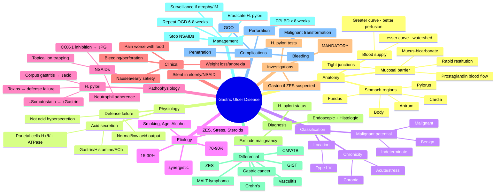
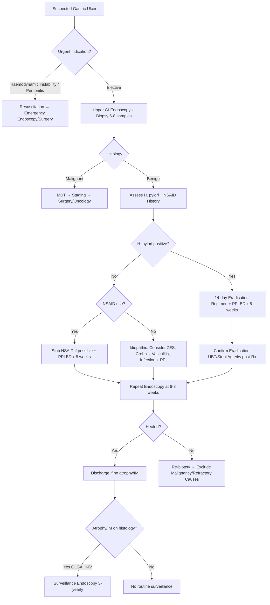

# Gastric ulcer disease

Related: [[../Gastroenterology MOC|Gastroenterology MOC]] · [[../Stomach and Duodenal Disorders|Stomach and Duodenal Disorders]] · [[Duodenal ulcer disease]] · [[Gastric adenocarcinoma]]

> [!important]
> Gastric ulcer disease must be approached more cautiously than duodenal ulcer disease because **malignancy can mimic a benign gastric ulcer**. Every gastric ulcer requires endoscopic evaluation with biopsy to exclude cancer.

## 1. Learning Objectives
- Distinguish gastric from duodenal ulcer disease in presentation, demographics, and malignant potential.
- Recognize causes and typical/atypical presentations.
- Understand why endoscopic confirmation with biopsy is mandatory.
- Outline H. pylori eradication, acid suppression, and surveillance strategy.
- Identify red flags and complications requiring urgent intervention.

## 2. Definition
**Gastric ulcer disease** is a chronic peptic ulcer occurring in the stomach mucosa due to an imbalance between mucosal defense mechanisms and acid-peptic aggression. Unlike duodenal ulcers, gastric ulcers have **significant malignant potential** (2-5% risk of gastric adenocarcinoma) and require histological confirmation of healing.

## 3. Anatomy
### Stomach regions relevant to ulcer location
- **Cardia**: proximal stomach near GOJ; ulcers here raise concern for Barrett-type or junctional malignancy.
- **Fundus**: dome above the cardiac orifice; less common ulcer site.
- **Body (corpus)**: major acid-secreting region; acid hypersecretion less common than in duodenal ulcer.
- **Antrum**: distal stomach near pylorus; most common site for gastric ulcers (antral ulcers on lesser curve).
- **Pylorus**: junction with duodenum; prepyloric ulcers share features with duodenal ulcers.

### Blood supply and mucosal defense
- **Lesser curvature** (right/left gastric arteries): most common ulcer site due to watershed vascular zone.
- **Greater curvature** (right/left gastroepiploic arteries): better perfusion, fewer ulcers.
- **Mucosal barrier**: surface mucus gel layer (bicarbonate-rich), tight epithelial junctions, rapid cell restitution, prostaglandin-mediated blood flow.

### Applied anatomy pearls
- Ulcers on the **greater curvature** or **posterior wall** are more suspicious for malignancy.
- **Lesser curve antral ulcers** are the classic benign H. pylori/NSAID ulcers.
- **Fundic ulcers** may suggest Zollinger-Ellison syndrome or malignancy.

## 4. Physiology
### Gastric acid secretion
- **Parietal cells** (oxyntic cells) in fundus/body secrete HCl via H+/K+-ATPase (proton pump).
- **Chief cells** secrete pepsinogen → activated to pepsin by acid.
- **G cells** (antrum) secrete gastrin → stimulates parietal cells and mucosal growth.
- Regulators: gastrin, histamine (ECL cells), acetylcholine (vagal). Somatostatin (D cells) inhibits acid.

### Mucosal defense mechanisms (mucosal barrier)
1. **Pre-epithelial**: mucus-bicarbonate layer (pH gradient from lumen 1-2 to epithelium 7).
2. **Epithelial**: tight junctions, hydrophobic surface phospholipids, rapid restitution (minutes).
3. **Sub-epithelial**: prostaglandin (PGE2/PGI2) mediated mucosal blood flow, bicarbonate secretion, capillary integrity.
4. **Cellular turnover**: complete epithelial regeneration every 3-5 days.

### Balance concept
- **Gastric ulcer** = **failure of defense** (not acid hypersecretion). Basal acid output usually normal/low.
- **Duodenal ulcer** = acid hypersecretion (high basal/peak) overwhelming normal duodenal defense.

## 5. Classification
### By chronicity
1. **Acute gastric ulcer** (stress ulcer, erosive gastropathy): multiple, superficial, hemorrhagic; due to acute mucosal ischemia.
2. **Chronic gastric ulcer**: single, punched-out, penetrating muscularis propria; benign or malignant.

### By location
- **Type I (most common)**: Lesser curvature of antrum/body junction.
- **Type II**: Combined gastric and duodenal ulcer.
- **Type III**: Prepyloric (within 3 cm of pylorus).
- **Type IV**: Proximal stomach (high on lesser curve or fundus) — high malignant concern.
- **Type V**: NSAID-induced, anywhere (body > antrum).

### By malignant potential
- **Benign gastric ulcer**: regular margins, smooth base, radiating folds.
- **Malignant ulcer**: irregular/heaped-up margins, nodular base, fused/absent folds, mass lesion.
- **Indeterminate**: requires repeat endoscopy with biopsy after healing trial.

## 6. Etiology / Risk Factors
### Major causes
| Cause | Mechanism | Population |
|-------|-----------|------------|
| **H. pylori** | Chronic active gastritis → ↓ somatostatin → ↑ gastrin → ↓ mucosal defense, impaired healing | 70-90% of benign ulcers |
| **NSAIDs/aspirin** | COX-1 inhibition → ↓ prostaglandins → ↓ mucus/bicarbonate/blood flow, ↑ neutrophil adherence | 15-30% (increasing with age) |
| **Combined H. pylori + NSAID** | Synergistic (additive risk) | High-risk elderly |

### Other risk factors
- **Age > 60 years**: declining mucosal defense, comorbidity, polypharmacy.
- **Smoking**: impairs healing, reduces bicarbonate/blood flow, increases recurrence.
- **Alcohol**: direct mucosal injury, not independent cause but cofactor.
- **Physiological stress** (ICU, burns, trauma): stress ulceration (Curling/Cushing ulcers).
- **Zollinger-Ellison syndrome**: gastrinoma → acid hypersecretion → multiple/recurrent ulcers.
- **Corticosteroids**: weak independent risk; mainly potentiates NSAID risk.
- **Anticoagulants/antiplatelets**: do not cause ulcers but increase bleeding severity.
- **Genetic/family history**: modest contribution.

## 7. Pathophysiology
### Core concept: Mucosal defense failure
Gastric ulcers arise when **aggressive factors** (acid, pepsin) overwhelm **defensive factors** (mucus, bicarbonate, blood flow, restitution, prostaglandins).

### H. pylori pathway
1. Colonizes antral mucosa → chronic active gastritis.
2. ↓ Somatostatin (D cell damage) → ↑ gastrin release.
3. ↑ Gastrin → parietal cell hyperplasia, but **corpus gastritis limits acid**.
4. Net effect: **impaired mucosal defense** (↓ mucus, ↓ blood flow, ↓ restitution) with normal/low acid.
5. Neutrophil elastase, ROS, VacA/CagA toxins damage epithelium.

### NSAID pathway
1. Systemic COX-1 inhibition → ↓ gastric PGE2/PGI2.
2. ↓ Mucus/bicarbonate secretion, ↓ mucosal blood flow, ↓ epithelial restitution.
3. Topical effect: ion trapping in surface epithelial cells → mitochondrial injury.
4. Neutrophil adherence to capillary endothelium → microvascular injury.

### Impaired healing hypothesis
- Even after H. pylori eradication/NSAID cessation, some ulcers heal slowly due to:
  - Persistent angiogenesis defects.
  - Altered growth factor expression (EGF, TGF-α, VEGF).
  - Fibrosis and vascular sclerosis at ulcer base.

### Why malignancy concern?
- Atrophic gastritis/intestinal metaplasia (H. pylori sequel) → dysplasia → adenocarcinoma.
- Ulcer may **be** the cancer (malignant ulcer) or **mask** cancer at margin.

## 8. Clinical Features
### Typical presentation (older age than duodenal ulcer, peak 50-70 years)
- **Epigastric pain**: burning/gnawing, **worse with food** (vs duodenal: relieved by food).
- **Nausea, early satiety, anorexia**: common due to antral involvement/gastric distension.
- **Weight loss**: common (anorexia + food avoidance); **major red flag**.
- **Vomiting**: less common; suggests obstruction or malignancy.

### Atypical/silent presentations
- **Elderly**: may present with bleeding/anaemia without pain (NSAID silent ulcers).
- **Incidental**: found on endoscopy for anaemia/screening.

### Complication-driven presentation
- **Acute bleeding**: haematemesis, melaena, syncope.
- **Perforation**: sudden severe epigastric pain, board-like rigidity, shock.
- **Penetration**: pain through to back (pancreas), persistent, less dramatic.
- **Gastric outlet obstruction**: vomiting undigested food, weight loss, succussion splash.

### Comparison: Gastric vs Duodenal Ulcer
| Feature | Gastric Ulcer | Duodenal Ulcer |
|---------|---------------|----------------|
| Age | Older (50-70) | Younger (30-50) |
| Pain timing | Worse with food / post-prandial | Relieved by food, wake at night |
| Weight | Loss common | Stable/gain (eats to relieve) |
| Acid output | Normal/low | High (basal & peak) |
| Malignant potential | 2-5% | <1% |
| H. pylori | 70-90% | 90-95% |
| NSAID association | Stronger | Weaker |
| Location | Lesser curve antrum/body | Duodenal bulb |
| Endoscopy | Mandatory with biopsy | Often empirical if classic |

## 9. Red Flags / Alarm Features
These mandate **urgent endoscopy** (within 2 weeks):
- **Age > 55** with new-onset dyspepsia (NICE: >55; some guidelines >60).
- **Unintentional weight loss** (>5% in 3-6 months).
- **GI bleeding**: haematemesis, melaena, iron-deficiency anaemia.
- **Persistent vomiting** / early satiety suggestive of obstruction.
- **Dysphagia** or odynophagia.
- **Epigastric mass** on examination.
- **Family history** of gastric cancer (1st degree relative).
- **Previous partial gastrectomy** (stump cancer risk).

## 10. Investigations
### Gold standard: Upper GI endoscopy (OGD)
**Mandatory for all suspected gastric ulcers.** Indications:
- All gastric ulcers (unlike duodenal where empirical therapy may be tried).
- Any alarm feature regardless of age.
- Age > 55 with new dyspepsia.
- Surveillance for healing (6-8 weeks).

### Endoscopic assessment
- **Location, size, morphology**: benign (clean base, smooth margins, radiating folds) vs malignant (irregular, nodular, heaped margins, fused folds).
- **Biopsy protocol**: minimum 6-8 biopsies from ulcer edge and base (jump biopsies if large).
- **Multiple biopsies** even if benign-appearing (sampling error 5-10%).

### H. pylori testing
| Test | Use case | Notes |
|------|----------|-------|
| **Rapid urease test (CLO)** | During endoscopy | Fast, cheap; false negative if PPI/antibiotic/bismuth recent |
| **Histology** (Giemsa/H&E) | During endoscopy | Gold standard; allows grading gastritis/atrophy/IM |
| **Urea breath test (UBT)** | Non-invasive confirmation of eradication | Stop PPI 2 weeks, antibiotics 4 weeks |
| **Stool antigen** | Non-invasive alternative | Good for eradication confirmation |
| **Serology** | Not for active infection/eradication | Only past exposure; not recommended routinely |

### Additional investigations
- **FBC, ferritin, LFTs**: baseline for anaemia, liver disease.
- **Coagulation screen**: if bleeding/anticoagulated.
- **Gastrin level**: if multiple/recurrent ulcers, suspicion of Zollinger-Ellison (fasting gastrin >1000 pg/mL or >10x ULN with low pH).
- **CT abdomen**: if perforation/penetration suspected, or staging if cancer confirmed.
- **Barium meal**: historical; rarely used now (cannot biopsy).

## 11. Interpretation Framework
### Gastric ulcer = biopsy until proven benign
1. **Endoscopic appearance** suggests benign → **still biopsy** (5-10% malignant look benign).
2. **Histology benign** → treat H. pylori/NSAID + PPI → **repeat endoscopy 6-8 weeks** to confirm healing.
3. **Histology malignant** → MDT, staging CT, EUS, laparoscopy as indicated.
4. **Indeterminate histology** → repeat endoscopy + biopsy after 6-8 weeks PPI.

### Non-healing ulcer at follow-up
- Re-biopsy (malignancy missed initially).
- Check compliance, ongoing NSAID, refractory H. pylori, Zollinger-Ellison.
- Consider malignancy, Crohn's, vasculitis, foreign body, infection (TB, CMV, syphilis).

## 12. Diagnosis
**Definitive diagnosis requires endoscopy + histology.**

### Diagnostic criteria
1. **Clinical suspicion**: epigastric pain ± alarm features.
2. **Endoscopy**: ulcer crater (≥5 mm, depth through mucosa into submucosa).
3. **Biopsy**: excludes malignancy; identifies H. pylori.
4. **H. pylori status**: positive (CLO/histology/UBT/stool antigen) or negative.
5. **NSAID/aspirin history**: documented use.

### Diagnostic categories
- **H. pylori-positive gastric ulcer**: treat eradication + PPI.
- **NSAID-associated gastric ulcer**: stop NSAID + PPI.
- **Idiopathic (H. pylori-negative, NSAID-negative)**: rare; consider Zollinger-Ellison, Crohn's, malignancy, vasculitis, infection.
- **Malignant gastric ulcer**: adenocarcinoma, lymphoma, MALT lymphoma, GIST, metastasis.

## 13. Differential Diagnosis
| Condition | Differentiating features |
|-----------|-------------------------|
| **Gastric adenocarcinoma** | Irregular ulcer, mass, weight loss, >55; biopsy confirms |
| **Gastric MALT lymphoma** | Often H. pylori-associated; may look like benign ulcer; biopsy + immunohistochemistry |
| **GIST** | Submucosal mass with ulceration; CD117+; EUS for layer of origin |
| **Zollinger-Ellison syndrome** | Multiple/recurrent ulcers, prominent folds, high fasting gastrin, secretory diarrhoea |
| **Crohn's disease** | Younger, diarrhoea, perianal disease, skip lesions, granulomas on biopsy |
| **CMV/TB/syphilis ulcer** | Immunocompromised; specific histology/IHC |
| **Vasculitis (PAN, Behçet)** | Systemic features; multiple ulcers; biopsy shows vasculitis |
| **Drug-induced (bisphosphonates, KCl, iron)** | Pill oesophagitis pattern; history of pill ingestion without water |
| **Gastric stump ulcer** | Post-gastrectomy; marginal ulcer; high cancer risk long-term |

## 14. Management
### Principles
1. **Exclude malignancy first** (endoscopy + biopsy).
2. **Eradicate H. pylori** if present.
3. **Stop NSAIDs/aspirin** if possible; if mandatory, continue PPI.
4. **Acid suppression**: PPI 8 weeks standard; high-dose if bleeding.
5. **Confirm healing** with repeat endoscopy at 6-8 weeks (mandatory).
6. **Surveillance** if atrophic gastritis/intestinal metaplasia (OLGA/OLGIM staging).

### H. pylori eradication (first-line)
| Regimen | Duration | Notes |
|---------|----------|-------|
| **Clarithromycin triple therapy** | 14 days | PPI BD + clarithromycin 500mg BD + amoxicillin 1g BD. Only if clarithromycin resistance <15%. |
| **Bismuth quadruple therapy** | 14 days | PPI BD + bismuth subcitrate 120mg QDS + tetracycline 500mg QDS + metronidazole 400mg QDS. First-line in high resistance areas. |
| **Concomitant therapy** | 10-14 days | PPI BD + clarithromycin + amoxicillin + metronidazole all together. |
| **Sequential therapy** | 10-14 days | 5 days PPI + amoxicillin → 5-9 days PPI + clarithromycin + metronidazole. |
| **Vonoprazan-based** | 7-14 days | P-CAB; superior acid control; emerging first-line in some regions. |

**Eradication confirmation**: UBT or stool antigen at **≥4 weeks post-treatment, off PPI ≥2 weeks**.

### Acid suppression
- **PPI standard dose BD** (e.g., omeprazole 20mg BD, pantoprazole 40mg BD) for 8 weeks.
- **High-dose IV PPI** (e.g., pantoprazole 80mg bolus then 8mg/hr infusion) after endoscopic haemostasis for bleeding ulcers (Forrest Ia, Ib, IIa).
- **Maintenance PPI** only if ongoing NSAID mandatory or refractory symptoms.

### NSAID management
- **Stop if possible** (switch to paracetamol, topical NSAID, non-NSAID analgesic).
- **If NSAID mandatory**: continue PPI co-therapy (BD during healing, then OD maintenance).
- **COX-2 selective inhibitor + PPI** if high GI risk (but cardiovascular risk assessment needed).
- **Misoprostol** (PGE1 analogue): effective but side effects (diarrhoea, abortion risk).

### Follow-up and surveillance
| Scenario | Follow-up |
|----------|-----------|
| **Benign ulcer healed** | No routine surveillance unless atrophy/IM present. |
| **Atrophic gastritis / Intestinal Metaplasia (OLGA III-IV / OLGIM III-IV)** | Surveillance endoscopy every 3 years (some guidelines 1-2 years for high risk). |
| **Gastric dysplasia** | Depends on grade: LGD → 6-12 months; HGD → ESD/EMR or 3-monthly. |
| **Post-H. pylori eradication** | Confirm eradication; no routine repeat endoscopy unless alarm features. |
| **Family history gastric cancer** | Consider earlier/more frequent surveillance. |

## 15. Complications
| Complication | Presentation | Management |
|--------------|--------------|------------|
| **Bleeding** (15-20%) | Haematemesis, melaena, syncope, anaemia | Resuscitation → endoscopy <24h → endoscopic therapy (adrenaline + clip/thermal) → high-dose IV PPI → repeat if rebleed |
| **Perforation** (2-10%) | Sudden severe pain, rigidity, sepsis, pneumoperitoneum | Resuscitation → antibiotics → urgent surgical repair (laparoscopic omental patch) |
| **Penetration** (5-10%) | Persistent pain radiating to back (pancreas), liver, colon | PPI + treat H. pylori; surgery if pancreatitis/fistula/failed medical |
| **Gastric outlet obstruction** (1-2%) | Vomiting undigested food, weight loss, succussion splash | Nasogastric decompression → PPI + H. pylori treatment; endoscopic dilation if fibrotic; surgery if malignant/failed |
| **Malignant transformation** | Non-healing ulcer, weight loss, new mass | Biopsy-proven cancer → staging → MDT → surgery ± chemo/radiotherapy |

### Forrester classification for bleeding ulcers (endoscopic stigmata)
- **Ia**: Spurting haemorrhage → high rebleed risk.
- **Ib**: Oozing haemorrhage.
- **IIa**: Non-bleeding visible vessel.
- **IIb**: Adherent clot.
- **IIc**: Flat pigmented spot.
- **III**: Clean base → low rebleed risk.

## 16. Red Flags / Emergencies
- **Acute upper GI bleed**: haemodynamic instability → resuscitation, endoscopy within 24h.
- **Perforation**: peritonitis, free air on erect CXR/CT → emergency surgery.
- **Non-healing ulcer at 8 weeks**: re-biopsy for malignancy.
- **Gastric outlet obstruction**: dehydration, electrolyte imbalance → NG decompression, correct electrolytes, then definitive management.

## 17. One-Page Summary
### Gastric Ulcer Disease — Exam Essentials
- **Definition**: Peptic ulcer in stomach; malignant potential 2-5%.
- **Demographics**: Older (50-70), M=F; pain **worse with food**, weight loss common.
- **Causes**: H. pylori (70-90%), NSAIDs (15-30%), combined = additive risk.
- **Investigation**: **OGD mandatory with biopsy** (6-8 biopsies). Even benign-looking ulcers need histology.
- **Diagnosis**: Endoscopic + histological; H. pylori status confirmed.
- **Treatment**: H. pylori eradication (14-day quadruple/concomitant) + PPI BD × 8 weeks + stop NSAIDs.
- **Follow-up**: **Repeat OGD at 6-8 weeks to confirm healing** (mandatory).
- **Complications**: Bleeding (endoscopic therapy + IV PPI), perforation (surgery), penetration, GOO, cancer.
- **Surveillance**: If atrophic gastritis/IM → 3-yearly endoscopy.

## 18. FCPS/MRCP High-Yield Points
1. **Gastric ulcer pain worsens with food**; duodenal ulcer pain improves with food.
2. **Weight loss is common** in gastric ulcer (anorexia/food avoidance); not typical in uncomplicated duodenal ulcer.
3. **Every gastric ulcer needs endoscopy with biopsy** — cannot diagnose clinically or treat empirically.
4. **Malignant potential 2-5%**; benign-appearing ulcers still need biopsy (sampling error 5-10%).
5. **H. pylori eradication** is 14-day regimen (quadruple/concomitant preferred over triple in most regions).
6. **Surveillance endoscopy at 6-8 weeks** is mandatory to confirm healing and exclude missed cancer.
6. **NSAIDs**: stop if possible; if mandatory, continue PPI co-therapy.
7. **Atrophic gastritis/intestinal metaplasia** (OLGA/OLGIM) warrants surveillance endoscopy.
8. **Zollinger-Ellison**: suspect if multiple/recurrent ulcers, prominent folds, diarrhoea, high gastrin.
9. **Bleeding ulcer**: IV PPI post-endoscopic therapy reduces rebleeding.
10. **Gastric ulcer in young patient (<40)**: consider Zollinger-Ellison, Crohn's, malignancy, NSAID.

## 19. Common Viva Questions / Traps
| Trap | Correct approach |
|------|------------------|
| "Treat gastric ulcer empirically with PPI like duodenal ulcer" | **Never**. Gastric ulcer requires endoscopy + biopsy first. |
| "Benign-looking ulcer on endoscopy = no biopsy needed" | **Wrong**. 5-10% sampling error; biopsy all gastric ulcers (6-8 biopsies). |
| "H. pylori negative = no need to eradicate" | Confirm with histology/UBT; if truly negative, investigate other causes (NSAID, ZES, Crohn's, malignancy). |
| "Ulcer healed clinically = no follow-up scope" | **Mandatory** repeat endoscopy at 6-8 weeks even if asymptomatic. |
| "NSAID ulcer = just stop NSAID" | Need PPI for healing + H. pylori test (synergistic risk) + mandatory follow-up scope. |
| "Weight loss in gastric ulcer = always cancer" | Common in benign ulcer due to anorexia/food avoidance; but **must exclude cancer**. |
| "All gastric ulcers are H. pylori" | 10-30% NSAID-related; idiopathic rare but exists (ZES, Crohn's, vasculitis). |
| "PPI alone cures H. pylori ulcer" | **Eradication required** to prevent recurrence (recurrence >80% without eradication). |

## 20. Mind Map

## 21. Flowchart

## 22. Suggested Visuals / Image Notes
- Diagram of stomach anatomy: regions, blood supply (lesser/greater curvature), common ulcer sites.
- Mermaid mind map rendered as visual for memory palace.
- Flowchart for diagnostic/management algorithm.
- Table: Gastric vs Duodenal ulcer comparison (age, pain, weight, acid, cancer risk, follow-up).
- Endoscopic images: benign gastric ulcer (clean base, radiating folds) vs malignant ulcer (heaped margins, nodular base, fused folds).
- Forrest classification endoscopic stigmata for bleeding ulcers.
- H. pylori eradication regimen comparison table.
- OLGA/OLGIM staging for atrophy/IM surveillance decision.

## 23. One-Minute Revision Prompts
- Define gastric ulcer disease in one sentence.
- Name the 3 key differences from duodenal ulcer (age, pain-food relationship, cancer risk).
- What is the gold standard investigation? Why is it mandatory?
- List 4 alarm features requiring urgent endoscopy.
- What is the standard H. pylori eradication regimen duration and type?
- When is repeat endoscopy mandatory? What if not healed?
- Name 5 complications of gastric ulcer.
- What surveillance is needed if atrophic gastritis/intestinal metaplasia found?

## 24. Revision Prompts
### 24-hour recall
- Draw the management flowchart from memory.
- List H. pylori eradication regimens (triple, quadruple, concomitant, sequential).
- State the 6-8 biopsy protocol and why sampling error matters.
- Recite gastric vs duodenal ulcer comparison table.

### 7-day / 15-day / 30-day tracker
| Timeline | Task |
|----------|------|
| **Day 1** | Read full note + one-page summary; draw mind map from memory. |
| **Day 3** | Attempt MCQs/SBAs without notes; review wrong answers. |
| **Day 7** | Reproduce flowchart + alarm features + H. pylori regimens. |
| **Day 15** | Explain gastric ulcer workup, treatment, follow-up in 3 minutes to peer. |
| **Day 30** | Teach the topic to someone else; identify and re-study weak spots. |

## 25. Must Know / Should Know / Nice to Know
### Must Know (exam-critical)
- Gastric ulcer definition, malignant potential (2-5%).
- Clinical distinction from duodenal ulcer (pain worse with food, weight loss, older age).
- **Mandatory endoscopy with biopsy** for all gastric ulcers (cannot treat empirically).
- H. pylori eradication regimens (14-day quadruple/concomitant preferred).
- **Mandatory follow-up endoscopy at 6-8 weeks** to confirm healing.
- Alarm features: age >55, weight loss, bleeding, vomiting, mass.
- Complications: bleeding, perforation, penetration, GOO, cancer.
- NSAID management: stop + PPI; if mandatory, continue PPI co-therapy.
- Zollinger-Ellison suspicion: multiple/recurrent ulcers, high gastrin, diarrhoea.

### Should Know (high-yield)
- OLGA/OLGIM staging for atrophic gastritis/IM surveillance (3-yearly if stage III-IV).
- Forrest classification for bleeding ulcer stigmata and rebleed risk.
- H. pylori testing: when to use CLO/histology vs UBT/stool antigen (eradication confirmation).
- Bismuth quadruple vs concomitant therapy indications (resistance patterns).
- Idiopathic ulcer differential: ZES, Crohn's, vasculitis, CMV, TB, malignancy.
- Penetration vs perforation clinical distinction.
- Gastric stump ulcer / post-gastrectomy cancer risk.

### Nice to Know (advanced/specialist)
- Vonoprazan (P-CAB) as emerging first-line acid suppression.
- Endoscopic submucosal dissection (ESD) for early gastric cancer/HGD.
- Gastric ulcer in specific populations: pregnancy, renal failure, transplant.
- Rare infections causing gastric ulcer: syphilis, histoplasmosis, mucormycosis.
- Genetic syndromes: HDGC (CDH1), Lynch, FAP, Peutz-Jeghers.
- Cost-effectiveness of surveillance strategies in different prevalence regions.
- Role of AI-assisted endoscopy for dysplasia detection.

## 26. Self-Test Scorecard
| Competency | Self-Score /10 |
|------------|----------------|
| Define gastric ulcer and state malignant potential | |
| Differentiate gastric vs duodenal ulcer (5 features) | |
| List alarm features mandating urgent endoscopy | |
| Describe endoscopic biopsy protocol (number, sites) | |
| Select appropriate H. pylori eradication regimen | |
| Explain mandatory follow-up endoscopy timing/purpose | |
| List 5 complications with management principles | |
| Outline surveillance indications (atrophy/IM/stump) | |
| Approach to non-healing ulcer at repeat endoscopy | |
| Recognize Zollinger-Ellison clinical clues | |
| **Total /100** | |

**Interpretation**:
- **<60/100** = Weak topic — re-read full note + re-do MCQs/SBAs.
- **60-79/100** = Acceptable — focus on weak sub-areas.
- **80-89/100** = Strong — maintain with spaced repetition.
- **90+/100** = Exam-ready — teach to consolidate.

## 27. MCQs (10)
1. A key distinction of gastric ulcer disease compared to duodenal ulcer disease is:
   - A. Malignancy may mimic it (2-5% risk)
   - B. It is never related to H. pylori
   - C. Pain is typically relieved by food
   - D. Acid output is characteristically high
   - **Answer: A**

2. The most common site for a chronic benign gastric ulcer is:
   - A. Fundus
   - B. Cardia
   - C. Lesser curvature of antrum/body junction
   - D. Greater curvature of body
   - **Answer: C**

3. Which statement about gastric ulcer pathophysiology is correct?
   - A. Basal acid output is typically elevated
   - B. It results from failure of mucosal defense with normal/low acid
   - C. H. pylori causes acid hypersecretion via corpus hyperplasia
   - D. NSAIDs cause ulcers solely via topical irritation
   - **Answer: B**

4. A 62-year-old man presents with 3 months of epigastric pain worse after meals and 6 kg weight loss. What is the mandatory investigation?
   - A. Abdominal ultrasound
   - B. Upper GI endoscopy with biopsy
   - C. H. pylori urea breath test
   - D. Barium meal
   - **Answer: B**

5. Minimum number of biopsies recommended from a gastric ulcer to exclude malignancy:
   - A. 2
   - B. 4
   - C. 6-8
   - D. 10-12
   - **Answer: C**

6. First-line H. pylori eradication regimen in areas with clarithromycin resistance >15%:
   - A. 7-day clarithromycin triple therapy
   - B. 14-day bismuth quadruple therapy
   - C. 10-day sequential therapy
   - D. 14-day concomitant therapy
   - **Answer: B** (also D acceptable; quadruple is guideline-preferred in high resistance)

7. After successful H. pylori eradication and PPI treatment, when is follow-up endoscopy mandatory for a gastric ulcer?
   - A. 2 weeks
   - B. 6-8 weeks
   - C. 3 months
   - D. Only if symptoms recur
   - **Answer: B**

8. Which endoscopic stigmata in a bleeding gastric ulcer carries the HIGHEST rebleeding risk (Forrest classification)?
   - A. Forrest IIc (flat pigmented spot)
   - B. Forrest IIb (adherent clot)
   - C. Forrest Ia (spurting haemorrhage)
   - D. Forrest III (clean base)
   - **Answer: C**

9. A gastric ulcer fails to heal at 8-week follow-up endoscopy despite H. pylori eradication and PPI compliance. Next step:
   - A. Increase PPI dose and repeat in 4 weeks
   - B. Re-biopsy ulcer edge and base to exclude malignancy
   - C. Switch to H2 blocker
   - D. Assume refractory benign ulcer and continue PPI
   - **Answer: B**

10. Which feature is MOST suggestive of Zollinger-Ellison syndrome rather than routine H. pylori gastric ulcer?
    - A. Single antral ulcer on lesser curve
    - B. Multiple ulcers, prominent gastric folds, secretory diarrhoea
    - C. Positive rapid urease test
    - D. Age >60 with NSAID use
    - **Answer: B**

## 28. SBA Questions (10)
1. A 58-year-old man has 4 months of epigastric pain worse after eating, 5 kg weight loss, and occult blood positive stool. He takes ibuprofen for osteoarthritis. Most appropriate next step?
   - A. Stop ibuprofen and start omeprazole 20mg daily; review in 4 weeks
   - B. Upper GI endoscopy with biopsy within 2 weeks
   - C. H. pylori urea breath test and treat if positive
   - D. CT abdomen to exclude gastric cancer
   - **Answer: B** — Alarm features (age >55, weight loss, bleeding) plus NSAID use mandate urgent endoscopy with biopsy; empirical treatment is inappropriate for gastric ulcer.

2. A 45-year-old woman undergoes endoscopy for dyspepsia. A 1.5 cm ulcer with clean base, smooth margins, and radiating folds is seen on the lesser curve of the antrum. Rapid urease test is positive. What is the management?
   - A. 14-day bismuth quadruple therapy + PPI BD × 8 weeks; repeat endoscopy at 6-8 weeks
   - B. PPI alone for 8 weeks; H. pylori does not need eradication in gastric ulcer
   - C. 7-day clarithromycin triple therapy only
   - D. No treatment needed; benign appearance on endoscopy
   - **Answer: A** — All gastric ulcers need biopsy (even benign-appearing); H. pylori requires 14-day eradication + PPI; mandatory follow-up scope at 6-8 weeks.

3. A 72-year-old man on low-dose aspirin for secondary prevention develops a bleeding gastric ulcer (Forrest IIa). Endoscopic therapy is applied. What is the appropriate post-endoscopy acid suppression?
   - A. Oral omeprazole 20mg daily
   - B. IV pantoprazole 80mg bolus then 8mg/hr infusion for 72 hours
   - C. No acid suppression needed after successful endoscopic therapy
   - D. Ranitidine 150mg BD
   - **Answer: B** — High-dose IV PPI after endoscopic therapy for high-risk stigmata (Ia, Ib, IIa, IIb) reduces rebleeding; oral PPI insufficient initially.

4. A 35-year-old man has a 2 cm prepyloric gastric ulcer. Biopsies show chronic gastritis but are negative for H. pylori (CLO negative, histology negative). He denies NSAID use. Fasting gastrin is 1200 pg/mL (normal <100). What is the likely diagnosis?
   - A. Idiopathic gastric ulcer
   - B. Zollinger-Ellison syndrome
   - C. Crohn's disease
   - D. Gastric adenocarcinoma
   - **Answer: B** — Young patient, prepyloric/duodenal ulcer, high gastrin, negative H. pylori, no NSAIDs → suspect ZES; confirm with secretin stimulation test.

5. A gastric ulcer appears benign on endoscopy (clean base, smooth margins). Biopsies from the edge show chronic gastritis only. The patient completes H. pylori eradication and 8 weeks PPI. At follow-up endoscopy, the ulcer persists with similar benign appearance. Best next step?
   - A. Continue PPI for another 8 weeks
   - B. Re-biopsy ulcer edge and base (jump biopsies)
   - C. Switch to sucralfate
   - D. Refer for surgical resection
   - **Answer: B** — Non-healing "benign" ulcer requires re-biopsy; sampling error 5-10%, malignancy can be missed initially.

6. A 60-year-old woman with a healed gastric ulcer on follow-up endoscopy has histology showing extensive intestinal metaplasia (OLGIM stage IV). What surveillance is recommended?
   - A. No surveillance needed; ulcer healed
   - B. Repeat endoscopy in 6 months
   - C. Surveillance endoscopy every 3 years
   - D. Annual endoscopy indefinitely
   - **Answer: C** — OLGA/OLGIM stage III-IV warrants 3-yearly surveillance endoscopy (some guidelines 1-2 years for stage IV).

7. A 28-year-old man presents with haematemesis. Endoscopy shows a 3 cm gastric ulcer on the greater curvature with heaped-up margins and nodular base. Biopsies are taken. He has no NSAID history. What is the most likely diagnosis?
   - A. Benign H. pylori ulcer
   - B. Gastric adenocarcinoma
   - C. Stress ulcer
   - D. CMV ulcer
   - **Answer: B** — Greater curvature ulcer with heaped/nodular appearance is highly suspicious for malignancy; benign ulcers are usually lesser curve antral.

8. An 80-year-old woman on warfarin for atrial fibrillation presents with melaena. Endoscopy reveals a 1.5 cm antral ulcer with a visible vessel (Forrest IIa). Endoscopic clipping is performed. Her INR is 3.5. Management of anticoagulation?
   - A. Stop warfarin indefinitely
   - B. Hold warfarin for 5-7 days; restart when haemostasis secure; consider bridging if high thrombotic risk
   - C. Continue warfarin unchanged; PPI alone sufficient
   - D. Switch to DOAC immediately
   - **Answer: B** — Balance bleeding vs thrombotic risk; hold warfarin short-term post-endoscopic haemostasis, restart with PPI cover; bridging individualized.

9. Which statement about H. pylori eradication confirmation is correct?
   - A. Repeat rapid urease test at 2 weeks post-treatment
   - B. Urea breath test or stool antigen at ≥4 weeks post-treatment, off PPI ≥2 weeks
   - C. Serology becomes negative at 4 weeks post-eradication
   - D. Histology at 2 weeks is the test of choice
   - **Answer: B** — Non-invasive tests (UBT/stool Ag) after adequate washout; serology stays positive months-years; CLO/histology require endoscopy.

10. A patient with a healed gastric ulcer has biopsy-proven low-grade dysplasia (LGD) in the surrounding mucosa. Next step?
    - A. Endoscopic resection immediately
    - B. Repeat endoscopy with enhanced imaging and targeted biopsies in 6-12 months
    - C. Gastrectomy
    - D. No follow-up; LGD is benign
    - **Answer: B** — LGD management: confirm with expert pathologist, high-definition endoscopy with chromoendoscopy/NBI, repeat in 6-12 months; HGD → endoscopic resection.

## 29. Flashcards
- Q: What are the two major causes of gastric ulcer disease?
  A: H. pylori (70-90%) and NSAIDs/aspirin (15-30%).
- Q: How does gastric ulcer pain differ from duodenal ulcer pain in relation to food?
  A: Gastric ulcer pain worsens with food; duodenal ulcer pain improves with food.
- Q: What is the malignant potential of a gastric ulcer?
  A: 2-5% risk of gastric adenocarcinoma.
- Q: Why is endoscopy with biopsy mandatory for every gastric ulcer?
  A: Malignancy can mimic benign ulcer; 5-10% sampling error even with benign appearance.
- Q: What is the standard H. pylori eradication regimen duration?
  A: 14 days (quadruple, concomitant, or sequential preferred over 7-10 day triple).
- Q: When is follow-up endoscopy mandatory after gastric ulcer treatment?
  A: At 6-8 weeks to confirm healing and exclude missed malignancy.
- Q: Name 4 alarm features mandating urgent endoscopy.
  A: Age >55, unintentional weight loss, GI bleeding/anaemia, persistent vomiting, dysphagia, epigastric mass.
- Q: What is the Forrest classification for a spurting arterial bleed?
  A: Forrest Ia.
- Q: What acid suppression is used after endoscopic therapy for high-risk bleeding stigmata?
  A: IV PPI bolus + infusion (e.g., pantoprazole 80mg bolus then 8mg/hr × 72h).
- Q: Which gastric ulcer location is most suspicious for malignancy?
  A: Greater curvature, posterior wall, fundic/proximal (Type IV) ulcers.
- Q: What surveillance is indicated for OLGIM stage IV intestinal metaplasia?
  A: Endoscopy every 3 years (some guidelines 1-2 years).
- Q: What should be suspected in a young patient with multiple/recurrent ulcers, diarrhoea, and high fasting gastrin?
  A: Zollinger-Ellison syndrome (gastrinoma).
- Q: Can a gastric ulcer be treated empirically with PPI without endoscopy?
  A: No — unlike duodenal ulcer, gastric ulcer requires endoscopic exclusion of malignancy first.
- Q: What is the role of NSAIDs in a patient with a healed gastric ulcer who requires ongoing analgesia?
  A: Stop NSAID if possible; if mandatory, continue PPI co-therapy (maintenance dose).
- Q: What is the biopsy protocol for a gastric ulcer?
  A: Minimum 6-8 biopsies from ulcer edge and base (jump biopsies if large).

## 30. Answer Key with Explanations
### MCQs
1. **A** — Gastric ulcers carry 2-5% malignant potential; benign-appearing ulcers can be cancer. Duodenal ulcers have <1% risk. Pain worsening with food and normal/low acid output are typical of gastric ulcer.
2. **C** — Type I ulcers on lesser curvature of antrum/body junction are most common (watershed blood supply). Fundic/cardial (Type IV) and greater curvature ulcers are more suspicious for malignancy.
3. **B** — Gastric ulcer = mucosal defense failure with normal/low acid. Duodenal ulcer = acid hypersecretion. H. pylori causes antral gastritis → ↑ gastrin but corpus gastritis limits acid. NSAIDs act via systemic COX-1 inhibition, not solely topical.
4. **B** — Alarm features (age >55, weight loss, bleeding) + NSAID use = urgent OGD with biopsy. Empirical treatment contraindicated in gastric ulcer.
5. **C** — Minimum 6-8 biopsies from ulcer edge and base recommended to minimize sampling error (5-10% false negative with fewer biopsies).
6. **B** — In clarithromycin resistance >15%, bismuth quadruple therapy (14 days) is guideline-preferred first-line. Concomitant therapy (D) is also acceptable but quadruple has more evidence.
7. **B** — Mandatory repeat endoscopy at 6-8 weeks to document healing. Non-healing ulcer requires re-biopsy.
8. **C** — Forrest Ia (spurting) has highest rebleed risk, followed by Ib (oozing), IIa (visible vessel), IIb (adherent clot). IIc and III are low risk.
9. **B** — Non-healing ulcer at follow-up: re-biopsy to exclude malignancy (missed initially or malignant transformation). Empirical continuation of PPI risks missing cancer.
10. **B** — ZES: multiple/recurrent ulcers (often distal duodenal/prepyloric), prominent gastric folds (parietal cell hyperplasia), secretory diarrhoea, high fasting gastrin (>1000 pg/mL or >10× ULN), H. pylori negative.

### SBAs
1. **B** — Age >55 + weight loss + bleeding = alarm features mandating urgent endoscopy. Empirical PPI without scoping is a dangerous trap in gastric ulcer.
2. **A** — Even benign-appearing ulcers need biopsy (done). H. pylori positive → 14-day eradication (quadruple/concomitant) + PPI BD × 8 weeks + mandatory follow-up scope at 6-8 weeks.
3. **B** — High-dose IV PPI post-endoscopic therapy for Forrest Ia/Ib/IIa/IIb reduces rebleeding. Oral PPI insufficient for acute high-risk bleed.
4. **B** — Young, prepyloric ulcer, negative H. pylori, no NSAIDs, high gastrin → ZES. Confirm with secretin stimulation test (>120 pg/mL rise).
5. **B** — Non-healing ulcer despite treatment: re-biopsy (jump biopsies). Sampling error 5-10%; malignant transformation or missed malignancy must be excluded.
6. **C** — OLGIM stage IV (extensive IM) warrants 3-yearly surveillance endoscopy. Stage III also 3-yearly. Stage I-II may not need routine surveillance.
7. **B** — Greater curvature ulcer with heaped/nodular margins = malignant until proven otherwise. Benign ulcers are typically lesser curve antral.
8. **B** — Balance approach: hold warfarin 5-7 days post-haemostasis, restart with PPI cover. Bridging (LMWH) only if very high thrombotic risk (mechanical mitral valve, recent VTE <3 months).
9. **B** — Eradication confirmation: UBT or stool antigen ≥4 weeks post-treatment, off PPI ≥2 weeks and antibiotics ≥4 weeks. CLO/histology require endoscopy; serology not for eradication confirmation.
10. **B** — LGD: confirm with expert pathologist, high-definition endoscopy with chromoendoscopy/NBI, repeat in 6-12 months. HGD → endoscopic resection (ESD/EMR). Gastrectomy not first-line for LGD.

---
*End of Gastric ulcer disease — Full FCPS/MRCP Topic Note*
