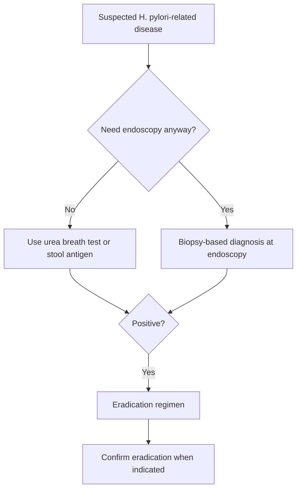

# Helicobacter pylori infection

Related: [[../Gastroenterology MOC|Gastroenterology MOC]] · [[../Stomach and Duodenal Disorders|Stomach and Duodenal Disorders]] · [[Helicobacter and ulcer disease|Helicobacter and ulcer disease]] · [[Duodenal ulcer disease]] · [[Functional dyspepsia]] · [[Gastric adenocarcinoma]] · [[Gastric lymphoma and MALT-related disease]]

## 1. Learning Objectives
- Describe H. pylori biology, pathophysiology, and disease associations.
- Know who to test and how to choose tests.
- Outline eradication principles and post-treatment confirmation logic.
- Recognize key complications and exam traps.

## 2. Definition
**Helicobacter pylori** is a spiral Gram-negative bacterium that colonizes gastric mucus and causes chronic active gastritis; it is strongly associated with peptic ulcer disease and some gastric malignancies.

## 3. Anatomy
- chiefly colonizes gastric antrum, but may involve pangastritis
- resides within mucus layer close to epithelium

## 4. Physiology / Microbiology Link
- urease converts urea to ammonia, buffering local acidity
- motility and adhesion help persistent colonization
- chronic inflammation alters acid physiology and mucosal defense

## 5. Classification / Clinical Associations
- asymptomatic infection
- H. pylori gastritis
- duodenal ulcer disease association
- gastric ulcer disease association
- gastric adenocarcinoma risk association
- MALT lymphoma association

## 6. Etiology / Transmission
- usually acquired in childhood
- person-to-person spread in crowded/household settings likely important
- associated with sanitation and socioeconomic conditions

## 7. Pathophysiology
- chronic mucosal colonization → gastritis
- antral-predominant disease can increase acid drive and promote **duodenal ulcer**
- pangastritis/atrophy may reduce acid but increase gastric cancer risk
- persistent inflammation may promote intestinal metaplasia and MALT lymphoid proliferation

## 8. Clinical Features
Many patients are asymptomatic.

When symptomatic, presentations include:
- dyspepsia
- epigastric pain
- peptic ulcer symptoms
- ulcer complications: bleeding/perforation

## 9. Investigations
### Non-invasive tests
- **urea breath test**
- **stool antigen test**
- serology: less useful for active infection confirmation

### Invasive tests via endoscopy
- biopsy urease testing
- histology
- culture/special tests in selected difficult cases

### When to test
Common high-yield indications:
- peptic ulcer disease (active or past documented ulcer)
- some dyspepsia pathways
- gastric MALT lymphoma
- after endoscopic finding of H. pylori-related disease

## 10. Interpretation Framework
### Test-choice logic
- If endoscopy is **not otherwise needed** → prefer **urea breath test** or **stool antigen** to detect active infection.
- If endoscopy is being done anyway → biopsy-based tests can diagnose infection.
- To confirm eradication → use **urea breath test** or **stool antigen**, not routine serology.

### Pre-test caution
PPIs and recent antibiotics can reduce test sensitivity. Temporary withholding may be required before confirmatory testing according to protocol.

## 11. Diagnosis
Diagnosis = objective evidence of active infection by:
- urea breath test
- stool antigen
- biopsy-based testing

## 12. Differential Diagnosis
- functional dyspepsia without infection
- NSAID-related ulcer disease
- GERD
- gastric malignancy
- non-H. pylori gastritis

## 13. Management
### Eradication principles
Use a recognized **eradication regimen** based on local resistance patterns and guideline availability.

General components often include:
- PPI
- 2 or more antibiotics depending on regimen
- sometimes bismuth-based therapy

### Core exam principles
- adherence is crucial
- choose guideline-appropriate regimen
- counsel regarding side effects
- confirm eradication when indicated

### After treatment
- confirm eradication with stool antigen or urea breath test when appropriate
- ensure testing is done after adequate post-treatment interval and after withholding confounding drugs as recommended

## 14. Complications / Importance
- duodenal ulcer disease
- gastric ulcer disease
- ulcer bleeding / perforation
- gastric adenocarcinoma association
- MALT lymphoma

## 15. Red Flags
H. pylori itself is not the red flag; the **clinical presentation** may be:
- GI bleed
- anaemia
- weight loss
- persistent vomiting
- dysphagia if another lesion coexists
- mass / malignant endoscopic features

## 16. One-Page Summary
- H. pylori is a **major cause of chronic gastritis and peptic ulcer disease**.
- Important associations: **duodenal ulcer, gastric ulcer, gastric cancer, MALT lymphoma**.
- Best active-infection tests: **urea breath test** and **stool antigen**.
- If endoscopy is already indicated, biopsy-based tests can diagnose it.
- After eradication, confirm cure with breath test/stool antigen when appropriate.
- Serology is less useful for confirming active current infection or cure.

## 17. FCPS/MRCP High-Yield Points
- H. pylori and NSAIDs are the 2 classic peptic-ulcer culprits.
- Antral-predominant infection is linked to duodenal ulcer tendency.
- H. pylori is a classically tested risk factor for gastric adenocarcinoma and MALT lymphoma.
- Post-treatment confirmation should use active-infection tests.

## 18. Common Viva Traps
- Using serology to confirm eradication.
- Forgetting that PPIs/antibiotics can affect test sensitivity.
- Treating ulcer disease without checking eradication logic.

## 19. Mind Map
- H. pylori
  - tests
    - breath test
    - stool antigen
    - biopsy
  - diseases
    - gastritis
    - duodenal ulcer
    - gastric ulcer
    - MALT lymphoma
    - gastric cancer
  - treatment
    - PPI
    - antibiotics
    - confirm eradication

## 20. Flowchart

## 21. Revision Prompts
- What diseases are classically associated with H. pylori?
- Which tests detect active infection?
- Why is serology weak for confirming eradication?
- How does H. pylori promote duodenal ulcer disease?

## 22. MCQs (10)
1. Helicobacter pylori is most strongly associated with:
A. Duodenal ulcer disease
B. Ulcerative colitis
C. Haemorrhoids
D. Gallstones only

2. A good non-invasive test for active H. pylori infection is:
A. Urea breath test
B. Serum sodium
C. ECG
D. Plain abdominal X-ray

3. Which condition is classically associated with H. pylori?
A. Gastric MALT lymphoma
B. Appendicitis
C. Asthma
D. Nephrotic syndrome

4. Which test is less useful for confirming eradication?
A. Stool antigen
B. Urea breath test
C. Serology
D. Biopsy urease at endoscopy

5. H. pylori survives in the stomach partly because of:
A. Urease activity
B. Insulin production
C. Bile obstruction
D. Colonic fermentation

6. The 2 classic major causes of peptic ulcer disease are:
A. H. pylori and NSAIDs
B. IBS and lactose intolerance
C. Asthma and eczema
D. Stroke and Parkinson disease

7. Which malignancy association is correct?
A. H. pylori and gastric adenocarcinoma
B. H. pylori and osteosarcoma
C. H. pylori and renal cell carcinoma only
D. H. pylori and pituitary adenoma

8. If endoscopy is being done anyway, H. pylori can be diagnosed by:
A. Biopsy-based testing
B. Spirometry
C. Colon transit study
D. CT brain

9. A key principle of treatment is:
A. Use eradication regimen based on guideline/resistance logic
B. Always use single antibiotic only
C. No need for adherence
D. Never confirm cure

10. Which statement is correct?
A. H. pylori never causes gastritis
B. H. pylori may be asymptomatic
C. All infected patients bleed
D. H. pylori is a virus

## 23. SBA Questions (10)
1. A 35-year-old man with endoscopically proven duodenal ulcer is found to have H. pylori. Best principle?
A. Eradication therapy is indicated
B. Reassure only
C. Treat with laxatives
D. Start insulin

2. A woman with dyspepsia does not need endoscopy but requires active H. pylori testing. Best test?
A. Urea breath test
B. Serum amylase
C. Echocardiography
D. Plain chest radiograph

3. After eradication therapy, the best confirmation method is:
A. Serology next week
B. Urea breath test or stool antigen at appropriate interval
C. ESR only
D. Colonoscopy only

4. Endoscopy for anaemia shows gastric ulceration; biopsies are taken. H. pylori can be assessed by:
A. Biopsy-based tests
B. Urinalysis only
C. Spirometry
D. Peak flow

5. Which association is most exam-relevant?
A. H. pylori and MALT lymphoma
B. H. pylori and appendicular abscess
C. H. pylori and varicose veins
D. H. pylori and nephrolithiasis

6. Which factor can reduce sensitivity of some active-infection tests?
A. Recent PPI use
B. Wearing spectacles
C. Vegetarian diet only
D. Sun exposure

7. A patient has positive serology years after prior treatment. Best interpretation?
A. Serology alone may not prove active current infection
B. Eradication definitely failed
C. Gastric cancer is proven
D. No further reasoning needed

8. H. pylori contributes to duodenal ulcer disease mainly via:
A. Chronic gastritis altering acid physiology
B. Colonic polyp formation only
C. Bile duct obstruction
D. Splenic infarction

9. Which combination best reflects eradication therapy principles?
A. PPI with antibiotic-based regimen and good adherence
B. Antacid only
C. Beta-blocker only
D. No need for follow-up

10. In a patient with H. pylori and alarm symptoms, best principle is:
A. Ignore alarm symptoms
B. Manage the alarm-feature presentation appropriately, often with endoscopy
C. Give vitamins only
D. Treat as IBS

## 24. Flashcards
- Q: Which 2 non-invasive tests best detect active H. pylori infection?  
  A: Urea breath test and stool antigen.
- Q: Name 2 major disease associations of H. pylori.  
  A: Peptic ulcer disease and gastric adenocarcinoma/MALT lymphoma.
- Q: Why is serology poor for confirming eradication?  
  A: Antibodies can remain positive after infection clears.
- Q: What common drug class can affect active-infection test sensitivity?  
  A: PPIs.
- Q: What are the 2 classic major causes of peptic ulcer disease?  
  A: H. pylori and NSAIDs.

## 25. Answer Key with Explanations
### MCQs
1. **A** — H. pylori is strongly linked to duodenal ulcer disease.
2. **A** — the urea breath test detects active infection.
3. **A** — gastric MALT lymphoma is a classic association.
4. **C** — serology is poor for confirming cure.
5. **A** — urease helps survival in the acidic environment.
6. **A** — these are the 2 classic causes of peptic ulcer disease.
7. **A** — H. pylori is linked to gastric adenocarcinoma.
8. **A** — biopsy-based diagnosis is used during endoscopy.
9. **A** — therapy must follow guideline-appropriate eradication logic.
10. **B** — infection may be asymptomatic.

### SBAs
1. **A** — eradication therapy is indicated.
2. **A** — active non-invasive testing is appropriate.
3. **B** — breath test or stool antigen is used after treatment at the correct interval.
4. **A** — biopsy testing is appropriate when endoscopy is already being done.
5. **A** — MALT lymphoma is the classic association.
6. **A** — PPIs can reduce test sensitivity.
7. **A** — serology alone may remain positive long after eradication.
8. **A** — gastritis-related acid/mucosal changes drive ulcer risk.
9. **A** — eradication requires combination treatment and adherence.
10. **B** — alarm symptoms must drive safe evaluation, often endoscopy.

## 26. Must Know / Should Know / Nice to Know
### Must Know
- H. pylori = gram-negative spiral bacterium; chronic gastritis → PUD, gastric cancer, MALT lymphoma
- Test: UBT (gold standard), stool Ag, RUT, histology; stop PPI 2w/ABx 4w before testing
- Eradication: clarithromycin triple (if resistance <15%), bismuth quadruple, concomitant, sequential
- Confirm eradication: UBT/stool Ag 4w post-treatment; PPI 2w/ABx 4w off before test
- Indications: PUD, gastric MALT, atrophic gastritis, 1st-degree relative gastric cancer, unexplained IDA/ITP

### Should Know
- Advanced management options
- Special populations (pregnancy, elderly)
- Emerging therapies

### Nice to Know
- Molecular pathogenesis
- Genetic risk scores
- Global epidemiology

## 27. Self-Test Scorecard
- Can I define the condition? /10
- Can I list 4 diagnostic criteria? /10
- Can I outline the management algorithm? /10
- Can I name 3 complications? /10

**Interpretation:**
- **<35/40** = weak topic
- **35-36/40** = acceptable but insecure
- **37+/40** = exam-ready

