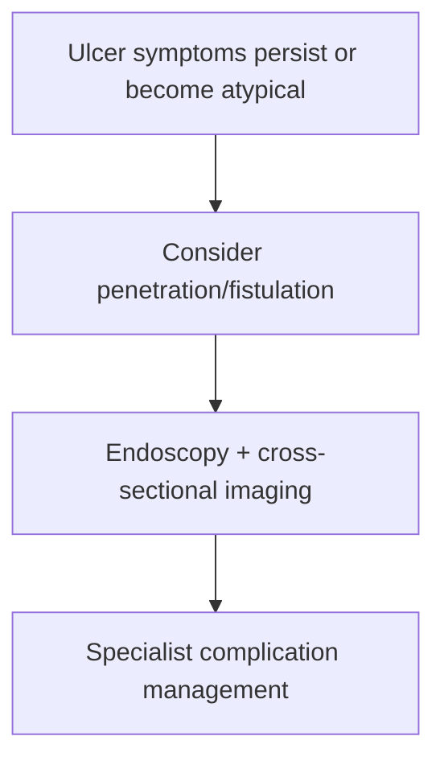

# Penetration and fistulation in peptic ulcer disease

Related: [[../Gastroenterology MOC|Gastroenterology MOC]] · [[../Stomach and Duodenal Disorders|Stomach and Duodenal Disorders]] · [[Perforated peptic ulcer]]

> [!important]
> Penetration means ulcer extension into an adjacent organ; fistulation means creation of an abnormal communication. Think of this when ulcer pain becomes **persistent, atypical, or linked to new organ-specific symptoms**.

## 1. Learning Objectives
- Define penetration and fistulation in peptic ulcer disease.
- Recognize clinical clues.
- Understand how they differ from free perforation.
- Outline management principles.

## 2. Definition
- **Penetration**: ulcer erodes into an adjacent structure without free intraperitoneal perforation.
- **Fistulation**: ulcer creates an abnormal communication with another organ/segment.

## 3. Clinical Features
- persistent or radiating pain (for example to the back when pancreas involved)
- failure of usual ulcer therapy
- recurrent sepsis or unusual GI symptoms if fistula forms
- bleeding may coexist

## 4. Differential from Free Perforation
| Feature | Penetration/fistulation | Free perforation |
|---|---|---|
| Pain | Persistent/atypical | Sudden catastrophic |
| Peritonitis | May be limited/absent initially | Marked early |
| Organ involvement | Adjacent organ | Free peritoneal contamination |

## 5. Investigations
- endoscopy for ulcer assessment
- CT/imaging when complication beyond mucosa is suspected
- evaluate bleeding/sepsis/nutritional effect

## 6. Management
- acid suppression and cause treatment alone are often insufficient if major complication exists
- specialist/surgical decision-making may be required
- treat sepsis/bleeding and underlying ulcer cause

## 7. Red Flags
- back-radiating pain in ulcer disease
- persistent symptoms despite treatment
- sepsis or abscess-type picture
- recurrent bleeding with complicated disease

## 8. FCPS/MRCP High-Yield Points
- Penetration classically causes persistent pain radiating to adjacent structures.
- Fistulation produces new abnormal communication symptoms.
- These are complicated ulcers, not routine dyspepsia.

## 9. Common Viva Traps
- Missing a complication in “refractory ulcer pain”.
- Confusing penetration with simple perforation.
- Forgetting cross-sectional imaging when adjacent-organ involvement is suspected.

## 10. One-Page Summary
- Penetration = ulcer into adjacent organ.
- Fistulation = abnormal tract/communication.
- Think of them in persistent, refractory, or atypical ulcer presentations.

## 11. Mind Map
- Complicated ulcer
  - penetration
  - fistula
  - persistent pain
  - back radiation
  - CT
  - surgery/specialist care

## 12. Flowchart

## 13. MCQs (10)
1. Ulcer penetration means:
   - A. Extension into an adjacent organ
   - B. Free air in the peritoneum always
   - C. Pure functional pain
   - D. Colonic polyp formation
   - **Answer: A**
2. Fistulation means:
   - A. Abnormal communication formed by ulcer disease
   - B. Only superficial gastritis
   - C. A motility disorder
   - D. Thrush infection
   - **Answer: A**
3. A clue to penetration is:
   - A. Persistent/radiating pain
   - B. Rhinitis
   - C. Dry scalp
   - D. Myopia
   - **Answer: A**
4. Which structure classically causes back pain if penetrated?
   - A. Pancreas
   - B. Ear canal
   - C. Retina
   - D. Kidney only
   - **Answer: A**
5. Which statement is true?
   - A. Penetration is not the same as free perforation
   - B. Both are always identical
   - C. Imaging never helps
   - D. All cases are benign dyspepsia
   - **Answer: A**
6. A common trap is:
   - A. Missing complication in refractory ulcer disease
   - B. Asking about pain radiation
   - C. Considering CT imaging
   - D. Reviewing treatment failure
   - **Answer: A**
7. Which investigation may be particularly helpful beyond endoscopy?
   - A. CT imaging
   - B. Spirometry
   - C. Audiogram
   - D. EEG
   - **Answer: A**
8. Management may require:
   - A. Specialist/surgical input
   - B. Reassurance only
   - C. Eye drops
   - D. Bronchodilator only
   - **Answer: A**
9. Which clue suggests this is not routine dyspepsia?
   - A. Persistent pain despite therapy
   - B. Mild transient belching only
   - C. Dry mouth only
   - D. Seasonal allergy only
   - **Answer: A**
10. Best summary?
   - A. Persistent atypical ulcer symptoms should raise suspicion of penetration or fistulation
   - B. Ulcer complications always present with sudden free perforation only
   - C. Radiation of pain is irrelevant
   - D. Cross-sectional imaging never matters
   - **Answer: A**

## 14. SBA Questions (10)
1. A patient with known ulcer disease develops persistent epigastric pain radiating to the back despite treatment. Best complication to consider?
   - A. Penetration into adjacent organ
   - B. IBS
   - C. Coeliac disease
   - D. Hemorrhoids
   - **Answer: A**
2. Which is a dangerous error?
   - A. Calling persistent refractory ulcer pain uncomplicated dyspepsia
   - B. Asking about pain radiation
   - C. Considering CT
   - D. Reviewing bleeding risk
   - **Answer: A**
3. What differentiates free perforation from penetration?
   - A. Free perforation causes free peritoneal leakage; penetration enters an adjacent organ
   - B. There is no difference
   - C. Penetration never causes pain
   - D. Fistulation is always benign
   - **Answer: A**
4. What does fistulation imply?
   - A. An abnormal tract/communication has formed
   - B. A healed benign ulcer
   - C. Pure reflux only
   - D. Functional dyspepsia
   - **Answer: A**
5. Which investigation combination is helpful?
   - A. Endoscopy plus cross-sectional imaging
   - B. Audiogram plus EEG
   - C. Spirometry plus ECG only
   - D. Urinalysis only
   - **Answer: A**
6. Which symptom pattern should raise suspicion?
   - A. New atypical symptoms despite adequate ulcer treatment
   - B. Brief self-limited burping only
   - C. Mild rhinitis only
   - D. Dry scalp only
   - **Answer: A**
7. Why may surgery be required?
   - A. Because this is complicated peptic disease with structural consequences
   - B. Because all dyspepsia is surgical
   - C. Because imaging is impossible
   - D. Because all ulcers need colectomy
   - **Answer: A**
8. Best exam pearl?
   - A. Think penetration when ulcer pain becomes persistent, deep, or radiating
   - B. Radiation excludes ulcer disease
   - C. All refractory pain is functional
   - D. CT adds nothing
   - **Answer: A**
9. Which associated issue may coexist?
   - A. Bleeding or sepsis
   - B. Cataract only
   - C. Hay fever only
   - D. Myopia only
   - **Answer: A**
10. Best summary?
   - A. Recognize the pattern, image the complication, and escalate beyond routine ulcer therapy
   - B. Continue simple antacids only forever
   - C. Ignore adjacent-organ clues
   - D. Never consider surgery
   - **Answer: A**

## 15. Flashcards
- Q: What is ulcer penetration?
  A: Extension into an adjacent organ without free intraperitoneal perforation.
- Q: What is fistulation?
  A: Formation of an abnormal communication from ulcer disease.
- Q: What pain clue suggests penetration?
  A: Persistent or back-radiating pain.
- Q: What imaging is often helpful beyond endoscopy?
  A: CT.
- Q: What common trap must be avoided?
  A: Calling refractory complicated ulcer pain uncomplicated dyspepsia.

## 16. Must Know / Should Know / Nice to Know
### Must Know
- Penetration = ulcer extends through wall into adjacent organ (pancreas) without free perforation
- Fistula = communication between GI tract and another organ/skin
- Penetration to pancreas: severe back pain, elevated amylase, CT shows pancreatic inflammation
- Gastrocolic fistula: diarrhoea, feculent vomitus, weight loss
- Management differs: penetration = medical; fistulation often surgical

### Should Know
- Penetration may mimic pancreatitis
- CT with oral contrast best for diagnosis
- Surgery for fistulas failing medical therapy

### Nice to Know
- Aortoenteric fistula (rare, catastrophic)
- Endoscopic clip/stent for selected fistulas

## 17. Self-Test Scorecard
- Can I distinguish penetration from perforation and fistula? /10
- Can I describe the presentation of pancreatic penetration? /10
- Can I outline the management of gastrocolic fistula? /10

**Interpretation:**
- **<35/40** = weak topic
- **35-36/40** = acceptable but insecure
- **37+/40** = exam-ready

## 18. Revision Prompts
What is penetration vs perforation vs fistulation?
How does a penetrating ulcer to the pancreas present?

## 19. Answer Key with Explanations

