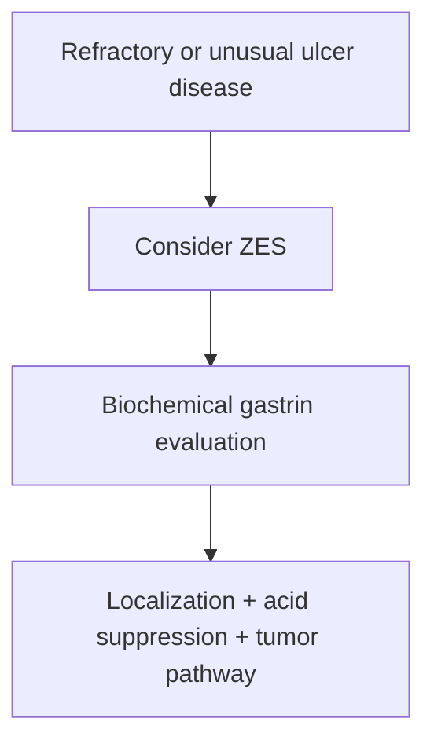

# Zollinger-Ellison syndrome

Related: [[../Gastroenterology MOC|Gastroenterology MOC]] · [[../Stomach and Duodenal Disorders|Stomach and Duodenal Disorders]] · [[Duodenal ulcer disease]]

> [!important]
> Think of Zollinger-Ellison syndrome when ulcer disease is **multiple, recurrent, severe, distal, or unusually refractory**.

## 1. Learning Objectives
- Define Zollinger-Ellison syndrome.
- Recognize its ulcer-pattern clues.
- Understand why acid hypersecretion matters.
- Outline diagnosis and management principles.

## 2. Definition
Zollinger-Ellison syndrome (ZES) is a syndrome of pathological gastrin excess, usually from a gastrinoma, causing marked gastric acid hypersecretion and severe peptic disease.

## 3. Pathophysiology
- gastrin excess
- massive acid hypersecretion
- recurrent/multiple ulceration and mucosal injury
- diarrhea may occur because acid impairs intestinal function and enzymes

## 4. Clinical Clues
- recurrent peptic ulcers
- ulcers in unusual or distal locations
- refractory ulcer symptoms despite treatment
- diarrhea with ulcer disease
- severe reflux/oesophagitis can occur

## 5. Investigations
- biochemical gastrin-based evaluation in the appropriate clinical setting
- imaging/localization after biochemical suspicion
- endoscopy for ulcer burden and complications

## 6. Management
- high-intensity acid suppression
- localize/treat gastrinoma pathway
- evaluate for associated syndromic contexts when relevant

## 7. Red Flags
- recurrent severe ulcers despite therapy
- recurrent bleeding/perforation
- diarrhea with difficult ulcer disease
- weight loss or metastatic suspicion

## 8. FCPS/MRCP High-Yield Points
- ZES causes refractory/recurrent ulcer disease.
- Diarrhea plus ulcer disease is a high-yield clue.
- Think of acid hypersecretion, not just “more common H pylori”.

## 9. Common Viva Traps
- Calling every difficult ulcer “noncompliance”.
- Forgetting diarrhea as a clue.
- Missing unusually distal/multiple ulcers.

## 10. One-Page Summary
- ZES = gastrinoma-driven acid hypersecretion.
- Causes severe recurrent ulcers, reflux, and sometimes diarrhea.
- Diagnose biochemically and localize afterwards.

## 11. Mind Map
- ZES
  - gastrinoma
  - high gastrin
  - high acid
  - recurrent ulcers
  - diarrhea
  - localization

## 12. Flowchart

## 13. MCQs (10)
1. Zollinger-Ellison syndrome is caused by:
   - A. Pathological gastrin excess
   - B. Candida infection
   - C. Colonic obstruction
   - D. Gallstones
   - **Answer: A**
2. A typical clinical clue is:
   - A. Refractory recurrent peptic ulcers
   - B. Polyuria only
   - C. Hematuria only
   - D. Dry cough only
   - **Answer: A**
3. Which accompanying symptom is high yield?
   - A. Diarrhea
   - B. Otalgia
   - C. Myopia
   - D. Dysuria
   - **Answer: A**
4. The mechanism is:
   - A. Marked gastric acid hypersecretion
   - B. Low gastric acid always
   - C. Pancreatic insulin excess
   - D. Renal sodium retention
   - **Answer: A**
5. Which pattern should raise suspicion?
   - A. Multiple/recurrent/unusually severe ulcer disease
   - B. One brief dyspepsia episode only
   - C. Seasonal allergies
   - D. Dry scalp
   - **Answer: A**
6. A common trap is:
   - A. Missing ZES in difficult ulcer disease with diarrhea
   - B. Asking about ulcer recurrence
   - C. Considering acid hypersecretion
   - D. Reviewing treatment response
   - **Answer: A**
7. Initial diagnosis relies on:
   - A. Biochemical gastrin evaluation in the right context
   - B. Audiogram
   - C. Spirometry
   - D. EEG
   - **Answer: A**
8. Treatment includes:
   - A. Powerful acid suppression and tumor-directed strategy
   - B. Bronchodilator only
   - C. Dialysis
   - D. Eye drops
   - **Answer: A**
9. Which complication can occur?
   - A. Bleeding or perforation from severe ulcer disease
   - B. Cataract only
   - C. Nephrotic syndrome only
   - D. Rhinitis only
   - **Answer: A**
10. Best summary?
   - A. Think ZES in severe recurrent ulcer disease, especially if diarrhea is present
   - B. ZES is ordinary IBS
   - C. ZES causes low acid
   - D. Diarrhea argues against ZES
   - **Answer: A**

## 14. SBA Questions (10)
1. A patient has recurrent duodenal ulcers despite adequate treatment and now has chronic watery diarrhea. Best diagnosis to consider?
   - A. Zollinger-Ellison syndrome
   - B. Functional dyspepsia
   - C. Hemorrhoids
   - D. Achalasia
   - **Answer: A**
2. What is the key physiological abnormality?
   - A. Gastrin-driven acid hypersecretion
   - B. Achalasia-like aperistalsis
   - C. Colonic ischemia
   - D. Reduced bile production
   - **Answer: A**
3. Which is a dangerous error?
   - A. Ignoring refractory ulcer disease and labeling it ordinary dyspepsia
   - B. Asking about ulcer recurrence
   - C. Reviewing diarrhoea symptoms
   - D. Considering a biochemical workup
   - **Answer: A**
4. Why can diarrhea occur?
   - A. Excess acid disrupts intestinal digestion/function
   - B. Colon cancer always coexists
   - C. Gallstones form immediately
   - D. The pancreas stops producing insulin
   - **Answer: A**
5. Which ulcer pattern is suspicious?
   - A. Recurrent, severe, or unusually located ulcers
   - B. Single mild self-limited episode only
   - C. Pure constipation only
   - D. Rhinitis only
   - **Answer: A**
6. Which management step is central while investigating?
   - A. Strong acid suppression
   - B. Stop all treatment
   - C. High-fibre only
   - D. Bronchodilator only
   - **Answer: A**
7. Best exam pearl?
   - A. Refractory ulcer disease plus diarrhea should trigger suspicion of ZES
   - B. Diarrhea excludes peptic disease
   - C. ZES causes low acid output
   - D. Recurrent ulcers are always due to poor compliance only
   - **Answer: A**
8. After biochemical suspicion, the next principle is:
   - A. Tumor localization
   - B. Audiometry
   - C. Spirometry
   - D. CSF analysis
   - **Answer: A**
9. Which reflux feature can coexist?
   - A. Severe oesophagitis from acid excess
   - B. No upper-GI symptoms ever
   - C. Only lower-GI bleeding
   - D. Isolated jaundice
   - **Answer: A**
10. Best summary?
   - A. Diagnose contextually, suppress acid aggressively, and seek the gastrinoma
   - B. Treat as ordinary IBS
   - C. Never investigate recurrent ulcers
   - D. Ignore diarrhea
   - **Answer: A**

## 15. Flashcards
- Q: What causes ZES?
  A: Gastrin excess, usually from gastrinoma.
- Q: What ulcer pattern should suggest ZES?
  A: Recurrent, severe, multiple, or refractory ulcers.
- Q: What extra symptom is a classic clue?
  A: Diarrhea.
- Q: What is the main physiological effect of gastrinoma?
  A: Marked acid hypersecretion.
- Q: What are the two management arms?
  A: Acid suppression and tumor localization/treatment.

## 16. Must Know / Should Know / Nice to Know
### Must Know
- ZES = gastrin-secreting neuroendocrine tumor (gastrinoma) → hypergastrinaemia → severe ulcer disease
- Multiple refractory ulcers, distal duodenal/jejunal ulcers, diarrhoea, steatorrhoea
- Associated with MEN1 (parathyroid, pituitary)
- Diagnosis: fasting gastrin >1000 pg/mL or >10x ULN + secretin stimulation test
- Management: high-dose PPI, surgical resection if localized, MEN1 screening

### Should Know
- PPI can cause false-negative gastrin - stop 1-2 weeks before testing
- Somatostatin receptor imaging (Ga-68 DOTATATE)
- Gastrinoma triangle (duodenum, pancreas, lymph nodes)

### Nice to Know
- Peptide receptor radionuclide therapy (PRRT) for metastatic
- Everolimus/sunitinib for advanced

## 17. Self-Test Scorecard
- Can I state the diagnostic criteria for ZES? /10
- Can I explain why PPI must be stopped before gastrin testing? /10
- Can I describe the MEN1 association? /10

**Interpretation:**
- **<35/40** = weak topic
- **35-36/40** = acceptable but insecure
- **37+/40** = exam-ready

## 18. Revision Prompts
How is Zollinger-Ellison syndrome diagnosed?
What is the secretin stimulation test?

## 19. Answer Key with Explanations

